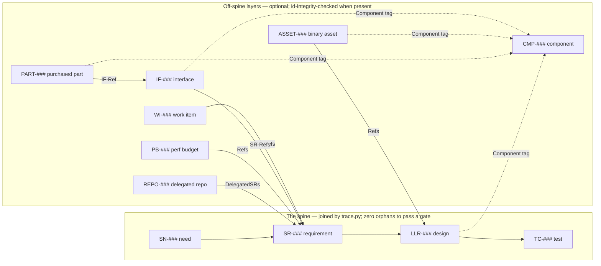

# ai-template

<a id="vision"></a>
**PROJECT-VISION:** A reusable starting point for building **maintainable,
requirement-traced projects** with AI agents and humans working from the same
playbook. The goal: code and analytics that stay readable and correct over the
long run, built **test-first** with **explicit approval gates** so you can
trust what ships.

It is **stack-agnostic** with **Python-first reference scripts** — drop it into
any repo and wire the harness to that repo's tooling (SN-003).

**License: [Apache-2.0](LICENSE)** ([NOTICE](NOTICE)). Copying
`project-trajectory/` into your repo — the quick start below — is exactly what
the grant is for. Your project's own code and the artifacts the scaffold
produces (your registries, requirements, log) are **yours**, under whatever
license you choose; only the kit files you copied stay Apache-2.0.
`bootstrap.py` drops the full License text into every scaffold at
`docs/kit-license` so a downstream repo can be redistributed without you
chasing it.

## What's in here

| Path | What it is |
|---|---|
| [`project-trajectory/`](project-trajectory/) | The portable kit: the gated, requirement-traced development process plus all templates and runnable scripts. **This is the thing you copy into new repos.** |
| [`project-trajectory/README.md`](project-trajectory/README.md) | Full contents + rationale for the kit. |
| [`CLAUDE.md`](CLAUDE.md) | Guide for working **in this template repo** (developing the templates themselves). |

## The kit's headline pieces

- **A gated process** ([`PROCESS.md`](project-trajectory/PROCESS.md)) — roles as
  "hats", approval bars (DevBar-Reqs→DevBar-Tests→DevBar-Release, then DevStg-Release and the owner's final read; DevStg-Release only for
  versioned releases), and a verdict protocol; each gate's bar **fails, never
  silently skips** (SN-004, SN-008).
- **A traceability spine** — `SN → SR → LLR → TC` registries joined by a
  generated matrix that must report **zero orphans** before each gate (SN-002).
- **Runnable scripts** — Python 3.11+ on the standard library, with any
  non-stdlib dependency admitted only through a reviewed row in
  [`docs/dependencies.md`](docs/dependencies.md) — *no unargued dependencies*,
  and nothing extra to install for the checks an adopter runs (SN-011).
  Cross-platform `setup`/`check` launchers (`.sh` + `.ps1`)
  ship for Linux/macOS and Windows. The **authoritative per-script table**
  (one home, one row per script) is the kit README:
  [`project-trajectory/README.md`](project-trajectory/README.md). Headliners:
  [`check.py`](project-trajectory/scripts/check.py) (the gate- and tier-aware
  harness) and [`trace.py`](project-trajectory/scripts/trace.py) (the
  traceability join) anchor the floor;
  [`check_docs.py`](project-trajectory/scripts/check_docs.py) keeps the docs
  navigable and this README need-cited (SN-010);
  [`check_privacy.py`](project-trajectory/scripts/check_privacy.py) gives every
  repo a secrets floor plus the opt-in PII/identity gate (SN-009); and
  [`bootstrap.py`](project-trajectory/scripts/bootstrap.py) scaffolds a new
  repo in one command (SN-001). The generated views these produce — including the
  single root `PROJECT_STATE.html` that shows progress **and** how the parts
  connect (the declared `IF-###` interface graph, SN-023) — are listed under
  "The registries & trace artifacts" below.

- **Unattended agent operation** (SN-006):
  - Root `agent-resume.*` launchers boot an agent session at the declared
    tier, or the walk-away coordinator loop
    ([`agent_loop.py`](project-trajectory/scripts/agent_loop.py)) — **one
    command from the repo root**, with nothing for a human to curate: what runs
    next is derived from the WI DAG plus Git, never a hand-maintained pointer
    (SN-025).
  - Fresh headless **worker sessions** build explicit dispatcher assignments —
    each scoped by its WI row, spec, and train context, never a `status.md`
    resume — and the stop banner + exit codes carry the run's
    outcome.
  - **Parallel-by-default execution** *(delivered — phase `v4` at DevBar-Release;
    [`parallel-wi-dispatch.md`](docs/archive/specs/parallel-wi-dispatch.2026-07-20.md))*: a plain
    launch **is** the dispatcher: it fans out every dependency-ready work item
    across bounded worker lanes, while mutation of the integration branch
    stays serialized and gated behind one fail-closed integrator (SN-027).
  - A per-phase model map (keyed on the in-process phase), reactive rate-limit
    backoff, a stall guard, and tracked per-session logs in `docs/iteration/`.
  - Optional **multi-family, heterogeneous scheduling** (SN-026) — several LLM
    families are declared as (family × model × tier) pair-rows in
    `docs/agents.toml` and selected **per job and per level**; when
    `docs/agents-enabled` opts in,
    a committing build schedules separate fresh **reviewer** sessions (redacted
    of the implementer's self-assessment), with the model chosen from the
    `docs/agents.toml` enable-list by tier + cross-family heterogeneity + cooldown,
    a mechanical substance scorer, and a fixed **win-stay/lose-shift**
    escalation policy (degraded availability — one provider — is legal); absent
    the enable-list, behavior is unchanged (see
    [`PROCESS_OPTIONS.md`](project-trajectory/PROCESS_OPTIONS.md) "Unattended
    operation").
  - Optional **subjective-quality critique loop** — a `Verification=Critique`
    requirement's perceptual acceptance is judged by a fresh, provider-
    heterogeneous **critic** against a written [`docs/rubrics/`](project-trajectory/rubrics/README.template.md)
    rubric (numbered good/bad anchors, derived from the SN/SR intent, never the
    authoring session), iterating rework toward the bar and escalating on budget
    exhaustion; a lax-TC ratchet keeps the fix landing in the chain (SN-024).
  - Optional **tier-conditional guardrails** — the `guardrails` dial
    injects a vendored discipline core into weaker-tier sessions, drift-checked
    by `check_vendored.py`.
  - Consent is explicit via the dials scaffolded into `docs/process.toml`:
    `human_ratification_through` (which tiers a human ratifies — the row
    below; the retired `gate_policy` enum is **not** shipped), `push`
    (who may push), and
    `privacy_check` (the PII/identity gate, enforced by the git hooks +
    `check_privacy.py`). That file is the **one home for every policy dial**
    (SN-028): a repo declaring the same dial twice — there and in a legacy
    one-word file — is refused rather than resolved by precedence, and
    `bootstrap.py --migrate-config` converts the legacy files so an adopter
    never meets that refusal un-aided.
- **Agent-neutral skills and hooks** (SN-005):
  - Opt-in skills ([`skills/`](project-trajectory/skills/)), materialized per
    agent by `bootstrap.py --agents`.
  - Git hooks ([`hooks/`](project-trajectory/hooks/)): a fast `pre-commit`
    process floor and a `pre-push` privacy backstop for privacy-checked repos.
- **An agent guide template**
  ([`AGENTS.template.md`](project-trajectory/AGENTS.template.md)) that encodes
  our readability/maintainability conventions and points agents at the
  process. It scaffolds to `AGENTS.md` (the cross-tool standard), with thin
  `CLAUDE.md`/`GEMINI.md` stubs pointing back at it.

## The registries & trace artifacts — one map

The process stores every durable fact as **one registry row**, referenced
everywhere else by id ([`PROCESS.md`](project-trajectory/PROCESS.md) §2–§3);
anything visual or navigable is a **generated view** of those rows, never a
second home for them. Four registries form the required **spine**; the rest are
optional layers a project adopts only when its scope earns them. How an
ambiguously-reported problem routes *into* these tiers — coverage gap vs.
requirement gap, then scoping via new IF/CMP/PART rows — is the
**change-intake flow**, charted in
[`PROCESS.md`](project-trajectory/PROCESS.md) §5.



### The spine — required, every project

| Registry | Ids | What it does |
|---|---|---|
| [`stakeholder-needs`](project-trajectory/registries/stakeholder-needs.template.toml) | `SN-###` | Why the project exists — one need per row, in the stakeholder's words. The root every other row must trace back to. |
| [`system-requirements`](project-trajectory/registries/system-requirements.template.toml) | `SR-###` | One testable *shall*-statement per row, with measurable acceptance criteria and input `Permutations` for test design; cites the `SN` it serves. |
| [`low-level-requirements`](project-trajectory/registries/low-level-requirements.template.toml) | `LLR-###` | The design decomposition — pins an SR onto real code (`Module` + `CodeSymbol`). Adds detail; never paraphrases its parent. |
| [`test-cases`](project-trajectory/registries/test-cases.template.toml) | `TC-###` | Verifies SR/LLR ids; states its `Method` (how it runs) and `Tier`. The verification class (Test / Demonstration / Inspection / Attest) rides the SR's `Verification` column. Written failing-first at DevBar-Tests. |

[`trace.py`](project-trajectory/scripts/trace.py) joins the four tiers into the
traceability matrix (`docs/test/report.md`; `--html` adds a collapsible map) and
fails the gate on any orphan, duplicate, or malformed id (SN-002).

### Off-spine registries — optional layers

Each lives off the joined spine (an absent or placeholder-only file costs
nothing) but back-links into it, so `trace.py` / `check_trajectory.py`
integrity-check the ids the moment real rows exist.

| Registry | Ids | What it does — and why it exists |
|---|---|---|
| [`interfaces`](project-trajectory/registries/interfaces.template.toml) | `IF-###` | One **directed seam** per row — this side ↔ a counterpart, the shared contract in one testable line, versioned. Endpoints are **primitives** (a repo or module, a physical mating surface) — never components; a component's interface set is *derived*, below. Every interface is backed by an SR and a contract test ([`PROCESS.md`](project-trajectory/PROCESS.md) §8). |
| [`performance-budgets`](project-trajectory/registries/performance-budgets.template.csv) | `PB-###` | Quantitative NFR budgets (latency, RAM, artifact size) that behavior tests can't express; `check_perf.py` compares emitted metrics against budget + baseline (§9). |
| [`procurement`](project-trajectory/registries/procurement.template.csv) | `PART-###` | Parts the project **buys rather than builds** (motor, board, camera): vendor, cost, status, quantity. The owning `IF-###` row is each part's owner-of-record. |
| [`assets`](project-trajectory/registries/assets.template.csv) | `ASSET-###` | The facts *about* an un-diffable binary (art, music, CAD, voice): provenance (AI-content disclosure), license, attribution, contract link, location + hash. |
| [`components`](project-trajectory/registries/components.template.toml) | `CMP-###` | The durable **set-grained** home for knowledge + lifecycle — a subsystem, "the left arm", a package group. It exists because no finer tier can hold either: an IF is one seam, a workstream is mutable by design, and an LLR *is* the thing a rewrite replaces — while `State`/`SupersededBy` carry identity across the rewrite. **Structure is derived, never authored**: membership is a `Component` tag on LLR/IF/ASSET/PART rows; an IF with both endpoints inside a CMP is *internal*, with one endpoint inside it is that CMP's *boundary*. (Ratified design: [`AXES_AND_WORKSTREAMS.md`](docs/archive/AXES_AND_WORKSTREAMS.md); live spec: [`PROCESS_OPTIONS.md`](project-trajectory/PROCESS_OPTIONS.md) "Component layer".) |
| [`work-items`](project-trajectory/registries/work-items.template.csv) | `WI-###` | The execution DAG — *when/how* atop the spine's *what*: each WI delivers SRs, belongs to a workstream, and depends on predecessors (a bare id blocks; a `~`-prefixed id only orders). Validated by `check_trajectory.py`; rendered into `PROJECT_STATE.html`. |
| [`repos`](project-trajectory/registries/repos.template.csv) | `REPO-###` | Coordinator-only, for the rare multi-repo rung: one row per delegated repo plus the coordinator SRs it fulfils ([`MULTI_REPO.md`](project-trajectory/MULTI_REPO.md) §6). |
| [`hats`](project-trajectory/registries/hats.template.toml) | *names, no id space* | The **declared expert perspectives** every applicable decomposition must face. Each `[hat.NAME]` carries `applies_when` (a closed, evaluable condition — `always`, `scope`/`kind` equality, `tags contains`), `asks` (the question that lands in the brief) and `listens_for` (the **failure class** it catches — a hat naming no failure is refused as ceremony). Unlike the rows above it ships with **content**, because an empty roster is a form with nothing behind it, and it is **owner text**: adopters edit it, which is what keeps an inherited `applies_when` honest. `scripts/hats.py` reads it; `scripts/plan_briefs.py` injects the applicable questions into the dual-plan **planner** (decomposition) brief. Deleting it is a supported opt-out; a broken one refuses loudly. |

This meta-repo dogfoods the component knowledge layer in its
[`docs/knowledge/` index](docs/knowledge/README.md).

*(Spine-touching work batches as a **phase** so one owner sitting re-attests
the whole batch, with the gate cadence riding the same convention — see
[`PROCESS_OPTIONS.md`](project-trajectory/PROCESS_OPTIONS.md) "Phase cadence".)*

### The generated trace artifacts — views, never sources of truth

Each is regenerated from the registries or source and freshness-gated
(`--check` byte-compares), so it cannot drift from what it depicts:

| Artifact | Generator | Shows |
|---|---|---|
| `docs/test/report.md` / `.html` | `trace.py` | The traceability matrix: counts, the `SN→SR→LLR→TC` outline, orphans and draft rows colored. |
| `docs/architecture.md` code map | `gen_arch_map.py` | Per-module summary, Mermaid dependency diagram, `Implements:` back-links — beneath the hand-written one-page overview and the authored runtime flows `check_flows.py` verifies. |
| root `PROJECT_STATE.html` | `gen_trajectory.py` | The offline dashboard: spine icicle, WI DAG, module map, an OKF knowledge-graph tab (when `docs/okf/` exists), definition/execution meters, a git-derived as-of stamp. |
| `docs/okf/` | `gen_okf.py` | The same graph exported as an Open Knowledge Format bundle — consumed by the dashboard's Knowledge tab. |
| `docs/release-checklist.md` | `gen_release_checklist.py` | Every human-verified item (Demonstration / Manual / Inspection SRs, Release-tier TCs) as back-linked tick-boxes for DevStg-Release. |

## Quick start — bootstrap a new project

```bash
# From inside this template repo:
python project-trajectory/scripts/bootstrap.py --dest /path/to/your/new/repo

# Preview without writing:
python project-trajectory/scripts/bootstrap.py --dest /path/to/repo --dry-run

# Setting up for an agent? Also materialize its skills (asks if run interactively):
python project-trajectory/scripts/bootstrap.py --dest /path/to/repo --agents claude
```

> **Which `python`?** Needs 3.11+. If `python` is missing or points at Python 2,
> use `python3` (Linux/macOS) or the `py` launcher (Windows). On a fresh macOS,
> the first `python3` may prompt to install the Command Line Tools — accept it
> (or run `xcode-select --install`), which also provides `git`.

This scaffolds:
- `AGENTS.md` (the agent guide; `CLAUDE.md`/`GEMINI.md` stubs point at it)
- `docs/` — process, status + log + plan, architecture, interfaces, the
  registries, the generated `gate` and the one policy home `process.toml` —
  plus `docs/log.d/`, the log's fragment
  drop-box: a work branch writes `docs/log.d/<WI-id>-<slug>.md` instead of
  hand-merging `docs/log.md`, and
  [`trunk_step.py`](project-trajectory/scripts/trunk_step.py) compiles the
  fragments in git-derived merge order (then re-derives the generated
  artifacts) in one serial step on the trunk
- `scripts/` — the harness
- root `run.*` / `agent-resume.*` launchers (shipped inert until you wire them —
  a `[run]` section in `docs/stack.ini` for `run.*`, `AGENT_CMD` for
  `agent-resume.*`)
- `.github/workflows/check.yml`, and empty `src/`/`tests/`

Then:

1. Fill the new repo's `AGENTS.md` **"Project" section** and `docs/status.md`
   **Scope** — both seeded from `KICKOFF_PROMPT.md`'s PROJECT BRIEF.
2. Install the harness tooling for your stack (Python reference: `ruff pytest
   pytest-cov`). Commands are declared once in `docs/stack.ini` — a
   non-Python stack edits that one file.
3. Start **gate DevBar-Reqs** — see the new repo's `docs/process.md`.

### Or kick off with an agent

If you'd rather drive it conversationally, open
[`project-trajectory/KICKOFF_PROMPT.md`](project-trajectory/KICKOFF_PROMPT.md),
fill the brief at the bottom, and paste it into your agent. It will scaffold the
same artifacts and run the gates with you.

## Why this produces sustainable code

- **Traceability** — every line of intent ties back to a stakeholder need and
  forward to a test; orphans are caught mechanically.
- **Test-driven** — the DevBar-Tests test case for each requirement is written as a
  *failing* test before the code that satisfies it (red → green → refactor), so
  implementation is pulled by the spec, not retrofitted to it.
- **Single source of truth** — facts live once and are referenced by id, so docs
  and code can't quietly contradict each other.
- **Modularity & dedup** — pure cores split from I/O shells; shared logic in one
  place; a one-page, generated architecture map that can't drift.
- **Honest gates** — machine-checkable where possible; everything else is
  explicitly classified, never hand-waved.

> **Generate vs. measure.** This kit *generates* legibility (traced spine,
> committed code map, gates). *Measuring* legibility over time — AI-readiness
> or complexity/churn dashboards — is a separate, optional, downstream concern
> ([`PROCESS.md`](project-trajectory/PROCESS.md) §7).

> **Spec vs. runtime harness.** This kit is a portable process *spec*. A
> turnkey, tool-specific agent-runtime harness (an installed engine with its
> own gates/subagents) is different, optional, downstream tooling that can run
> *with* a repo built from this kit — never a dependency of it
> ([`PROCESS.md`](project-trajectory/PROCESS.md) §7).

> **Project scale.** One module in one repo is the default. A larger repo can
> host several modules on the same spine (grouped by `Module`/`Area`,
> module-scoped review, an integration TC at each seam); a multi-repo split
> under a coordinator is a rarer, heavier step, taken only when modules need
> independent versioning/release
> ([`PROCESS.md`](project-trajectory/PROCESS.md) §10; coordinator design:
> [`MULTI_REPO.md`](project-trajectory/MULTI_REPO.md)).

> **Onboarding ladder.** `Stage 0` (get git + the repo) → `dev-setup`
> (workstation: runtime, git, an offline Mermaid renderer) → `setup` (product
> toolchain) → `check` (the gates) — each rung optional, readable, and
> consent-first. The kit scaffolds a per-platform Stage-0 `onboard` script
> (native folder picker + an AI-agent handoff for non-coders) and a tiered
> `dev-setup` ([`PROCESS.md`](project-trajectory/PROCESS.md) §7).

## Built with the kit (self-adoption)

This repo eats its own dog food: the kit is developed **using the kit's own
process**, traced by its own `SN→SR→LLR→TC` spine and gated by its own
[`check.py`](project-trajectory/scripts/check.py).

- Every capability above cites the
  [stakeholder need](docs/requirements/stakeholder-needs.toml) it realizes;
  `check_docs.py`'s **opt-out** need-coverage guard keeps that honest — every
  Must/Should need must be cited somewhere in this README, so a requirements
  change mechanically ages it (no delimiter markers; any `SN-###` counts).
- Two needs have no headline bullet of their own — the meta-repo's own:
  **SN-007**, the kit's own changes stay traced and tested (the suite
  exercises every script end-to-end against a real scaffold), and **SN-012**,
  the process stays right-sized (perf, guardrails, unattended, and
  parallel-tracks layers cost a repo that doesn't use them nothing).
- The meta-repo's needs, requirements, and tests live under
  [`docs/requirements/`](docs/requirements/) + [`docs/test/`](docs/test/) —
  distinct from the blank templates the kit *ships*.
- It currently passes its own gates at **DevBar-Release** (gate-walk record:
  [`docs/log.md`](docs/log.md)).

### Configuration at a glance (defaults vs. this repo)

Every **process** dial — how work is processed, and (since the 2026-08-11
overturn of WI-423) whether each check is on — is declared once in
[`docs/process.toml`](docs/process.toml), one `key = value` per line so the git
hooks can read the privacy dials in pure sh and a Python-less box still fails
closed. The remaining knobs stay small declared files under `docs/`, because
presence itself is the semantic. Everything is stated once and read by the hooks,
`check.py`, and the coordinator; **each file's (or key's) own header comment is
its canonical doc** (this table is the map, checked against this repo's tree).
What a fresh scaffold gets, which way each option toggles, and how this repo is
set:

| Option (`docs/…`) | Fresh-scaffold default | Turn on / off | This repo |
|---|---|---|---|
| `gate` | **generated** — `derive_gate.py` computes it from artifact states (a fresh scaffold reads `DevBar-Reqs`) | never hand-edited; advances by *ratifying* artifacts | `DevBar-Release` (derived) |
| `process.toml` `gate_policy` | **not shipped** — SN-029 retired the enum for the ordinal below; a legacy key is read only as a migration fallback | `bootstrap.py --gate-policy <word>` still takes `"attended"` / `"single-ratify"` / `"autonomous"`, but **translates** it to the dials rather than storing it (and scaffolds a deviation register) | not declared; the `"autonomous"` posture is recorded in its [register](docs/gate-policy.md) |
| `process.toml` `human_ratification_through` | `4` (every tier human-held) | lower the ordinal — `3` SNs+SRs+LLRs, … `0` nothing human-held | `0` |
| `process.toml` `push` | `"human"` | opt-in `"agent-iteration"` / `"agent"` | `"human"` |
| `process.toml` `review_rounds` | `1` | reviewer dial `0`–`2` (an **int**, not a word) | `1` |
| `process.toml` `privacy_check` | `false` | **opt-in** `true` (PII/identity layer) | `false` |
| `process.toml` `secrets_scan` | `true` | **opt-out** `false` | `true` |
| `process.toml` `privacy_review` | `"require"` | opt-down `"warn-unwired"` (the unwired reviewer warns instead of blocking) | `"require"` |
| `process.toml` `blackout` | `"12:00-12:00"` — **disabled**, shipped in window shape so the format is visible (UTC, Mon–Fri when populated) | fill in your own `HH:MM-HH:MM`; empty value (or start == end) disables | `"12:00-19:00"` (the owner's own hours; the kit no longer ships them) |
| `process.toml` `guardrails` | `"off"` | **opt-in** model-substring allowlist / `"all except …"` | `"off"` (no vendored core — reason in the key's comment) |
| `process.toml` `trajectory_check` | `true` — the WI registry validator + its dashboard | **opt-out** `false` (vacuous anyway on a placeholder-only registry) | `true` |
| `process.toml` `okf_export` | `true` | **opt-out** `false` | `true` (`docs/okf/` committed) |
| `process.toml` `interfaces_check` | `true`, warn-first | **opt-out** `false` | `true` — declared seams checked |
| `process.toml` `components_check` | `true`, warn-first | **opt-out** `false` | `true` — 5 components |
| `process.toml` `live_status` | `false` | **opt-in** `true` (same as `agent_loop.py --live-status`; TTY-only either way) | `false` |
| `process.toml` `subagent_gate` | `"off"` | **opt-in** `"ask"` / `"deny"` (Claude hook example) | `"off"` |
| `agents.toml` + `agents-enabled` | registry seeded **inert**; no enable-list | **opt-in** — creating `agents-enabled` turns managed routing on | **on** — 8 pair rows / 3 families (ANTHROPIC / OPENAI / OPENCODE; tiers `strong/medium/quick`; Anthropic-led per tier — Fable strong, Opus medium) |

Scaffold-time *structure* (which process sections your generated docs carry) is
a separate dial — `bootstrap.py --stack/--omit`, recorded in `docs/kit-profile`.
The opt-in **layers** themselves (what each costs, when it applies) are
specified in [`PROCESS_OPTIONS.md`](project-trajectory/PROCESS_OPTIONS.md).

### The gates at a glance

What each approval gate certifies — full criteria in
[`PROCESS.md`](project-trajectory/PROCESS.md) §4, which also carries the ruled
**stage/gate** model: a repo is *in* a stage (the tier of the decomposition
being worked, 0–5), and *passes* a gate. The gate value in `docs/gate` is
*derived*, not declared — `derive_gate.py` computes it from the artifact states
and caches it (generated, never hand-edited) as **the gate that must next be
passed**, which is also the strictness the harness runs at. It advances when a
batch of artifacts is **ratified** in a reviewed `Status`-change commit, and it
*pulls back* when attested content is amended — a `Status=Modified` row owes a
re-attest and derives DevBar-Tests until the sitting blesses it (`trace.py --ratify
modified` emits the before/after brief; semantics: PROCESS.md §7)
(process-options.md "Derived gate model").

- **DevBar-Reqs — Requirements/UX/Constraints.** Needs + requirements are complete,
  measurable, and consistent with the vision; every requirement links a need;
  usability/doc needs, constraints, and non-goals are captured.
- **DevBar-Tests — Decomposition & test coverage.** Every requirement decomposes to design
  (LLR) and a test (TC), each TC written **failing-first**; zero trace orphans;
  no placeholder rows; key runtime flows diagrammed.
- **DevBar-Release — Implementation.** Code is written **test-first** and passes the full
  harness: format/lint, full test tier, coverage ≥ threshold, schema, every
  in-scope requirement `Verified`, no stubs.
- **DevStg-Release — Release readiness** *(per release)*. The release test tier
  passes; the generated release checklist is completed and signed; version
  bumped; changelog + interface versions updated.
- **Acceptance — the owner's final read.** A human exercises the real product (including
  manual/demonstration items) and approves.

See [`project-trajectory/README.md`](project-trajectory/README.md) for the full
tour and the tuning knobs (`COVERAGE_THRESHOLD`, `MAX_ROUNDS`, dropping hats for
small projects).
