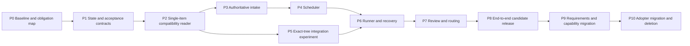

# Implementation and migration breakdown

**Proposal only.** This document defines reviewable implementation packages; these labels are not minted WI IDs. Source baseline: `a9bf6cee29fd0492d136457615598e8e96e5dada`. Read [the design recommendation](README.md) first.

The intended deliverable is a smaller reusable kit, not a second permanent coordinator. Keep the current runner as a rollback option until cutover, then delete the replaced runtime. Retain unrelated working tools unless the capability review explicitly replaces or retires them.

## 1. Implementation boundaries

Suggested files describe responsibilities rather than mandatory filenames:

```text
workflow/
  model.py          WI, Assignment, Candidate, Result; validation and transitions
  intake.py         proposal reconciliation and atomic queue mutation plans
  schedule.py       pure decisions, reasons, no effects
  run.py            enact decisions, subprocess lifecycle, recovery
  review.py         plan/review/arbitration protocol
  integrate.py      candidate preparation, checks, acceptance, promotion
  git_adapter.py    narrow Git/worktree commands
  agents.py         roster selection and provider invocation
  cli.py            create / next / run / review / status / doctor
```

Do not split these further preemptively. Reuse existing modules behind adapters where their behavior remains sound. In particular, the check harness, gate derivation, requirement readers, and bootstrap do not need rewrites merely because the runner changes. The CLI can initially wrap existing commands; avoid shipping two independent implementations of the same policy.

The pure layer must import neither process launch nor Git mutation code. The runner calls domain functions and adapters; views only read results. One intake writer allocates IDs and applies queued-scope changes. One integration writer changes trunk.

### Proposed domain records

| Record | Required information | Authority |
|---|---|---|
| WI | ID, intent/acceptance, references, dependencies, priority, tier, execution exclusivity, applicable review strategy | Versioned spec; directory remains WI status during migration |
| Assignment | Single WI ID, attempt, spec digest, base/claim commit, branch/worktree, route and policy revision | Tracked claim created by coordinator |
| Candidate | Assignment, trunk base, candidate commit and complete tree, declared checks and WI close proposal | Frozen versioned candidate |
| Review result | Subject tree/spec/policy, reviewer provenance, criterion-linked findings, severity, disposition | Controlled reviewer result, persisted by coordinator |
| Outcome | WI/attempt, complete/partial/cancelled result, evidence and missing scope, follow-up proposals | One terminal close and its receipt/report |
| Intake decision | Input fingerprint, affected queued IDs, keep/extend/edge/consolidate/return decision and lineage | One reviewed queue mutation |

Canonical fields should be parsed into typed values once. Reuse TOML frontmatter initially. Do not hand-edit a mutable run log and separately replay the same log to decide another authoritative state. Historical attempts are records; current WI directory and recorded current assignment have distinct meanings.

Specify the tracked claim's exact location in package P1. Preserve existing `docs/work/active/<branch>/` structure if it avoids needless migration; replace only its multi-ID assumption. A small assignment file inside the active claim directory is acceptable if no WI status is duplicated in it. Temporary worktree process metadata is not a substitute for the tracked claim.

## 2. Dependency order



P5 is an early stop/go experiment. It must settle whether peeling can be removed before P6 hardens a replacement runtime around the wrong evidence model. P3/P4 can proceed independently of that experiment after P2, but do not run multiple mutating coordinators on the same repo.

## 3. Work packages

### P0 — Establish the behavior baseline and retire list

**Problem:** a rewrite can preserve obsolete mechanisms while accidentally deleting real stakeholder obligations.

**Work:**

- Record source revision, CLI/public carrier surface, active/queued work, relevant owner rulings, and currently supported adopter versions. Exclude owner-only material.
- Inventory all 27 SNs and 76 SRs, then the LLR/TC and test families they govern. Classify core, advanced capability, migration-only, or retirement candidate. Do not approve the classification automatically.
- Capture representative scenarios from ordinary work, spine changes, adjudication, consolidation, human holds, partial close, interrupted review, and adopter upgrade.
- Measure fresh-core scaffold footprint, warm smoke/full checks, operator interventions, and session costs where logs actually support attribution. Keep historical numbers labeled historical.
- Explicitly disposition existing dev-slice/train batching policy and its approved design/tests: one-WI cardinality is a proposed policy change, not a compatible reinterpretation. Obtain that decision before enabling new assignment creation.
- Make a deletion ledger: old responsibility, candidate replacement, acceptance evidence, exact retirement condition. Unused compatibility code must get an expiry rather than a permanent adapter.

**Done when:** every stakeholder need has a disposition proposal; public compatibility obligations are named; the selected scenarios can be reproduced without live paid agents by scripted adapters. The owner can distinguish behavior retained from behavior proposed for removal.

**Do not:** clean the backlog, change authority dials, retire tests, or restamp ratchets in this package.

### P1 — Define the small state model and observable acceptance

**Problem:** current lifecycle meaning is distributed across folders, commits, rounds, and inferred bases.

**Work:**

- Specify the domain records above, legal transitions, authority per transition, and one-WI assignment cardinality.
- Define dependency satisfaction for complete, partial, cancelled, and restructured predecessors. Absorption rewrites live inbound edges; it never declares missing work complete.
- Define pause as stop admission and drain according to current policy. Distinguish held approval, malformed authority, provider fault, crash, and deliberate partial result.
- Define proposal staleness using all actual decision inputs. Start conservatively with the whole relevant queue/spec/spine snapshot; optimize invalidation only with evidence.
- Specify the owner-policy conflict resolution for supervision faults under SN-006 versus approval holds under SN-029. Record it as a policy question if existing rulings do not settle it.
- Write the small behavioral scenarios and failure tables before kernel code.

**Done when:** a reviewer can walk create → claim → execute → review → integrate and each failure return without reading existing runtime modules; every state has one owning writer and recovery rule. Any unresolved SN-006/SN-029 failure-policy conflict has an owner ruling before P6 implements those transitions; lack of a ruling blocks that dependent implementation, not this proposal.

**Deletion enabled:** no implementation yet, but multi-ID assignment and inferred base are explicitly absent from the target contract.

### P2 — Read the existing kit through one compatibility boundary

**Problem:** changing both storage and orchestration at once makes failures hard to locate.

**Work:**

- Read current specs and policy using existing parsers where possible; convert once into the domain records.
- Add one-item assignment creation with a durable base, spec digest, and route record.
- Reject multi-WI assignment creation in the new kernel. Existing active multi-WI lanes must drain through the old runner before switching; do not fabricate new acceptance or split their history.
- Keep schema and CLI migration translations in this adapter only, with the supported version range declared.
- Expose a read-only `next --explain`/`status` interface for the new model.

**Done when:** all current queued WIs and active assignments, including legacy multi-WI shapes, have a supported or explicitly unsupported/old-runner disposition; snapshots are reproducible; no repository state changes during inspection.

**Deletion enabled:** multiple ad-hoc consumers of WI status and base inference in the new execution path. Old imports remain until cutover.

### P3 — Put reconciliation before eligibility

**Problem:** scopes are minted independently and reconciled again at dispatch or close.

**Work:**

- Implement a single proposal path for human drafts, gap findings, partial reports, review findings, and worker successor proposals.
- Produce a reviewable intake mutation plan. Semantic decisions may call the adjudicator; allocation/writes remain deterministic and trunk-owned.
- Support keep, extend an unclaimed WI, add edge, consolidate several unclaimed WIs into one successor, and return for decision.
- Recheck input fingerprint and queued status immediately before applying. Stage the complete change in an isolated candidate/index; publish one commit or nothing. No partially rewritten dependency graph becomes authoritative.
- Preserve each absorbed acceptance criterion and source link. Many-to-many legacy supersession must import without dropped obligations or cycles.
- Freeze active specs. A proposal overlapping active work waits for it or requests a separately authorized stop/change; it never edits the assignment silently.
- Reconcile the legacy queue once under an exclusive reconciliation WI. Thereafter reconcile new or changed proposals, not every idle tick.
- Deduplicate repeated event proposals by source event and accepted decision, with a bounded adjudication outcome. An unchanged dismissed finding cannot mint work forever.

**Done when:** duplicate replay mints no duplicate WI; stale judgments do not apply; dependent edges remain valid; unrelated proposals stay independent; contradictions surface before affected build admission.

**Deletion enabled:** `dispatch._admit` consolidation census in the replacement path; repeated successor-specific consolidation logic. Keep lineage validation as intake behavior.

### P4 — Make scheduling the sole admission policy

**Problem:** scheduler order and dispatcher admission are separate answers.

**Work:**

- Use a pure immutable snapshot and return selected one-item assignments plus blocked/held reasons.
- Handle dependency readiness, authority, global/affected reconciliation barriers, exclusive work, pause, and capacity in one function.
- Test whether stdlib `graphlib` removes enough cycle/traversal code to justify use. Always impose deterministic priority/ID ordering on its ready set; library iteration order is not product policy.
- Replay legacy queue snapshots and list every intentional ordering change. No blanket “matches legacy” claim: the proposed priority simplification deliberately changes some ties.
- Render the same decision result in CLI and dashboard. An executor finding a changed snapshot must recompute, not reorder locally.

**Done when:** independent readers select identical WIs/reasons; exclusive work drains and admits exactly one; human-held work is never authorized by capacity or priority; rejected/missing/cyclic dependencies are clear.

**Deletion enabled:** `_judgement_first`, spine batch assembly, duplicated kind/action ranking in the new dispatcher, and optionally custom critical-path/downstream algorithms if their policy is retired.

### P5 — Prove the exact-tree integration design

**Problem:** evidence is hard to trust when close and refresh mutate the reviewed branch.

**Work:**

- Build a real-Git prototype that reserves the final integration turn, composes candidate C on trunk B, performs closure/generation, freezes tree T, checks/reviews T, and publishes a same-tree acceptance receipt.
- Persist candidate/attempt identity before invoking the reviewer. Use retained ordinary branches under `trajectory/candidates/<attempt>`; preserve worker and trunk ancestry, and append each phase receipt as a same-tree child commit. Rejected and human-held candidates remain reachable until the required evidence is archived. A lost uncommitted result is re-requested; it is never guessed as approval. Specify a full-clone/export recovery procedure that includes candidate branches, and test retention before allowing their deletion.
- Put the complete minimum acceptance evidence in Git-reachable committed material. For the proposed design, structured receipt plus necessary rationale lives in commit metadata; generated Markdown is a projection. Prototype rejected-review persistence too.
- Verify message/secret hooks, identity policy, commit signing where configured, and CI check binding. A new commit with the same tree may still need commit-specific checks; do not equate tree equality with every check passing.
- Verify human artifact attestations still name the approved normative content and acting authority. Content authority is not conferred merely by matching a hash.
- Publish using a normal checked Git workflow that refuses dirty trunk and unexpected B. Do not update a checked-out branch behind its index, bypass hooks through plumbing, or overwrite unrelated work.
- Crash-inject before/after candidate creation, review result recording, acceptance commit creation, trunk promotion, outcome/intake bookkeeping, and worktree cleanup.
- Measure serial-turn wait time with scripted fast and slow reviewers and a representative live controlled run when implementation is approved.

**Done when:** wrong-tree acceptance, stale-trunk promotion, missing review provenance, and duplicate terminal outcomes are impossible in the tested transition model; restart from a clean clone reconstructs all committed obligations; the measured tradeoff is acceptable.

**Stop/go:** if required evidence cannot be carried simply or review serialization is unacceptable, keep the existing verdict adapter temporarily and revise this design before P6. P6 may proceed only after P5 passes or an explicit retained-adapter contract is reviewed; its evidence assumptions cannot remain unresolved. Do not build a second metadata service or general event store as an unnoticed workaround.

**Deletion enabled if successful:** refresh and mechanical-close peeling, governing-revision reconstruction, and record-path exclusions in the replacement acceptance protocol. Historical evidence readers can remain in a migration/export tool.

### P6 — Implement runner, claims, and recovery

**Problem:** lane execution currently understands trains, historical evidence, and multiple closing shapes.

**Work:**

- Implement one dispatch loop: reconcile pending inputs, obtain schedule decision, record claim, create worktree, execute assigned phase, collect result, send candidate to review/integration, record outcome.
- Use Git worktree operations behind a narrow adapter. Preserve branches and patches until outcome/recovery evidence permits cleanup.
- Route every invocation with exactly one WI ID and one attempt. Unknown worker output is an error/uncertain attempt, never `complete`.
- Resume from the recorded base and next owed phase. Ensure the single-checkout/resumed shape cannot turn the evidence range into HEAD..HEAD.
- Pin the running coordinator code revision. When its implementation changes, stop admission, reach a defined safe boundary, exit, and let the launcher restart. Do not hot-reload an imported module graph.
- Distinguish durable state from local PID/log conveniences. In a same-machine restart, reconcile running processes; from a fresh clone, no local process is assumed active.
- Implement deliberate partial close by preserving unfinished code and making a reviewed report-only terminal transaction unless a usable subset independently meets the declared acceptance. Do not merge broken work solely to terminate a lane. Reconcile this change explicitly with SR-144/SR-169 before enabling it.

**Done when:** one and two lanes use the same path; no double assignment, no lost partial artifact, no rerun of completed work, and no busy retry loop on human-held work. Pause and resume work through every state.

**Deletion enabled:** multi-WI focus selection, train evidence aggregation, assignment-wide round inference, duplicate clean/partial path writers, and stale in-process coordinator behavior.

### P7 — Unify controlled review and planning

**Problem:** plan, adjudication, critique, and implementation review use overlapping session machinery and different outcome grammars.

**Work:**

- Use one result schema and shared transition engine, with subject-specific prompts and applicable criteria.
- Preserve provider-neutral routing, consent, cross-family preference/fallback, and configured review count initially.
- Support one ordinary review; opt-in plan review; rubric-based subjective critique; consolidation review; bounded dispute arbitration. Keep advanced dual-plan strategy behind its capability boundary.
- Store stable finding IDs, criterion, evidence, severity, disposition, and resolution. Preserve minor suggestions without requiring another build round for stylistic churn.
- Treat proposed acceptance changes as amendments requiring appropriate authority, never reviewer edits hidden in rework.
- Record model/tier/roster ID and session role before launch. Preserve budget use across retries and resumed sessions.
- Stop recurring arbitration at the declared cap and produce a concise owner brief: contested obligation, evidence, options, recommendation, and affected work.

**Done when:** each review type uses the same provenance/freshness rules; disagreements route consistently; exhausted budgets surface a concrete decision; a model or worker cannot silently lower approval requirements.

**Deletion enabled:** duplicated phase-specific result parsing and escalation accounting; mandatory advanced-plan steps for ordinary WIs where owner policy permits retirement.

### P8 — Demonstrate one complete replacement loop

**Problem:** clean unit tests do not demonstrate the user's intended loop.

**Work:**

- Run fresh scaffold scenarios with scripted providers over real Git: two independent WIs, overlap requiring consolidation, ordered separate changes, human-held amendment, conflicting review, partial close, and crash/restart.
- Verify final status and records from a fresh clone. Compare scheduler display with actual claims.
- Run a controlled sequence of real ordinary WIs and one scope-changing WI only after the owner approves implementation/operation. Keep the current pause until deliberately changed in that implementation session.
- Report operator interventions, root causes, session counts, token attribution where available, time in build/review/integration, and emitted follow-up work. Distinguish harness failures from product failures.

**Done when:** all acceptance families below pass; the agreed pilot completes without manual state repair; required repository checks pass with results and elapsed seconds recorded. Proposed pilot minimum: three ordinary completions and one reconciliation/approval case, plus automated recovery scenarios. This is a smoke demonstration, not a reliability estimate.

**Deletion enabled:** replacement becomes the only candidate runtime for the migration release; old runner remains a rollback tool, not a second active service.

### P9 — Consolidate requirements, tests, docs, and capability packaging

**Problem:** a smaller kernel can still inherit the same process burden.

**Work:**

- Apply the reviewed P0 disposition map to the spine without silently dropping criteria, historic approvals, or live dependencies. Every retired SR/LLR/TC must map to affected SN acceptance clauses and replacement evidence, or the explicit owner decision retiring that obligation; no approved clause may become unsupported through indirect cleanup.
- Re-map executable tests to enduring behavioral obligations. Keep a known-defect regression even if its old helper disappears, translated to the new boundary.
- Move obsolete implementation notes and old compatibility controls to migration/history; remove live normative rows only through the approved spine change.
- Assemble three capability sets using existing scaffold machinery: manual core; managed loop; advanced planning/architecture/reporting. Use a small declarative capability manifest listing included artifacts, applicable need/requirement IDs, and verification entry points. The exact set boundaries must honor the SN dispositions; accessibility stays with every shipped UI. Adoption tests must prove that each moved promise is available and verified when its capability is enabled, as well as absent from core dependencies when disabled.
- Keep current gate derivation and trace schema in this release. Consider direct SR evidence or stage simplification only in a separately reviewed proposal.
- Replace master-process runtime prose with the four-step loop and the canonical policy tables. Put detailed operational reference beside the relevant adapter.
- Run byte-budget checks before and after editing watched docs and report deltas. This report itself is outside those capped files.

**Done when:** every removed row/check has an explicit disposition; a minimum scaffold runs without importing/installing advanced capabilities; required capability tests and all mandated repo checks pass.

**Deletion enabled:** retired template surfaces, redundant doctrine copies, old helper-specific tests, and advanced-core imports. No test quota determines success.

### P10 — Ship a bounded migration and remove old paths

**Problem:** indefinite compatibility doubles the architecture.

**Work:**

- Publish a versioned RESYNC recipe and converter that reads supported old formats, preserves adopter content and history, and reports unsupported/ambiguous input without modifying it.
- Require an idle old station before conversion. Drain active multi-WI lanes with the old runner; never import them as fake one-WI accepted assignments.
- Run old and new schedulers read-only on saved snapshots, comparing intentional policy differences and unexplained differences separately.
- Select exactly one mutating runner through an explicit version/config boundary. Refuse mixed claims or simultaneous runners.
- Pilot on this repo and at least one representative adopter copy, including a non-Python profile and supported OS CI.
- Remove old runtime files, aliases, migration fallbacks outside the supported window, prompts, and tests whose behaviors were retired. Update bootstrap mapping, kit inventory, dependency ledger, resync pack, and docs together.

**Done when:** fresh adoption and supported upgrade are green; a reviewer can locate one writer for each lifecycle fact; the old runner is unreachable in the shipped current profile; the rollback recipe has been exercised on a copy.

## 4. Acceptance and test families

These are behavior families, not a request for one new registry row per bullet or one test per implementation branch.

| Family | Required checks |
|---|---|
| Intake | Duplicate proposals; stale semantic inputs; overlap with active work; contradictory approved requirement; atomic edge rewrite; no accepted obligation lost in consolidation |
| Scheduling | Deterministic selection; correct predecessor satisfaction; stable priorities; unknown/cyclic references; pending reconciliation; exclusive drain; one WI per lane; capacity and human holds |
| Assignment | Durable base; immutable assigned scope; claim before launch; repeated claim refused; clear attempt identity; provider failure and reroute provenance |
| Review | Correct subject tree/spec/policy; independent role provenance; changed content invalidates verdict; missing evidence cannot approve; minor vs material defects; bounded dispute handling |
| Integration | Real composed-tree checks; trunk changed after preparation; dirty checkout; conflicts; complete close before final review; no unauthorized artifact approval; publication policy honored |
| Recovery | Crash at each durable boundary; existing process ownership uncertain; candidate/receipt written but not promoted; promoted but intake not run; cleanup interrupted; no duplicate work or close |
| Partial/cancelled | Preserved code/report; terminal does not mean accepted implementation; dependencies stay unsatisfied or are explicitly rewritten; successor deduplication |
| Adoption | Fresh green scaffold; preserved adopter files; supported old upgrade; non-Python tooling; Windows/POSIX; absent advanced layers have no required imports |
| Assurance | Gate/check failure honesty; secrets and optional privacy behavior; trace integrity; unchanged human approval authority; normative amendment invalidates attestation |
| User-facing | One explainable next-action view; operator sees a concrete blocked decision; no historical record is presented as a living requirement; status after fresh-clone recovery |

Test selection strategy:

1. Small deterministic unit examples for policy boundaries and meaningful failure messages.
2. Property/state-sequence tests for graph ordering, unique claims, bounded transitions, and idempotent recovery. Hypothesis is optional development tooling, not a shipped dependency.
3. A limited real-Git suite for the filesystem, hooks, refs, worktrees, and candidate publication boundaries. Mocks cannot establish those guarantees.
4. Fresh-scaffold and upgrade tests per supported capability/OS contract, not every combinatorial toggle permutation.
5. Human acceptance of first-use and owner-decision clarity. Almost entirely automated TC coverage cannot establish that the process feels proportionate.

Record before/after suite duration on the same environment. Do not transfer the old smoke membership ratchet mechanically to a changed implementation: review the behavioral bar first, then change any membership baseline with its reason. Existing checks remain mandatory until that change is approved.

## 5. Rollback and migration integrity

Before enabling the new writer, retain the old kit revision, a clean paused state, and an export of open specs and claims. Back up by normal Git references and copies; no rewriting or deletion of owner history.

- Before the first new accepted mutation, rollback can select the old runner with the untouched old state.
- After new mutations, rolling code back alone is insufficient. Pause/drain, translate new open state through a tested reverse converter if supported, or use an explicit forward repair. Never reset trunk to erase accepted work or owner rulings.
- Historical old verdicts remain historical; the new integrator requires its own evidence for new candidates. Do not globally grandfather legacy review files.
- An unsupported adopter format stops that migration with a report. It does not become a permanent silent runtime fallback.
- A package that adds a new path must name the old path it removes and the release that removes it. P10 is part of the deliverable, not an optional cleanup wish.

## 6. Effort and agent use

Do not price this from the current registry size or claim a credible calendar estimate before P0/P5. The high-risk work is evidence/publication/recovery, not writing the scheduler. Re-estimate after the integration experiment and the first end-to-end fixture.

Use Luna for bounded tasks with explicit evidence:

- Census and old→new obligation/test mappings, with spot-check review.
- Read-only scheduler replays and documented differences.
- Deterministic fixture creation and mechanical adapter cleanup after contracts settle.
- Documentation/link updates and deletion-ledger verification.

Use a stronger architectural reviewer for the state/authority contract, intake transaction, exact-tree integration and crash model, policy changes, and final consolidation decisions. Use an independent reviewer of the configured family for acceptance. This is a work-allocation recommendation, not a new model-routing policy. Record actual tier and roster identity so savings can be assessed rather than assumed.

The useful completion criterion is not “fewer files” or “fewer tests.” It is: one WI per assignment; one intake decision boundary; one scheduler answer; one review subject; one terminal outcome; preserved stakeholder evidence; and a demonstrated reduction in the work required to understand and operate the kit.
