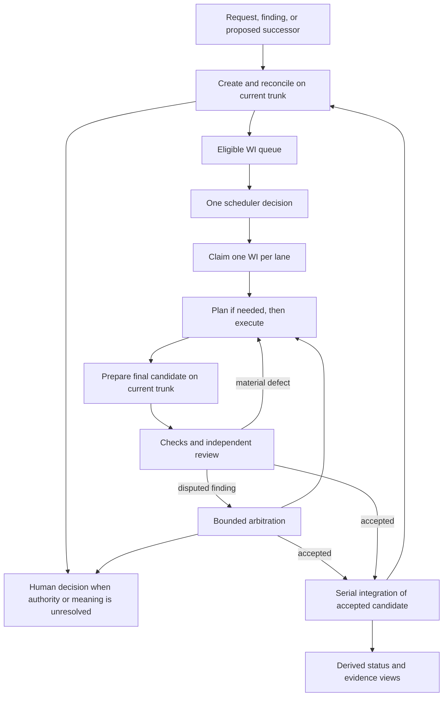

# A smaller ai-template: redesign for separate review

**Prepared:** 2026-09-05. **Status:** proposal; no runtime implementation, requirement rulings, or gate changes authorized by this document.

**Permanent location:** `docs/ai-template-redesign-2026-09-05-codex/` in this repository, at the owner’s direction. Preserve the plan and review history here.

**Recommendation:** replace the orchestration kernel behind the existing kit, preserve the useful adoption and assurance tools, and migrate by complete behavior slices. Do not rewrite the whole repository or carry every historical mechanism into a new implementation.

Your four-step loop is the right organizing model:

> Create and reconcile work → schedule the admitted queue → dispatch one WI per lane → plan/build/review, arbitrate when needed, integrate, and feed findings back into creation.

The principal root cause is that policy decisions and lifecycle facts have accumulated across multiple readers and writers. A repair often has to teach several modules how to interpret the same event. Work batching, close-time edits, legacy carriers, and implicit reconciliation then multiply the states those readers must reconstruct. The number of tests is a consequence as well as a maintenance cost; deleting tests first would leave the causes intact.

This proposal separates three decisions that are currently easy to conflate:

- **What is one coherent change?** Intake and adjudication decide before admission.
- **What can run together?** The scheduler decides from dependencies and exclusivity.
- **What is accepted?** A controlled review and integration protocol decides against a frozen candidate and the applicable approval policy.

This plan was amended after a Claude Fable 5 adversarial review at high effort. See [the findings and their dispositions](FABLE-REVIEW-DISPOSITIONS.md); the review does not approve implementation or change repository policy.

Read [the implementation breakdown](IMPLEMENTATION.md) for executable phases, dependencies, exit criteria, migration, and rollback. [Evidence and reuse options](EVIDENCE-AND-TOOLS.md) contains measurements, source references, limitations, and external documentation.

## 1. What must survive simplification

The canonical vision promises reusable, maintainable, requirement-traced projects, test-first work, explicit approval gates, and a shared human/agent playbook. The loop is the means of delivering those promises, not the entire product. A replacement that schedules agents beautifully but loses safe adoption, traceability, or honest approval would miss the vision.

| Stakeholder outcome | Existing anchors | Proposed treatment |
|---|---|---|
| Adopt and upgrade without clobbering project content | SN-001, SN-003, SN-011 | Preserve bootstrap ownership rules, stack configuration, Windows/POSIX support, argued dependencies |
| Understand why behavior exists and how it is verified | SN-002, SN-007, SN-033 | Keep traceability and tests; reduce duplicate descriptions and implementation-shaped normative text |
| Trust approvals, failures, and published output | SN-004, SN-005, SN-008, SN-009, SN-028, SN-029 | Preserve declared gates, human holds, privacy/secrets floor, evidence freshness, and explicit failure |
| Keep small projects and changes small | SN-012 | Make the small profile physically small and independently usable; measure its cost |
| Run and resume autonomous work | SN-006, SN-025, SN-034, SN-035 | One launch path, durable assignment, explainable next action, bounded recovery |
| Use independent judgment where warranted | SN-024, SN-026, SN-036 | One review engine; perspectives, rubric, and provider selection are inputs |
| Execute independent work concurrently and integrate serially | SN-027 | One WI per lane, bounded worktrees, one integration authority; single-lane setting uses the same code |
| Read progress and architecture | SN-010, SN-023, SN-037, SN-038, SN-039, SN-040 | Preserve promised outcomes; distinguish core status from advanced architecture/reporting capabilities |

These are coverage groups, not proposed replacement need IDs. All 27 existing needs must receive an explicit disposition before any retirement. “Optional profile” does not mean an approved need disappears. In particular, boundary/interface coverage and reproducible architecture partitioning are approved promises: narrowing them requires an explicit scope decision, not a refactor.

**Amend conflicting requirements before enabling the new kernel.** P1A in the implementation breakdown lands the reviewed, version-scoped changes for assignment cardinality, admission authority, reconciliation timing, and any changed partial-close/evidence behavior. P8 cannot run under incompatible old requirements and defer their correction to P9. Bulk documentation and requirement consolidation can still wait until P9.

**Keep the existing stage model during the kernel migration.** The eight stages and cumulative approval dial are not the first deletion target. A later owner-reviewed requirements change may simplify their presentation or scope. Do not collapse stages, change human authority, and replace orchestration in the same experiment.

## 2. Findings and current gaps

### 2.1 The displayed schedule is not the whole admission decision

`schedule.order_key` orders by kind rank, priority, downstream count, path length, and ID. `dispatch._judgement_first` then moves adjudications ahead of spine work and expressly documents the disagreement. This is intentional code, but it means a reader of the scheduler does not yet hold the final answer to “what runs next.”

**Redesign:** one pure scheduling result contains selected assignments and the reason every other WI waits. CLI, dashboard, and dispatcher consume that result. Dispatch may refuse a stale decision or unavailable resource; it never substitutes another priority ordering. [Source](../../project-trajectory/scripts/dispatch.py), [ordering](../../project-trajectory/scripts/schedule.py).

### 2.2 Consolidation is late and mixed into admission

Creation already has a central intake owner, which is valuable. But intake also occurs after merge, on empty-frontier census, and through an idle-station consolidation census inside dispatch. The recent plan explicitly retained multi-WI spine batches. This is why adding consolidation has not removed batching complexity.

The September 5 report is right that a closing worker cannot safely consolidate the trunk queue from its old lane snapshot. That argument establishes **where authoritative reconciliation must occur**, not that it must remain a separate dispatcher mechanism forever.

**Redesign:** workers submit proposals. The single trunk intake transaction adjudicates them against current queued work before making them eligible. Semantic reconciliation of legacy queued work can run as one explicit exclusive WI, with its own declared scope, review, and terminal outcome. Pure format normalization is a mechanical intake transaction and does not need a semantic adjudication WI. A pending reconciliation prevents admission of the affected work; active assignments are immutable. [Report §4](../../docs/decisions-for-review-2026-09-05.md), [current trigger](../../project-trajectory/scripts/dispatch.py).

### 2.3 One lane can contain several review/completion units

`dispatch._admission` returns a list of spine WIs for one exclusive lane. Worker logic then tracks a current WI within that assignment and determines which review obligations remain across the train. The September 5 report also notes that lane-level telemetry can be replicated across several WIs.

**Redesign:** the assignment schema contains one `wi_id`, never a list. A coherent consolidated WI may have several acceptance criteria and commits. It has one reviewed scope and one terminal decision. Distinct changes remain separate WIs even if they run serially.

**Important qualification:** consolidation does not prove independence. Shared filenames are a signal for examination, not a reason to combine work or proof of conflict. Separately named WIs can still conflict semantically; large consolidated WIs can still be bad assignments. Add a dependency, reserve an exclusive resource, or return a contradiction for decision when that is the better answer.

### 2.4 Evidence identity depends on historical interpretation

`kitlib/verdict.py` distinguishes tree identity, governing revision, refresh peeling, mechanical-close attestation, and tip peeling. These protections address real integrity defects. They are also expensive machinery for recovering what was actually reviewed after the branch has been mechanically changed.

The archive writer defect illustrates the coupling: changing a terminal path also requires changing verdict-peel recognition and numerous fixtures. OI-84 shows a related problem: recomputing a resumed lane's base as HEAD can make all evidence readers see an empty range.

**Redesign:** persist the base when claiming; prepare the final candidate before its final review; record the exact candidate tree. Do not reconstruct assignment or acceptance from commit subjects or whichever merge-base happens to be available. Retain evidence identity protection, but simplify the event ordering that makes peeling necessary. [Evidence implementation](../../project-trajectory/scripts/kitlib/verdict.py), [report §5](../../docs/decisions-for-review-2026-09-05.md).

### 2.5 Requirements, design, migration history, and backlog overlap

There are 27 SNs, 76 SRs, 192 LLRs, and 191 TC records. The problem is not an acceptable numerical ceiling. It is that some normative rows carry internal helper placement, retired vocabulary, compatibility detail, or long test procedures that duplicate code and tests. Meanwhile some SRs span multiple responsibilities, so indiscriminately merging rows could make review worse.

Examples for disposition review:

- SR-148 covers a broad scheduling/admission/resume contract, including retired pointer behavior. Split enduring observable obligations from temporary migration acceptance.
- LLR-058/059/123/149/152/159 are a useful cluster for re-deriving the scheduling contract after removing batch admission.
- LLR-182 describes terminal vocabulary and helper placement: preserve its terminal-outcome behavior; reconsider whether module placement merits a permanent LLR.
- LLR-050 explicitly records retirement; inspect whether a live normative row is the right home for that history.
- TC-208 carries a long consolidation method spanning clustering, digests, exclusion, archival, and edge rewriting. Replace repeated procedural prose with compact behavioral acceptance and executable evidence references.
- LLR-099–120 cover a substantial dashboard subsystem. Accessibility remains necessary for any shipped UI; advanced dashboard behavior can be isolated from the managed loop.

An **Approved design** can legitimately describe behavior not implemented yet, especially at DevStg-Tests. “NOT BUILT YET” in LLR-176 is not by itself proof of a false approval. The problem to fix is the mixing of normative design, implementation status, and known gaps in one cell, and any surface that incorrectly presents design approval as delivered behavior.

### 2.6 Right-sizing is declared more clearly than it is delivered

PROCESS already states a small profile and proportionality doctrine. Yet the reusable process masters total 276,297 bytes, and the kit has 82 Python files containing 76,337 physical lines. Optional behavior still costs maintainers and can cost adopters reading and dependency exposure even when its toggle is off.

**Redesign:** a usable manual core, an optional managed loop, and separate advanced reporting/planning capabilities. Verify an omitted capability is absent from the scaffold and not imported by the core. Avoid inventing a general plugin framework: the existing bootstrap mapping can express a few explicit capability sets.

### 2.7 Operational feedback is weaker than the detailed machinery

The September 5 investigation reports review churn confounding worker-quality measurements, missing routed-tier/roster IDs, and no uniform successful-close outcome record. Those results support small instrumentation improvements, not a learned router.

**Redesign:** record WI ID, attempt, role, provider/model, roster row, tier, policy version, timestamps, review outcome, and terminal result once. Evaluate completed stakeholder work per unit of operator attention, tokens, and time. Do not use review-round count alone as a quality measure, and do not promise token savings before measuring them.

## 3. The target loop

There are four policy responsibilities and thin execution adapters:

| Responsibility | Owns | Must not own |
|---|---|---|
| Intake | Draft validation, scope comparison, contradiction decisions, consolidation, dependency rewrite, ID allocation | Worker process launch, implicit approval of human-held artifacts |
| Scheduler | Readiness, priority, capacity, exclusivity, authority holds, explainable selection | File writes, creating WIs, reinterpreting review files |
| Runner | Claim enactment, one-WI worktree, session invocation, attempt/recovery handling | Backlog edits, scope expansion, admission reordering |
| Review/integration | Plan/review protocol, candidate checks, verdict authority, serialized acceptance | Auto-declaring failed work complete, silently changing acceptance criteria |

Git/worktree operations, provider commands, and the existing check harness are adapters. A small domain module defines WI, Assignment, ReviewResult, and Outcome. Do not create a service or manager class for every noun.

### Creation and consolidation contract

A proposal carries intent, source/requirement references, acceptance criteria, dependencies, priority, routing tier, and any known shared resources. Detailed touched-file lists are optional hints; inaccurate declarations must not establish safety by themselves.

At intake:

1. Read current queued/active work, relevant approved requirements and pending amendments, and applicable policy.
2. Mechanically reject malformed references, missing scope, self-dependencies, cycles, and invalid authority changes.
3. Reuse an existing decision when its full relevant inputs still match. Compare semantic scope and acceptance content, not just titles.
4. For an overlap, choose keep separate, add ordering edge, extend an unclaimed WI, consolidate unclaimed WIs into a successor, or return the proposal for a contradiction decision.
5. Write the complete reviewed mutation in one trunk commit: new/updated specs, absorbed lineage, dependency rewrites, and the decision record. A failed precondition publishes none of it.
6. Only then may affected WIs appear as eligible to the scheduler.

The current `queue_digest` includes ID, title, dependencies, and safety class but omits Done-when and Context. The four-field choice is deliberate: its docstring avoids repeating a judgment when Deliverable or BuildTier changes without changing the scope question. Preserve that principle. The new semantic fingerprint covers the adjudicated scope and acceptance text, dependencies, requirement/artifact revisions, and execution conflicts; exclude telemetry, generated display text, Deliverable history, and a routing-only tier change unless the decision actually depends on them. Record the exact input revision separately for transaction staleness. A changed semantic input invalidates reuse; a merely newer trunk requires rereading/precondition checks, not automatically another LLM judgment. Start with conservative invalidation where an input has not yet been classified, and measure the resulting re-adjudication frequency. The omission is a freshness gap to investigate, not a claim that every current stale case has been reproduced.

Do not invoke an LLM on every scheduler tick. Reconcile on a new proposal, relevant change, or explicit reconciliation request. Bounded semantic adjudication handles uncertainty; a stalled adjudicator cannot generate an endless series of judges. Unaffected work may continue only under the declared independent-work policy.

Consolidation has a size limit in **coherence**, not a universal line count: one acceptance decision must be able to judge the result. If two subsets can ship independently or demand different authority, sequence them instead. A plan may list several future WIs; it is not a multi-WI assignment. For existing spine trains, the default is to consolidate only rows that share one coherent acceptance decision; otherwise sequence separate exclusive WIs. P0 must show historical train sizes and compare both outcomes—including the extra compose/check/review turns—before the cardinality decision enables a new runner.

### Scheduling contract

The scheduler consumes an immutable validated snapshot of work, active assignments, pending decisions, and policy. It produces assignments, held/waiting reasons, and the snapshot revision.

- A predecessor is satisfied by its accepted disposition, never merely because its process exited. Cancelled/partial work does not silently satisfy delivery dependencies.
- A pending affected-scope reconciliation is resolved before that scope is admitted. An explicitly global reconciliation drains the station and runs alone.
- Exclusive work admits one WI only after active work drains. Independent ordinary work fills available lanes, one WI each.
- The initial priority rule is explicit priority descending, then stable ID, after readiness/authority/exclusivity constraints. Retain downstream/path ranking only if the owner wants it and replay shows a useful difference. This is an explicit scheduling-policy migration, not promised old-order equivalence.
- The dashboard displays the same decision object that dispatch executes. If its inputs change, dispatch requests a new decision.

The reconciliation decision records an explicit set of affected queued WI IDs against its input snapshot. The adjudicator derives that set from requirement/artifact row references, dependency closure, declared shared/exclusive resources, and the proposal’s normative scope; file lists alone cannot certify independence. New relevant input invalidates that decision. Missing or ambiguous scope falls back to a global hold; merely having some references does not prove that the scope is complete. The scheduler uses this recorded set rather than inventing a semantic classifier.

No extra classifier predicts arbitrary semantic conflicts. Intake handles known overlaps; conservative exclusive execution handles uncertain shared scope; final composed-tree checks and review handle integration effects.

### Assignment and recovery contract

An Assignment contains one WI ID, an attempt ID, the WI specification digest, claim/base commit, worktree/branch reference, chosen route, claim-time policy revision, and the next owed phase. The claim is recorded before a process starts. Claim-time policy records execution provenance; it does not grandfather approval authority. Review and promotion evaluate authority, holds, required evidence, and publication permission against current trunk policy. Recheck them at every phase boundary and immediately before promotion; a tightening applies to in-flight work, and a relaxation is never inferred from the old claim. A proposed policy relaxation inside the candidate cannot authorize its own acceptance; current trunk authority governs approval of that policy change.

A crash is an interrupted attempt, not a partial outcome. Resume from the recorded assignment; if process liveness is uncertain, resolve ownership before launching another worker on it. A deliberate partial close has an immutable report explaining delivered, missing, and preserved work. Never infer either condition solely from prose or branch naming.

Use one shared transition function for the small attempt states: claimed → executing → candidate-ready → reviewing → accepted, with explicit retry/rework and human-blocked outcomes. WI lifecycle remains draft/queued/active/terminal during migration. Assignment execution phase and WI status describe different entities; no dashboard or log gets a separate authoritative status.

Bound retries by a declared session/attempt budget. Temporary provider failure may reroute under existing consent; record the change. Unknown approval authority prevents that approval, while independent work follows the existing continuation policy. The existing acceptance clauses already require approval-authority faults to resolve toward more human involvement (SN-029), and faults in limit-enforcement machinery to be recorded while operation continues (SN-006). Preserve those clauses; do not add a general failure-policy ruling or treat continuation as authority to approve a held artifact. P1 asks only the unresolved question, if any: how to proceed when the machinery deciding whether other work is independent of a pending hold fails. That specific transition needs a ruling before it is implemented.

### Controlled plans, reviews, and arbitration

A shared result envelope serves plans, implementation, consolidation, and subjective artifacts; only provenance, findings, and disposition are common. Subject-specific criteria remain typed payloads rather than an expanding set of universal optional fields. The envelope records subject and revision, criteria/rubric, reviewer provenance, findings with stable IDs and severity, disposition, and any requested decision.

Ordinary work gets one independent review under the configured review policy. A plan session is appropriate for uncertain design, scope changes, or explicit requests. Two competing plans and position-swapped arbitration remain an advanced strategy; do not make their eight-session happy path the default for a straightforward WI.

A material defect must name the unmet criterion and evidence. Minor suggestions are recorded and do not silently become required scope. A reviewer can still identify an omitted stakeholder obligation; that is a scoped amendment/adjudication decision, not a prose rewrite disguised as fixing the original acceptance.

An arbiter resolves a disputed finding against the same candidate, criteria, and evidence; it cannot waive a human hold or bless changed content under an old result. Start with one arbitration attempt per dispute, then a human decision if unresolved, subject to an explicitly reviewed policy. Preserve current configured routing and review settings until that policy migration is approved.

### Simpler integration: favor stable evidence over a fast merge slot

A useful simplification to prototype is to serialize **final candidate preparation, final checks, final review, and promotion**, while workers continue building in parallel. Today considerable machinery supports checking/reviewing before a very short merge slot, then explaining away mechanical changes.

The proposed default sequence is:

1. Reserve the integration turn and read trunk revision B. Other workers continue; coordinator-controlled trunk mutations and new claims wait during this turn. This reservation cannot lock out a human commit: recheck B before and after every expensive phase, stop a stale attempt early, and retain the final promotion check.
2. Compose the worker result onto B in a candidate worktree. Resolve conflicts, perform the planned terminal spec move, and generate required normative/checked outputs before review.
3. Freeze candidate C and its complete Git tree T. Check T, and obtain the final review against T, the WI scope, and policy. Any content change creates another candidate and reruns applicable validation.
4. Record acceptance provenance in a commit message whose tree remains T; promote only if trunk still equals B and current policy still authorizes this approval. No excluded-path classification or refresh/close peeling is needed to identify T.
5. Run intake and regenerate human views in the next serialized transaction. These derived views do not decide whether the preceding tree was approved.

Git supports commit metadata independent of a tree. That makes a tree-preserving acceptance receipt technically possible; it is an architectural proposal, not a proven fit for this kit. The prototype must prove commit-hook/CI behavior, complete review evidence retention, human-attestation handling, and recovery across the publication boundary. [Git commit objects](https://git-scm.com/docs/git-commit-tree).

Candidate commits live on retained ordinary Git branches under `trajectory/candidates/<attempt>` until their evidence is archived under the declared retention policy. Candidate preparation preserves worker ancestry and current trunk ancestry; the receipt is a child commit with the same tree, so promotion does not discard worker history. Rejected and human-held candidates retain their branches too. A full clone/recovery test must fetch these retained branches; a single-branch shallow clone is not a complete recovery export. Each review/arbitration phase appends one same-tree receipt with a strict versioned schema, and the final acceptance links the required phase results. No required evidence may rely solely on a reflog or dangling object.

Receipt authority comes from the controlled reviewer invocation and coordinator validation, not from arbitrary text containing APPROVE. Preserve the repository’s authorized-writer, signing, and protected-history policies. A rewritten receipt is a new commit identity whose authority and evidence must be revalidated; a copied message is not transferable approval. Before promotion, run both the checks of tree content and the required checks of the final commit/message/provenance.

The receipt must carry sufficient structured result and rationale to recover acceptance from Git alone, not just a path/hash to an untracked log. Full session transcripts can be ancillary, but required evidence cannot disappear. A later generated Markdown view reads the receipt; it is not another verdict authority. Rejected reviews are durably recorded before releasing the turn; they do not mark the candidate accepted.

This trades some concurrency utilization and integration latency for substantially simpler correctness. SN-027 explicitly justifies concurrency structurally rather than promising throughput. The stop/go experiment must count the whole serial cost per completion: every compose/check/review round, rework, arbitration, and intake judgment at the configured lane count. Include single-pass, repeated-rework, and long-tail cases from the historical distribution; do not mislabel entire WI wall time as time spent in the serial turn. Before running, record numeric latency/throughput budgets, workload, hardware, and an acceptable operator-intervention count against the existing runner. Also account for the schemas, retained refs, recovery/export rules, and reservations the new receipt protocol adds against the peeling it deletes. Correctness alone does not establish simplification. Measure head-of-line blocking: if a long final review makes the design impractical, reject this prototype and retain the current tree-identity adapter temporarily. Do not quietly recreate peeling or add a metadata database to save an unproven design.

Preserve the configured human-hold behavior. With `keep_nondependent = false`, stop new admission, drain existing work, then prepare the human-held candidate on the settled trunk; the coordinator does not keep promoting unrelated work during that approval. With independent continuation enabled, retain the pending candidate and permit unrelated work while the owner is unavailable, then reserve a final integration turn when the owner takes up the decision. Recompose before asking for final tree approval so the owner is not repeatedly asked to race moving trunk. A human commit can still invalidate the candidate and must be reported.

Distinguish existing artifact approval from final candidate approval: an artifact attestation names its normative content and scope and is rechecked under current authority; unchanged artifact content does not require re-attestation solely because an unrelated trunk commit landed. Final candidate approval names the exact candidate tree T and current required policy. It is never carried to T′ merely because a patch looks identical. Recompose/check/review the new candidate, and reacquire human approval wherever current policy requires it. Do not weaken whole-tree review freshness to solve the waiting problem.

## 4. Requirements and test redesign

Keep two questions distinct: “Does this obligation still belong in the product?” and “Does this particular design or test still provide independent evidence?” Answer the first with the stakeholder; the second through engineering review.

For every existing SR/LLR/TC, assign one disposition:

| Disposition | Meaning |
|---|---|
| Keep | Enduring observable contract or trust boundary |
| Consolidate | Same enduring obligation, expressed once; preserve every distinct acceptance condition |
| Move to design decision | Internal organization or justified mechanism; reviewable without pretending it is a stakeholder outcome |
| Move to optional capability | Still promised when enabled; separate scaffold and verification boundary |
| Migration-only | Required for a supported old format; explicit retirement release and evidence |
| Retire | Behavior deliberately removed; owner-approved rationale and successor mapping where applicable |

Do not set a target number of requirements and fit the product to it. A useful core contract set is intake correctness, scheduling determinism, assignment exclusivity, recovery, review authority/freshness, integration integrity, adoption ownership, honest verification, and status clarity. Whether that takes 10 or 20 SRs depends on independently failing obligations.

For the first migration keep the existing SN→SR→LLR→TC schema and approval mechanisms. Reclassify and consolidate within that contract. A later optional proposal can permit direct SR-to-verification evidence where an LLR would merely paraphrase the SR. That changes SN-002's existing acceptance and the trace checker; it is not an automatic consequence of simplifying orchestration.

Retain test-first development. The replacement kernel should begin with observable acceptance scenarios and a small reference state model, then implementation. Keep known failure regressions, real Git integration, malformed-input tests, and Windows coverage. Parameterize repeated examples or use generated state sequences where that reduces code while preserving diagnostics. One TC may point to many executable cases; one helper need not acquire its own TC record.

Required behavior families are enumerated in [IMPLEMENTATION.md](IMPLEMENTATION.md). Test retirement requires a mapping to a surviving obligation/test or an approved deleted behavior. A coverage percentage alone does not justify retirement. Do not convert a red check to opt-in to make the rewrite appear simpler.

### Replace a design when its LLR is the problem

Treat an LLR as the approved current implementation design, not a permanent restriction on future solutions. The existing authoring rules already allow approved text to be amended, but the intake diagram omits a useful third route: the parent obligation remains right while its selected design should change. Add that route to the normal WI/approval process. A worker should propose a justified LLR replacement instead of building an obsolete mechanism into a workaround; preserve parent outcomes, required approval, historical evidence, and behavioral regressions. A changed parent promise still requires a parent amendment.

### Separate HTML rendering and its expensive tests

Extract the HTML surface behind a package boundary in this repository. Core scheduling, registry validation, and text-status generation should not import rendering or layout code. An ordinary core-only change should run core/shared tests without the expensive HTML family. Changes to rendering, its input contract or shared dependencies must select the affected rendering tests; routine data changes still require current-output generation/freshness. Retain full enabled-capability runs at the approved phase/release/periodic cadence.

The detailed replacement workflow, renderer boundary, selection table, and P9R exit criteria are in [the LLR and rendering follow-up](LLR-AND-RENDERING.md). These additions follow the Fable review and do not carry a new Fable verdict.

## 5. What to reuse and what not to build

Keep Git/worktrees, TOML, the existing harness, bootstrap ownership, useful trace/gate code, and pytest. Consider stdlib `graphlib` for cycle detection and dependency traversal; keep the small policy-specific ordering explicit. Hypothesis is a plausible development-only addition for scheduler and crash-state invariants.

GitHub protections and merge queues are useful in an optional hosted mode, but do not replace local/offline operation or prove semantic review of every newly composed merge candidate. Schema libraries need a measured deletion argument. SQLite is unnecessary as an initial authority store. Temporal, Prefect, and LangGraph address broader orchestration problems and would add another runtime model here. The detailed comparison and sources are [in the evidence document](EVIDENCE-AND-TOOLS.md#external-tools).

Do not add a learned worker-tier estimator, a new generic plugin framework, an event-sourcing platform, a replacement Git implementation, or new ratchets before the core behavior is smaller. The September 5 report's optional escapes ratchet and title improvement can remain legitimate maintenance proposals, but they do not solve this architectural problem.

## 6. Review decisions and recommendation

I recommend a **replacement kernel with staged migration**, not either a whole-kit rewrite or another decomposition-only WI that redistributes the same behavior among more files.

The owner review should decide:

1. Adopt one WI per lane as a schema invariant, including spine work; consolidation or sequencing happens before claim.
2. Make authoritative intake reconciliation the eligibility boundary, with one explicit migration reconciliation WI for the existing queue.
3. Prototype the serialized final-review integration turn and accept its throughput tradeoff only after measurement.
4. Preserve the stage ladder, owner-authority controls, and trace schema; land the narrow P1A requirement amendments before enabling changed runtime behavior. Review bulk requirements simplification separately.
5. Separate manual core, managed loop, and advanced capabilities without silently retiring stakeholder promises.
6. Make justified LLR replacement a normal design-change route, without adding a separate approval layer.
7. Isolate HTML rendering and select its expensive tests by affected capability rather than running them for every core change.
8. Keep the old runner available only as a rollback implementation; permit one mutating runner at a time and remove compatibility paths after a named migration release.

These are proposals for the separate review the user requested. No new WIs were minted, no stages changed, and no runtime implementation or publication was performed in preparing or updating this report.
