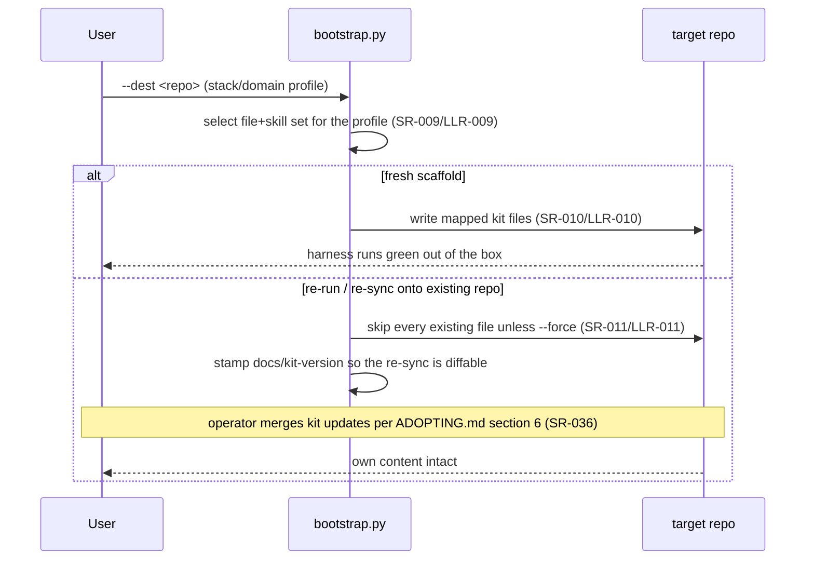
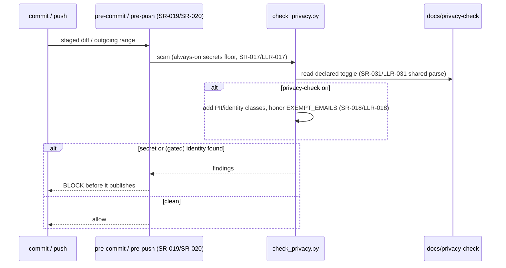

# Architecture — the kit meta-repo (self-adoption)

One page over the kit's **own** product: the reusable process kit under
[`project-trajectory/`](../project-trajectory/) — its runnable scripts
(`project-trajectory/scripts/`), git hooks (`project-trajectory/hooks/`), and
the artifact templates it ships — verified by the suite in [`tests/`](../tests/).
This doc is the kit's **self-adoption** architecture (IMPROVEMENT_PLAN.md Thread
47); it is distinct from the `architecture.template.md` the kit ships to
adopters. The requirement spine it renders lives in
[`requirements/`](requirements/) + [`test/`](test/).

## Shape of the product

- **Checkers / generators** (`project-trajectory/scripts/*.py`) — stdlib-only,
  Python 3.8+, cross-platform (SR-034/SR-035). Each is invoked as a subprocess
  by the check harness (`check.py`) and by the test suite, so the "product" is a
  set of independently runnable commands, not a linked application.
- **Enforcement floor** (`project-trajectory/hooks/*`) — the pre-commit /
  pre-push / commit-msg hooks that run the integrity + secrets floor
  agent-neutrally (SR-019/SR-020/SR-021).
- **Declared config** (`docs/stack.ini`, `docs/gate`, `docs/*-policy`,
  `docs/privacy-check`) — read once by the harness and the coordinator so a
  behavior is declared in text, not baked into a script (SR-007/SR-031).

## Module map

The per-symbol map over `project-trajectory/scripts/`, generated by
`gen_arch_map.py` (SR-023). **Do not edit by hand** — `gen_arch_map.py --check`
(the G3 arch-map-freshness step) fails if this block drifts from source;
regenerate with `python project-trajectory/scripts/check.py --run-step arch-map`.

<!-- BEGIN GENERATED MODULE MAP -->
_Generated by `scripts/gen_arch_map.py` from the source tree (AST). Do not edit by hand; run the check harness to refresh. Summaries and `Implements:` come from your docstrings/comments._

### `scripts/agent_loop`
_Unattended coordinator: loop fresh agent driver sessions until done._
Imports (internal): `agent_route`, `score_reviews`
Contracts (interfaces): IF-015, IF-037, IF-041

| Public item | Summary | Implements |
|---|---|---|
| `read_declared(path, default)` | Read a one-word declared-policy file (docs/gate, docs/run-state, …): |  |
| `sanitize_track(name)` | A track name becomes a lane directory segment, so restrict it to a safe |  |
| `lane_dir(docs, track)` | The coordination lane for a track: docs/tracks/<track> when a track is |  |
| `acquire_lock(lock_path)` | Take the per-worktree coordinator lock, or return an error string. |  |
| `release_lock(lock_path)` | Drop the coordinator lock: closing the descriptor releases the OS lock. |  |
| `guardrails_apply(policy, model)` | Whether to inject the guardrails core for a session on `model`, under |  |
| `guardrails_core(root)` | The always-on core to prepend to a weak-tier session's prompt, or None. |  |
| `guardrails_inert(policy, models)` | True when a *guarding* policy (not off / bare all) would guard none of the |  |
| `split_cmd(template)` | Split a command template into tokens, quote-aware but with backslash |  |
| `build_argv(template, model, prompt)` | Substitute {model}/{prompt} per token (never through a shell, so the |  |
| `status_size_warning(status_path, limit)` | A warn-only message when the resume surface outgrew one screen, or None. |  |
| `parse_model_map(spec)` | "P0=model-a,G3=model-b" -> {"P0": "model-a", "G3": "model-b"}. |  |
| `phase_tier(phase, tier_map)` | The routing tier for a run-phase: the declared --tier-map / AGENT_TIER_MAP |  |
| `reviewer_prompt(prompt_templates, phase, verdict_path)` | The redacted reviewer prompt for a review phase: the per-phase prompt-map |  |
| `load_critique_srs(docs)` | The SR ids whose Verification is `Critique` (docs/requirements/ |  |
| `build_scope_srs(root, docs, commit_range)` | The SR ids the WIs named in `commit_range`'s commit subjects deliver — the |  |
| `critique_brief(root, docs, scope_srs)` | The redacted critique brief: for each in-scope Critique SR, its intent (the |  |
| `critique_prompt(prompt_templates, verdict_path, brief)` | The redacted critique prompt: the CRITIQUE prompt-map template (a FILE the |  |
| `git(root, *args)` | Run git in the repo; returns (returncode, stdout-stripped). |  |
| `head_sha(root)` | Short HEAD sha, or None on a zero-commit repo (guarded rev-parse). |  |
| `current_state_excerpt(status_path, max_lines)` | The '## Current State' section of a status.md — the root dispatcher's or |  |
| `parse_json_result(output)` | Best-effort parse of a --output-format json run: the last line (or the |  |
| `limit_reset_hint(output, data, exit_code)` | The 'resets <time>' text of a rate-limit message, or None. |  |
| `seconds_until_reset(hint, now)` | Best-effort seconds until a reset hint like '3:45pm', '10am', |  |
| `bounded_transcript(output)` | Head + capped tail of a session transcript (the tracked-log bound). |  |
| `write_session_log(iter_dir, meta, transcript)` | Write the tracked, size-bounded per-session log: a `# key: value` |  |
| `read_log_meta(path)` | Parse the `# key: value` metadata header of one session log. |  |
| `regenerate_index(docs_dir)` | Rebuild docs/iteration_index.md from the docs/iteration/*.log metadata |  |
| `next_session_number(iter_dir)` | Next NNN, continuing across coordinator restarts. |  |
| `preflight(root, template, args)` | Refuse to start iteration 1 on a broken footing. Returns the list of |  |
| `run_session(argv, root, timeout, env)` | One fresh headless driver session. Returns (exit_code, output, |  |
| `stop_banner(status_path, label, detail)` |  |  |
| `main()` |  |  |

### `scripts/agent_route`
_Model routing for the unattended coordinator — the enable-list + availability_
Contracts (interfaces): IF-044, IF-045

| Public item | Summary | Implements |
|---|---|---|
| `Model (class)` | One registry row = one (model x route) pair. The id is opaque (a join |  |
| `load_registry(path)` | Parse docs/agents.csv into {id: Model}, plus a list of error strings for |  |
| `parse_env(spec)` | Parse an `Env` cell (`KEY=value;KEY2=value2`) into a dict, to be merged |  |
| `parse_tag_rank(spec)` | Parse a `ga>preview>beta>exp` ordering into {tag: rank} (higher = earlier |  |
| `load_tag_rank(path, env)` | The maturity rank vocabulary for version-less resolution: the |  |
| `resolve_token(token, registry, tag_rank)` | Resolve one enable-list token to a registry id, or (None, reason). |  |
| `resolve_enabled(enabled, registry, tag_rank)` | Resolve the ordered enable-list to concrete registry ids, preserving |  |
| `load_enabled(path)` | The ordered enable-list (docs/agents-enabled): every non-empty, non-# |  |
| `available(cooldowns, model_id, now)` | True when `model_id` is not cooling down. `cooldowns` maps id -> the epoch |  |
| `cool(cooldowns, model_id, now, seconds)` | Put `model_id` on cooldown until now+seconds (its limit is probably |  |
| `select(enabled, registry, tier, now, cooldowns, exclude_families, prefer_different)` | Pick a model id from the enabled pool, or None. Returns (id, reason) — the |  |
| `load_constants(env)` | The escalation constants: the per-repo-overridable defaults, each read from |  |
| `escalate(rounds, constants, swapped, at_top_tier)` | The fixed win-stay/lose-shift decision after a review round. |  |
| `failure_action(gate_policy)` | What a page-the-human escalation does, keyed to docs/gate-policy (ruled). |  |
| `main(argv)` |  |  |

### `scripts/bootstrap`
_Scaffold a new project from this trajectory kit._
Contracts (interfaces): IF-014, IF-039

| Public item | Summary | Implements |
|---|---|---|
| `selected_agents(choice)` | Expand an --agents choice into the concrete agent keys to materialize. |  |
| `parse_skill_frontmatter(text)` | Minimal frontmatter parse (name/scope + list fields) for a SKILL.md. |  |
| `matches_scope(fm, stack, domain, binary_assets)` | Trivial tag-intersection matcher: does a skill's applicability fit the |  |
| `select_skills(stack, domain, binary_assets)` | The kit-scope skills whose applicability intersects the declared scope. |  |
| `materialize_agent_layer(dest, agents, skills, dry_run, force)` | Copy the selected skills (and the inert hook example) into each chosen |  |
| `sync_agent_skills(dest, dry_run)` | Force-refresh each per-agent skill copy from the ONE neutral source, so a |  |
| `seed_agent_resume(dest, agents, created, dry_run)` | Fill the freshly scaffolded agent-resume launchers' AGENT_CMD/AGENT_MODEL |  |
| `record_agent_choice(dest, choice, skills, dry_run)` | Append a one-line setup note to docs/status.md recording the agent choice |  |
| `prompt_choice(prompt, choices, default)` | Ask on a TTY; return `default` immediately when stdin isn't interactive |  |
| `prompt_text(prompt, default)` | Free-text prompt on a TTY; `default` when stdin isn't interactive |  |
| `apply_gate_policy(dest, level, dry_run)` | Write a non-default gate-authority level: set docs/gate-policy (keeping |  |
| `apply_push_policy(dest, policy, dry_run)` | Write a non-default push policy into docs/push-policy, keeping the |  |
| `apply_privacy_check(dest, value, dry_run)` | Write the privacy-check toggle into docs/privacy-check, keeping the |  |
| `apply_tracks(dest, dry_run)` | Scaffold the parallel-tracks opt-in files. Returns the created rel-paths. |  |
| `profile_stub(axis)` | The resolvable one-liner an omitted profile region leaves behind: the |  |
| `strip_markers(text, omit, where)` | Generate a scaffold doc from a master: drop kit-only regions, keep or |  |
| `read_kit_profile(dest)` | The recorded profile of an existing adoption (docs/kit-profile), or None. |  |
| `write_kit_profile(dest, stack, omit, dry_run)` | Record the resolved profile in docs/kit-profile (beside the kit-version |  |
| `seed_arch_map_mode(dest, stack, created, dry_run)` | A non-Python stack starts on the stack-neutral file-level arch map: |  |
| `append_stack_checklist(dest, stack, dry_run)` | Insert the rewiring checklist into the freshly scaffolded status.md's |  |
| `apply_template_rewrites(dst_rel, dst)` | Strip copy-me meta-prose from a freshly written scaffold file (see |  |
| `initialize_generated_docs(dest, created)` | Run the generators once so the fresh scaffold starts green: the arch-map |  |
| `kit_version()` | The kit's committed identity for the version stamp: (label, dirty). |  |
| `write_kit_version(dest, dry_run)` | Stamp docs/kit-version with the kit commit the scaffold came from, so a |  |
| `main()` |  |  |

### `scripts/check`
_The check harness — one command that runs every quality gate locally and in CI._
Contracts (interfaces): IF-013, IF-022, IF-040

| Public item | Summary | Implements |
|---|---|---|
| `load_profile(path)` | Parse the declared product toolchain (docs/stack.ini) if present, else |  |
| `extra_steps(profile, subs)` | Project-declared additional gate steps, from `docs/stack.ini` |  |
| `steps(coverage, tier, gate, phase, profile)` |  |  |
| `resolve_gate(explicit)` | The gate to run: an explicit --gate wins; else the docs/gate file (the |  |
| `run_step(name, requires, cmd, lenient)` | Run one step. Returns (status, detail) where status in PASS/FAIL/SKIP. |  |
| `main()` |  |  |

### `scripts/check_doc_refs`
_Doc reference validation — prose that names dead files or symbols (Thread 49)._
Contracts (interfaces): IF-008, IF-028

| Public item | Summary | Implements |
|---|---|---|
| `is_path_shaped(token)` |  |  |
| `doc_files(root)` |  |  |
| `load_symbol_oracle(arch_path)` | {module-tail: {symbols}} parsed from the generated module map, or {}. |  |
| `findings_for(doc, root, oracle)` |  |  |
| `main()` |  |  |

### `scripts/check_docs`
_Doc navigability & staleness check: keep the hand-written doc set honest._
Contracts (interfaces): IF-002, IF-030

| Public item | Summary | Implements |
|---|---|---|
| `slugify(text)` | GitHub-style heading slug: lowercase, drop punctuation, spaces->hyphens. |  |
| `blank_fenced(text)` | Return the lines of `text` with fenced code blocks blanked out (line |  |
| `parse_doc(path)` | Parse one Markdown file into its outbound links and its anchor set. |  |
| `collect_docs(root, docs_dir, ignore)` | Root-level *.md plus every *.md under docs/, de-duplicated and resolved. |  |
| `rel(path, root)` | Display path: repo-relative POSIX, or absolute if outside the root. |  |
| `check_links(parsed, docs, root)` | Validate every outbound link; build the doc->doc reachability graph. |  |
| `entry_roots(root, docs, docs_dir, extra)` | Reachability roots: top-level *.md, an optional docs/index.md Map-of- |  |
| `reachable(roots, graph)` | Docs reachable from any entry root by following doc->doc links. |  |
| `find_orphans(docs, graph, roots, root)` | Scanned docs with no path from an entry root (entry roots excepted). |  |
| `check_vision(docs, root)` | The root README must state the vision exactly once (process.md §4 G1). |  |
| `check_inventory(docs, root, docs_dir)` | The root README honors the traceability spine (process.md §4 G1). |  |
| `git_commit_lookup(root)` | Return a memoized path->last-commit-epoch lookup, or None when git is |  |
| `find_stale(parsed, root, lookup)` | Docs linking a non-doc file committed more recently than the doc itself. |  |
| `main()` |  |  |

### `scripts/check_dupes`
_Duplicate-code lint — copy-paste blocks violate one-fact-one-home (Thread 53)._
Contracts (interfaces): IF-007, IF-027

| Public item | Summary | Implements |
|---|---|---|
| `significant_tokens(path)` | (kind, text, line) for each significant token in the file, or None when |  |
| `find_duplicates(files, min_tokens)` | Duplicated blocks across the given files. |  |
| `read_allowlist(path)` | Substring patterns (one per line, # comments and blanks skipped), or []. |  |
| `main(argv)` |  |  |

### `scripts/check_flows`
_Design-time runtime-flow check: the G2 reviewer reads diagrams, not CSV rows._
Contracts (interfaces): IF-003, IF-029

| Public item | Summary | Implements |
|---|---|---|
| `load_ids(docs)` | Collect the known ids per kind from the registries (trace.py's sources). |  |
| `flows_section(text)` | Return the 'Runtime flows' section body, or None when the heading is |  |
| `mermaid_blocks(section)` | The ```mermaid fenced blocks inside the section, in order. |  |
| `main()` |  |  |

### `scripts/check_perf`
_Performance budget & regression comparator: track the numbers, alert on drift._
Contracts (interfaces): IF-004, IF-031

| Public item | Summary | Implements |
|---|---|---|
| `load_budgets(path)` | Real PB rows from the registry (the -000 example row is ignored, like |  |
| `load_metrics(path)` | Read a {PB-ID: number} JSON map. A value may also be {"value": number}. |  |
| `to_number(s)` |  |  |
| `parse_tolerance(s)` | ('pct', 0.10) for "10%", ('abs', 5.0) for "5", or None when blank. |  |
| `direction_of(row)` |  |  |
| `in_tier(row_tier, run_tier)` |  |  |
| `absolute_breach(measured, budget, direction)` | True when `measured` is worse than `budget` (None budget = no abs check). |  |
| `regression_limit(baseline, tol, direction)` | The worst value still tolerated relative to `baseline`, or None when a |  |
| `regression_breach(measured, limit, direction)` |  |  |
| `evaluate(budgets, metrics, baselines, run_tier)` | Compare each in-tier budget row against its measured value. Returns a list |  |
| `fmt(n)` |  |  |
| `delta_str(measured, baseline)` |  |  |
| `reason(res)` |  |  |
| `render_report(results, run_tier)` |  |  |
| `update_baseline(baseline_path, metrics)` | Merge the current metrics into the committed baseline and write it back |  |
| `main()` |  |  |

### `scripts/check_privacy`
_Secrets + privacy-leak lint — the deterministic floor (stdlib only)._
Contracts (interfaces): IF-005, IF-032, IF-043

| Public item | Summary | Implements |
|---|---|---|
| `read_privacy_enabled(root)` | Whether the privacy layer is on: docs/privacy-check's first non-comment |  |
| `email_ok(email)` | True when an email is exempt from privacy flagging: an RFC 2606 example |  |
| `read_secrets_scan(root)` | Whether the always-on secrets floor is enabled. `docs/secrets-scan` with |  |
| `git(root, *args)` | Run git in the repo; returns (returncode, stdout). Never raises on a |  |
| `Scanner (class)` | Compiles the active leak classes for one run. |  |
| `  methods` | scan_line |  |
| `scan_diff_text(text, scanner)` | Findings from `git diff` / `git log -p` output. |  |
| `is_binary(data)` |  |  |
| `iter_repo_files(root)` | Tracked files via git; fall back to a filesystem walk (skipping VCS and |  |
| `scan_repo(root, scanner)` |  |  |
| `report(findings, what, layers_desc)` | Print findings for a scan of `what`; return the process exit code. |  |
| `check_author(root)` | Validate the commit author email against the exempt allowlist — the |  |
| `scan_message(msg_path, scanner, layers_desc)` | Scan a commit-message file (title + body). git's own comment lines |  |
| `main()` |  |  |

### `scripts/check_stubs`
_No-stub / substance detector: flag implementations that only *exist* (process.md §4 G3)._
Contracts (interfaces): IF-006, IF-026

| Public item | Summary | Implements |
|---|---|---|
| `stub_kind(func)` | Return the stub shape of a FunctionDef/AsyncFunctionDef as a short label |  |
| `find_stubs(tree)` | Public module-level functions and public methods (one class level deep) |  |
| `scan_source(text)` | Parse Python source and return its stub findings (importable unit). Raises |  |
| `iter_py_files(src, root, exclude)` | Every `*.py` under `src`, skipping repo-relative globs in `exclude`. |  |
| `rel(path, root)` |  |  |
| `render_report(findings, n_files)` |  |  |
| `main()` |  |  |

### `scripts/check_trajectory`
_Validate the work-item registry (docs/requirements/work-items.csv) — stdlib only._
Contracts (interfaces): IF-009, IF-023

| Public item | Summary | Implements |
|---|---|---|
| `read_trajectory_enabled(root)` | Whether the trajectory check is on. `docs/trajectory-check` with the one |  |
| `read_interfaces_check_enabled(root)` | Whether the architecture-connectivity coverage warns are on (S5/WI-056). |  |
| `read_components_check_enabled(root)` | Whether the How-SW top-view right-sizing rule is on (WI-073/FB5). |  |
| `read_rows(path)` | The CSV rows of `path` as dicts, or [] when the file is absent. |  |
| `load_wis(rows)` | Parse work-item rows into `(wis, integrity_errors)`. |  |
| `validate(wis, known_srs)` | Return the hard-error strings for the work-item graph ([] = clean). |  |
| `load_known_srs(root)` | The set of real SR ids from system-requirements.csv (for the SR-ref warn). |  |
| `load_ifs(rows)` | Real (non-`-000`) IF-### interface rows as dicts. Lenient — `trace.py` owns |  |
| `arch_inventory(root)` | `(module_names, {module: {IF ids}})` parsed from `docs/architecture.md`'s |  |
| `interface_findings(root)` | Architecture-connectivity coverage warns (S5/WI-056; process.md §8), all |  |
| `load_cmps(rows)` | Real (non-`-000`) CMP-### component rows as dicts (id, name, category, |  |
| `module_components(root)` | `{normalized module key: set(real-looking CMP ids)}` from the LLR |  |
| `component_top_view(root)` | The How-SW containment derivation (WI-073), shared by the right-sizing |  |
| `component_findings(root)` | The How-SW top-view right-sizing finding(s) (WI-073/FB5; process-options.md |  |
| `ssot_findings(wis, root)` | The status.md ↔ work-items.csv coherence findings (R-A…R-E) + the |  |
| `staged_findings(root)` | The no-validation-delta warn (S0 ruling #2 corollary; warn-first). |  |
| `critique_ratchet_findings(root)` | The lax-TC ratchet for the critique loop (WI-068; warn-first, the same |  |
| `main()` |  |  |

### `scripts/check_vendored`
_Drift check for vendored third-party docs (stdlib only, network-gated, warn-first)._
Contracts (interfaces): IF-016, IF-036

| Public item | Summary | Implements |
|---|---|---|
| `parse_manifest(text)` | (base, [(local_path, upstream_path), ...]) from the UPSTREAM manifest. |  |
| `fetch(url, timeout)` | (bytes, None) on success; (None, reason) on any network failure — so the |  |
| `main()` |  |  |

### `scripts/gen_arch_map`
_Generate the module/function map for `architecture.md` from the source tree._
Contracts (interfaces): IF-010, IF-025

| Public item | Summary | Implements |
|---|---|---|
| `load_interfaces(path)` | The rows of an `interfaces.csv` (IF-### seam registry) as dicts, or [] when |  |
| `first_line(text)` | First non-empty line of a docstring, trimmed. |  |
| `signature(node)` | Render a function/method signature from its AST args (names only). |  |
| `implements(node, source_lines)` | Collect requirement ids annotated near a symbol (docstring + the few |  |
| `module_contracts(tree, source_lines)` | The IF-### seam ids this module declares via a `Contracts: IF-###, ...` |  |
| `internal_imports(tree, internal_names)` | In-tree modules this file imports (best-effort: relative imports, or an |  |
| `scan_module(path, root, internal_names)` | Return (rel_module, summary, imports, contracts, rows) for one .py file. |  |
| `first_comment_summary(text, prefixes)` | A file's one-line summary for --mode files: the text of its first comment |  |
| `build_files_map(src_roots, prefixes)` | Stack-neutral MODULE MAP block: one row per source file (path + first |  |
| `build_map(src_roots)` |  |  |
| `collect_parse_errors(src_roots)` | (rel, message) for every scanned module that fails to parse. Used by |  |
| `build_dependency_diagram(src_roots, if_rows)` | Mermaid `graph LR` of the internal-import graph — the imports the module |  |
| `splice_region(doc_text, begin, end, content, target, required)` | Replace the text between begin/end markers. If the markers are absent: |  |
| `build_flow(src_roots, entry)` | Ordered list of the internal functions the entry orchestrator calls. |  |
| `main()` |  |  |

### `scripts/gen_cases`
_Generate test-case combinations from a requirement's input dimensions._
Contracts (interfaces): IF-017

| Public item | Summary | Implements |
|---|---|---|
| `parse_spec(spec)` | Return (dims, strategy_or_None). dims = list of (name, values, boundary_flags). |  |
| `pair_key(a, va, b, vb)` |  |  |
| `all_pairs(values)` | Greedy all-pairs (pairwise) cover over a list of per-dimension value lists. |  |
| `boundary_corners(dims)` | All-low, all-high, and each dimension flipped to its other extreme. |  |
| `main()` |  |  |

### `scripts/gen_okf`
_OKF export — the traceability graph as a portable knowledge bundle (Thread 48)._
Contracts (interfaces): IF-012, IF-033

| Public item | Summary | Implements |
|---|---|---|
| `read_rows(path)` |  |  |
| `split_refs(cell)` |  |  |
| `real_rows(rows, key, prefix)` | Real (non-placeholder) rows whose id is well-formed. The id becomes a |  |
| `sn_rows(root)` |  |  |
| `read_enabled(root)` |  |  |
| `fm(pairs)` | A YAML frontmatter block; JSON string scalars are valid YAML, so quoting |  |
| `banner(source)` | The one-line GENERATED provenance blockquote every emitted file carries, |  |
| `concept(rel_dir, cid, ctype, title, description, tags, resource, body_lines)` |  |  |
| `links(label, ids, target_dir)` |  |  |
| `emit(root)` | {relpath-under-docs/okf: content} for the whole bundle, or {} when the |  |
| `on_disk(out_root)` |  |  |
| `main()` |  |  |

### `scripts/gen_release_checklist`
_Generate the human release checklist from the registries._
Contracts (interfaces): IF-018, IF-034

| Public item | Summary | Implements |
|---|---|---|
| `load_csv(path)` |  |  |
| `is_example(rid)` |  |  |
| `read_stakeholder_needs(md_path)` | Parse the SN core-needs markdown table -> list of (SN-ID, need, acceptance). |  |
| `main()` |  |  |

### `scripts/gen_skills_index`
_Generate the skills applicability index from the SKILL.md frontmatter._
Contracts (interfaces): IF-019, IF-035

| Public item | Summary | Implements |
|---|---|---|
| `check_agent_sync(source, root)` | Verify every per-agent skill copy under `root` is byte-identical to its |  |
| `parse_frontmatter(text)` | Parse the leading `---`-delimited frontmatter into a dict. |  |
| `collect_skills(skills_dir)` | Return the parsed frontmatter of every `<skill>/SKILL.md`, sorted by name. |  |
| `render_index(rows)` | Render the rows as CSV text (LF-terminated, stable column order). |  |
| `main()` |  |  |

### `scripts/gen_trajectory`
_Generate the offline project-state dashboard (root `PROJECT_STATE.html`)._
Imports (internal): `check_trajectory`
Contracts (interfaces): IF-011, IF-024

| Public item | Summary | Implements |
|---|---|---|
| `read_sns(root)` | (id, short-label) per stakeholder need — the SN count + icicle roots. |  |
| `arch_icicle(root)` | SVG icicle (partition) of the SN->SR->LLR->TC spine + (details, descendants). |  |
| `spine_stats(root)` | Definition-maturity numbers. 'Definition completeness' = SRs marked |  |
| `project_vision(root)` | One-line vision: the README `PROJECT-VISION:` tag (the kit's canonical |  |
| `project_name(root)` | The project's display name — the README's first H1, else the folder name. |  |
| `dag_svg(wis)` | The work-item DAG as one plain SVG string + a details dict for the panel. |  |
| `sw_graph(root, mods)` | The How-SW interface graph as one plain SVG string, or None when no IF |  |
| `sw_containment(root, mods)` | The containerized How-SW top view (WI-073), or None when no `CMP-###` |  |
| `sw_modules(root)` | [(module, summary, [public symbols])] parsed from architecture.md's |  |
| `cmp_rows(root)` | Real CMP-### component rows (the optional physical/component layer). |  |
| `know_graph(root)` | The OKF concept graph as (svg, details), or None when there is no bundle |  |
| `build_html(root, wis)` |  |  |
| `main()` |  |  |

### `scripts/run_menu`
_The run capability menu — one launcher that presents every major capability._
Contracts (interfaces): IF-048, IF-049

| Public item | Summary | Implements |
|---|---|---|
| `load_capabilities(path)` | Parse the `[run]` section of a stack.ini into an ordered list of |  |
| `launch(command, extra)` | Run a capability's shell line, returning its exit code (passthrough). |  |
| `direct(capabilities, name, extra)` | Launch the named capability, or report the valid names and exit 2. |  |
| `interactive_menu(capabilities)` | Present the numbered menu, read a pick from stdin, launch it. |  |
| `main(argv)` |  |  |

### `scripts/score_reviews`
_The substance scorer — score a review verdict block by how USEFUL it is, not_
Contracts (interfaces): IF-046, IF-047

| Public item | Summary | Implements |
|---|---|---|
| `Finding (class)` |  |  |
| `Verdict (class)` |  |  |
| `parse_verdict(text, model)` | Parse one verdict block into a Verdict. `model` overrides the Model: header |  |
| `anchored_precision(verdict, root, symbols)` | Fraction of ANCHORED findings whose anchor resolves, in [0,1]. No anchored |  |
| `actionability(verdict)` | Fraction of findings with a concrete change clause (issue -> change), the |  |
| `corroboration(v_a, v_b, providers)` | Cross-reviewer overlap in [0,1]: the fraction of reviewer A's anchored |  |
| `confirmed_rate(verdict, confirmed_lines)` | Fraction of anchored findings a later commit confirmed (touched +/- 10 |  |
| `substance(verdict, root, other, providers, symbols, confirmed_lines)` | The conservative composite in [0,1]: the mean of the AVAILABLE components |  |
| `tripwire_count_mismatch(verdict)` | A declared findings=N that does not equal the counted finding lines — |  |
| `tripwire_near_duplicate(text_a, text_b)` | Two reviewers' text is near-identical (token Jaccard >= threshold) — they |  |
| `tripwire_implementer_touched_review(changed_paths)` | The implementer's diff touched a review/policy path (editing the referee). |  |
| `tripwire_mass_rejection(rejected, total, threshold)` | A prior round's findings were mostly rejected/unaddressed (> threshold) — |  |
| `fired_tripwires(verdicts, changed_paths, rejected, total_prior)` | Every tripwire that fired over a round's verdict list, as a name list. |  |
| `merge_verdict(verdicts)` | Mechanical merge, no debate: CHANGES-REQUESTED if any reviewer requests |  |
| `read_scoreboard(path)` | Parse the scoreboard: ({provider: (substance, rounds)}, [round dict, ...]). |  |
| `write_scoreboard(path, providers, rounds)` | Write the scoreboard deterministically (LF, providers sorted). |  |
| `record_round(path, round_info, provider_substance)` | Append a round to the scoreboard and decay the provider tallies. |  |
| `main(argv)` |  |  |

### `scripts/subagent_gate`
_Subagent spawn gate — deny-by-default fan-out control for unattended runs._
Contracts (interfaces): IF-020, IF-038

| Public item | Summary | Implements |
|---|---|---|
| `read_declared(path)` | First non-comment, non-blank line lowercased, or "" — the same |  |
| `decide(tool_name, policy, override)` | Pure decision core for one tool call. | LLR-040, SR-043 |
| `emit(decision, reason)` | Map a decision to PreToolUse stdout + an exit code, returning the code. |  |
| `log_decision(root, tool_name, decision, reason)` | Append one tab-separated decision to docs/subagent-gate.log (best-effort; |  |
| `main(argv)` | Read the PreToolUse payload on stdin, decide, emit, log. Fails OPEN on any | LLR-040, SR-043 |

### `scripts/trace`
_Traceability join + orphan report for the SN->SR->LLR->TC registries._
Contracts (interfaces): IF-001, IF-021, IF-042

| Public item | Summary | Implements |
|---|---|---|
| `load_csv(path)` |  |  |
| `refs(value)` | Split a multi-ref cell (';', ',' or whitespace separated) into ids. |  |
| `is_example(rid)` |  |  |
| `structure_findings(path, display)` | Column-count structural check over one registry CSV: every data row must |  |
| `ac_advisories(srs)` | Warn-only findings: real SR rows whose AcceptanceCriteria uses a |  |
| `id_key(label)` |  |  |
| `integrity_findings(label, raw_rows)` | Duplicated or malformed ids in one registry (example '-000' rows skipped — |  |
| `triangle_findings(tcs, llrs)` | SR/LLR citation coherence (IMPROVEMENT_PLAN.md Thread 50). A TC may cite an | LLR-1, SR-1, SR-2 |
| `interface_findings(ifs, sr_ids, module_ids)` | The IF-### seam tier's back-link checks (process.md §8), closing the gap |  |
| `placeholder_findings(label, raw_rows)` | Leftover template example rows (ids ending '-000') in one registry. |  |
| `scan_sn_placeholders(sn_md)` | Sorted unique '-000' SN ids still present in stakeholder-needs.md (if it exists). |  |
| `schema_findings(label, rows)` | Empty required fields and out-of-vocabulary Verification/Tier values, over |  |
| `build_forest(sn_ids, srs, llrs, tcs, orphan_ids)` | The SN -> SR -> LLR -> TC chain as nested nodes, plus synthetic groups for |  |
| `outline_lines(roots)` | Indented Markdown list of the forest — pure text, so it reviews line-by- |  |
| `mermaid_graph(sn_ids, srs, llrs, tcs, orphan_ids)` | A `graph LR` DAG of the chain (a TC verifies its SR *and* its LLR), colored |  |
| `html_document(roots)` | A dependency-free, collapsible <details> tree of the full graph — inline |  |
| `main()` |  |  |
<!-- END GENERATED MODULE MAP -->

## Runtime flows

Hand-authored sequence diagrams of the behaviors most easily misread from
registry rows — concurrency, what blocks on what, failure handling — each citing
the SR/LLR ids it renders (PROCESS.md §3, required at G2).

### Flow 1 — Unattended coordinator session (SR-026, SR-027, SR-028, SR-029, SR-030)

```mermaid
sequenceDiagram
    participant Launcher as agent-resume launcher
    participant Loop as agent_loop.py
    participant Lock as per-worktree lock (SR-029/LLR-029)
    participant Status as docs/status.md
    participant Agent as agent CLI
    Launcher->>Loop: run --root .
    Loop->>Loop: preflight — git repo? agent CLI? privacy author? (SR-027/LLR-027)
    alt broken footing
        Loop-->>Launcher: typed nonzero exit (EXIT_PREFLIGHT), never hangs
    else ok
        Loop->>Lock: acquire_lock (SR-030/LLR-030 refuse a 2nd writer)
        Lock-->>Loop: held (kernel-released on death — SR-029)
        Loop->>Status: read next action (SR-026/LLR-026, stdin closed)
        Loop->>Agent: run headless
        alt agent errors (retired model / auth)
            Agent-->>Loop: nonzero
            Loop->>Loop: log ERROR; all-ERROR region = unavailable agent (SR-028/LLR-028)
        else worked
            Agent-->>Loop: session output
        end
        Loop-->>Launcher: typed outcome code (DONE/BLOCKED/NEEDS-HUMAN)
    end
```

### Flow 2 — Scaffold generation and re-sync (SR-009, SR-010, SR-011, SR-036)



### Flow 3 — Secrets + privacy floor at commit/push (SR-017, SR-018, SR-019, SR-020)


