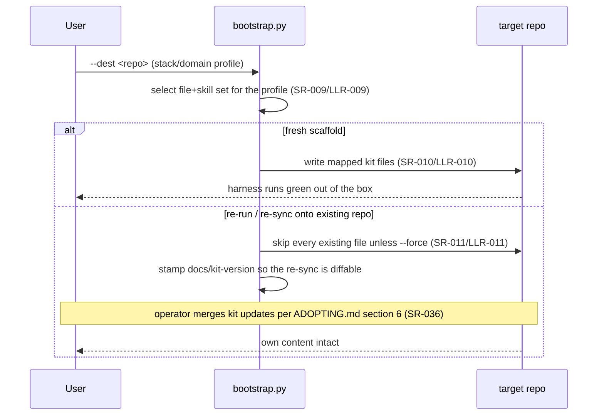
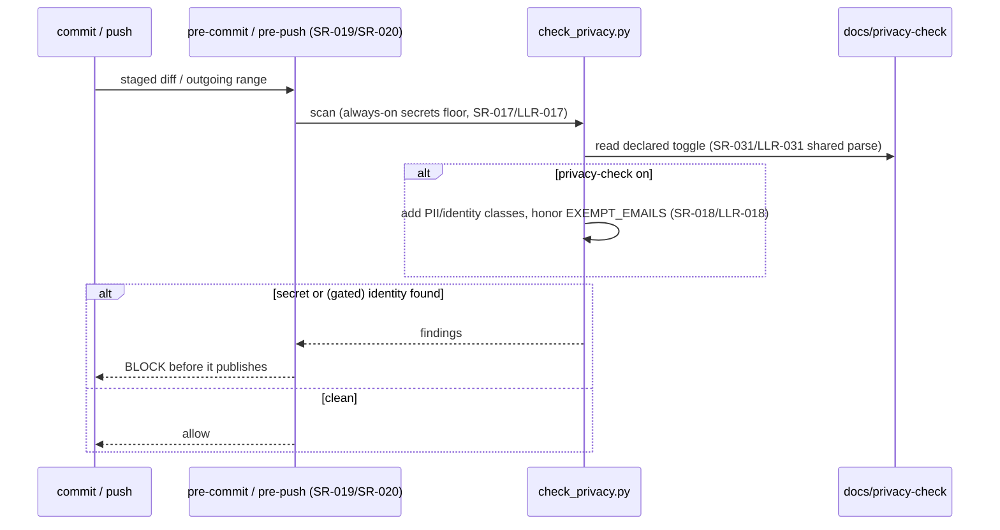

# Architecture — the kit meta-repo (self-adoption)

One page over the kit's **own** product: the reusable process kit under
[`project-trajectory/`](../project-trajectory/) — its runnable scripts
(`project-trajectory/scripts/`), git hooks (`project-trajectory/hooks/`), and
the artifact templates it ships — verified by the suite in [`tests/`](../tests/).
This doc is the kit's **self-adoption** architecture (IMPROVEMENT_PLAN.md Thread
47); it is distinct from the `architecture.template.md` the kit ships to
adopters. The requirement spine it renders lives in
[`requirements/`](requirements/) + [`test/`](test/).

## Shape of the product

- **Checkers / generators** (`project-trajectory/scripts/*.py`) — stdlib-only,
  Python 3.8+, cross-platform (SR-034/SR-035). Each is invoked as a subprocess
  by the check harness (`check.py`) and by the test suite, so the "product" is a
  set of independently runnable commands, not a linked application.
- **Enforcement floor** (`project-trajectory/hooks/*`) — the pre-commit /
  pre-push / commit-msg hooks that run the integrity + secrets floor
  agent-neutrally (SR-019/SR-020/SR-021).
- **Declared config** (`docs/stack.ini`, `docs/gate`, `docs/*-policy`,
  `docs/privacy-check`) — read once by the harness and the coordinator so a
  behavior is declared in text, not baked into a script (SR-007/SR-031).

> **Generated module map — deferred to Thread 47 phase 6.** The per-symbol
> module map + dependency diagram (`gen_arch_map.py` over
> `project-trajectory/scripts/`, the G3 arch-map-freshness step SR-023) is
> authored in phase 6. This page carries the one-page overview and the
> **Runtime flows** the G2 gate requires (PROCESS.md §3); the generated
> `<!-- BEGIN GENERATED MODULE MAP -->` block lands with phase 6.

## Runtime flows

Hand-authored sequence diagrams of the behaviors most easily misread from
registry rows — concurrency, what blocks on what, failure handling — each citing
the SR/LLR ids it renders (PROCESS.md §3, required at G2).

### Flow 1 — Unattended coordinator session (SR-026, SR-027, SR-028, SR-029, SR-030)

```mermaid
sequenceDiagram
    participant Launcher as agent-resume launcher
    participant Loop as agent_loop.py
    participant Lock as per-worktree lock (SR-029/LLR-029)
    participant Status as docs/status.md
    participant Agent as agent CLI
    Launcher->>Loop: run --root .
    Loop->>Loop: preflight — git repo? agent CLI? privacy author? (SR-027/LLR-027)
    alt broken footing
        Loop-->>Launcher: typed nonzero exit (EXIT_PREFLIGHT), never hangs
    else ok
        Loop->>Lock: acquire_lock (SR-030/LLR-030 refuse a 2nd writer)
        Lock-->>Loop: held (kernel-released on death — SR-029)
        Loop->>Status: read next action (SR-026/LLR-026, stdin closed)
        Loop->>Agent: run headless
        alt agent errors (retired model / auth)
            Agent-->>Loop: nonzero
            Loop->>Loop: log ERROR; all-ERROR region = unavailable agent (SR-028/LLR-028)
        else worked
            Agent-->>Loop: session output
        end
        Loop-->>Launcher: typed outcome code (DONE/BLOCKED/NEEDS-HUMAN)
    end
```

### Flow 2 — Scaffold generation and re-sync (SR-009, SR-010, SR-011, SR-036)



### Flow 3 — Secrets + privacy floor at commit/push (SR-017, SR-018, SR-019, SR-020)


