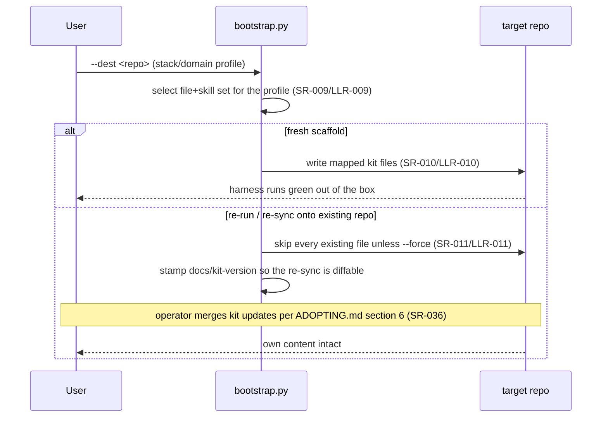

# Architecture — the kit meta-repo (self-adoption)

One page over the kit's **own** product: the reusable process kit under
[`project-trajectory/`](../project-trajectory/) — its runnable scripts
(`project-trajectory/scripts/`), git hooks (`project-trajectory/hooks/`), and
the artifact templates it ships — verified by the suite in [`tests/`](../tests/).
This doc is the kit's **self-adoption** architecture (IMPROVEMENT_PLAN.md Thread
47); it is distinct from the `architecture.template.md` the kit ships to
adopters. The requirement spine it renders lives in
[`requirements/`](requirements/) + [`test/`](test/).

## Shape of the product

- **Checkers / generators** (`project-trajectory/scripts/*.py`) — stdlib-only,
  Python 3.11+, cross-platform (SR-034/SR-035). Each is invoked as a subprocess
  by the check harness (`check.py`) and by the test suite, so the "product" is a
  set of independently runnable commands, not a linked application.
- **Enforcement floor** (`project-trajectory/hooks/*`) — the pre-commit /
  pre-push / commit-msg hooks that run the integrity + secrets floor
  agent-neutrally (SR-019/SR-020/SR-021).
- **Declared config** (`docs/stack.ini`, the generated `docs/gate`, and
  `docs/process.toml` — the one home for every process dial) — read once by the
  harness and the coordinator so a behavior is declared in text, not baked into
  a script (SR-007/SR-031).
- **The unattended station** (`agent_loop.py` + `dispatch.py` + `lane.py` +
  `integrate.py` + `handback.py` + `intake.py`, over `schedule.py`'s frontier)
  — the only subsystem here that is a *running* thing rather than a command:
  one dispatch loop per checkout drives N lanes from the WI frontier to trunk
  (SR-026/SR-057/SR-132). Flow 4 renders it; it is the piece most often
  misread from the rows alone.

## Module dependencies (generated)

The internal-import graph + declared `IF-###` seams, harvested from the source
AST and `docs/requirements/interfaces.csv`: a solid arrow is an import, a
dotted labeled arrow a declared seam — so an undeclared cross-component
coupling is visible at a glance. The `check_trajectory.py` cross-CMP rule
(LLR-067) reads this **committed** block; `gen_arch_map.py --check` gates its
freshness like the module map below.

<!-- BEGIN GENERATED DEPENDENCY DIAGRAM -->
_Generated by `scripts/gen_arch_map.py` from the source tree (AST): each solid arrow is an internal import; a dotted labeled arrow is a declared IF-### interface seam. Do not edit by hand; run the check harness to refresh._

```mermaid
graph LR
    m_scripts_adjudicate_brief["scripts/adjudicate_brief — adjudicate_brief.py — the EVIDENCE an adjudicat…"]
    m_scripts_agent_common["scripts/agent_common — Shared coordinator primitives, extracted VERBAT…"]
    m_scripts_agent_loop["scripts/agent_loop — Headless session engine: one claimed worker ass…"]
    m_scripts_agent_route["scripts/agent_route — Model routing for the unattended coordinator — …"]
    m_scripts_agent_session["scripts/agent_session — One headless agent session: argv/stdin construc…"]
    m_scripts_bootstrap["scripts/bootstrap — Scaffold a new project from this trajectory kit."]
    m_scripts_check["scripts/check — The check harness — one command that runs every…"]
    m_scripts_check_coverage["scripts/check_coverage — Per-module coverage floors: stop the global flo…"]
    m_scripts_check_doc_refs["scripts/check_doc_refs — Doc reference validation — prose that names dea…"]
    m_scripts_check_docs["scripts/check_docs — Doc navigability & staleness check: keep the ha…"]
    m_scripts_check_figures["scripts/check_figures — Declared-figure provenance — a driven figure ca…"]
    m_scripts_check_flows["scripts/check_flows — Design-time runtime-flow check: the G2 reviewer…"]
    m_scripts_check_perf["scripts/check_perf — Performance budget & regression comparator: tra…"]
    m_scripts_check_privacy["scripts/check_privacy — Secrets + privacy-leak lint — the deterministic…"]
    m_scripts_check_stubs["scripts/check_stubs — No-stub / substance detector: flag implementati…"]
    m_scripts_check_trajectory["scripts/check_trajectory — Validate the work-item registry — stdlib only."]
    m_scripts_check_vendored["scripts/check_vendored — Drift check for vendored third-party docs (stdl…"]
    m_scripts_derive_gate["scripts/derive_gate — Derive the active gate from artifact states — t…"]
    m_scripts_dispatch["scripts/dispatch — dispatch.py — the dispatcher: tick loop, admiss…"]
    m_scripts_gen_arch_map["scripts/gen_arch_map — Generate the module/function map for `architect…"]
    m_scripts_gen_cases["scripts/gen_cases — Generate test-case combinations from a requirem…"]
    m_scripts_gen_okf["scripts/gen_okf — OKF export — the traceability graph as a portab…"]
    m_scripts_gen_open_items["scripts/gen_open_items — The owner decision surface, generated (WI-322, …"]
    m_scripts_gen_prompt_catalog["scripts/gen_prompt_catalog — Generate the shipped prompt catalogue — `projec…"]
    m_scripts_gen_release_checklist["scripts/gen_release_checklist — Generate the human release checklist from the r…"]
    m_scripts_gen_skills_index["scripts/gen_skills_index — Generate the skills applicability index from th…"]
    m_scripts_gen_trajectory["scripts/gen_trajectory — Generate the offline project-state dashboard (r…"]
    m_scripts_handback["scripts/handback — handback.py — the lane closes that are not a cl…"]
    m_scripts_intake["scripts/intake — intake.py — the unified trunk-side intake mint …"]
    m_scripts_integrate["scripts/integrate — integrate.py — the local integrator: the statio…"]
    m_scripts_lane["scripts/lane — lane.py — one lane's mechanics (docs/concurrenc…"]
    m_scripts_migrate_carrier["scripts/migrate_carrier — Convert the requirement registries from their `…"]
    m_scripts_plan_artifacts["scripts/plan_artifacts — The dual-plan round artifact filer: the coordin…"]
    m_scripts_plan_briefs["scripts/plan_briefs — Redacted dual-plan brief assembler + the three …"]
    m_scripts_plan_coverage["scripts/plan_coverage — Dual-plan coverage pre-pass: make rival WI deco…"]
    m_scripts_plan_coverage_step["scripts/plan_coverage_step — Coverage step adapter: run the dual-plan covera…"]
    m_scripts_plan_round["scripts/plan_round — The dual-plan round state machine: a pure, side…"]
    m_scripts_plan_runner["scripts/plan_runner — The dual-plan round RUNNER: the coordinator fan…"]
    m_scripts_prompts["scripts/prompts — prompts.py — the kit's prompt templates as FILE…"]
    m_scripts_run_menu["scripts/run_menu — The run capability menu — one launcher that pre…"]
    m_scripts_schedule["scripts/schedule — Derive the dependency-ready WI frontier and its…"]
    m_scripts_score_reviews["scripts/score_reviews — The substance scorer — score a review verdict b…"]
    m_scripts_spec_move["scripts/spec_move — spec_move.py — the link-aware spec-move ritual:…"]
    m_scripts_spine_carrier["scripts/spine_carrier — The requirement spine's registry CARRIER (OI-12…"]
    m_scripts_subagent_gate["scripts/subagent_gate — Subagent spawn gate — deny-by-default fan-out c…"]
    m_scripts_trace["scripts/trace — Traceability join + orphan report for the SN->S…"]
    m_scripts_trace_text["scripts/trace_text — Spine-row TEXT rules and the row primitives the…"]
    m_scripts_traj_graph["scripts/traj_graph — Pure graph layout and wire routing for the proj…"]
    m_scripts_traj_panels["scripts/traj_panels — The Knowledge / Process / Next-work dashboard p…"]
    m_scripts_traj_parse["scripts/traj_parse — Parse/sources for the project-state dashboard —…"]
    m_scripts_traj_render["scripts/traj_render — SVG/HTML rendering primitives for the project-s…"]
    m_scripts_traj_status["scripts/traj_status — The --status snapshot + pending projection (WI-…"]
    m_scripts_traj_views["scripts/traj_views — The What / When / How-SW dashboard views (WI-28…"]
    m_scripts_trunk_step["scripts/trunk_step — The serial trunk step — compile the log fragmen…"]
    m_scripts_wi_convert["scripts/wi_convert — Convert the work-item registry between its CSV …"]
    m_scripts_adjudicate_brief --> m_scripts_agent_common
    m_scripts_adjudicate_brief --> m_scripts_dispatch
    m_scripts_adjudicate_brief --> m_scripts_handback
    m_scripts_adjudicate_brief --> m_scripts_prompts
    m_scripts_adjudicate_brief --> m_scripts_spine_carrier
    m_scripts_agent_common --> m_scripts_agent_session
    m_scripts_agent_loop --> m_scripts_adjudicate_brief
    m_scripts_agent_loop --> m_scripts_agent_common
    m_scripts_agent_loop --> m_scripts_agent_route
    m_scripts_agent_loop --> m_scripts_agent_session
    m_scripts_agent_loop --> m_scripts_dispatch
    m_scripts_agent_loop --> m_scripts_intake
    m_scripts_agent_loop --> m_scripts_plan_round
    m_scripts_agent_loop --> m_scripts_plan_runner
    m_scripts_agent_loop --> m_scripts_prompts
    m_scripts_agent_loop --> m_scripts_score_reviews
    m_scripts_agent_loop --> m_scripts_spine_carrier
    m_scripts_check_doc_refs --> m_scripts_spine_carrier
    m_scripts_check_docs --> m_scripts_spine_carrier
    m_scripts_check_figures --> m_scripts_check_doc_refs
    m_scripts_check_flows --> m_scripts_spine_carrier
    m_scripts_check_trajectory --> m_scripts_check_docs
    m_scripts_check_trajectory --> m_scripts_spine_carrier
    m_scripts_derive_gate --> m_scripts_spine_carrier
    m_scripts_dispatch --> m_scripts_agent_common
    m_scripts_dispatch --> m_scripts_gen_trajectory
    m_scripts_dispatch --> m_scripts_handback
    m_scripts_dispatch --> m_scripts_intake
    m_scripts_dispatch --> m_scripts_integrate
    m_scripts_dispatch --> m_scripts_lane
    m_scripts_dispatch --> m_scripts_schedule
    m_scripts_dispatch --> m_scripts_trace
    m_scripts_gen_okf --> m_scripts_spine_carrier
    m_scripts_gen_open_items --> m_scripts_gen_trajectory
    m_scripts_gen_open_items --> m_scripts_trace
    m_scripts_gen_prompt_catalog --> m_scripts_prompts
    m_scripts_gen_release_checklist --> m_scripts_spine_carrier
    m_scripts_gen_trajectory --> m_scripts_check_trajectory
    m_scripts_gen_trajectory --> m_scripts_traj_graph
    m_scripts_gen_trajectory --> m_scripts_traj_panels
    m_scripts_gen_trajectory --> m_scripts_traj_parse
    m_scripts_gen_trajectory --> m_scripts_traj_render
    m_scripts_gen_trajectory --> m_scripts_traj_status
    m_scripts_gen_trajectory --> m_scripts_traj_views
    m_scripts_handback --> m_scripts_agent_common
    m_scripts_handback --> m_scripts_integrate
    m_scripts_handback --> m_scripts_spec_move
    m_scripts_intake --> m_scripts_agent_common
    m_scripts_intake --> m_scripts_check_trajectory
    m_scripts_intake --> m_scripts_dispatch
    m_scripts_intake --> m_scripts_schedule
    m_scripts_intake --> m_scripts_spine_carrier
    m_scripts_intake --> m_scripts_trace
    m_scripts_intake --> m_scripts_wi_convert
    m_scripts_integrate --> m_scripts_agent_common
    m_scripts_integrate --> m_scripts_handback
    m_scripts_integrate --> m_scripts_intake
    m_scripts_integrate --> m_scripts_schedule
    m_scripts_integrate --> m_scripts_score_reviews
    m_scripts_integrate --> m_scripts_spec_move
    m_scripts_lane --> m_scripts_agent_common
    m_scripts_lane --> m_scripts_integrate
    m_scripts_plan_artifacts --> m_scripts_wi_convert
    m_scripts_plan_briefs --> m_scripts_prompts
    m_scripts_plan_briefs --> m_scripts_spine_carrier
    m_scripts_plan_coverage --> m_scripts_spine_carrier
    m_scripts_plan_runner --> m_scripts_agent_route
    m_scripts_plan_runner --> m_scripts_agent_session
    m_scripts_plan_runner --> m_scripts_plan_artifacts
    m_scripts_plan_runner --> m_scripts_plan_briefs
    m_scripts_plan_runner --> m_scripts_plan_coverage_step
    m_scripts_plan_runner --> m_scripts_plan_round
    m_scripts_spec_move --> m_scripts_agent_common
    m_scripts_trace --> m_scripts_spine_carrier
    m_scripts_trace --> m_scripts_trace_text
    m_scripts_traj_panels --> m_scripts_integrate
    m_scripts_traj_panels --> m_scripts_schedule
    m_scripts_traj_panels --> m_scripts_traj_graph
    m_scripts_traj_panels --> m_scripts_traj_parse
    m_scripts_traj_panels --> m_scripts_traj_render
    m_scripts_traj_panels --> m_scripts_traj_status
    m_scripts_traj_parse --> m_scripts_check_trajectory
    m_scripts_traj_parse --> m_scripts_schedule
    m_scripts_traj_parse --> m_scripts_spine_carrier
    m_scripts_traj_render --> m_scripts_traj_graph
    m_scripts_traj_status --> m_scripts_check_trajectory
    m_scripts_traj_status --> m_scripts_traj_parse
    m_scripts_traj_views --> m_scripts_check_trajectory
    m_scripts_traj_views --> m_scripts_traj_graph
    m_scripts_traj_views --> m_scripts_traj_parse
    m_scripts_traj_views --> m_scripts_traj_render
    m_scripts_trunk_step --> m_scripts_plan_artifacts
    m_scripts_agent_common -. IF-065 .-> m_scripts_agent_loop
    m_scripts_agent_route -. IF-044 .-> m_scripts_agent_loop
    m_scripts_agent_session -. IF-064 .-> m_scripts_agent_loop
    m_scripts_check_coverage -. IF-069 .-> m_scripts_check
    m_scripts_check_doc_refs -. IF-008 .-> m_scripts_check
    m_scripts_check_doc_refs -. IF-087 .-> m_scripts_check_figures
    m_scripts_check_docs -. IF-002 .-> m_scripts_check
    m_scripts_check_docs -. IF-077 .-> m_scripts_check_trajectory
    m_scripts_check_figures -. IF-086 .-> m_scripts_check
    m_scripts_check_flows -. IF-003 .-> m_scripts_check
    m_scripts_check_perf -. IF-004 .-> m_scripts_check
    m_scripts_check_privacy -. IF-005 .-> m_scripts_check
    m_scripts_check_stubs -. IF-006 .-> m_scripts_check
    m_scripts_check_trajectory -. IF-009 .-> m_scripts_check
    m_scripts_check_trajectory -. IF-056 .-> m_scripts_gen_trajectory
    m_scripts_check_trajectory -. IF-091 .-> m_scripts_intake
    m_scripts_check_trajectory -. IF-082 .-> m_scripts_traj_parse
    m_scripts_check_trajectory -. IF-084 .-> m_scripts_traj_status
    m_scripts_check_trajectory -. IF-083 .-> m_scripts_traj_views
    m_scripts_derive_gate -. IF-050 .-> m_scripts_check
    m_scripts_gen_arch_map -. IF-010 .-> m_scripts_check
    m_scripts_gen_okf -. IF-012 .-> m_scripts_check
    m_scripts_gen_trajectory -. IF-011 .-> m_scripts_check
    m_scripts_gen_trajectory -. IF-088 .-> m_scripts_dispatch
    m_scripts_intake -. IF-090 .-> m_scripts_integrate
    m_scripts_integrate -. IF-093 .-> m_scripts_traj_panels
    m_scripts_plan_artifacts -. IF-061 .-> m_scripts_plan_runner
    m_scripts_plan_coverage -. IF-060 .-> m_scripts_plan_coverage_step
    m_scripts_plan_round -. IF-058 .-> m_scripts_plan_runner
    m_scripts_plan_runner -. IF-066 .-> m_scripts_agent_loop
    m_scripts_prompts -. IF-099 .-> m_scripts_agent_loop
    m_scripts_prompts -. IF-098 .-> m_scripts_gen_prompt_catalog
    m_scripts_prompts -. IF-100 .-> m_scripts_plan_briefs
    m_scripts_schedule -. IF-053 .-> m_scripts_check_trajectory
    m_scripts_schedule -. IF-071 .-> m_scripts_gen_trajectory
    m_scripts_schedule -. IF-055 .-> m_scripts_integrate
    m_scripts_schedule -. IF-094 .-> m_scripts_traj_panels
    m_scripts_schedule -. IF-085 .-> m_scripts_traj_parse
    m_scripts_score_reviews -. IF-046 .-> m_scripts_agent_loop
    m_scripts_spine_carrier -. IF-109 .-> m_scripts_agent_loop
    m_scripts_spine_carrier -. IF-104 .-> m_scripts_check_doc_refs
    m_scripts_spine_carrier -. IF-112 .-> m_scripts_check_docs
    m_scripts_spine_carrier -. IF-105 .-> m_scripts_check_flows
    m_scripts_spine_carrier -. IF-106 .-> m_scripts_gen_okf
    m_scripts_spine_carrier -. IF-107 .-> m_scripts_gen_release_checklist
    m_scripts_spine_carrier -. IF-110 .-> m_scripts_intake
    m_scripts_spine_carrier -. IF-108 .-> m_scripts_plan_briefs
    m_scripts_spine_carrier -. IF-102 .-> m_scripts_trace
    m_scripts_spine_carrier -. IF-111 .-> m_scripts_traj_parse
    m_scripts_trace -. IF-001 .-> m_scripts_check
    m_scripts_trace -. IF-089 .-> m_scripts_dispatch
    m_scripts_trace -. IF-075 .-> m_scripts_gen_open_items
    m_scripts_trace -. IF-101 .-> m_scripts_intake
    m_scripts_trace_text -. IF-076 .-> m_scripts_trace
    m_scripts_wi_convert -. IF-092 .-> m_scripts_intake
    m_scripts_wi_convert -. IF-078 .-> m_scripts_plan_artifacts
```


<!-- END GENERATED DEPENDENCY DIAGRAM -->

## Module map

The per-symbol map over `project-trajectory/scripts/`, generated by
`gen_arch_map.py` (SR-023). **Do not edit by hand** — `gen_arch_map.py --check`
(the G3 arch-map-freshness step) fails if this block drifts from source;
regenerate with `python project-trajectory/scripts/check.py --run-step arch-map`.

<!-- BEGIN GENERATED MODULE MAP -->
_Generated by `scripts/gen_arch_map.py` from the source tree (AST). Do not edit by hand; run the check harness to refresh. Summaries and `Implements:` come from your docstrings/comments._

### `scripts/adjudicate_brief`
_adjudicate_brief.py — the EVIDENCE an adjudication session's brief is filled_
Imports (internal): `agent_common`, `dispatch`, `handback`, `prompts`, `spine_carrier`

| Public item | Summary | Implements |
|---|---|---|
| `declared_brief(row)` | The row's declared `Brief` cell, normalized; `""` when it declares none. |  |
| `disposition_values(root, row)` | `({report, spec, evidence}, None)` for a `partial`/`cancelled` lane close, | SN-031, SR-144 |
| `red_tc_values(root, row)` | `({tcs, spine}, None)` for the idle-frontier census's unverified test | SN-030 |
| `compose(root, row, verdict_path, prompt_templates)` | `(prompt_text, None)` when this adjudication row's declared brief could |  |

### `scripts/agent_common`
_Shared coordinator primitives, extracted VERBATIM from agent_loop.py_
Imports (internal): `agent_session`
Contracts (interfaces): IF-037, IF-065

| Public item | Summary | Implements |
|---|---|---|
| `read_declared(path, default)` | Read a one-word declared-policy file (docs/gate, the legacy | SN-028 |
| `process_config(docs)` | The parsed `docs/process.toml` as a dict of sections, or `{}` when the |  |
| `read_toml_text(text)` | `tomllib.loads(text)`, or None when it does not parse. The TEXT twin of |  |
| `read_toml(path)` | `tomllib.loads` of `path`, or None when it is absent, unreadable, |  |
| `process_shape_findings(docs)` | Refusal strings for a `docs/process.toml` written in a shape the git |  |
| `declared_policy(docs, legacy_name, default)` | The value of one policy dial, `docs/process.toml` first. | SN-028 |
| `legacy_ratification(word, key)` | One dial's value under a legacy `gate-policy` word, or None when the word |  |
| `ratification_level(docs)` | `[attestation] human_ratification_through` as an int 0-4. |  |
| `human_holds(docs, stage)` | Is work at spine `stage` still the HUMAN's to ratify? |  |
| `final_review(docs)` | Does the run stop for a FINAL human read even when the level let it |  |
| `complete_review(docs)` | `(mode, rate)` for adjudicating a CLEAN close — `"off" \| "sample" \| |  |
| `keep_nondependent(docs)` | The orthogonal dial the ordinal cannot carry: may other lanes keep |  |
| `spine_stage_of(root)` | This repo's derived spine stage, read off the generated `docs/gate` |  |
| `config_conflicts(docs)` | The SN-028 MIXED-CONFIG refusal (plan §11.8): refusal strings naming | SN-028 |
| `read_agent_loop_config(docs)` | The declared coordinator dials — the ``[agent-loop]`` section of |  |
| `resolve_coordinator_dials(args, docs)` | ``(model, model_map)`` for the session engine, each resolved by the |  |
| `tracked_pause(docs_dir)` | The **tracked** pause declaration — `docs/work/pause` |  |
| `pause_reason(lane)` | A declared **graceful-pause** request: pause the loop at the next session |  |
| `venv_python(root)` | Absolute path (a Path) to the repo's own .venv interpreter, or None when |  |
| `harness_python(root)` | The interpreter the test harness (pytest + the pinned dev tools) should run |  |
| `interpreter_version(exe)` | (major, minor) of the interpreter at `exe`, or None when it cannot be run. |  |
| `harness_floor_failures(root)` | WI-286/WI-361: a singleton list with a floor message when the interpreter |  |
| `parse_blackout(line)` | Parse a `HH:MM-HH:MM` blackout line into `(start_min, end_min)` — minutes |  |
| `blackout_wake(line, now)` | Seconds until the current UTC weekday blackout window ends, or `None` when |  |
| `blackout_banner(window, resume_at, wake_seconds, policy_file)` | The multi-line terminal banner shown when the coordinator holds a NEW |  |
| `blackout_countdown_line(remaining_seconds, resume_at)` | One countdown-heartbeat line emitted every BLACKOUT_HEARTBEAT_SEC while |  |
| `blackout_wait(wake_seconds, window, resume_at, emit, sleep, interval)` | Emit the blackout banner, then wait `wake_seconds` in `interval`-second |  |
| `sanitize_train(name)` | A session tag becomes a log-file prefix and a reviews/ subdirectory, |  |
| `parse_wi_list(spec)` | The ordered assigned-WI list from a `;`/`,`/whitespace-joined --wi value. |  |
| `spec_work_dir(csv_path)` | The `docs/work` folder that replaces the registry CSV at `csv_path` — its |  |
| `spec_files(work_dir)` | Every `<status>/WI-*.md` spec under `work_dir`, sorted by path; `[]` when |  |
| `parse_spec_frontmatter(text, relpath)` | `(data, body)` for one spec file: the TOML frontmatter between the `+++` |  |
| `parse_spec_status(relpath)` | The Status a spec's LOCATION encodes — the whole of it. |  |
| `parse_spec_id(relpath, data)` | The work-item id, which must be a non-empty string AND must be the one |  |
| `parse_spec_deliverable(relpath, body)` | The Deliverable cell a spec body carries, verbatim ("" when absent). |  |
| `parse_spec_row(text, relpath)` | `(row, order)` for one spec file — an 18-key row shaped exactly like the |  |
| `read_spec_rows(work_dir, on_error)` | The spec folder's rows in REGISTRY order — by the explicit `order` key, |  |
| `load_registry_rows(root)` | The work-item rows from the one registry home, `docs/work/` (the spec |  |
| `load_wi_registry(root)` | {WI-ID: raw row dict} from the worktree's tracked WI registry — the |  |
| `latest_trailer_evidence(log_out)` | Fold a newest-first trailer log (TRAILER_EVIDENCE_FMT) into |  |
| `train_evidence(root, base)` | (built, blocked) read from the train branch's committed trailers in |  |
| `dispatch_lock_path(root)` | The DISPATCH lock's one home: ``out/agent-loop.lock`` under `root`. |  |
| `acquire_lock(lock_path)` | Take the per-worktree coordinator lock, or return an error string. |  |
| `release_lock(lock_path)` | Drop the coordinator lock: closing the descriptor releases the OS lock. |  |
| `parse_map(spec)` | Parse a KEY=value phase map — shared by --model-map/--cmd-map/--prompt-map/ |  |
| `git(root, *args)` | Run git in the repo; returns (returncode, text). |  |
| `head_sha(root)` | Short HEAD sha, or None on a zero-commit repo (guarded rev-parse). |  |
| `working_tree_dirty(root)` | The `git status --porcelain` lines — one per uncommitted path (a rename is |  |
| `substantive_working_tree_dirty(root)` | `working_tree_dirty` minus the FB3 owner-only paths (OWNER_ONLY_PATHS) — |  |
| `current_state_excerpt(status_path, max_lines)` | The '## Current State' section of a status.md — the root dispatcher's or |  |
| `bounded_transcript(output)` | Head + capped tail of a session transcript (the tracked-log bound). |  |
| `redact_secrets(text)` | Best-effort redaction of well-known credential shapes, applied before a |  |
| `prompt_fingerprint(text)` | A short, stable fingerprint of a rendered prompt — `sha256:` + 12 hex. |  |
| `write_session_log(iter_dir, meta, transcript)` | Write the tracked, size-bounded per-session log: a `# key: value` |  |
| `read_log_meta(path)` | Parse the `# key: value` metadata header of one session log. |  |
| `per_turn_pace(meta)` | API seconds per turn from a log's header meta — the like-for-like speed |  |
| `per_turn_context(meta)` | Average context carried per turn (cache-read tokens / turns, humanized |  |
| `regenerate_index(docs_dir)` | Rebuild docs/iteration_index.md from the docs/iteration/*.log metadata |  |
| `commit_telemetry(root, session, label, paths)` | Commit the coordinator's own bookkeeping in its own `telemetry:` commit, |  |
| `next_session_number(iter_dir, train)` | Next NNN, continuing across coordinator restarts. A worker's numbering |  |
| `phase_draw_ordinal(iter_dirs, phase)` | The 0-based CROSS-TRAIN draw ordinal for `phase` (WI-263, repo-review |  |
| `worktree_records(root)` | Parsed `git worktree list --porcelain` records as (path, branch) pairs, |  |
| `primary_worktree_root(root)` | The MAIN (primary) worktree of `root`'s repo — the FIRST entry of |  |
| `draw_iter_dirs(root, local_iter_dir)` | The iteration directories `phase_draw_ordinal` must union for a cross-train |  |
| `preflight(root, template, args)` | Refuse to start iteration 1 on a broken footing. Returns the list of |  |
| `stop_banner(status_path, label, detail)` |  |  |
| `head_sha_full(root)` | Full HEAD sha (reservation bases are exact, never abbreviated). |  |

### `scripts/agent_loop`
_Headless session engine: one claimed worker assignment, a reviewer/critique_
Imports (internal): `adjudicate_brief`, `agent_common`, `agent_route`, `agent_session`, `dispatch`, `intake`, `plan_round`, `plan_runner`, `prompts`, `score_reviews`, `spine_carrier`
Contracts (interfaces): IF-015, IF-068, IF-099, IF-109

| Public item | Summary | Implements |
|---|---|---|
| `worker_prompt(root, wi_rows, wi, train, base, rework_text)` | The per-session worker prompt (SR-060): the WI row + SpecRef + | SR-060 |
| `guardrails_apply(policy, model)` | Whether to inject the guardrails core for a session on `model`, under |  |
| `guardrails_core(root)` | The always-on core to prepend to a quick-tier session's prompt, or None. |  |
| `guardrails_inert(policy, models)` | True when a *guarding* policy (not off / bare all) would guard none of the |  |
| `prompt_source(prompt_templates, phase)` | Which template a phase's session composed from: an operator override's |  |
| `row_routing(phase, row)` | `(phase, pinned_tier)` for a claimed WI row — the two routing facts a | SN-026 |
| `adjudicating(row)` | Whether a claimed WI row is an ADJUDICATION row (SN-026). | SN-026 |
| `phase_tier(phase, tier_map)` | The routing tier for a phase: the declared --tier-map / AGENT_TIER_MAP |  |
| `reviewer_prompt(prompt_templates, phase, verdict_path)` | The redacted reviewer prompt for a review phase: the per-phase prompt-map |  |
| `session_body(root, worker, current_wi, session, sha, reviews_dir, templates)` | `(body, verdict_path)` for a NON-REVIEW session — the one fork both | SN-026 |
| `session_model(model_map, default_model)` | The legacy/interactive route: the tracked docs/run-phase file is retired |  |
| `session_template(cmd_map, default_template, phase)` | The per-phase command template (AGENT_CMD_MAP), else AGENT_CMD — phase |  |
| `compose_session_prompt(model, body, resume_reconcile, guardrails_policy, root, warned_no_core)` | The session prompt: `body` (the worker assignment, a redacted reviewer |  |
| `load_critique_srs(docs)` | The SR ids whose Verification is `Critique` (docs/requirements/ |  |
| `build_scope_wis(root, docs, commit_range)` | The WI ids named in `commit_range`'s commit subjects; empty when there is |  |
| `build_scope_srs(root, docs, commit_range)` | The SR ids delivered by the WI-tagged commits in `commit_range`. |  |
| `critique_control(docs, wi_ids, default_max)` | Resolve the optional per-WI critique control for one build scope. |  |
| `critique_brief(root, docs, scope_srs)` | The redacted critique brief: for each in-scope Critique SR, its intent (the |  |
| `critique_prompt(prompt_templates, verdict_path, brief)` | The redacted critique prompt: the CRITIQUE prompt-map template (a FILE the |  |
| `launcher_exe(cmd_template)` | `(exe, installed)` for a command template: argv[0], and whether that |  |
| `fresh_verdict_path(reviews_dir, name)` | The path a managed session must write its verdict to, guaranteed ABSENT. |  |
| `read_verdict(verdict_path, route_family)` | The parsed verdict at `verdict_path`, or None when the session wrote no |  |
| `RoutingState (class)` | The serial loop's managed-routing / escalation / critique / stall state |  |
| `  methods` | pick_phase · route_intent · note_build_tier · cool · record_review_verdict · round_ready · complete_round · escalation · apply_decision · set_design_check · after_design_check · on_committed_build · set_train_range · schedule_review_round · schedule_critique · record_critique_verdict · note_session · stall_verdict |  |
| `limit_reset_hint(output, data, exit_code)` | The 'resets <time>' text of a rate-limit message, or None. |  |
| `seconds_until_reset(hint, now)` | Best-effort seconds until a reset hint like '3:45pm', '10am', |  |
| `classify_outcome(reset_hint, timed_out, state, committed, data, exit_code)` | The outcome ladder for one session — a rate limit wins as WAITING, a |  |
| `worker_endstate(root, worker, review_open, managed, rp_int, allow_block_exit)` | (exit_code, label, detail) when the assignment reached an end state, |  |
| `worker_exit_banner(worker, end)` | Print the worker's end banner (never a status.md excerpt — a worker |  |
| `parse_args()` | The whole CLI surface — one home for every flag + its default. |  |
| `map_preflight(root, template, args, cmd_map, prompt_map, tier_map, prefer_map, managed, registry, enabled, reg_errors, enable_errors)` | Assemble every up-front launchability failure (default template, |  |
| `build_worker_assignment(args, root)` | The explicit worker assignment (--wi, on a claimed branch): parse the |  |
| `run_interactive(args, root, model_map, cmd_map, template, guardrails_policy, warned_no_core)` | Boot exactly one hands-on session (stdio attached) and return its |  |
| `print_run_banner(root, branch, worker, gate_policy, push_policy, review_policy, managed, enabled, registry, guardrails_policy, template, cmd_map, prompt_map, docs)` | The unattended-coordinator launch banner: the run's identity, its |  |
| `LoopContext (class)` | Everything one iteration reads, built once at loop start; the |  |
| `route_session(ctx, i, current_wi, session, resume_reconcile, now)` | Pick the phase + model + prompt for this worker session (managed |  |
| `session_bookkeeping(ctx, plan, outcome, code, commits, after, reset_hint, now, session, wi_label)` | The managed-routing / reviewer-dispatch consequences of one session |  |
| `run_iteration(ctx, i)` | One worker session end-to-end: guards, routing (route_session), |  |
| `main()` |  |  |

### `scripts/agent_route`
_Model routing for the unattended coordinator — the enable-list + availability_
Contracts (interfaces): IF-044, IF-045

| Public item | Summary | Implements |
|---|---|---|
| `normalize_tier(tier)` | Lowercase + the legacy alias: `weak` — the pre-rename bottom tier — reads |  |
| `Model (class)` | One registry row = one (model x route) pair. The id is opaque (a join |  |
| `load_registry(path)` | Parse docs/agents.csv into {id: Model}, plus a list of error strings for |  |
| `parse_env(spec)` | Parse an `Env` cell (`KEY=value;KEY2=value2`) into a dict, to be merged |  |
| `parse_tag_rank(spec)` | Parse a `ga>preview>beta>exp` ordering into {tag: rank} (higher = earlier |  |
| `load_tag_rank(path, env)` | The maturity rank vocabulary for version-less resolution: the |  |
| `resolve_token(token, registry, tag_rank)` | Resolve one enable-list token to a registry id, or (None, reason). |  |
| `resolve_enabled(enabled, registry, tag_rank)` | Resolve the ordered enable-list to concrete registry ids, preserving |  |
| `load_enabled_entries(path)` | Parse docs/agents-enabled into ordered (token, {phase: weight}) entries |  |
| `load_enabled(path)` | The ordered enable-list ids (docs/agents-enabled): the first field of |  |
| `resolved_weights(entries, registry, tag_rank)` | Map each resolved registry id to its {phase: weight} from parsed enable-list |  |
| `phase_weights(weight_map, phase)` | The per-id draw weights for `phase` from the resolved weight map |  |
| `available(cooldowns, model_id, now)` | True when `model_id` is not cooling down. `cooldowns` maps id -> the epoch |  |
| `cool(cooldowns, model_id, now, seconds)` | Put `model_id` on cooldown until now+seconds (its limit is probably |  |
| `select(enabled, registry, tier, now, cooldowns, exclude_families, prefer_different, preferred_ids, weights, counter)` | Pick a model id from the enabled pool, or None. Returns (id, reason) — the |  |
| `winstay_preferred_ids(next_primary, enabled, registry, cooldowns, now)` | Resolve a win-stay `next_primary` (the reviewer FAMILY `escalate` returns |  |
| `pool_context(enabled, registry, cooldowns, now)` | The enabled pool, one line per row, for a page-human/failure banner: |  |
| `load_constants(env)` | The escalation constants: the per-repo-overridable defaults, each read from |  |
| `escalate(rounds, constants, swapped, at_top_tier, fails_since)` | The fixed win-stay/lose-shift decision after a review round. |  |
| `failure_action(human_held, keep_nondependent)` | What a page-the-human escalation does, keyed to SN-029's ordinal | SN-029 |
| `PlannerSession (class)` | One planner-hat session selection — a routed (model x route) pick for a |  |
| `PlannerPair (class)` | The result of routing the two planner hats: the two `PlannerSession`s (or |  |
| `planner_pair(enabled, registry, tier, now, cooldowns, preferred_ids, hats)` | Route the two planner hats to two FRESH sessions (DP-001 plan P3, case a/b). |  |
| `planner_fallback(failed, enabled, registry, tier, now, cooldowns, preferred_ids, hats)` | The runtime-nonresponse fallback (DP-001 plan P3, case c) — the entry the |  |
| `main(argv)` |  |  |

### `scripts/agent_session`
_One headless agent session: argv/stdin construction, launch, and capture._
Contracts (interfaces): IF-041, IF-064

| Public item | Summary | Implements |
|---|---|---|
| `split_cmd(template)` | Split a command template into tokens. |  |
| `build_argv(template, model, prompt)` | Build the session argv from a CmdTemplate and decide how the prompt is |  |
| `parse_json_result(output)` | Best-effort parse of a --output-format json / stream-json run: the last |  |
| `summarize_session_line(line)` | Parse one line of session output into zero or more compact console |  |
| `echo_session_line(line)` | Scrolling live echo (WI-125): print each compact summary of one output |  |
| `LiveStatus (class)` | One in-place console status line for a workstream (WI-136). Opt-in |  |
| `  methods` | event · finish |  |
| `run_session(argv, root, timeout, env, on_line, stdin_input)` | One fresh headless driver session. Returns (exit_code, output, | SN-016 |

### `scripts/bootstrap`
_Scaffold a new project from this trajectory kit._
Contracts (interfaces): IF-014, IF-039

| Public item | Summary | Implements |
|---|---|---|
| `selected_agents(choice)` | Expand an --agents choice into the concrete agent keys to materialize. |  |
| `parse_skill_frontmatter(text)` | Minimal frontmatter parse (name/scope + list fields) for a SKILL.md. |  |
| `matches_scope(fm, stack, domain, binary_assets)` | Trivial tag-intersection matcher: does a skill's applicability fit the |  |
| `select_skills(stack, domain, binary_assets)` | The kit-scope skills whose applicability intersects the declared scope. |  |
| `copy_if_new(src, dst, dry_run, force)` | The write-once scaffold copy, stated once (WI-347): True when `dst` was |  |
| `materialize_agent_layer(dest, agents, skills, dry_run, force)` | Copy the selected skills (and the inert hook example) into each chosen |  |
| `materialize_knowledge_packs(dest, domain, dry_run, force)` | Install the curated packs for one explicitly declared domain. |  |
| `sync_agent_skills(dest, dry_run)` | Force-refresh each per-agent skill copy from the ONE neutral source, so a |  |
| `seed_agent_resume(dest, agents, created, dry_run)` | Fill the freshly scaffolded agent-resume launchers' AGENT_CMD/AGENT_MODEL |  |
| `record_agent_choice(dest, choice, skills, dry_run)` | Append a one-line setup note to docs/status.md recording the agent choice |  |
| `prompt_choice(prompt, choices, default)` | Ask on a TTY; return `default` immediately when stdin isn't interactive |  |
| `set_process_key(dest, section, key, value, dry_run, add_if_missing)` | Set `[section] key = value` in `docs/process.toml`, IN PLACE. |  |
| `apply_gate_policy(dest, level, dry_run)` | Write a non-default gate-authority posture, as the THREE DIALS it is. | SN-029 |
| `apply_push_policy(dest, policy, dry_run)` | Write a non-default push policy into `[policies] push` of | SN-028 |
| `apply_privacy_check(dest, value, dry_run)` | Write the privacy-check toggle into `[policies] privacy_check` of |  |
| `migrate_legacy_config(dest, dry_run)` | Fold every legacy one-word policy file into docs/process.toml and DELETE |  |
| `profile_stub(axis)` | The resolvable one-liner an omitted profile region leaves behind: the |  |
| `strip_markers(text, omit, where)` | Generate a scaffold doc from a master: drop kit-only regions, keep or |  |
| `read_kit_profile(dest)` | The recorded profile of an existing adoption (docs/kit-profile), or None. |  |
| `write_kit_profile(dest, stack, omit, dry_run)` | Record the resolved profile in docs/kit-profile (beside the kit-version |  |
| `seed_arch_map_mode(dest, stack, created, dry_run)` | A non-Python stack starts on the stack-neutral file-level arch map: |  |
| `append_stack_checklist(dest, stack, dry_run)` | Insert the rewiring checklist into the freshly scaffolded status.md's |  |
| `raise_watermark(dest, space, floor)` | Raise `space`'s id-watermark mark to at least `floor` (never lower it). | SN-001 |
| `strip_provenance(text)` | Remove archive-anchor review-doc provenance citations from a kit script so |  |
| `apply_template_rewrites(dst_rel, dst)` | Strip copy-me meta-prose from a freshly written scaffold file (see |  |
| `initialize_generated_docs(dest, created)` | Run the generators once so the fresh scaffold starts green: the arch-map |  |
| `kit_version()` | The kit's committed identity for the version stamp: (label, dirty). |  |
| `write_kit_version(dest, dry_run)` | Stamp docs/kit-version with the kit commit the scaffold came from, so a |  |
| `write_kit_license(dest, dry_run, verb)` | Write `docs/kit-license` — the kit's own LICENSE text, scoped by a header. |  |
| `ScaffoldPlan (class)` | Everything the resolution ladders decided, before a byte is written: |  |
| `CopyOutcome (class)` | What the copy phases did, accumulated across them: `created` is the |  |
| `build_parser()` | The CLI surface. Its own function so `main()` reads as a sequence of |  |
| `resolve_profile(ap, args, dest)` | `(stack, omit)` — the scaffold profile (Thread 34): explicit flags win; |  |
| `resolve_choices(args, stack, omit)` | The consent-first ladders — agent layer, domain/skills, and the three |  |
| `copy_kit_files(dest, plan)` | The MAPPING copy pass + the GITKEEP_DIRS placeholders, as a |  |
| `apply_stack_extras(dest, plan, outcome)` | The declared stack's two follow-ups: the harness-rewiring checklist a |  |
| `materialize_agent_layer_phase(dest, plan, outcome)` | The chosen agent's layer: its matched skills into the native skills dir |  |
| `apply_declared_policies(dest, plan, outcome)` | The three declared authorities: a non-default level overwrites the key | SN-028 |
| `report_outcome(plan, outcome)` | The per-file report + the one-line summary, in the order the phases |  |
| `write_stamps(dest, plan)` | The generated stamps — kit-version / kit-profile / kit-license — plus |  |
| `run_migrate_config(dest, dry_run)` | The `--migrate-config` report (SN-028). Its own function so `main` keeps | SN-028 |
| `main()` |  |  |

### `scripts/check`
_The check harness — one command that runs every quality gate locally and in CI._
Contracts (interfaces): IF-013, IF-022, IF-040

| Public item | Summary | Implements |
|---|---|---|
| `load_profile(path)` | Parse the declared product toolchain (docs/stack.ini) if present, else |  |
| `extra_steps(profile, subs)` | Project-declared additional gate steps, from `docs/stack.ini` |  |
| `extra_step_lanes(profile)` | `{step-name: lane}` for `[step:<name>]` sections declaring `lane = <other>` |  |
| `steps(coverage, tier, gate, phase, profile)` |  |  |
| `window_open(gate_file)` | True when an open `Draft`/`Modified` window is holding the derived gate |  |
| `run_advisory(advisory, jobs, lane_map)` | Run the warn-only tier and return its results ([] when there is none). |  |
| `advisory_plan(gate, plan, steps_at)` | Steps a HIGHER gate requires, while an open ratification window holds this |  |
| `resolve_gate(explicit)` | The gate to run: an explicit --gate wins; else the docs/gate file (the |  |
| `run_step(name, requires, cmd, lenient)` | Run one step, streaming its output live (the sequential path). |  |
| `run_step_captured(name, requires, cmd, lenient)` | run_step with the child's output captured instead of streamed — the |  |
| `run_plan(plan, lenient, jobs, lane_map)` | Execute the plan's steps; returns [(name, status, detail)] in plan order. |  |
| `main()` |  |  |

### `scripts/check_coverage`
_Per-module coverage floors: stop the global floor hiding weak high-risk modules._
Contracts (interfaces): IF-069, IF-070

| Public item | Summary | Implements |
|---|---|---|
| `load_floors(path)` | Parse the floors census into `[(module, floor, lineno)]`. Each non-comment |  |
| `load_report(path)` | The coverage.py JSON report as `{normalized-file-path: percent_covered}`, |  |
| `module_percent(percents, module)` | The measured percent for `module` (a normalized repo-relative path), or |  |
| `evaluate(floors, percents)` | `[(module, floor, measured_or_None, status)]` for each declared floor, |  |
| `main()` |  |  |

### `scripts/check_doc_refs`
_Doc reference validation — prose that names dead files or symbols (Thread 49)._
Imports (internal): `spine_carrier`
Contracts (interfaces): IF-008, IF-028, IF-072, IF-104

| Public item | Summary | Implements |
|---|---|---|
| `is_path_shaped(token)` |  |  |
| `doc_files(root)` |  |  |
| `load_symbol_oracle(arch_path)` | {module-tail: {symbols}} parsed from the generated module map, or {}. |  |
| `load_declared_absences(path)` | `{path: reason}` from a declared-absences file, or `{}` when it is absent |  |
| `untraced_reason(token, rel, root, kit_root, record_prefixes, absences)` | Why a missing path is explainable, or None when it is real rot (WI-062). |  |
| `judge_token(token, entry, bad, untraced, rel, root, kit_root, record_prefixes, absences)` | Judge one cited token and file its verdict under `entry` — the finding |  |
| `path_findings(line, rel, n, root, kit_root, record_prefixes, absences)` | One line's path-tier verdicts as `(dangling, untraced)` (WI-062). |  |
| `registry_findings(root, kit_root, record_prefixes, absences)` | `(dangling, untraced)` over the spine's Evidence-class cells (WI-394). |  |
| `authored_lines(doc)` | `(n, line)` pairs of the surface's hand-authored lines. Generated marker |  |
| `findings_for(doc, root, oracle, kit_root, record_prefixes, absences)` | `(dangling, untraced)` — see the module docstring for the split. |  |
| `main()` |  |  |

### `scripts/check_docs`
_Doc navigability & staleness check: keep the hand-written doc set honest._
Imports (internal): `spine_carrier`
Contracts (interfaces): IF-002, IF-030, IF-112

| Public item | Summary | Implements |
|---|---|---|
| `slugify(text)` | GitHub-style heading slug: lowercase, drop punctuation, spaces->hyphens. |  |
| `blank_frontmatter(text)` | `text` with a leading `+++`-fenced TOML block blanked (line count kept). |  |
| `blank_fenced(text)` | Return the lines of `text` with fenced code blocks blanked out (line |  |
| `parse_doc(path)` | Parse one Markdown file into its outbound links and its anchor set. |  |
| `collect_docs(root, docs_dir, ignore)` | Root-level *.md plus every *.md under docs/, de-duplicated and resolved. |  |
| `rel(path, root)` | Display path: repo-relative POSIX, or absolute if outside the root. |  |
| `check_links(parsed, docs, root)` | Validate every outbound link; build the doc->doc reachability graph. |  |
| `entry_roots(root, docs, docs_dir, extra)` | Reachability roots: top-level *.md, an optional docs/index.md Map-of- |  |
| `reachable(roots, graph)` | Docs reachable from any entry root by following doc->doc links. |  |
| `find_orphans(docs, graph, roots, root)` | Scanned docs with no path from an entry root (entry roots excepted). |  |
| `declared_lines(path)` | The declared-file idiom in ONE home: every non-blank, non-`#` line of |  |
| `load_orphan_classes(root, docs_dir)` | The docs/<docs>/orphans-allow glob patterns (declared-file idiom, like |  |
| `partition_orphans(orphans, patterns)` | Split orphan relpaths into (genuine, expected). |  |
| `report_orphans(genuine, expected, strict, docs_dir)` | Print the orphan findings: each genuine orphan individually (WARN, or FAIL |  |
| `check_vision(docs, root)` | The root README must state the vision exactly once (process.md §4 G1). |  |
| `check_inventory(docs, root, docs_dir)` | The root README honors the traceability spine (process.md §4 G1). |  |
| `git_commit_lookup(root)` | Return a path->last-commit-epoch lookup populated by one Git traversal. |  |
| `find_stale(parsed, root, lookup)` | Docs linking a non-doc file committed more recently than the doc itself. |  |
| `check_status_surface(root, docs_dir)` | S-1 (line budget) / S-2 (Open items before ## Scope) / S-3 (OI coherence |  |
| `main()` |  |  |

### `scripts/check_figures`
_Declared-figure provenance — a driven figure carries its command and revision_
Imports (internal): `check_doc_refs`
Contracts (interfaces): IF-086, IF-087

| Public item | Summary | Implements |
|---|---|---|
| `marker_segments(line)` | The text each `fig:` marker on a line owns: from its own match to the |  |
| `judge_marker(segment)` | None when the declared figure carries its provenance, GRAMMAR_EXAMPLE |  |
| `findings_for(doc, root)` | `(findings, declared)` for one surface: the flagged marker lines and the |  |
| `main()` |  |  |

### `scripts/check_flows`
_Design-time runtime-flow check: the G2 reviewer reads diagrams, not CSV rows._
Imports (internal): `spine_carrier`
Contracts (interfaces): IF-003, IF-029, IF-105

| Public item | Summary | Implements |
|---|---|---|
| `load_ids(docs)` | Collect the known ids per kind from the registries (trace.py's sources). |  |
| `flows_section(text)` | Return the 'Runtime flows' section body, or None when the heading is |  |
| `mermaid_blocks(section)` | The ```mermaid fenced blocks inside the section, in order. |  |
| `main()` |  |  |

### `scripts/check_perf`
_Performance budget & regression comparator: track the numbers, alert on drift._
Contracts (interfaces): IF-004, IF-031

| Public item | Summary | Implements |
|---|---|---|
| `load_budgets(path)` | Real PB rows from the registry (the -000 example row is ignored, like |  |
| `load_metrics(path, malformed)` | Read a {PB-ID: number} JSON map. A value may also be {"value": number}. |  |
| `to_number(s)` |  |  |
| `parse_tolerance(s)` | ('pct', 0.10) for "10%", ('abs', 5.0) for "5", or None when blank. |  |
| `direction_of(row)` |  |  |
| `in_tier(row_tier, run_tier)` |  |  |
| `absolute_breach(measured, budget, direction)` | True when `measured` is worse than `budget` (None budget = no abs check). |  |
| `regression_limit(baseline, tol, direction)` | The worst value still tolerated relative to `baseline`, or None when a |  |
| `regression_breach(measured, limit, direction)` |  |  |
| `evaluate(budgets, metrics, baselines, run_tier, malformed)` | Compare each in-tier budget row against its measured value. Returns a list |  |
| `fmt(n)` |  |  |
| `delta_str(measured, baseline)` |  |  |
| `reason(res)` |  |  |
| `render_report(results, run_tier)` |  |  |
| `update_baseline(baseline_path, metrics)` | Merge the current metrics into the committed baseline and write it back |  |
| `main()` |  |  |

### `scripts/check_privacy`
_Secrets + privacy-leak lint — the deterministic floor (stdlib only)._
Contracts (interfaces): IF-005, IF-032, IF-043

| Public item | Summary | Implements |
|---|---|---|
| `read_privacy_enabled(root)` | Whether the privacy layer is on: `docs/process.toml` `[policies] |  |
| `email_ok(email)` | True when an email is exempt from privacy flagging: an RFC 2606 example |  |
| `read_secrets_scan(root)` | Whether the always-on secrets floor is enabled. `docs/process.toml` |  |
| `git(root, *args)` | Run git in the repo; returns (returncode, stdout). Never raises on a |  |
| `Scanner (class)` | Compiles the active leak classes for one run. |  |
| `  methods` | scan_line |  |
| `scan_diff_text(text, scanner)` | Findings from `git diff` / `git log -p` output. |  |
| `is_binary(data)` |  |  |
| `iter_repo_files(root)` | Tracked files via git; fall back to a filesystem walk (skipping VCS and |  |
| `scan_repo(root, scanner)` |  |  |
| `report(findings, what, layers_desc)` | Print findings for a scan of `what`; return the process exit code. |  |
| `check_author(root)` | Validate the commit author email against the exempt allowlist — the |  |
| `scan_message(msg_path, scanner, layers_desc)` | Scan a commit-message file (title + body). git's own comment lines |  |
| `main()` |  |  |

### `scripts/check_stubs`
_No-stub / substance detector: flag implementations that only *exist* (process.md §4 G3)._
Contracts (interfaces): IF-006, IF-026

| Public item | Summary | Implements |
|---|---|---|
| `stub_kind(func)` | Return the stub shape of a FunctionDef/AsyncFunctionDef as a short label |  |
| `find_stubs(tree)` | Public module-level functions and public methods (one class level deep) |  |
| `scan_source(text)` | Parse Python source and return its stub findings (importable unit). Raises |  |
| `iter_py_files(src, root, exclude)` | Every `*.py` under `src`, skipping repo-relative globs in `exclude`. |  |
| `rel(path, root)` |  |  |
| `render_report(findings, n_files)` |  |  |
| `main()` |  |  |

### `scripts/check_trajectory`
_Validate the work-item registry — stdlib only._
Imports (internal): `check_docs`, `spine_carrier`
Contracts (interfaces): IF-009, IF-023, IF-077

| Public item | Summary | Implements |
|---|---|---|
| `read_trajectory_enabled(root)` | Whether the trajectory check is on. `docs/trajectory-check` with the one |  |
| `read_interfaces_check_enabled(root)` | Whether the architecture-connectivity coverage warns are on (S5/WI-056). |  |
| `read_components_check_enabled(root)` | Whether the How-SW top-view right-sizing rule is on (WI-073/FB5). |  |
| `read_rows(path)` | The CSV rows of `path` as dicts, or [] when the file is absent. Read |  |
| `spec_work_dir(csv_path)` | The `docs/work` folder that replaces the registry CSV at `csv_path` — its |  |
| `spec_files(work_dir)` | Every `<status>/WI-*.md` spec under `work_dir`, sorted by path; `[]` when |  |
| `parse_spec_frontmatter(text, relpath)` | `(data, body)` for one spec file: the TOML frontmatter between the `+++` |  |
| `parse_spec_status(relpath)` | The Status a spec's LOCATION encodes — the whole of it. |  |
| `parse_spec_id(relpath, data)` | The work-item id, which must be a non-empty string AND must be the one |  |
| `parse_spec_deliverable(relpath, body)` | The Deliverable cell a spec body carries, verbatim ("" when absent). |  |
| `parse_spec_row(text, relpath)` | `(row, order)` for one spec file — an 18-key row shaped exactly like the |  |
| `read_spec_rows(work_dir, on_error)` | The spec folder's rows in REGISTRY order — by the explicit `order` key, |  |
| `read_registry_rows(path, errors)` | The work-item rows from the one registry home — the spec folder beside |  |
| `registry_home(root)` | The repo-relative path of the registry home — `docs/work/`, the one |  |
| `load_wis(rows)` | Parse work-item rows into `(wis, integrity_errors)`. |  |
| `cell_integrity_errors(rows)` | Hard-error strings for any registry cell that is not one line of plain text. |  |
| `validate(wis, known_srs)` | Return the hard-error strings for the work-item graph ([] = clean). |  |
| `load_known_srs(root)` | The set of real SR ids from system-requirements.csv (for the SR-ref warn). |  |
| `load_ifs(rows)` | Real (non-`-000`) IF-### interface rows as dicts. Lenient — `trace.py` owns |  |
| `arch_inventory(root)` | `(module_names, {module: {IF ids}}, {module: {imported stems}})` parsed |  |
| `interface_findings(root)` | Architecture-connectivity coverage warns (S5/WI-056; process.md §8), all |  |
| `load_cmps(rows)` | Real (non-`-000`) CMP-### component rows as dicts (id, name, category, |  |
| `module_components(root)` | `{normalized module key: set(real-looking CMP ids)}` from the LLR |  |
| `component_top_view(root)` | The How-SW containment derivation (WI-073), shared by the right-sizing |  |
| `knowledge_packs(root)` | Real knowledge-pack labels under `docs/knowledge/` (research-knowledge.md |  |
| `shipped_modules(root)` | Normalized module keys ON DISK under the declared arch-map scan root — |  |
| `added_module_findings(root, view, packs)` | The WI-399 early firing point of the knowledge⇒component containment |  |
| `cross_component_findings(root)` | The cross-CMP-edge-without-IF rule (WI-064; the AXES ratified model's |  |
| `component_findings(root)` | The How-SW component-coverage finding(s) (process-options.md "Component |  |
| `spec_interface_findings(root)` | WI-191 — a spec-of-record acts on DECLARED interface boundaries. A spec's |  |
| `read_derived_phases(root)` | `{phase-label: gate-level-int}` parsed from the `# basis:` line of the |  |
| `phase_anchors(wis)` | `({(phase, gate): wi}, [shape-warnings])` — the `[phase]-[g*]` anchor WIs |  |
| `phase_findings(root, wis)` | The phase-archetype + phase-drop warns (WI-093; warn-first). Returns the |  |
| `doc_anchors(path)` | The lowercase anchor slugs `path` exposes, or None when they cannot be |  |
| `nearest_anchor(frag, anchors)` | The closest existing slug to `frag`, or None. A wrong anchor is nearly |  |
| `specref_findings(root, w)` | R-E's SpecRef rule for ONE open WI, as a list of messages (the caller tags |  |
| `ssot_findings(wis, root)` | The work-items.csv coherence findings (R-A + R-E) + the unknown-status |  |
| `queue_conflict_findings(wis)` | SR-143, mechanical half: pairs of OPEN rows that overlap. | SR-143 |
| `spec_lifecycle_findings(root, wis)` | The spec-lifecycle close-side rule **R-F** (WI-251) — the mechanical half |  |
| `completion_reconciliation_findings(root, wis)` | Disagreements between a WI's declared `Status` and its completion evidence, |  |
| `tier_completion_findings(findings)` | Split reconciler findings into `(warn_only, gated)`. |  |
| `staged_completion_findings(root)` | The close-time half of the reconciler (WI-352): a staged commit flipping a |  |
| `status_forward_only_findings(root, wis)` | The status.md forward-only rule (WI-200) — restores the WI-180-retired R-D |  |
| `dead_dependency_findings(wis)` | Surface a live WI that hard-depends on a `cancelled` predecessor (WI-267). |  |
| `knowledge_pack_findings(root, wis)` | The WI-388 pack-citation warn (consumer 3 of the intake context block) |  |
| `backlog_staleness_findings(root, wis)` | WI-205 — the backlog-staleness warn (warn-only, the WI-129 checker stance). |  |
| `staged_findings(root)` | The no-validation-delta warn (S0 ruling #2 corollary; warn-first). |  |
| `spine_cell_class(csv_path, column)` | `"traced"` for a column §A5.1 rules traceability, else `"ratified"`. |  |
| `normative_text(csv_path, row)` | The canonical text a digest is taken over, for one SR/LLR/TC row. |  |
| `sn_normative_text(sn_md_text, sn_id)` | The canonical text for one STAKEHOLDER NEED: its `\| SN-### \| … \|` table |  |
| `digest(text)` | `sha256:<hex>` of `text`. Full width — this is an ANCHOR, and a truncated |  |
| `current_digests(root)` | `{artifact id: digest}` over every real spine row and every SN. |  |
| `staged_spine_amendments(root, base, head)` | The structured amendment set behind the amend-without-flip warn (WI-316, |  |
| `staged_spine_findings(root)` | The amend-without-flip warn (WI-316; warn-first, `--staged` only), scoped |  |
| `ratify_brief_findings(root)` | Warn-first brief lint (WI-146b): an open-items row whose decision is a |  |
| `critique_ratchet_findings(root)` | The lax-TC ratchet for the critique loop (WI-068; warn-first, the same |  |
| `critique_staleness_findings(root)` | The perceptual re-fire finding (WI-243; git-time staleness like |  |
| `main()` |  |  |

### `scripts/check_vendored`
_Drift check for vendored third-party docs (stdlib only, network-gated, warn-first)._
Contracts (interfaces): IF-016, IF-036

| Public item | Summary | Implements |
|---|---|---|
| `parse_manifest(text)` | (base, [(local_path, upstream_path), ...]) from the UPSTREAM manifest. |  |
| `fetch(url, timeout)` | (bytes, None) on success; (None, reason) on any network failure — so the |  |
| `looks_text(data)` | Whether `data` is confidently TEXT, and may therefore be line-normalized. |  |
| `looks_binary(data)` | The complement of `looks_text` — kept as a name because the call sites and |  |
| `content_digest(data)` | The sha256 of `data` as CONTENT: CRLF and lone CR collapse to LF for text, |  |
| `main()` |  |  |

### `scripts/derive_gate`
_Derive the active gate from artifact states — the hybrid, cached gate._
Imports (internal): `spine_carrier`
Contracts (interfaces): IF-050, IF-051

| Public item | Summary | Implements |
|---|---|---|
| `load_csv(path)` |  |  |
| `refs(value)` | Split a multi-ref cell (';', ',' or whitespace separated) into ids. |  |
| `is_example(rid)` |  |  |
| `is_draft(row)` | A row in the pre-ratification `Draft` state (open-vocab Status). |  |
| `is_verified(row)` | The terminal `Verified` state, matched case-insensitively — the SAME rule as |  |
| `llr_exempt(row)` | SR Verification method in LLR_EXEMPT, matched on the stripped cell. |  |
| `phase_num(row)` | The integer a row's free-form `Phase` cell digit-parses to (`v2`->2, `2`->2); |  |
| `sn_all_ids(text)` | The SN id UNIVERSE: every `SN-###` token anywhere in stakeholder-needs.md |  |
| `sn_draft_ids(text)` | The set of Draft SN ids in a needs registry's `text`, through whichever |  |
| `sn_cited_ids(srs)` | Every SN id cited by >=1 SR row's `SN-Refs` cell — the coverage set the |  |
| `sr_gate(sr, has_llr, has_tc)` | The gate an SR row has reached, from its Status + whether it is decomposed. |  |
| `maturity_gate(row)` | An LLR/TC caps the gate only when it is Draft (G0 — the new-phase signal). |  |
| `is_modified(row)` | The post-attestation `Modified` state (WI-316, process.md §7): content |  |
| `sn_gate(sn_id, draft_ids, cited_ids)` | A Draft SN (section-as-state) is G0 — and that is the ONLY rung that fires |  |
| `spine_stage(srs, llrs, tcs, sn_ids, sn_draft)` | The tier currently IN PROCESS, 0-4 — the axis a human-ratification level |  |
| `stage_to_gate(stage)` | THE DECLARED MAPPING between the two axes — stated once, here, so the |  |
| `compute(docs)` | Derive the gate from the spine registries under `docs`. Returns a result |  |
| `basis_line(result)` | The single, deterministic `# basis:` comment line compared by --check |  |
| `render_cache(result, as_of, date)` | The full docs/gate file text: static header, the compared `# basis:` line, |  |
| `parse_cache(text)` | `(gate_value, basis_line)` from a cached docs/gate: the first non-comment |  |
| `main()` |  |  |

### `scripts/dispatch`
_dispatch.py — the dispatcher: tick loop, admission, merge slot (the scheduling front end)._
Imports (internal): `agent_common`, `gen_trajectory`, `handback`, `intake`, `integrate`, `lane`, `schedule`, `trace`
Contracts (interfaces): IF-015

| Public item | Summary | Implements |
|---|---|---|
| `gap_census(root)` | THE WI-388 HANDOFF SEAM — ladder rung 1 (§A4 amendment, ruled |  |
| `red_tc_census(root, reg)` | SR-142: TEST CASES LEFT RED UNDER A CLAIMED IMPLEMENTATION. | SR-142 |
| `parse_red_tc(line)` | `(tc_id, [target, ...])` for a red-TC census line, or None for any other | SR-145 |
| `run(root, args, worker, tier)` | The dispatch loop (docs/concurrency-v2.md §A4). `worker` is the one |  |

### `scripts/gen_arch_map`
_Generate the module/function map for `architecture.md` from the source tree._
Contracts (interfaces): IF-010, IF-025

| Public item | Summary | Implements |
|---|---|---|
| `load_interfaces(path)` | The rows of an `interfaces.csv` (IF-### seam registry) as dicts, or [] when |  |
| `first_line(text)` | First non-empty line of a docstring, trimmed. |  |
| `signature(node)` | Render a function/method signature from its AST args (names only). |  |
| `implements(node, source_lines)` | Collect requirement ids annotated near a symbol (docstring + the few |  |
| `module_contracts(tree, source_lines)` | The IF-### seam ids this module declares via a `Contracts: IF-###, ...` |  |
| `internal_imports(tree, internal_names)` | In-tree modules this file imports (best-effort: relative imports, or an |  |
| `scan_module(path, root, internal_names)` | Return (rel_module, summary, imports, contracts, rows) for one .py file. |  |
| `first_comment_summary(text, prefixes)` | A file's one-line summary for --mode files: the text of its first comment |  |
| `build_files_map(src_roots, prefixes)` | Stack-neutral MODULE MAP block: one row per source file (path + first |  |
| `build_map(src_roots)` |  |  |
| `collect_parse_errors(src_roots)` | (rel, message) for every scanned module that fails to parse. Used by |  |
| `build_dependency_diagram(src_roots, if_rows)` | Mermaid `graph LR` of the internal-import graph — the imports the module |  |
| `splice_region(doc_text, begin, end, content, target, required)` | Replace the text between begin/end markers. If the markers are absent: |  |
| `build_flow(src_roots, entry)` | Ordered list of the internal functions the entry orchestrator calls. |  |
| `main()` |  |  |

### `scripts/gen_cases`
_Generate test-case combinations from a requirement's input dimensions._
Contracts (interfaces): IF-017

| Public item | Summary | Implements |
|---|---|---|
| `parse_spec(spec)` | Return (dims, strategy_or_None). dims = list of (name, values, boundary_flags). |  |
| `pair_key(a, va, b, vb)` |  |  |
| `all_pairs(values)` | Greedy all-pairs (pairwise) cover over a list of per-dimension value lists. |  |
| `boundary_corners(dims)` | All-low, all-high, and each dimension flipped to its other extreme. |  |
| `emit_toml_rows(cases, args, strategy, param_str)` | Paste-ready TC tables, one per case. |  |
| `emit_csv_rows(cases, args, strategy, param_str)` | Paste-ready TC rows for the LEGACY carrier. |  |
| `main()` |  |  |

### `scripts/gen_okf`
_OKF export — the traceability graph as a portable knowledge bundle (Thread 48)._
Imports (internal): `spine_carrier`
Contracts (interfaces): IF-012, IF-033, IF-106

| Public item | Summary | Implements |
|---|---|---|
| `read_rows(path)` |  |  |
| `split_refs(cell)` |  |  |
| `real_rows(rows, key, prefix)` | Real (non-placeholder) rows whose id is well-formed. The id becomes a |  |
| `sn_rows(root)` | Every need as the core four — `spine_carrier.folded_needs`, the ONE home |  |
| `read_enabled(root)` |  |  |
| `fm(pairs)` | A YAML frontmatter block; JSON string scalars are valid YAML, so quoting |  |
| `banner(source)` | The one-line GENERATED provenance blockquote every emitted file carries, |  |
| `concept(rel_dir, cid, ctype, title, description, tags, resource, body_lines)` |  |  |
| `links(label, ids, target_dir)` |  |  |
| `field(label, value, fmt)` | One optional labelled body section, or nothing when the cell is empty. |  |
| `source_path(root, rel, needs)` | The registry path to CITE, resolved to the carrier that is actually live |  |
| `emit(root)` | {relpath-under-docs/okf: content} for the whole bundle, or {} when the |  |
| `on_disk(out_root)` |  |  |
| `main()` |  |  |

### `scripts/gen_open_items`
_The owner decision surface, generated (WI-322, OI-10 ruled option (b))._
Imports (internal): `gen_trajectory`, `trace`
Contracts (interfaces): IF-073, IF-074, IF-075

| Public item | Summary | Implements |
|---|---|---|
| `theme_tokens(css)` | `{"light": {token: value}, "dark": {...}}` parsed out of the EMITTED CSS — |  |
| `read_view(path)` | The view as written, without universal-newline translation. |  |
| `stamped_baseline(view_text)` | The `--since` revision a rendered view records, or None when it records |  |
| `normalize(text)` | Line endings folded to LF for COMPARISON only. |  |
| `esc(text)` |  |  |
| `load_open_items(root)` | Rows of the open-items registry, `-000` example rows dropped (the |  |
| `word_diff(before, after)` | A unified word-level diff as HTML: unchanged runs wrapped `.eq` (so the |  |
| `changed_percent(before, after)` | How much of the cell moved, counting WORDS — whitespace runs are dropped |  |
| `md_inline(text)` | The few markdown inline forms the reused pointer lines actually use — |  |
| `render(root, since)` | The whole page. Deterministic: every input is sorted upstream. |  |
| `pending_block_text(root)` | The pending-projection markdown item text, reused from gen_trajectory |  |
| `main(argv)` |  |  |

### `scripts/gen_prompt_catalog`
_Generate the shipped prompt catalogue — `project-trajectory/prompts/CATALOG.md`._
Imports (internal): `prompts`
Contracts (interfaces): IF-098

| Public item | Summary | Implements |
|---|---|---|
| `render()` | The catalogue's full text. Pure — takes no arguments and touches no |  |
| `main(argv)` |  |  |

### `scripts/gen_release_checklist`
_Generate the human release checklist from the registries._
Imports (internal): `spine_carrier`
Contracts (interfaces): IF-018, IF-034, IF-107

| Public item | Summary | Implements |
|---|---|---|
| `load_csv(path)` |  |  |
| `is_example(rid)` |  |  |
| `read_stakeholder_needs(md_path)` | `(SN-ID, need, acceptance)` per need, through the CARRIER (repo-lock D-5). |  |
| `main()` |  |  |

### `scripts/gen_skills_index`
_Generate the skills applicability index from the SKILL.md frontmatter._
Contracts (interfaces): IF-019, IF-035

| Public item | Summary | Implements |
|---|---|---|
| `check_agent_sync(source, root)` | Verify every per-agent skill copy under `root` is byte-identical to its |  |
| `parse_frontmatter(text)` | Parse the leading `---`-delimited frontmatter into a dict. |  |
| `collect_skills(skills_dir)` | Return the parsed frontmatter of every `<skill>/SKILL.md`, sorted by name. |  |
| `render_index(rows)` | Render the rows as CSV text (LF-terminated, stable column order). |  |
| `main()` |  |  |

### `scripts/gen_trajectory`
_Generate the offline project-state dashboard (root `PROJECT_STATE.html`)._
Imports (internal): `check_trajectory`, `traj_graph`, `traj_panels`, `traj_parse`, `traj_parse.schedule`, `traj_render`, `traj_status`, `traj_views`
Contracts (interfaces): IF-011, IF-024, IF-052, IF-056, IF-071

| Public item | Summary | Implements |
|---|---|---|
| `build_html(root, wis)` |  |  |
| `main()` |  |  |

### `scripts/handback`
_handback.py — the lane closes that are not a clean merge (concurrency-v2 §A3,_
Imports (internal): `agent_common`, `integrate`, `spec_move`
Contracts (interfaces): IF-080

| Public item | Summary | Implements |
|---|---|---|
| `diff_records(fields)` | `--name-status -z` fields as `[(status, [paths])]`, or None if truncated. |  |
| `report_path(branch, wi_id)` | The repo-relative path of one close's report. |  |
| `render_report(wi_id, branch, claimed_outcome, reason, span, fields)` | The report TEXT: TOML frontmatter carrying every typed field, then the |  |
| `read_report(path)` | One report's frontmatter as a dict, or None when it is unreadable or |  |
| `report_refusal(meta)` | Why a report is not actionable, or None. |  |
| `close_partial(root, branch, reason, fields)` | Close `branch` on the PARTIAL outcome. `(closed WI ids, None)`, or |  |
| `quarantine(root, branch, why)` | Turn a RED non-merged lane into a BAR-INERT artefact. A refusal, or None. |  |

### `scripts/intake`
_intake.py — the unified trunk-side intake mint (WI-388; docs/concurrency-v2.md §A5.2)._
Imports (internal): `agent_common`, `check_trajectory`, `dispatch`, `schedule`, `spine_carrier`, `trace`, `wi_convert`
Contracts (interfaces): IF-090, IF-091, IF-092, IF-101, IF-110

| Public item | Summary | Implements |
|---|---|---|
| `next_wi_id(root)` | `max(watermark, existing) + 1` — the mint counts from the WATERMARK. |  |
| `tier_signal(trigger, *, rows_touched, gate_moved)` | `buildtier` from MEASURABLE inputs (the amendment's clause 2): rows | SN-031 |
| `context_block(root, wi_row, rows)` | The WI-388 context block: what the registries already know about this |  |
| `parse_dispositions(text, where)` | `(drafts, refusal)` — the `## Dispositions` section's fenced TOML |  |
| `intake_after_merge(root, before, after, outcomes, branch)` | THE MERGE-SLOT ARM: triggers (a), (b) and (d) for one landed merge. |  |
| `mint_gap_rows(root, census)` | THE DISPATCHER'S RUNG-1 ARM (trigger c): the gap census, minted as |  |
| `adjudication_action(human_held)` | May adjudication FLIP `Modified` -> `Verified`? Ruled decision 2, re-keyed | SN-029 |
| `flip_verified(root, ids)` | Enact — or recommend — the adjudication row's cheap outcome for spine |  |
| `main(argv)` |  |  |

### `scripts/integrate`
_integrate.py — the local integrator: the station protocol and its merge slot._
Imports (internal): `agent_common`, `handback`, `intake`, `schedule`, `score_reviews`, `spec_move`

| Public item | Summary | Implements |
|---|---|---|
| `fail(msg)` |  |  |
| `normalize_wi_id(wi_id)` | `wi-401`/`Wi-401` -> `WI-401`; anything else is returned unchanged. |  |
| `claim(root, wi_ids, branch, dispatch_lock_held)` | §2.3 steps 1+2 in the order that makes a half-claim BENIGN (§A3). |  |
| `finished_branches(root)` | Claimed branches whose tip moved every spec out of active/<branch>/. |  |
| `branch_outcomes(root, branch)` | `({WI id: outcome}, [claimed filenames naming other than ONE outcome])`. |  |
| `refresh_attestation(root, branch, rev)` | `(work_tip_sha, bar summary)` if `rev` is a GENUINE refresh commit for |  |
| `lane_worktree(root, branch)` | The lane worktree holding `branch`: `(path, error)`, created if needed. |  |
| `trunk_is_ancestor(root, branch)` | THE CONSTRAINT (§A2): is the trunk's HEAD already an ancestor of `branch`? |  |
| `ignored_files(wt)` | Every IGNORED FILE under `wt` as a set of repo-relative posix paths, or |  |
| `existing_directories(wt)` | Every directory under `wt` right now, as a set of paths. |  |
| `refresh(root, branch, tier)` | The §A2 station refresh. Returns `(branch tip sha, None)` or `(None, refusal)`. |  |
| `integrate_one(root, branch, tier, held)` | One branch through the merge slot. Returns None on green, else the refusal. |  |
| `integrate(root, tier, branches)` |  |  |
| `audit(root, since)` | RULING-6 over a window: non-merge trunk commits must stay on bookkeeping |  |
| `main(argv)` |  |  |

### `scripts/lane`
_lane.py — one lane's mechanics (docs/concurrency-v2.md §A4.2, WI-381)._
Imports (internal): `agent_common`, `integrate`

| Public item | Summary | Implements |
|---|---|---|
| `ensure_worktree(root, branch)` | The lane worktree holding `branch`: `(path, error)`, created if needed. |  |
| `worker_argv(root, wt, branch, wi_ids, args)` | The worker session's argv: one agent_loop.py --wi run on the lane |  |
| `spawn_worker(root, branch, wi_ids, args)` | Launch one worker session loop on the claimed branch's worktree, |  |
| `run_worker(root, branch, wi_ids, args)` | The BLOCKING worker launch — `spawn_worker` waited to completion, with | LLR-150 |
| `spawn_refresh(root, branch, tier)` | The §A2 station refresh for `branch`, NON-blocking: a Popen running |  |

### `scripts/migrate_carrier`
_Convert the requirement registries from their `.md` + `.csv` carriers to one_
Contracts (interfaces): IF-103

| Public item | Summary | Implements |
|---|---|---|
| `toml_scalar(value)` | A Python str/int/list as a TOML value. |  |
| `cell_to_value(col, raw)` | One CSV cell as the value its column means. Empty -> None (key omitted). |  |
| `rows_to_toml(table, id_col, rows, header)` | The whole registry as TOML text, source order preserved. |  |
| `value_to_cell(col, value)` | The inverse of `cell_to_value`, for the round-trip check. |  |
| `raw_need_findings(rel, raw, text)` | Findings for any need present in the RAW markdown and absent from the |  |
| `compare(rel, table, expected, text)` | Findings for one converted registry. `expected` is {id: {key: text}} — |  |
| `read_sn(path)` | [(id, kind, {field: text})] in document order. |  |
| `sn_to_toml(needs)` |  |  |
| `convert(root, write)` | Convert every spine registry. Returns (findings, written_paths). |  |
| `main(argv)` |  |  |

### `scripts/plan_artifacts`
_The dual-plan round artifact filer: the coordinator's write-side of a round_
Imports (internal): `wi_convert`
Contracts (interfaces): IF-061, IF-078

| Public item | Summary | Implements |
|---|---|---|
| `parse_plan_wis(text)` | The selected plan's `Plan-WI` rows (id/title/predecessors) from the first |  |
| `allocate_round_dir(root, slug)` | Create and return the next `docs/plans/DP-NNN-<slug>/` directory. |  |
| `write_stage(round_dir, name, text)` | Write one stage artifact `name` (a stable filename — `goal.md`, |  |
| `file_selected_wis(root, plan_text, spec_ref, workstream, predecessor_wi, tier_map)` | Append the selected plan's `Plan-WI` rows as **queued** work items and |  |
| `append_log_summary(root, text)` | Append a verdict-summary block (`text`, composed by the caller — it owns |  |

### `scripts/plan_briefs`
_Redacted dual-plan brief assembler + the three hat prompt-map keys (DP-001_
Imports (internal): `prompts`, `spine_carrier`
Contracts (interfaces): IF-059, IF-100, IF-108

| Public item | Summary | Implements |
|---|---|---|
| `load_template(hat, override)` | The prompt-template TEXT for a hat: the operator's --prompt-map override |  |
| `strip_dispatcher_block(text)` | Return the prompt body with a leading HTML-comment dispatcher block |  |
| `build_surface(root)` | The allowlist-only registry surface the briefs embed, as `{slot: text}` |  |
| `assemble(hat, slots, template_text)` | Strict slot-fill of the `{{NAME}}` placeholders in `template_text`. |  |
| `main(argv)` |  |  |

### `scripts/plan_coverage`
_Dual-plan coverage pre-pass: make rival WI decompositions mechanically_
Imports (internal): `spine_carrier`
Contracts (interfaces): IF-057

| Public item | Summary | Implements |
|---|---|---|
| `parse_goal(text)` | The goal brief's declared clauses: ordered {id: text}. Duplicate |  |
| `parse_plan(text)` | The plan's proposed-WI rows from the first table whose header carries a |  |
| `split_refs(cell)` | `;`-separated (commas tolerated) ref tokens from a table cell. |  |
| `load_registry_ids(path, key)` | The id column of an optional CSV registry, or None when it is absent — |  |
| `spine_ids(path, key)` | `load_registry_ids` for a SPINE registry, which reads through the carrier |  |
| `proposed_rationale_present(cell)` | True when a `Proposed:` interfaces cell carries rationale text beyond |  |
| `find_cycle(rows)` | A predecessor cycle among plan rows (list of ids), or None. Iterative |  |
| `check_plan(name, rows, clauses, sr_ids, if_ids)` | One plan's findings + its covered-clause set. |  |
| `format_report(goal_name, clauses, plans)` | The markdown coverage report: per-plan coverage + the pairwise diff. |  |
| `main()` |  |  |

### `scripts/plan_coverage_step`
_Coverage step adapter: run the dual-plan coverage pre-pass headless and turn_
Contracts (interfaces): IF-060

| Public item | Summary | Implements |
|---|---|---|
| `run_coverage(goal, plan_paths, root, out_path, plan_key_of)` | Run `plan_coverage.py` headless over `goal` + `plan_paths` and return the |  |
| `to_record_kwargs(result)` | The `plan_round.record(state, STEP_COVERAGE, ...)` kwargs for a result: |  |
| `main()` |  |  |

### `scripts/plan_round`
_The dual-plan round state machine: a pure, side-effect-free library the_
Contracts (interfaces): IF-058

| Public item | Summary | Implements |
|---|---|---|
| `RoundCapError (class)` | The caller attempted a transition the protocol forbids (a second |  |
| `new_round(slug, budget)` | A fresh round state: one JSON-able dict, no hidden objects. |  |
| `ready_steps(state)` | The steps the coordinator may dispatch now (parallel-friendly: both |  |
| `record(state, step, plan, stage, run, **result)` | Record one finished step and return the round's disposition. |  |
| `disposition(state)` | The round's current disposition: PAGE / SELECTED / CONTINUE. |  |
| `page_action(human_held, keep_nondependent)` | The documented failure-semantics action for a PAGE at the declared | SN-029 |
| `main()` |  |  |

### `scripts/plan_runner`
_The dual-plan round RUNNER: the coordinator fan-in over the WI-194..WI-198_
Imports (internal): `agent_route`, `agent_session`, `plan_artifacts`, `plan_briefs`, `plan_coverage_step`, `plan_round`
Contracts (interfaces): IF-066

| Public item | Summary | Implements |
|---|---|---|
| `wi_plan_mode(row)` | The WI row's declared plan mode: `dual` fires the round; anything else |  |
| `run_dual_plan_round(root, wi, row, template, model, timeout, prompt_map)` | Run one dual-plan decomposition round for `wi` unattended and return |  |

### `scripts/prompts`
_prompts.py — the kit's prompt templates as FILES, and their strict fill._
Contracts (interfaces): IF-097

| Public item | Summary | Implements |
|---|---|---|
| `PromptError (class)` | A template could not be loaded or filled. Raised, not returned: every |  |
| `strip_dispatcher_block(text)` | The prompt body with a leading `<!-- ... -->` operator-notes block |  |
| `template_path(key, override)` | The FILE a prompt key resolves to: the operator's `--prompt-map` override |  |
| `load(key, override)` | The prompt TEXT for `key`, dispatcher notes stripped and the trailing |  |
| `slots(text)` | The set of single-brace slot names present in `text`. |  |
| `fill(key, text, values)` | STRICT single-brace fill — the `{{NAME}}` hats' guarantee, in the |  |
| `strict_check(label, present, provided, form, error)` | THE strictness both slot syntaxes share, stated once. |  |
| `digest(text)` | `sha256:<12 hex>` of the NORMALIZED text — line endings folded to `\n` |  |
| `preflight(keys, overrides)` | Refusal strings for every kit prompt that cannot be loaded — the |  |
| `catalog_rows()` | `[(key, file, slots, digest)]` over every shipped kit prompt, sorted by |  |
| `main(argv)` |  |  |

### `scripts/run_menu`
_The run capability menu — one launcher that presents every major capability._
Contracts (interfaces): IF-048, IF-049

| Public item | Summary | Implements |
|---|---|---|
| `load_capabilities(path)` | Parse the `[run]` section of a stack.ini into an ordered list of |  |
| `launch(command, extra)` | Run a capability's shell line, returning its exit code (passthrough). |  |
| `direct(capabilities, name, extra)` | Launch the named capability, or report the valid names and exit 2. |  |
| `interactive_menu(capabilities)` | Present the numbered menu, read a pick from stdin, launch it. |  |
| `main(argv)` |  |  |

### `scripts/schedule`
_Derive the dependency-ready WI frontier and its deterministic schedule._
Contracts (interfaces): IF-053, IF-054

| Public item | Summary | Implements |
|---|---|---|
| `load_rows(path)` |  |  |
| `spec_work_dir(csv_path)` | The `docs/work` folder that replaces the registry CSV at `csv_path` — its |  |
| `spec_files(work_dir)` | Every `<status>/WI-*.md` spec under `work_dir`, sorted by path; `[]` when |  |
| `parse_spec_frontmatter(text, relpath)` | `(data, body)` for one spec file: the TOML frontmatter between the `+++` |  |
| `parse_spec_status(relpath)` | The Status a spec's LOCATION encodes — the whole of it. |  |
| `parse_spec_id(relpath, data)` | The work-item id, which must be a non-empty string AND must be the one |  |
| `parse_spec_deliverable(relpath, body)` | The Deliverable cell a spec body carries, verbatim ("" when absent). |  |
| `parse_spec_row(text, relpath)` | `(row, order)` for one spec file — an 18-key row shaped exactly like the |  |
| `read_spec_rows(work_dir, on_error)` | The spec folder's rows in REGISTRY order — by the explicit `order` key, |  |
| `load_registry_rows(path)` | The work-item rows from the one registry home — the spec folder beside |  |
| `load_wis(rows)` | Parse work-item rows into a list of scheduler WI dicts (skips the inert |  |
| `kind_of(wi, *, structural)` | The declared KIND both §A1 axis tables are keyed by — `classify`'s | SR-093, SR-094 |
| `classify(wi, *, structural)` | `(concurrency, rank, [reason_codes])` for one WI — a pure function. | SR-107 |
| `is_schedulable(concurrency)` | Only a positively-classified WI is eligible; unclassified fails closed. |  |
| `hard_preds_satisfied(wi, status)` | Every hard predecessor is integrated `done`. An unknown predecessor id |  |
| `downstream_counts(wis)` | `{id: transitive hard-descendant count}` — how many distinct WIs depend on |  |
| `hard_path_lengths(wis)` | `{id: remaining hard-path length}` — the longest chain of hard descendants |  |
| `order_key(wi, rank, downstream, hardpath)` | The deterministic sort key: lowest rank first, then the human Priority |  |
| `evaluate(wis, reserved)` | Classify every WI and compute its readiness disposition — the one pass the |  |
| `frontier(wis, reserved)` | The ordered ready frontier: records whose disposition is `ready`. |  |
| `simulate(wis, jobs, reserved)` | Greedy list-scheduling simulation over the hard DAG: each round assigns up |  |
| `main(argv)` |  |  |

### `scripts/score_reviews`
_The substance scorer — score a review verdict block by how USEFUL it is, not_
Contracts (interfaces): IF-046, IF-047

| Public item | Summary | Implements |
|---|---|---|
| `Finding (class)` |  |  |
| `Verdict (class)` |  |  |
| `parse_verdict(text, model)` | Parse one verdict block into a Verdict. `model` overrides the Model: header |  |
| `anchored_precision(verdict, root, symbols)` | Fraction of ANCHORED findings whose anchor resolves, in [0,1]. No anchored |  |
| `actionability(verdict)` | Fraction of findings with a concrete change clause (issue -> change), the |  |
| `corroboration(v_a, v_b, providers)` | Cross-reviewer overlap in [0,1]: the fraction of reviewer A's anchored |  |
| `confirmed_rate(verdict, confirmed_lines)` | Fraction of anchored findings a later commit confirmed (touched +/- 10 |  |
| `substance(verdict, root, other, providers, symbols, confirmed_lines)` | The conservative composite in [0,1]: the mean of the AVAILABLE components |  |
| `tripwire_count_mismatch(verdict)` | A declared findings=N that does not equal the counted finding lines — |  |
| `tripwire_near_duplicate(text_a, text_b)` | Two reviewers' text is near-identical (token Jaccard >= threshold) — they |  |
| `tripwire_implementer_touched_review(changed_paths)` | The implementer's diff touched a review/policy path (editing the referee). |  |
| `tripwire_mass_rejection(rejected, total, threshold)` | A prior round's findings were mostly rejected/unaddressed (> threshold) — |  |
| `fired_tripwires(verdicts, changed_paths, rejected, total_prior)` | Every tripwire that fired over a round's verdict list, as a name list. |  |
| `merge_verdict(verdicts)` | Mechanical merge, no debate: CHANGES-REQUESTED if any reviewer requests |  |
| `latest_phase_verdicts(entries)` | The deterministic latest-file-per-phase rule the integrator gate reads — | SR-096 |
| `read_scoreboard(path)` | Parse the scoreboard: ({provider: (substance, rounds)}, [round dict, ...]). |  |
| `write_scoreboard(path, providers, rounds)` | Write the scoreboard deterministically (LF, providers sorted). |  |
| `record_round(path, round_info, provider_substance)` | Append a round to the scoreboard and decay the provider tallies. |  |
| `main(argv)` |  |  |

### `scripts/spec_move`
_spec_move.py — the link-aware spec-move ritual: move a registry/spec file and_
Imports (internal): `agent_common`

| Public item | Summary | Implements |
|---|---|---|
| `rewrite_text(text, rewrite_target)` | `text` with `rewrite_target(target) -> new\|None` applied to every inline |  |
| `expected_relink(text, doc_dir, remap)` | What `text` (held at posix directory `doc_dir`) WOULD say after the |  |
| `move_spec(root, src_rel, dest_rel, *, new_text)` | THE RITUAL — move `src_rel` to `dest_rel` and keep every repo link true, |  |
| `archive_dest(src_rel, stamp)` | The spec-of-record archival destination for `src_rel` (the |  |
| `main(argv)` |  |  |

### `scripts/spine_carrier`
_The requirement spine's registry CARRIER (OI-12 / docs/repo-lock.md D-5)._
Contracts (interfaces): IF-102

| Public item | Summary | Implements |
|---|---|---|
| `stem(rel_path)` | A registry path with its carrier suffix removed, so one constant can |  |
| `carriers(rel_path, suffixes)` | Both carrier paths a registry can appear under. |  |
| `value_to_cell(value)` | One TOML value as the cell text the CSV carrier held. |  |
| `rows_from_toml(text, id_col)` | `{id: row}` under today's column names, or None when `text` does not |  |
| `rows_from_csv(text, id_col)` | `{id: row}` from the CSV carrier. |  |
| `rows_from_text(text, id_col, carrier)` | `{id: row}` for the named carrier (`".toml"` / `".csv"`), or None when a |  |
| `rows_seq_from_text(text, id_col, carrier)` | Rows as a SEQUENCE in file order, duplicates included — or None when a |  |
| `resolve(path, suffixes)` | The live carrier file for a registry, given a path under EITHER suffix. |  |
| `empty_value_findings(rows, id_col, rel)` | One finding per cell written as an EXPLICIT EMPTY STRING. |  |
| `load(path, id_col, keep_examples)` | The live registry as a LIST of rows in file order — the shape |  |
| `columns(path, id_col)` | The COLUMN NAMES a live registry actually uses, id column first, in | SR-001 |
| `needs_from_markdown(text)` | `[{id, kind, **fields}]` from the legacy prose tables, document order. | SN-013 |
| `needs_from_toml(text)` | `[{id, kind, **fields}]` from the TOML carrier, or None when it does not |  |
| `needs_from_text(text)` | `[{id, kind, **fields}]` for a needs registry given only its TEXT, by | SN-001 |
| `load_needs(path)` | Every stakeholder need, through whichever carrier is live. |  |
| `folded(need)` | A need projected onto the CORE four, for a reader that renders one shape. | SN-000 |
| `draft_ids_from_text(text)` | Draft need ids for a needs registry given only its TEXT, per carrier. |  |
| `folded_needs(path)` | Every need as the CORE four, `-000` skipped and id-sorted — the shape | SN-000 |
| `need_ids(needs)` | Every declared need id — the UNIVERSE the draft set is carved out of. |  |
| `draft_need_ids(needs)` | The needs still at draft. A FIELD now, not a heading a prose mention can |  |

### `scripts/subagent_gate`
_Subagent spawn gate — deny-by-default fan-out control for unattended runs._
Contracts (interfaces): IF-020, IF-038

| Public item | Summary | Implements |
|---|---|---|
| `read_declared(path)` | First non-comment, non-blank line lowercased, or "" — the same |  |
| `decide(tool_name, policy, override)` | Pure decision core for one tool call. | LLR-040, SR-043 |
| `emit(decision, reason)` | Map a decision to PreToolUse stdout + an exit code, returning the code. |  |
| `log_decision(root, tool_name, decision, reason)` | Append one tab-separated decision to out/subagent-gate.log (best-effort; |  |
| `main(argv)` | Read the PreToolUse payload on stdin, decide, emit, log. Fails OPEN on any | LLR-040, SR-043 |

### `scripts/trace`
_Traceability join + orphan report for the SN->SR->LLR->TC registries._
Imports (internal): `spine_carrier`, `trace_text`
Contracts (interfaces): IF-001, IF-021, IF-042

| Public item | Summary | Implements |
|---|---|---|
| `load_csv(path)` |  |  |
| `is_verified(row)` | The terminal `Verified` state, matched case-insensitively so it follows the |  |
| `is_modified(row)` | The post-attestation `Modified` state (WI-316, process.md §7): the row |  |
| `llr_exempt(row)` | SR Verification method in LLR_EXEMPT, matched on the stripped cell so a |  |
| `phase_num(row)` | The integer a row's free-form `Phase` cell digit-parses to (`v2`->2, `2`->2); |  |
| `structure_findings(path, display)` | Column-count structural check over one registry CSV: every data row must |  |
| `llr_status_advisories(llrs, tcs)` | Warn-only findings (WI-129): an LLR whose Status reads below `Verified` |  |
| `modified_chain_advisories(srs, llrs, tcs)` | Warn-only findings (WI-316): a `Modified` LLR/TC whose owning SR is neither |  |
| `id_key(label)` |  |  |
| `id_sort_key(rid)` | Numeric-then-lexical sort key for a registry id, so SR-9 orders before | SR-10, SR-9 |
| `integrity_findings(label, raw_rows)` | Duplicated or malformed ids in one registry (example '-000' rows skipped — |  |
| `live_max_ids(root)` | `{space: highest id number currently present}` over the WHOLE repo. |  |
| `read_watermark(root)` | `{space: int}` from `docs/id-watermark`. RAISES on absent or malformed. |  |
| `watermark_findings(root, previous)` | The id-watermark rules, integrity-class. |  |
| `render_watermark(marks, basis)` | The file's text. One `<SPACE> = <int>` per line, deliberately: a merge |  |
| `committed_watermark(root)` | The highest mark per space across HEAD **and every other parent**. |  |
| `bump_watermark(root)` | Raise every mark to the live maximum. Returns `(marks, raised)`. |  |
| `sr_supersession_findings(srs, llrs)` | Validate the optional SR ``SupersededBy`` extension. |  |
| `triangle_findings(tcs, llrs)` | SR/LLR citation coherence. A TC may cite an | LLR-1, SR-1, SR-2 |
| `interface_findings(ifs, sr_ids, module_ids)` | The IF-### seam tier's back-link checks (process.md §8), closing the gap |  |
| `tc_citation_findings(tcs, spine_ids, ifs)` | Every TC-`Verifies` orphan rule, as ``[(at_fault_id, finding), ...]``. |  |
| `placeholder_findings(label, raw_rows)` | Leftover template example rows (ids ending '-000') in one registry. |  |
| `scan_sn_placeholders(sn_md)` | Sorted unique '-000' SN ids still present in the needs registry. |  |
| `sn_all_ids(text)` | The SN id UNIVERSE: every `SN-###` token anywhere in stakeholder-needs.md |  |
| `sn_draft_ids(text)` | The set of Draft SN ids in a needs registry's `text`, through whichever |  |
| `sn_cited_ids(srs)` | Every SN id cited by >=1 SR row's `SN-Refs` cell — the coverage set the |  |
| `sn_integrity_findings(sn_text)` | Duplicate-id protection for the SN tier — the one tier stored as prose, |  |
| `schema_findings(label, rows)` | Empty required fields and out-of-vocabulary Verification/Tier values, over |  |
| `phase_ratified_findings(real)` | The ratified-phase NUMERIC-ONLY rule (process.md §4 "Phased delivery"; owner |  |
| `build_forest(sn_ids, srs, llrs, tcs, orphan_ids, sn_draft)` | The SN -> SR -> LLR -> TC chain as nested nodes, plus synthetic groups for |  |
| `outline_lines(roots)` | Indented Markdown list of the forest — pure text, so it reviews line-by- |  |
| `reattest_model(root, srs, llrs, tcs, since, statuses)` | The STRUCTURED attestation model: one entry per SR owing an attestation, |  |
| `newest_ratify_brief(root)` | The live re-attestation brief — the newest `docs/ratify/*.md` — or None. |  |
| `declared_since(text)` | The `--since` revision a brief declares, or None when it derived its own. |  |
| `ratify_check(root, srs, llrs, tcs, out_path, since)` | `(code, message)` for `--ratify modified --check`. |  |
| `reattest_lines(root, srs, llrs, tcs, since)` | Markdown for the re-attestation brief (`--ratify modified`, WI-316): one |  |
| `ratify_lines(scope, sn_ids, srs, llrs, tcs, sn_meta)` | Markdown for the batch-scoped ratification hierarchy (WI-146a). Groups the |  |
| `mermaid_graph(sn_ids, srs, llrs, tcs, orphan_ids, sn_draft)` | A `graph LR` DAG of the chain (a TC verifies its SR *and* its LLR), colored |  |
| `html_document(roots)` | A dependency-free, collapsible <details> tree of the full graph — inline |  |
| `Registries (class)` | Loaded spine + off-spine registries: raw rows (kept for the integrity/ |  |
| `Findings (class)` | The analyze() output — every finding list + derived set the report, |  |
| `load_registries(docs)` | Load the spine + off-spine registries under docs (loading only — no analysis). |  |
| `analyze(reg, args)` | The whole checker pass over loaded registries: orphan rules, off-spine |  |
| `render_report(reg, findings, args, forest)` | Assemble the full report.md text (the metric table, the SR->LLR->TC matrix, the outline + mermaid views over `forest`, the orphan/integrity/advisory sections, and the flag-gated off-spine/draft/area/status sections). Pure — returns the text; the caller writes it. |  |
| `render_console(reg, findings, args, out, html_out)` | Print the warn-only advisory lines and the one-line Traceability summary to stdout (loud but never gating). |  |
| `exit_code(findings, args)` | The gate exit code: 1 under --strict if any orphan/status/integrity/placeholder/schema/off-spine finding exists; 1 under --strict-integrity if any integrity finding exists; else 0. |  |
| `main()` |  |  |

### `scripts/trace_text`
_Spine-row TEXT rules and the row primitives they share (WI-329)._
Contracts (interfaces): IF-076

| Public item | Summary | Implements |
|---|---|---|
| `refs(value)` | Split a multi-ref cell (';', ',' or whitespace separated) into ids. |  |
| `is_example(rid)` |  |  |
| `is_draft(row)` | A row in the pre-ratification `Draft` state (derived-gate model §3): exempt |  |
| `ac_advisories(srs)` | Warn-only findings: real SR rows whose AcceptanceCriteria uses a |  |
| `provenance_findings(srs, llrs, tcs)` | A spine row whose text carries its own PROVENANCE — a work-item id, or a | LLR-050 |
| `form_findings(srs, llrs, tcs)` | A spine row whose text is not ONE testable obligation (process.md §3). |  |
| `paraphrase_advisories(srs, llrs)` | Warn-only: a child cell that mostly RE-WORDS its parent (process.md §3 |  |

### `scripts/traj_graph`
_Pure graph layout and wire routing for the project-state dashboard._

| Public item | Summary | Implements |
|---|---|---|
| `GraphGeom (class)` | One layered graph's geometry — the (col_w, col_gap, row_h, row_gap, pad) |  |
| `route_graph(nodes, edges, pos, geom, min_dx, end_trim)` | The shared fan/rects/route sequence every layered emitter ran inline |  |
| `flat_graph(node_ids, edges, geom, min_dx, end_trim)` | Adjacency + layout + routing for a FLAT, id-seeded graph in one call — |  |

### `scripts/traj_panels`
_The Knowledge / Process / Next-work dashboard panels (WI-280 split of_
Imports (internal): `integrate`, `schedule`, `traj_graph`, `traj_parse`, `traj_render`, `traj_status`
Contracts (interfaces): IF-093, IF-094

| Public item | Summary | Implements |
|---|---|---|
| `know_graph(root)` | The OKF concept graph as (svg, details), or None when there is no bundle |  |
| `know_view(root)` | The OKF concept graph as a START-COLLAPSED, type-tiered Simulink-style drill | SR-089 |
| `process_panel(root, wis, stats)` | The Process tab + panel as (tab, panel), or None when there is no |  |

### `scripts/traj_parse`
_Parse/sources for the project-state dashboard — registries, docs, git._
Imports (internal): `check_trajectory`, `schedule`, `spine_carrier`
Contracts (interfaces): IF-082, IF-085, IF-111

| Public item | Summary | Implements |
|---|---|---|
| `read_sns(root)` | (id, short-label) per stakeholder need — the SN count + icicle roots. |  |
| `spine_stats(root)` | Definition-maturity numbers. 'Definition completeness' = SRs marked |  |
| `project_vision(root)` | One-line vision: the README `PROJECT-VISION:` tag (the kit's canonical |  |
| `project_name(root)` | The project's display name — the README's first H1, else the folder name. |  |
| `sw_modules(root)` | [(module, summary, [public symbols])] parsed from architecture.md's |  |
| `cmp_rows(root)` | Real CMP-### component rows (the optional physical/component layer). |  |

### `scripts/traj_render`
_SVG/HTML rendering primitives for the project-state dashboard._
Imports (internal): `traj_graph`

| Public item | Summary | Implements |
|---|---|---|
| `esc(s)` |  |  |
| `tab_button(tab, label)` | One dynamically-added dashboard tab as a WAI-ARIA `role="tab"` button | SR-052 |
| `tab_panel_open(pid)` | Opening `<section>` tag for a dynamically-added tab panel (WI-273, | SR-052 |

### `scripts/traj_status`
_The --status snapshot + pending projection (WI-280 split of gen_trajectory.py)._
Imports (internal): `check_trajectory`, `traj_parse`
Contracts (interfaces): IF-084

| Public item | Summary | Implements |
|---|---|---|
| `pending_block(root)` | The GENERATED PENDING block CONTENT (between the markers) for the |  |
| `status_block(root)` | The GENERATED STATUS block CONTENT (between the markers) for docs/status.md: |  |
| `run_status(root, check)` | `--status` mode: splice the derived snapshot into docs/status.md (or, with |  |

### `scripts/traj_views`
_The What / When / How-SW dashboard views (WI-280 split of gen_trajectory.py)._
Imports (internal): `check_trajectory`, `traj_graph`, `traj_parse`, `traj_parse.spine_carrier`, `traj_render`
Contracts (interfaces): IF-083

| Public item | Summary | Implements |
|---|---|---|
| `TierSpec (class)` | One spine tier's registry columns for the icicle's node build (WI-280 |  |
| `arch_icicle(root)` | SVG icicle (partition) of the SN->SR->LLR->TC spine + (details, descendants). |  |
| `dag_svg(wis)` | The work-item DAG as one plain SVG string + a details dict for the panel. |  |
| `sw_graph(root, mods)` | The How-SW interface graph as one plain SVG string, or None when no IF |  |
| `sw_containment(root, mods)` | The containerized How-SW top view as a Simulink-style drill (SR-090..SR-092, | SR-090, SR-092 |
| `when_view(root, wis)` | The When roadmap as a Simulink-style drill-down (SR-089/SR-091/SR-092, | SR-089, SR-091, SR-092 |

### `scripts/trunk_step`
_The serial trunk step — compile the log fragments, regenerate the trunk artifacts._
Imports (internal): `plan_artifacts`

| Public item | Summary | Implements |
|---|---|---|
| `fragment_paths(root)` | The fragment files awaiting compilation, filename-sorted. Dotfiles are |  |
| `read_fragment(path)` | A fragment's text with line endings normalised to `\n`. |  |
| `validate_fragment(path, text)` | The reasons `path` cannot be compiled, as a list of one-line strings (empty |  |
| `added_at(root, path)` | The commit date (unix seconds) of the commit that ADDED `path`, `None` off |  |
| `ordered_fragments(root, paths)` | `(ordered, errors)` — the fragments in merge order, or the loud reasons they |  |
| `rebased_link_target(target)` | The rewritten target for ONE inline link inside a fragment, or None to leave |  |
| `rebase_links(text)` | `text` with every rebasable inline link target moved from log.d-relative to |  |
| `compile_log(root, dry_run)` | Fold `docs/log.d/*.md` into `docs/log.md` in merge order and delete them. |  |
| `regen(root, dry_run)` | Re-derive the trunk's generated artifacts, in REGEN_STEPS order. Stops at |  |
| `main(argv)` |  |  |

### `scripts/wi_convert`
_Convert the work-item registry between its CSV row form and its spec-file form._
Contracts (interfaces): IF-079

| Public item | Summary | Implements |
|---|---|---|
| `ConvertError (class)` | A refusal: the input cannot be converted without inventing something. |  |
| `toml_string(value)` | `value` as a TOML basic string, escaped so tomllib reads it back exactly. |  |
| `toml_value(value)` | `value` as TOML: int, array of basic strings, or basic string. |  |
| `render_frontmatter(pairs)` | `key = value` lines for an ordered `(key, value)` sequence. |  |
| `slugify(title)` | The filename slug: lowercase kebab of the title's first ~40 characters, |  |
| `spec_filename(row)` |  |  |
| `status_dir(row)` | The directory a row's Status maps to — or a refusal naming the row. |  |
| `frontmatter_pairs(row, order)` | The ordered frontmatter of one registry row. Empty cells are OMITTED — |  |
| `render_spec(row, order)` | `(relative_path, text)` for one registry row. |  |
| `split_spec(text, where)` | `(frontmatter_text, body_text)` from a spec file's raw text. |  |
| `parse_deliverable(body, where)` | The verbatim Deliverable cell from a spec body (empty when absent). |  |
| `status_from_location(directory, where)` | The Status a spec's location encodes — the inverse of `status_dir`. |  |
| `parse_spec(text, relpath, where)` | `(row, order)` reconstructed from one spec file. |  |
| `work_dir_for(csv_path)` | The `docs/work` folder that pairs with the registry CSV at `csv_path` — |  |
| `spec_paths(work_dir)` | Every `<status>/WI-*.md` spec under `work_dir`, sorted by path; `[]` when |  |
| `load_csv(path)` | The registry's rows, header-preserving. Refuses a header that is not the |  |
| `write_csv(path, rows)` | Write `rows` back as the 18-column registry: QUOTE_MINIMAL, LF. |  |
| `to_specs(csv_path, work_dir, force)` | Write one spec file per CSV row under `work_dir`. Returns the relative |  |
| `write_spec_file(work_dir, row, order)` | Write one registry row as a spec file under `work_dir`; return its |  |
| `read_specs(work_dir)` | `[(row, order, relpath)]` for every `*.md` under `work_dir`, sorted into |  |
| `to_csv(work_dir, out_path)` | Rebuild the registry CSV from a spec folder. Returns the row count. |  |
| `verify(csv_path, emit)` | Full round-trip: CSV -> specs -> CSV in a temp dir, compared CELL-EXACT. |  |
| `main()` |  |  |
<!-- END GENERATED MODULE MAP -->

## Runtime flows

Hand-authored sequence diagrams of the behaviors most easily misread from
registry rows — concurrency, what blocks on what, failure handling — each citing
the SR/LLR ids it renders (PROCESS.md §3, required at G2).

> **Inherited drift, recorded not absorbed (Flow 4).** Flow 4 renders the code
> as it stands after the concurrency-v2 program (WI-380/381/383/386/387/388).
> Three rows it cites still describe the model that program replaced — SR-132
> still specifies the composed-tree bar on a candidate worktree, SR-093 and
> SR-124 still describe the five-class scheduling ladder — and LLR-143 still
> names the deleted `drive.py` as its Module. Amending them is
> [WI-390](work/queued/WI-390-concurrency-v2-program-close.md)'s spine scope
> (one re-attest window, one owner sitting), so this section states the code
> truthfully and leaves the rows to their owner rather than editing spine text
> outside a ratification. Where a diagram and a cited row disagree today, the
> diagram is the current behavior.

### Flow 1 — Unattended coordinator session (SR-026, SR-027, SR-028, SR-029, SR-030)

```mermaid
sequenceDiagram
    participant Launcher as agent-resume launcher
    participant Loop as agent_loop.py (coordinator)
    participant Lock as dispatch lock — out/agent-loop.lock (SR-029/LLR-029)
    participant Disp as dispatch.run — the station (Flow 4)
    participant Worker as agent_loop --wi (lane subprocess)
    participant Agent as agent CLI
    Launcher->>Loop: run --root .
    Loop->>Loop: preflight — git repo? agent CLI? privacy author? (SR-027/LLR-027)
    alt broken footing
        Loop-->>Launcher: typed nonzero exit (EXIT_PREFLIGHT), never hangs
    else ok
        Loop->>Lock: _coordinator_lock (SR-030/LLR-030 refuse a 2nd writer)
        Lock-->>Loop: held for the process lifetime (kernel-released on death — SR-029)
        Loop->>Disp: _drive_entry — nothing is read from docs/status.md
        Note over Loop,Disp: resume authority is the claimed assignment plus the committed<br/>trailers on its branch (SR-026/LLR-026); the serial<br/>resume-from-status.md loop is retired
        Disp->>Worker: spawn per admitted lane, stdin closed (SR-060/LLR-061)
        Worker->>Agent: run headless session(s)
        alt agent errors (retired model / auth)
            Agent-->>Worker: nonzero
            Worker->>Worker: log ERROR; all-ERROR region = unavailable agent (SR-028/LLR-028)
        else worked
            Agent-->>Worker: session output
        end
        Worker-->>Disp: typed worker exit — decided outcome or crash (Flow 4)
        Disp-->>Loop: first fatal code, or DONE once the station drains
        Loop-->>Launcher: typed outcome code (DONE/PAUSED/STALL/PREFLIGHT/…)
    end
```

### Flow 2 — Scaffold generation and re-sync (SR-009, SR-010, SR-011, SR-036)



### Flow 3 — Secrets + privacy floor at commit/push (SR-017, SR-018, SR-019, SR-020)


### Flow 4 — Station cycle: admission, lane, refresh, merge slot, intake (SR-057, SR-093, SR-115, SR-131, SR-132)

One tick of `dispatch.run`. The three properties hardest to read off the rows:
the **spine barrier** is a property of admission (nothing slips past an
exclusive kind into a free lane), the **bar is attested to a tree** on the
branch *before* the merge slot rather than run on a composed tree inside it,
and **every lane ends in a merge** — a worker that cannot finish hands back and
the run keeps going.

```mermaid
sequenceDiagram
    participant Sched as schedule.py frontier (SR-057/SR-115, LLR-152)
    participant Disp as dispatch.py tick loop (LLR-149)
    participant Lane as lane.py worktree + subprocesses (LLR-150)
    participant Hand as handback.py (LLR-144)
    participant Slot as integrate.py merge slot (LLR-140/LLR-151)
    participant Intake as intake.py (LLR-153/LLR-154)
    loop each tick, until a fatal code or a drained queue
        Disp->>Disp: tracked pause? dirty trunk? (SR-131/LLR-138) — freeze admission, let lanes come home
        Disp->>Sched: re-derive the ready frontier as (WI, kind) pairs
        Sched-->>Disp: exclusive kinds ranked ahead of parallel ones (SR-093/SR-115)
        alt an exclusive kind is on the frontier
            Note over Disp: THE SPINE BARRIER — admission stops outright;<br/>the batch admits alone, sole toucher of trunk
        else free lane and parallel work
            Disp->>Slot: claim, dispatch lock held (LLR-151)
            Slot-->>Disp: spec to active/&lt;branch&gt;/ on a trunk commit, branch cut from it
            Disp->>Lane: spawn the worker subprocess on the lane worktree
        end
        Lane-->>Disp: worker exit
        alt decided non-DONE exit (NEEDS-HUMAN, blocked, budget, stall)
            Disp->>Hand: hand_back — commit as-is, spec to queued/ with a Handback section and a blockref
            Note over Disp,Hand: the lane still closes into trunk and the run<br/>continues; only a FAILED handback stops it (LLR-144)
        else crash (traceback, signal)
            Note over Disp: claim stays in active/&lt;branch&gt;/; the next tick<br/>resumes it, bounded by the stall guard
        end
        Disp->>Lane: spawn the refresh — mechanical, no agent
        Lane->>Lane: merge trunk in, then trunk_step, then the check.py bar
        Lane->>Lane: commit a Bar-Green trailer naming the tree it barred and its work parent
        alt refresh red
            Note over Disp,Hand: a branch asserting DONE stops the run; one that merges<br/>nothing is quarantined once (code reverted, diff kept<br/>as a bar-inert patch) and refreshed again
        else refresh green
            Disp->>Slot: merge this lane's branch only — the slot is sub-second
            Slot->>Slot: is trunk already an ancestor, and does the tip attest its OWN tree?
            Slot->>Slot: merge --no-ff, ff trunk, unload, audit
            Slot->>Intake: post-merge arm, still inside the held slot (LLR-154)
            Intake-->>Slot: rows the merge forces, as ONE bookkeeping commit on trunk (LLR-153)
        end
    end
    Disp->>Intake: empty frontier — gap census mints gap-closure rows, else drain and exit 0
```
