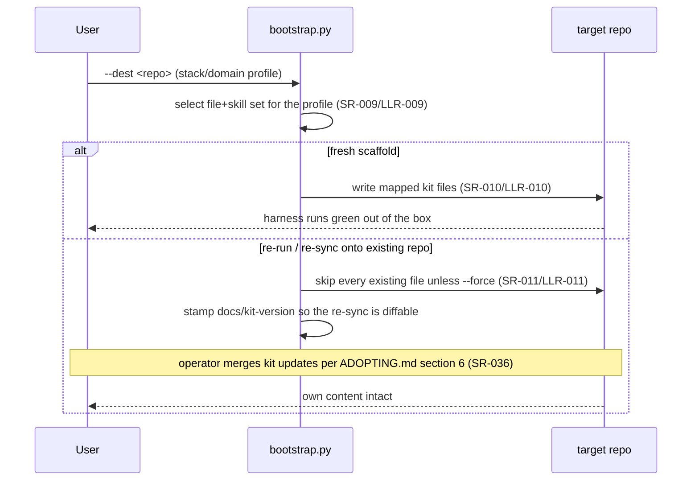

# Architecture — the kit meta-repo (self-adoption)

One page over the kit's **own** product: the reusable process kit under
[`project-trajectory/`](../project-trajectory/) — its runnable scripts
(`project-trajectory/scripts/`), git hooks (`project-trajectory/hooks/`), and
the artifact templates it ships — verified by the suite in [`tests/`](../tests/).
This doc is the kit's **self-adoption** architecture (IMPROVEMENT_PLAN.md Thread
47); it is distinct from the `architecture.template.md` the kit ships to
adopters. The requirement spine it renders lives in
[`requirements/`](requirements/) + [`test/`](test/).

## Shape of the product

- **Checkers / generators** (`project-trajectory/scripts/*.py`) — stdlib-only,
  Python 3.11+, cross-platform (SR-034/SR-035). Each is invoked as a subprocess
  by the check harness (`check.py`) and by the test suite, so the "product" is a
  set of independently runnable commands, not a linked application.
- **Enforcement floor** (`project-trajectory/hooks/*`) — the pre-commit /
  pre-push / commit-msg hooks that run the integrity + secrets floor
  agent-neutrally (SR-019/SR-020/SR-021).
- **Declared config** (`docs/stack.ini`, the generated `docs/gate`, and
  `docs/process.toml` — the one home for every process dial) — read once by the
  harness and the coordinator so a behavior is declared in text, not baked into
  a script (SR-007/SR-031).
- **The unattended station** (`agent_loop.py` + `dispatch.py` + `lane.py` +
  `integrate.py` + `handback.py` + `intake.py`, over `schedule.py`'s frontier)
  — the only subsystem here that is a *running* thing rather than a command:
  one dispatch loop per checkout drives N lanes from the WI frontier to trunk
  (SR-026/SR-057/SR-132). Flow 4 renders it; it is the piece most often
  misread from the rows alone.

## Module dependencies (generated)

The internal-import graph + declared `IF-###` seams, harvested from the source
AST and `docs/requirements/interfaces.toml`: a solid arrow is an import, a
dotted labeled arrow a declared seam — so an undeclared cross-component
coupling is visible at a glance. The `check_trajectory.py` cross-CMP rule
(LLR-067) reads this **committed** block; `gen_arch_map.py --check` gates its
freshness like the module map below.

<!-- BEGIN GENERATED DEPENDENCY DIAGRAM -->
_Generated by `scripts/gen_arch_map.py` from the source tree (AST): each solid arrow is an internal import; a dotted labeled arrow is a declared IF-### interface seam. Do not edit by hand; run the check harness to refresh._

_(no source scanned)_
<!-- END GENERATED DEPENDENCY DIAGRAM -->

## Module map

The per-symbol map over `project-trajectory/scripts/`, generated by
`gen_arch_map.py` (SR-023). **Do not edit by hand** — `gen_arch_map.py --check`
(the DevBar-Release arch-map-freshness step) fails if this block drifts from source;
regenerate with `python project-trajectory/scripts/check.py --run-step arch-map`.

<!-- BEGIN GENERATED MODULE MAP -->
_Generated by `scripts/gen_arch_map.py` from the source tree (AST). Do not edit by hand; run the check harness to refresh. Summaries and `Implements:` come from your docstrings/comments._

_(no source scanned)_
<!-- END GENERATED MODULE MAP -->

## Runtime flows

Hand-authored sequence diagrams of the behaviors most easily misread from
registry rows — concurrency, what blocks on what, failure handling — each citing
the SR/LLR ids it renders (PROCESS.md §3, required at DevBar-Tests).

> **Inherited drift, recorded not absorbed (Flow 4).** Flow 4 renders the code
> as it stands after the concurrency-v2 program (WI-380/381/383/386/387/388).
> Three rows it cites still describe the model that program replaced — SR-132
> still specifies the composed-tree bar on a candidate worktree, SR-093 and
> SR-124 still describe the five-class scheduling ladder — and LLR-143 still
> names the deleted `drive.py` as its Module. Amending them is
> [WI-390](work/queued/WI-390-concurrency-v2-program-close.md)'s spine scope
> (one re-attest window, one owner sitting), so this section states the code
> truthfully and leaves the rows to their owner rather than editing spine text
> outside a ratification. Where a diagram and a cited row disagree today, the
> diagram is the current behavior.

### Flow 1 — Unattended coordinator session (SR-026, SR-027, SR-028, SR-029, SR-030)

```mermaid
sequenceDiagram
    participant Launcher as agent-resume launcher
    participant Loop as agent_loop.py (coordinator)
    participant Lock as dispatch lock — out/agent-loop.lock (SR-029/LLR-029)
    participant Disp as dispatch.run — the station (Flow 4)
    participant Worker as agent_loop --wi (lane subprocess)
    participant Agent as agent CLI
    Launcher->>Loop: run --root .
    Loop->>Loop: preflight — git repo? agent CLI? privacy author? (SR-027/LLR-027)
    alt broken footing
        Loop-->>Launcher: typed nonzero exit (EXIT_PREFLIGHT), never hangs
    else ok
        Loop->>Lock: _coordinator_lock (SR-030/LLR-030 refuse a 2nd writer)
        Lock-->>Loop: held for the process lifetime (kernel-released on death — SR-029)
        Loop->>Disp: _drive_entry — nothing is read from docs/status.md
        Note over Loop,Disp: resume authority is the claimed assignment plus the committed<br/>trailers on its branch (SR-026/LLR-026); the serial<br/>resume-from-status.md loop is retired
        Disp->>Worker: spawn per admitted lane, stdin closed (SR-060/LLR-061)
        Worker->>Agent: run headless session(s)
        alt agent errors (retired model / auth)
            Agent-->>Worker: nonzero
            Worker->>Worker: log ERROR; all-ERROR region = unavailable agent (SR-028/LLR-028)
        else worked
            Agent-->>Worker: session output
        end
        Worker-->>Disp: typed worker exit — decided outcome or crash (Flow 4)
        Disp-->>Loop: first fatal code, or DONE once the station drains
        Loop-->>Launcher: typed outcome code (DONE/PAUSED/STALL/PREFLIGHT/…)
    end
```

### Flow 2 — Scaffold generation and re-sync (SR-009, SR-010, SR-011, SR-036)



### Flow 3 — Secrets + privacy floor at commit/push (SR-017, SR-018, SR-019, SR-020)


### Flow 4 — Station cycle: admission, lane, refresh, merge slot, intake (SR-057, SR-093, SR-115, SR-131, SR-132)

One tick of `dispatch.run`. The three properties hardest to read off the rows:
the **spine barrier** is a property of admission (nothing slips past an
exclusive kind into a free lane), the **bar is attested to a tree** on the
branch *before* the merge slot rather than run on a composed tree inside it,
and **every lane ends in a merge** — a worker that cannot finish hands back and
the run keeps going.

```mermaid
sequenceDiagram
    participant Sched as schedule.py frontier (SR-057/SR-115, LLR-152)
    participant Disp as dispatch.py tick loop (LLR-149)
    participant Lane as lane.py worktree + subprocesses (LLR-150)
    participant Hand as handback.py (LLR-144)
    participant Slot as integrate.py merge slot (LLR-140/LLR-151)
    participant Intake as intake.py (LLR-153/LLR-154)
    loop each tick, until a fatal code or a drained queue
        Disp->>Disp: tracked pause? dirty trunk? (SR-131/LLR-138) — freeze admission, let lanes come home
        Disp->>Sched: re-derive the ready frontier as (WI, kind) pairs
        Sched-->>Disp: exclusive kinds ranked ahead of parallel ones (SR-093/SR-115)
        alt an exclusive kind is on the frontier
            Note over Disp: THE SPINE BARRIER — admission stops outright;<br/>the batch admits alone, sole toucher of trunk
        else free lane and parallel work
            Disp->>Slot: claim, dispatch lock held (LLR-151)
            Slot-->>Disp: spec to active/&lt;branch&gt;/ on a trunk commit, branch cut from it
            Disp->>Lane: spawn the worker subprocess on the lane worktree
        end
        Lane-->>Disp: worker exit
        alt decided non-DONE exit (NEEDS-HUMAN, blocked, budget, stall)
            Disp->>Hand: hand_back — commit as-is, spec to queued/ with a Handback section and a blockref
            Note over Disp,Hand: the lane still closes into trunk and the run<br/>continues; only a FAILED handback stops it (LLR-144)
        else crash (traceback, signal)
            Note over Disp: claim stays in active/&lt;branch&gt;/; the next tick<br/>resumes it, bounded by the stall guard
        end
        Disp->>Lane: spawn the refresh — mechanical, no agent
        Lane->>Lane: merge trunk in, then trunk_step, then the check.py bar
        Lane->>Lane: commit a Bar-Green trailer naming the tree it barred and its work parent
        alt refresh red
            Note over Disp,Hand: a branch asserting DONE stops the run; one that merges<br/>nothing is quarantined once (code reverted, diff kept<br/>as a bar-inert patch) and refreshed again
        else refresh green
            Disp->>Slot: merge this lane's branch only — the slot is sub-second
            Slot->>Slot: is trunk already an ancestor, and does the tip attest its OWN tree?
            Slot->>Slot: merge --no-ff, ff trunk, unload, audit
            Slot->>Intake: post-merge arm, still inside the held slot (LLR-154)
            Intake-->>Slot: rows the merge forces, as ONE bookkeeping commit on trunk (LLR-153)
        end
    end
    Disp->>Intake: empty frontier — gap census mints gap-closure rows, else drain and exit 0
```
