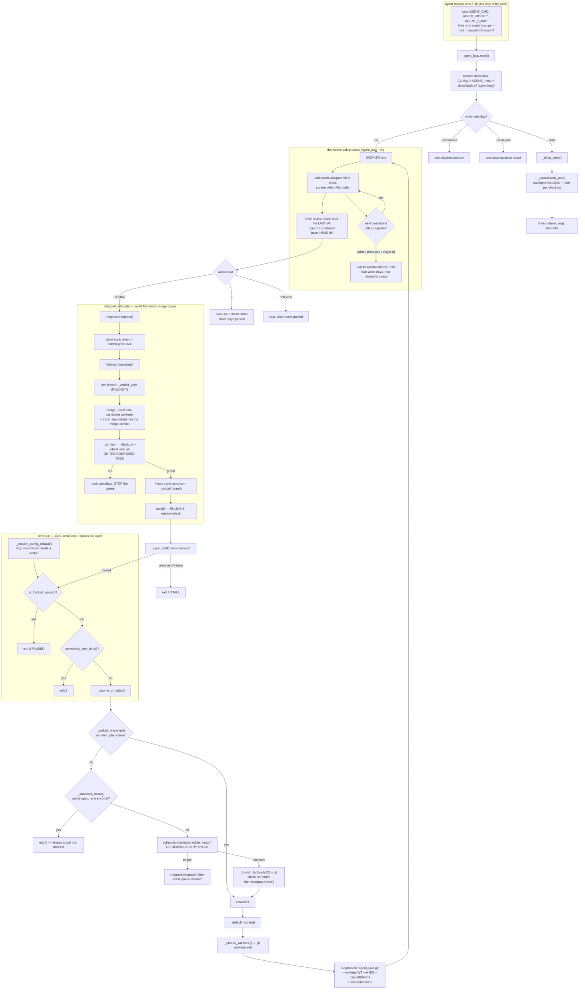
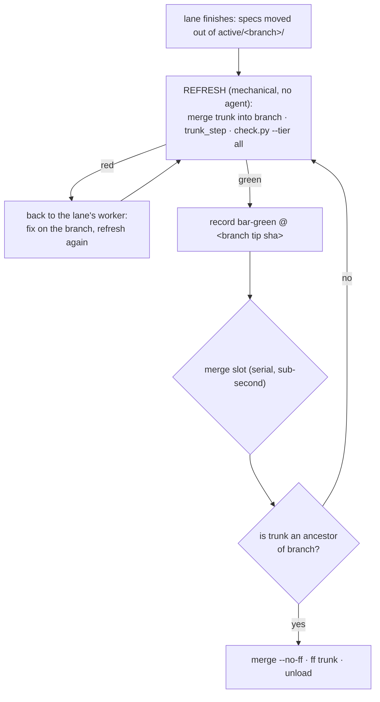
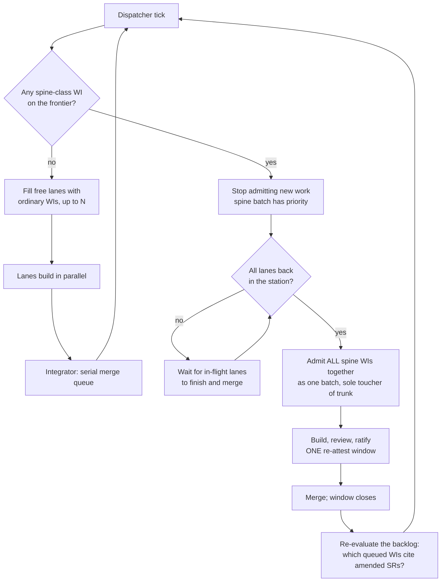

# Constraints over checks — concurrency, spine authority, and work-item state

> **STATUS: CLOSED AND RULED — the rulings are in [`log.md`](log.md)'s
> Decisions.** Working surface opened 2026-07-31 after a session ran two work
> items in parallel by hand and surfaced problems that were not really about
> concurrency. §0/§A0 are background; **Part I** carries the owner's 2026-07-31
> answers to questions A–F and the derivations taken from them — each labelled
> **(OWNER)** or **(DERIVED)**. **All six questions are answered** and §A2's
> one empirical precondition is **measured** (§A2.1). The rows this plan
> produced are claimable in [`docs/work/queued/`](work/queued/) — they were
> written here while the design was open and moved out of `deferred/` the
> moment it was ruled. Precedent for the shape:
> [`concurrency-restructure.md`](concurrency-restructure.md).

## 0. The governing principle (owner framing, 2026-07-31)

> *"A lot of the previous moth-balling was due to constraining the overall
> system and building checks instead of building constraints that would have
> prevented the bad behavior in the first place."*

Prefer **structure that makes a bad state unrepresentable** over **a check
that detects it after the fact**. Every section below is an application; each
proposal is judged first by whether it *removes* machinery.

**Worked example, found while drafting this.** The `archive/` folder holds
both terminal states, so a `disposition = "retired"` frontmatter key
disambiguates it — and `parse_spec_status()` exists to verify the attribute
and the folder agree, raising on "unknown disposition" and on "a retired spec
outside archive/". One folder too few produced: an attribute, a validator, two
error paths, and its tests. **Splitting the folder deletes all of it.** That is
the shape to look for everywhere else.

**Why this keeps happening — a structural answer, not a character one.** The
2026-07-28 audit already found enforcement-layer growth to be the repo's
dominant failure mode, and Phase 5 then deleted 4,042 lines, so this is not
aversion to architectural change. The likelier cause is an **incentive
gradient**: a check fits inside the scope of the WI that discovered the
problem, while a constraint usually needs a schema or flow change that crosses
WI boundaries and may owe an attestation. Every local decision to add a check
is individually correct; the aggregate is enforcement-layer growth. If that
diagnosis is right, the fix is procedural — ask *"what constraint would make
this unrepresentable?"* at **filing** time, where the cost is still comparable,
rather than at review time when only the check is in scope.

---

# Workstream A — concurrency and spine authority

## A0. How a launch works TODAY (the shipped call chain)

Read this before proposing changes — it is what exists, not what is wanted.
Verified against the code 2026-07-31.



**What this makes visible for the batching question:**

- **`drive.py` has no CLI and no lane input.** It is a library `agent_loop`
  calls; it reads 14 fields off the shared namespace and always claims
  `ready[0]`, passing `wi_ids = [wid]` — **exactly one**. A dispatcher needs a
  genuinely new input; nothing here can be repurposed.
- **The batch capability lives one level down**, at `agent_loop --wi
  'WI-201;WI-204'` — reachable by hand, unreachable from `drive`, because
  nothing packs.
- **The worker already refuses to batch spine work** (the `exit 10` arm):
  built work stays, unstarted constituents return to the queue. The
  *worker-side* half of §A4 exists; the dispatcher-side half (wait for the
  station, batch the spine WIs together) does not.
- **A batch is ONE review scope** — a single round after the last constituent,
  over the combined diff. That is the real amortisation, and the real loss of
  attribution.
- **The bar sits at `integrate`, not at the worker.** The only MECHANICAL bar
  in the loop is the integrator's; the builder's "close bar" is prose in a
  prompt, self-reported. §A2 moves the mechanical bar onto the branch and
  deletes the integrator's.
- **Two flag collisions.** `--max-iterations` is drive's *cycle* ceiling and is
  **not** forwarded, so the worker independently uses its own default of 40
  *sessions*. `--stall-limit` is forwarded but means *cycles with an unmoved
  trunk* to drive and *consecutive no-commit sessions* to the worker.

---

# Part I — the resolved model (owner answers 2026-07-31 + derivations)

**Provenance discipline.** §A1–§A8 below mix two kinds of statement and label
both: **(OWNER)** is an answer the owner gave in the 2026-07-31 design pass and
is settled; **(DERIVED)** is a consequence this draft worked out from those
answers and the shipped code, and is a **claim awaiting the owner's line**.
Nothing here is in [`log.md`](log.md)'s Decisions yet — that entry is written
when the design closes, not per-section.

## A1. Two axes, not one class ladder (DERIVED)

`schedule.py` has five scheduling classes on ONE ladder — `spine-serial |
protected-serial | single-wi | ordinary | unclassified` — and uses that ladder
for two different jobs at once. `_GATE_RANK` makes the class decide **who goes
first**; `classify()` makes the same class decide **what may share the
station**. That conflation is why `protected-serial` and `single-wi` look like
different things when they are not (both mean *run alone*), and why a critique
is stuck being serial when nothing about a critique touches product code.

The owner's priority list is two independent axes. Split them:

| Axis | Values | Derived from |
|---|---|---|
| **Concurrency** | `exclusive` \| `parallel` | the declared kind |
| **Rank** (low first) | integer | the declared kind, then `Priority`, then downstream count, hard-path length, id |

| Declared kind | Concurrency | Rank | Re-attest window | Runs a bar |
|---|---|---|---|---|
| `spine` — scope change | exclusive | 0 | **opens** one | yes |
| `adjudication` | exclusive | 1 | no | **no** |
| `attestation` / `gate` | exclusive | 2 | **closes** one | no |
| `protected` | exclusive | 3 | no | yes |
| `high-risk`, `PlanMode=dual` | exclusive | 4 | no | yes |
| `critique` | **parallel** | 5 | no | no |
| `ordinary` | parallel | 6 | no | yes |
| missing / contradicting structural evidence | — | — | — | `unclassified`, never scheduled |

That is the owner's list mechanized, and it **deletes** rather than adds:
`SCHED_PROTECTED`, `SCHED_SINGLE_WI` and `SCHED_SPINE_SERIAL` collapse into one
`exclusive` value, `_GATE_RANK` becomes the rank axis it was pretending to be,
and "opens/closes a window" stops being inferred from the concurrency class.

**Why `critique` may go parallel now:** it was `single-wi` to keep a critique
out of a packed traincar. With packing gone (§A6, question D), `single-wi` has
nothing left to prevent — the distinction it drew no longer exists.

## A2. The station protocol — refresh, then merge (DERIVED, and it replaces the sketch)

This is the one place the owner's sketch needs amending, and the amendment is
in the sketch's own direction.

**The sketch:** *"the branch pulls the current main into its branch, runs the
full bar, and merges into trunk."* **What ships:** the opposite direction — the
integrator makes a candidate worktree at trunk, merges the branch **into** it,
bars the composed tree there, then advances trunk `--ff-only` to that exact
sha. Keep the shipped direction: it is why trunk can only ever move to a tree a
bar passed, by construction rather than by discipline, and a red bar leaves
trunk untouched with nothing to undo.

**But the sketch's instinct is right and names a real gap:** today a merge
conflict is an integrator *refusal* that stops the whole queue and hands the
conflict to nobody. Take the half of the sketch that fixes that — **the branch
owns being current with trunk** — and admit it as a precondition rather than a
merge step:

> **A branch may not enter the merge queue unless trunk is already an ancestor
> of it.** `git merge-base --is-ancestor <trunk> <branch>` — exact, cheap,
> mechanical.

Everything follows from that one line:

- **A merge conflict becomes unrepresentable.** If trunk is an ancestor, the
  `--no-ff` merge is trivially clean and the resulting tree is byte-identical
  to the branch tip. The conflict arm, the `merge --abort` paths and the
  parked-half-merge cleanup in `_candidate_worktree` all delete.
- **The composed tree IS the branch tree**, so the bar need only run once — on
  the branch, at refresh — instead of once by the builder (self-reported) and
  again by the integrator (mechanical). Fold `trunk_step.py` into the refresh
  and the two trees are identical including generated artifacts.
- **Class C composition failures are caught anyway, and better.** A and B both
  cut from `T0`. A refreshes (trunk still `T0`), bars, merges → `T1`. B must
  refresh onto `T1` — which *contains A* — and bar there. Every pair is
  composed exactly once, on the real tree, by whichever branch merges second,
  and a red is attributable to the refresh that caused it. **This is what
  drain grouping (§A6/WI-382) was for. It is now free, so that WI dies.**



**The slot is sub-second, so the integration queue the sketch worried about
costs nothing.** The 11-minute bar runs *outside* the slot, optimistically. A
lane only loses the race if another lane merged during its bar — then it
refreshes once more. **Bound it:** after one lost race a branch takes the slot
for its retry, so a slow lane cannot be starved indefinitely by fast ones. That
is one rule, not a family of checks.

**The bar must be attested to a tree, not to a run.** Record `bar-green @
<sha>` where the sha is the branch tip that merges. The dispatcher verifies the
sha, not a claim — the same git-derived freshness shape `_verdict_gate` already
uses, and the reason the refresh bar is mechanical rather than the agent's
self-report (today the only *mechanical* bar in the loop is the integrator's;
the builder's close bar is prose in a prompt).

### A2.0 What "the slot" is, and why the bar sits outside it

**The slot is the exclusive turn to advance trunk** — today, the
`out/integrate.lock` that `integrate()` holds for a whole drain. Only one branch
may be moving trunk at a time; that is the entire merge queue. Everything else
(building, reviewing, refreshing, barring) can happen in parallel across lanes.
The only question is **how much work a branch does while holding that turn.**

| | **Pessimistic** — bar inside the slot | **Speculative** — bar outside (recommended) |
|---|---|---|
| Sequence | take slot → merge trunk in → **bar (11 min)** → merge → release | merge trunk in → **bar (11 min)** → take slot → *is trunk still my ancestor?* → merge → release |
| Slot held for | ~11 minutes | **sub-second** |
| Can lose a race? | never — trunk cannot move while you hold it | yes: if another lane merged during your bar, you are no longer current and must redo the refresh |
| Trunk advance ceiling | **~5.5 WI/hour, regardless of lane count** — the slot is the bottleneck | bounded by lanes, not by the queue |

Concretely at `lanes = 2`. Lanes A and B both finish at `T0`. Pessimistic: A
takes the slot and bars for 11 minutes while B sits idle waiting for a turn it
cannot use; 22 minutes for two WIs. Speculative: both bar concurrently, A wins
the slot and merges in a second, B finds trunk is no longer its ancestor and
refreshes once — ~22 minutes too in the worst case, but B's redo is the *only*
cost and it is bar-time it would have paid anyway if it had gone second. As
lanes grow, pessimistic gets strictly worse and speculative does not.

**The retry is bounded, not open-ended:** after **one** lost race a branch takes
the slot for its retry, degrading to pessimistic exactly for the branch that is
losing. So no lane can be starved by faster neighbours, and the common case
still pays nothing.

**RULED 2026-07-31: speculative, with the one-lost-race rule** — and the owner
attached a caveat worth keeping: *"this might need to be restricted to
pessimistic in the future. As long as it only needs ancestry this should be
fine; I know it caused pain historically, but that might have been due to how it
was implemented."*

**Checked, and the caveat's suspicion is correct — the historical pain was the
implementation, not speculation.** The recorded failure is the deleted
dispatcher's **19 reservations → 8 integrations → 0 gate-verified → 11
rescues**, and `concurrency-restructure.md` §2.3 diagnoses it precisely: the
speculation was held in **state git could not adjudicate** — `refs/llm/`
reservation refs used as compare-and-swap, `out/dispatch/events.jsonl` as run
state, and the residue that came with them (36 stale worktrees, 34 `llm/*`
branches, an orphaned stash), on a module whose threat model was named as *bugs
and fail-open*. The eleven rescues were rescues of **reservations**, not of merge
races. The fix was to make the claim a serial trunk commit — *"atomic and
race-free because step 1 is a serial trunk commit."*

**What §A2 speculates on is categorically different: ancestry, and nothing
else.** No reservation, no CAS ref, no events file, no run state. Git itself is
the arbiter, the question is one command (`merge-base --is-ancestor`), and a
lost race has **nothing to reconcile** — the branch simply redoes a refresh it
would have had to do anyway had it gone second. That is the distinction the
caveat is reaching for, and it holds.

**Two things make restricting to pessimistic later cheap, and they are
requirements on WI-386, not hopes:**

1. **Slot acquisition must have exactly one call site.** Pessimistic is then the
   same code with that call moved *before* the refresh instead of after — a
   one-line move, not a rewrite. (No dial is added now; a config knob for a
   decision nobody has needed to change is the shape §0 warns about.)
2. **The pessimistic path is never dead code.** The one-lost-race fallback *is*
   the pessimistic sequence, and it executes in production every time a lane
   loses a race. So a later restriction switches to a path that has been running
   and passing all along, rather than to a branch that rotted untested.

If the caveat is ever exercised, the cost is (1) and the confidence is (2).

### A2.1 The determinism precondition — MEASURED 2026-07-31, holds

§A2 rests on "a lane-side `trunk_step.py` yields the tree the merge would."
Measured, not assumed — regen run on a detached worktree at a clean committed
`HEAD`, diffed against the committed artifacts:

```
PROJECT_STATE.html | 2 +-        state as of commit 16d3560  -> 16d35601
docs/gate          | 2 +-        # computed 2026-07-31 (as-of 16d3560 -> 4c864a6d)
```

**Two files drift, both by a HEAD-derived stamp line, and nothing else.**
(Note the first one is not even a different commit — it is the same sha
abbreviated to a different LENGTH, because git widens abbreviations as the
object count grows. Sha-length is not a stable input.)

**This does not block §A2, for two independent reasons:**

1. **Both stamps are already excluded from the freshness gates, by design.**
   `gen_trajectory.ASOF_RE` drops the as-of line from the `--check`
   byte-compare ("the stamp is informational"), and `derive_gate --check`
   compares only the deterministic `# basis:` line, never `# computed … (as-of
   …)`. The drift is invisible to every gate that would red on it — which is
   also why the harness is green today despite a committed artifact *always*
   carrying its predecessor's sha.
2. **Under §A2 the integrator does not fold at all.** The merge is `--no-ff` of
   a branch that already contains trunk, so the merge tree **is** the branch
   tree, byte for byte. The stamps simply record the branch tip rather than the
   merge commit — informational, and gate-invisible per (1).

**But the check found a real hazard worth one rule.** `docs/log.md` is
*append*-compiled from `docs/log.d/` fragments. Move that compile onto the
branch and two lanes append to the same file end — so a lane that refreshes,
compiles, then **loses the merge race and refreshes again** would hit a textual
conflict on `log.md`, which is exactly the failure §A2 exists to abolish.

> **The refresh is a disposable commit.** A retry is `git reset --hard <last
> work commit>` and a fresh merge-trunk → `trunk_step` → bar, never a second
> merge stacked on the first. The fragment returns to `log.d/` and compiles
> cleanly onto the new trunk's log. One rule, and the conflict cannot form.

Order inside the refresh is therefore fixed and load-bearing:
**merge trunk → `trunk_step` (compile, then regen) → bar → commit.**

## A3. Terminal outcomes — why a branch cannot hang (DERIVED)

> *"WIs must always land back into trunk. Branches never get to hang."*

Make that true by leaving no fourth option. **Every lane ends in a merge.**

| Outcome | What the branch commits | Merges? |
|---|---|---|
| **merged** | specs → `complete/` | yes |
| **cancelled** | specs → `cancelled/` with the reason in the spec | **yes** — the cancellation is a trunk fact, and the id stays retired |
| **handback** | work committed as-is; specs → `queued/` (or `draft/`) with a `## Handback` section naming what remains and a `blockref` if a human is wanted | **yes** |

`cancelled` is "throw the work away"; `handback` is the owner's *quarantine*
— the partial work lands in trunk where a future WI can pick it up, instead of
living on a branch nobody will find. Neither needs an adjudicator to sweep up,
because neither is an exceptional path.

**This deletes the run-stopping arms.** Today `EXIT_NEEDS_HUMAN` parks the
branch and stops the entire drive loop — one WI wanting a human freezes a
walk-away run. Under handback the lane closes, the WI returns to trunk marked
blocked and visible on the owner surface, and the dispatcher keeps working.
Same for any non-zero worker exit that is not a crash.

**A crashed worker is not a hang** and keeps the machinery that already handles
it: the branch exists, the specs are still in `active/<branch>/`, so the
dispatcher re-assigns a lane to it (`_parked_branches`, unchanged).

**The one hole in this — RULED 2026-07-31, after the frequency claim was
checked and refuted.** All three outcomes merge, and a merge requires a green
bar (§A2), so *whatever handback carries must itself be bar-green*. That is
fine when the work is incomplete-but-sound; the question is what happens when a
lane hands back **because its code is red and it cannot fix it**.

> **Correction.** An earlier draft of this section called that "a large share
> of the real cases." **The recorded evidence says the opposite**, and no
> measurement supported the claim. §A6's failure table puts Class A — *the WI's
> own code is broken* — at **0 at merge** across this session's seven WIs; every
> red observed was Class B (registration), D (pre-existing rot), E (merge
> conflict) or F (gate refusal), and three of those four are process artefacts
> this design deletes outright. Reading the *causes* of `EXIT_NEEDS_HUMAN` in
> `agent_loop.py` points the same way — no routable model / provider auth, a
> review escalation past the streak budget, critique budget exhausted still
> CHANGES-REQUESTED, a dual-plan page. **Not one of them is "the bar is red."**
> The dominant handback shape is *green-but-not-approved* or
> *cannot-proceed-for-config-reasons*, and both merge without trouble.

That **strengthens** the choice rather than weakening it: a genuinely rare path
must not earn its own exclusion mechanism, and must not cost the invariant.

**A consequence found in the same read, and it must be built with WI-387: the
verdict gate has to key off the OUTCOME, not off the claim.** `_verdict_gate`
demands an `APPROVE` for every id in `_claimed_wi_ids`, which it reads from
trunk's `active/<branch>/`. A handback leaves those ids claimed at merge time —
so as written the gate would demand an approval for work being *returned*.
Only the **merged** outcome asserts done and owes a verdict; `cancelled` and
`handback` assert the opposite and owe none. (This is the same review escalation
that causes most handbacks in the first place — so without this fix the common
path deadlocks on itself.)

The three ways out that were weighed:

1. **Revert the code, keep the record.** The handback merges the spec move, the
   notes and the failing diff as a bar-inert artefact (a `.patch` under
   `docs/work/`), so the work is in trunk, findable, and cannot red anything.
   Nothing is lost; nothing is live.
2. **Merge behind a declared absence.** The code lands but is excluded from the
   bar by an explicit, expiring declaration. Honest, but it puts red code in
   trunk and adds an exclusion mechanism — a check, where §0 wants a constraint.
3. **Admit one parked case.** Concede that a red, unfixable branch is the single
   legitimate hang, and gate it behind a named owner surface.

**RULED: (1).** The only one that keeps *every lane ends in a merge* literally
true, and it satisfies the owner's quarantine requirement — accessible in the
trunk, pickable by a future WI — without ever putting red code where the bar can
reach it. The rarity finding above is what settles it: option 2 buys an
exclusion mechanism for an edge case, and option 3 spends the invariant on one.

**One more constraint worth taking while here.** `_stranded_claims` exists
because `claim()` does two writes — trunk commit, then branch cut — and a crash
between them leaves a claim no lane can reach, costing an exit-2 refusal and
hand repair. Invert the order (`commit-tree` → `git branch` → advance trunk)
and a crash leaves at worst an orphan branch whose claim commit is *not* an
ancestor of trunk while its WI is still `queued/` — which is definitionally an
abandoned claim the dispatcher deletes and re-claims. The failure moves to the
benign side and the check deletes with it.

## A4. How the dispatcher operates (OWNER, with the barrier now derived)

Spine work is **not refused** — it waits for the station to clear, then runs
alone.



Properties this gives, none of which hold today: spine work is **exclusive**,
**batched** (N spine changes = one window, one owner sitting), and
**prioritised** (drains rather than starving).

**Constraint, not check:** `schedule.py` already classifies
`spine|gate|attestation → serial-whole-project`, but `_disposition()` still
returns `ready` for those rows and the only enforcement is `integrate.py`'s
blunt refusal. Making the frontier itself withhold a spine WI until lanes are
empty is a constraint; the current refusal is a check.

### A4.1 What admits the batch — the dispatcher (OWNER, question B)

> *"A dispatcher is the only one who should kick off spine work."*

So `_claim_refusal`'s `safety != "ordinary"` arm — the hard stop at
[`integrate.py:246`](../project-trajectory/scripts/integrate.py#L246) — is
**deleted**, and admission becomes the dispatcher's scheduling decision.

That leaves one authority hole, closed by a constraint rather than by
re-adding the refusal: `integrate claim` is also a hand-runnable CLI, so a
human could claim a spine WI mid-flight. Make **the claim require the
dispatcher's lock**. A hand claim on an idle station still works (useful, and
attended-serial per RULING-8); a hand claim while lanes are running becomes
unrepresentable instead of refused.

The mid-flight case the owner named stays exactly as stated: a WI that
discovers it needs spine work **cleans up what it can, records that its scope
changed, and hands back** (§A3) with a draft spine WI for the remainder. It
never does spine work inline — which is what WI-280 did under an honest
`ordinary` declaration.

### A4.2 Driver and dispatcher — split, thin seam (OWNER, question A)

> *"Take drive, rename it dispatch, then extract the parts that are only
> really about driving."*

Two modules, and the seam is thinner than the sketch feared:

| Module | Owns | From |
|---|---|---|
| **`dispatch.py`** | the tick loop, the lane table and its count, pause, the frontier read, admission + the spine barrier, the merge slot, stall | `drive.py` minus the launch |
| **`lane.py`** | one lane's mechanics: ensure worktree, launch the worker subprocess, run the **refresh** (§A2), report the outcome | `_ensure_worktree` + `_default_worker` (~60 lines today) |

> **The handshake the sketch worried about does not exist.** *"The drive then
> needs to wait for the dispatcher again to say it's okay to merge."* It does
> not: a lane declares itself finished by **moving its specs out of
> `active/<branch>/`** — the tree-derived signal `finished_branches()` already
> reads, with no state file and no back-channel. The dispatcher polls it. The
> merge slot is the dispatcher's own serial loop over that list, which is what
> `integrate()` already is.

At `lanes = 1` `dispatch.py` degenerates to today's serial loop, so the split
is safe to land before any concurrency is switched on.

### A4.3 Lane count (question E) — the contention answer, corrected

The sketch expects no contention: *"one will usually be develop or review,
while test bar costs only occur right before merging."* Two corrections, one
in each direction:

- **The merge bar was never concurrent** — `integrate()` holds
  `out/integrate.lock`, so at most one composed bar has ever run at a time.
  And after §A2 there is no merge bar at all.
- **The refresh bars ARE concurrent** — that is where the 11 minutes moved. N
  lanes finishing together means N simultaneous full bars.

They do contend, but the damage is already bounded and the bound is written
down in [`status.md`](status.md): on a plain Windows desktop the root
`conftest.py` job object makes a second run **join** the shared 50% ceiling, so
N bars split one half-machine — the cost is per-bar wall-clock, not a wedged
desktop. **On POSIX there is no cap at all**, so N lanes genuinely
oversubscribe there.

**RULED 2026-07-31: `lanes` is a declared dial in `docs/stack.ini
[agent-loop]`,** beside the existing ones, resolving on the established ladder
(CLI flag > `AGENT_*` env > `stack.ini` > code default). Two lanes is the
smallest count that proves the barrier, the merge slot and the refresh race are
real rather than vacuous — a 1-lane default everywhere would let all three rot
untested.

**With one refinement the owner's condition forces.** `docs/stack.ini` is
**adopter-owned** — ADOPTING.md §6 lists it under *"Preserve always (yours, kit
only seeds them)"* — so a re-sync will never overwrite a downstream lane count.
Good, but it means the opposite hazard: a kit-seeded key **never appears** in an
existing adopter's file, so their behaviour would be decided by the code default
alone. A code default of 2 would therefore switch a long-adopted repo from
serial to two-lane concurrency **silently, on upgrade**. So split them:

- **Template seeds `lanes = 2`** — a fresh scaffold gets concurrency, and gets
  it visibly, on a line it can read and change.
- **Absent key ⇒ `lanes = 1`** — an existing adopter stays exactly as serial as
  it was until it opts in by adding the line.

New repos exercise the machinery; nobody is upgraded into concurrency they did
not ask for.

## A5. What counts as a spine touch — OWNER RULING 2026-07-31

> Only what is **ratified** matters. Ratification is on change of **scope**,
> defined by the **prose and the relevant field attributes**. Traceability —
> the `Module` pointer and its kin — is *traced*, not ratified, and must **not**
> count as a spine touch.

The detector violates this. `check_trajectory.staged_spine_findings` compares
every column except `Status`:

```python
changed = sorted(k for k in set(head) | set(row)
                 if k != "Status" and (head.get(k) or "") != (row.get(k) or ""))
```

So `Module`, `CodeSymbol`, `TestRefs`, `Component` and `Phase` arm the
re-attest warn as if requirement prose had changed. **That is what happened on
WI-280**: 19 LLR `Module` cells followed code that moved → 11 owning SRs to
`Modified` → gate G3→G2 → a ratify brief and four review rounds, for a change
that altered no requirement. Under this ruling **that window should never have
opened.**

### A5.1 The cell split — RESOLVED (OWNER, question C)

> *"Omit SN-Refs and Verifies as a ratified item to verify against."*

| Registry | Ratified — arms the re-attest | Traced — must NOT |
|---|---|---|
| SR | `Title`, `Requirement`, `Rationale`, `AcceptanceCriteria`, `Permutations`, `Priority`, `Verification` | `SN-Refs`, `Phase`, `Area`, `Lifecycle` |
| LLR | `Title`, `Detail`, `Rationale` | `Module`, `CodeSymbol`, `TestRefs`, `Component`, `Phase` |
| TC | `Method`, `Expected`, `Parameters`, `Level`, `Tier` | `Verifies`, `Evidence`, `Automated`, `Phase` |

**And what happens when a traced cell changes — CONFIRMED (OWNER, 2026-07-31).**
A changed `SN-Refs` or `Verifies` **routes to adjudication** (§A5.2); it never
arms a re-attest window directly. Re-pointing what a requirement answers to, or
what a test claims to cover, is a *judgement* about whether scope moved — which
is the thing adjudication exists to make. The cost of being wrong is asymmetric
and points the same way: a spurious window costs an owner sitting and four
review rounds (WI-280), a spurious adjudication costs one bar-less WI.

### A5.2 Adjudication — the mechanical WI (OWNER)

> *"A detected scope change is mechanical. The WI can be created with a derived
> description so it does not require an LLM at all to create the initial
> structure and force in a WI that must be attended to."*

This is the piece that makes the §A5 ruling *safe*: narrowing the detector
(WI-380) without it would just move the mis-fires from "spurious window" to
"missed window."

**Minting is deterministic — no model.** A trunk commit that changes a ratified
cell of a `Verified` row causes the dispatcher to write
`docs/work/queued/WI-NNN-adjudicate-<rows>.md` in a bookkeeping commit
(`docs/work/` is already an allowed RULING-6 prefix), with:

- `safety_class = "adjudication"` → exclusive, rank 1
- a Deliverable body listing each changed row, cell, and its before/after — all
  of it derived from the diff `staged_spine_findings` already computes
- `blockref` empty: it is *work*, not a decision brief

**Adjudication runs no bar.** Its only outputs are (a) flipping `Modified`
rows back to `Verified` when the change was grammar, clarity or a re-point that
did not move scope, or (b) filing real WIs — a `spine` WI for the scope change,
and cancellations or re-scopes of queued WIs whose premise moved. It touches
Status cells and the work registry, nothing a product bar can speak to.

**It absorbs §A7 (backlog re-evaluation) entirely** — *"verify if current work
items in queue need adjustment / cancellation"* is the same judgement, made by
the same agent, with the diff already in front of it. That is a standalone WI
deleted rather than a warn added.

**Where the deterministic id comes from** matters here and ties to question F:
`WI-NNN` must be `max(existing) + 1` over **every** spec in `docs/work/`,
which only works if every folder holding a spec is a declared status directory.
See §B3.

## A6. Grouping and the bar

The bar is ~11 minutes (measured 2026-07-31: 634 s is `tests+coverage`; the
other nineteen steps total ~25 s). Three WIs singly = three bars.

**What actually fails**, from this session's seven WIs:

| Class | What | Seen | Attributable without bisecting? |
|---|---|---|---|
| A. Product code wrong | the WI's own code is broken | **0 at merge** | yes |
| B. Registration incomplete | code fine, a spine/census/ratchet row missing | WI-374, WI-280 | **yes** — the bar names check and row |
| C. Composition | two greens, red together | **0 observed** | **no** — needs bisecting |
| D. Pre-existing rot | exposed, not caused | WI-280 | yes — reproduces at trunk |
| E. Merge conflict | textual | WI-280 ×2, WI-277 ×1 | yes — before the bar |
| F. Gate refusal | verdict freshness | WI-280 ×2 | yes — not a work failure |

The composed bar **never caught broken product code** — each builder's own
close bar caught it first. So the merge bar's realistic job is composition and
registration, and most reds name their own cause.

| Knob | Groups | Failure coupling |
|---|---|---|
| **Session grouping** (retired traincar) | N WIs into one session | High — one bad WI reds the car; recorded history 19 reservations → 8 integrations → **0** gate-verified |
| **Drain grouping** | N *finished branches*, barred once | Medium — red needs bisecting; fall back to per-branch on red |

**Drain grouping was the answer** — 3-bars-into-1 without session grouping's
coupling, and the only configuration that could catch Class C at all.

### A6.1 RESOLVED — both grouping knobs die (DERIVED, question D)

**Session grouping: removed** (the owner's D deferred to the flow; the flow
answers it). With lanes, packing two WIs into one session is strictly worse
than putting them in two lanes: same throughput, worse attribution, and the
coupling the recorded 19→8→**0** history already indicts. Delete the vestigial
plumbing — `classify()`'s packing distinction, the §7 continuation guard, the
`exit 10 ASSIGNMENT-END` arm.

`agent_loop --wi 'WI-201;WI-204'` **stays**, with exactly one caller left: the
dispatcher admitting the **spine batch** (§A4), which is the one case where N
WIs genuinely must share one window and one owner sitting.

**Drain grouping: not built.** §A2 makes the merge bar disappear rather than
amortising it, and catches Class C on the *real* composed tree via refresh —
better attribution than a grouped drain, at zero cost. **WI-382 is cancelled,
not deferred.**

## A7. Backlog re-evaluation after re-attest — folded into adjudication

A verdict goes stale when the tree moves; a **WI's premise** goes stale when a
cited SR is amended. The first is mechanized (`_verdict_gate`); the second is
**not checked at all** — `SR-Refs` is only ever tested for *existence*.

The earlier proposal here was a git-derived **warn** on queued WIs citing an
amended SR. **§A5.2 supersedes it:** adjudication already reads the diff, is
already exclusive and already files WIs, and the owner has already scoped it
to *"verify if current work items in queue need adjustment / cancellation."*
A warn would be a second, weaker reader of the same fact. **WI-385 folds into
the adjudication WI** — one behaviour, one home, one owner.

## A8. Gate policy is the dispatcher's authority dial (OWNER premise, DERIVED table)

> *"A full attended G1/G2/G3 would require a back and forth between the
> detection of gate changes, which would then cause the agent-resume to exit
> since no work could be taken, and those ratification items should surface in
> open-items. That is how it works today, so I assumed that part would continue
> to work."*

**Confirmed against the code — the premise holds, with one honest correction.**

- **Detection → gate drop** is real: `Modified`/`Draft` rows change what
  `derive_gate.py` computes, `docs/gate` falls (e.g. G3→G2), and the window
  *lowers* the bar without blinding it (the higher gate's steps run advisory).
- **Surfacing is real**: `gen_open_items.py` renders one card per `Draft` (owes
  a first ratification) or `Modified` (owes a re-attest) SR **with its whole
  chain**, alongside the `Status=pending` decision rows — and it deliberately
  owns no second opinion, deferring to the `--ratify` brief.
- **The exit is real but it is a REFUSAL, not a drain.** A queued spine row
  sorts *first* on the frontier (`_GATE_RANK` 0), `drive` claims `ready[0]`,
  and `_claim_refusal` rejects it with `safety_class != "ordinary"` — so the
  run stops nonzero, reading like a failure in a walk-away log when what
  actually happened is *the machine finished everything it was allowed to do*.
  **Fix that with the barrier:** drain the lanes, then exit **0** with
  "queue drained — N ratification(s) waiting in open-items.html". Same stop,
  honest banner. (`agent_route.failure_action("attended")` already words the
  behaviour this way: *"start nothing new, let in-flight sessions close out,
  then alert the user"* — the dispatcher barrier is that contract implemented.)

**The three levels, as the code defines them** (`agent_route._PAGE_ACTIONS` /
`failure_action`, and `docs/gate-policy.md`'s deviation register):

| Level | Escalation action | `pause_wi` | Keeps non-dependent work? | Who ratifies a gate |
|---|---|---|---|---|
| `attended` (default) | `stop-needs-human` | yes | **no** — start nothing new | a human, per batch |
| `single-ratify` | `surface-block-continue-others` | yes | **yes** | LLM-gate through G1+G2; the human ratifies the queued batch once at the phase's `[g2]` close, autonomous after |
| `autonomous` (this repo) | `design-check-session` | yes | **yes** | an independent fresh-context LLM reviewer's recorded verdict, every gate except G-Final |

**What the dispatcher does with each kind, per level.** This is the table the
barrier needs and the one place the design must not invent policy:

| Kind on the frontier | `attended` | `single-ratify` | `autonomous` |
|---|---|---|---|
| `ordinary`, `critique` | dispatch (parallel) | dispatch | dispatch |
| `high-risk`, `protected` | dispatch (exclusive) | dispatch | dispatch |
| `spine` — build a scope change | dispatch: it is **work**, not a ratification. It *opens* a window; closing it is the next row's job | dispatch | dispatch |
| `adjudication` | dispatch — but **see the open decision below** | dispatch | dispatch |
| `attestation` / `gate` — close a window | **do not dispatch.** Drain the lanes, surface the cards, exit 0 into the owner's queue | dispatch only the queued batch at the phase `[g2]` close; otherwise surface | dispatch (recorded reviewer verdict ratifies) |

**Fixed points survive every level** and the dispatcher must not paper over
them: G-Final is the human's; **no un-run greens**; the harness is still the
bar; ratified owner decisions are never re-decided by an agent.

**The open decision this exposes — may adjudication FLIP under `attended`?**
An adjudication WI's cheap outcome is flipping `Modified` → `Verified` when a
change turned out to be grammar, clarity, or a re-point that moved no scope.
That flip is a **Status change that recovers the gate** — which is a
ratification, and under `attended` ratification is the human's. Two readings,
both defensible:

- **Flip.** Adjudication asserts *no scope changed*, so there is nothing to
  ratify — it is unwinding a false positive, not closing a real window.
- **Recommend only.** Under `attended` it writes its judgement into the WI and
  the open-items card and stops; the human flips. The owner still sits, but now
  with a prepared brief — *"these 19 cells are traced-only, no scope moved,
  recommend re-verify"* — instead of a bare `Modified` count.

**Recommendation: recommend-only under `attended`, flip under `single-ratify`
and `autonomous`.** It costs one owner click on the cheap path and keeps the
level's meaning exact — and *"prepared brief instead of a bare count"* is most
of the win WI-388 exists for.

## A9. The deletion ledger (DERIVED)

Every claim in Part I, scored by §0's bar — does it *remove* machinery?

| Deleted | Because |
|---|---|
| `integrate.py` merge-conflict arm, `merge --abort` paths, parked half-merge cleanup | trunk-is-ancestor makes a conflict unrepresentable (§A2) |
| the composed-tree bar, the candidate worktree, `_teardown`, `candidate-red`, `_composed_tree_script` | the composed tree *is* the branch tree (§A2) |
| `_stranded_claims` + its exit-2 refusal + tests | claim order inverted; the crash window fails benign (§A3) |
| the `EXIT_NEEDS_HUMAN` run-stop, the parked-branch stop | handback is a merge, not an exception (§A3) |
| `_claim_refusal`'s `safety != "ordinary"` arm | the dispatcher admits; the claim rung has no authority (§A4.1) |
| `SCHED_PROTECTED`, `SCHED_SINGLE_WI`, `SCHED_SPINE_SERIAL`, `_GATE_RANK`-as-class | two axes, two values (§A1) |
| packing plumbing: continuation guard, `exit 10`, the packing class | nothing packs (§A6.1) |
| WI-382 (drain grouping), WI-385 (backlog warn) | subsumed by §A2 and §A5.2 |
| `disposition` + `parse_spec_status`'s cross-check + 2 raise paths + tests | the folder is the state (§B) |

**Added:** the refresh step, the ancestor precondition, the lane count dial,
the `adjudication` kind, two folders. Net: strongly negative, which is the
point.

### A9.1 What the ledger does NOT cover — the program close

**Every row above deletes its own machinery, inside its own scope.** Deferring a
deletion to a later "cleanup" row is the mothballing §0 exists to prevent, and
this section must never become its excuse.

But three surfaces are genuinely un-ownable by a single builder, because each
one only makes sense once *all* the rows have landed:

1. **The spine amendment.** Live SRs describe the model this program replaces
   and become **false** when it lands — `SR-093` (*Pure safety classification*)
   and `SR-124` (*Contradiction-safe dual-plan dispatcher class*) both describe
   the five-class ladder §A1 collapses, and `SR-124` names `single-WI`
   specifically, a class that ceases to exist; `SR-132` (*Local integrator:
   serial fail-closed merge queue*) describes the composed-tree bar and
   candidate worktree §A2 deletes. `SR-131` and `SR-133` need *checking* against
   §A3 and §A2 rather than assuming. Rows the program retires rather than amends
   follow the existing convention — mark them `Superseded: <title>`, as Phase 5
   did for the deleted dispatcher's SRs, never delete the row.
2. **Connectivity and the interface registry** — the `drive.py` →
   `dispatch.py` + `lane.py` move. Note the registry is **already drifting
   before this program starts**: `check_trajectory` warns today that
   `drive`, `traj_graph`, `traj_panels` and `traj_render` sit in the
   arch-map with no `IF-###` row, and that `IF-055`/`IF-080`/`IF-081` are
   registered with no script declaring them. Close the drift this program
   *causes*; **record, without silently absorbing,** the drift it inherits.
3. **The prose and the stamps** — `PROCESS_OPTIONS.md` (rewritten onto the seam
   model at Phase 5, and the station protocol moves that seam),
   `AGENTS.template.md`, and the size/dupes stamps. Deletions **shrink**
   modules, so the mirror of *"retire or delete an entry, never re-stamp up"* is
   **re-stamp down** — a generous ceiling silently permits regrowth.
   `concurrency-restructure.md` is **history**: read it as the account of what
   was built, never edit it into a claim about what now exists.

**Why this is one `spine` row and not a checklist: §A4 applied to this design
itself.** All spine WIs admit together as one batch, so the whole program costs
the owner **one re-attest window and one sitting** rather than one per row —
which is exactly the WI-280 pain the design was written to remove. Executes as
**WI-390**, hard-blocked on every contract-changing row so the amendment
reflects the final state.

**And it is answered mechanically, not by eye.** *"Is anything left behind?"*
has real answers here — `check_stubs.py`, `check_dupes.py`, the size ratchet,
and `check_trajectory.py --strict` unfiltered — so the close quotes real output
rather than reading code and concluding.

---

# Workstream B — work-item state

## B1. The duplication

Status **is** the folder — except `archive/`, which holds two terminal states
and therefore needs a `disposition` attribute plus a validator to keep them
honest. That is the only reason the attribute exists.

## B2. The proposed model (owner, 2026-07-31)

| Before | After |
|---|---|
| `queued`, `active`, `deferred`, `archive` (+ `disposition`) | `draft`, `queued`, `active`, `deferred`, `cancelled`, `complete` |

- **`draft/`** — written down, **not claimable**. Today there is nowhere honest
  to put thinking-in-progress; `deferred` reads as *a decision*, and `draft` as
  the absence of one. **These very rows are the worked example:** while this
  design was open they sat in `deferred/` for want of a `draft/`, which said
  *"we decided not to do this now"* about work whose whole status was *"still
  being figured out."* They moved to `queued/` the moment the design was ruled,
  so the mis-filing has ended — but only because the thinking finished. The next
  design to open has the same nowhere to sit until this lands.
- **`cancelled/`** replaces `retired`, which is ambiguous — it can read as
  *finished and put out to pasture*. "Cancelled" cannot.
- **`complete/`** replaces the done half of `archive/`.

**What this removes:** the `disposition` key, `parse_spec_status()`'s
attribute/folder cross-check, its two raise paths, and their tests. State
becomes *unrepresentably* inconsistent rather than checked-for-consistency.
This is §0's principle applied.

**Specs mirror it — RESTATED 2026-08-01 (OI-11 ruled (a); WI-391's
measurement).** The goal this sentence originally set — a spec's location
answers "did this ship or was it cancelled?" without opening it — **is met by
the registry half of this very section**: the closed WI's own file sits in
`docs/work/complete/` or `docs/work/cancelled/`. The archive half was measured
and refuted: of 111 archived specs, 92 resolve to a completed WI and 3 to a
cancelled one — already answered by registry location — while **16 resolve to
no single terminal state at all** (15 shared effort docs serving several WIs,
one of them cited from both terminal states; plus one glob-mismatched
filename), so any `complete/`/`cancelled/` placement under
`docs/archive/specs/` would assert something false for them, and the split
would duplicate a registry fact with no regenerator gating its freshness. The
spec-of-record archive therefore **stays one flat folder by decision** —
`docs/declared-absences` carries the two never-built destinations (restated
there, never deleted). Ruling record: OI-11 → [log.md](log.md) Decisions,
2026-08-01.

### B2.1 `retired` and `cancelled` are the same state, one rename apart

Worth stating plainly because it is a live question the moment anything retires
before this row lands. **They are not two states.** Today's shipped vocabulary
has exactly one won't-build terminal, spelled `disposition = "retired"` and
living in `archive/`; `cancelled/` is that same state after this row renames it
and gives it a folder. So:

- Anything retired **before** WI-384 lands correctly writes `retired` — that is
  the only spelling the readers, the scheduler's `_TERMINAL_DISPOSITION` and
  `check_trajectory`'s R-A/R-F rungs accept.
- Anything retired **after** writes nothing at all: it goes in `cancelled/`, and
  the folder is the whole statement.
- The migration is mechanical and already in this row's scope — *existing
  `archive/` rows migrate by disposition* — so **WI-382 and WI-385 are simply
  two of its inputs**, and a useful pair: both carry a real reason, so they
  prove the migration preserves the record rather than just the state.

The rename is not cosmetic. `retired` can be read as *finished and put out to
pasture*; `cancelled` cannot, and the two rows this design retires are exactly
the case that would be misread — subsumed work that **never shipped**.

**Cost, stated honestly:** `SPEC_STATUS_DIRS` is triplicated across the three
F5 readers (`agent_common.py`, `check_trajectory.py`, `schedule.py` — 3/4/3
references), plus `wi_convert.py`, the scheduler's terminal-state logic, and
tests. The driver must treat `draft` as never-ready. Existing `archive/` rows
migrate by disposition. Downstream repos owe a migration step.

## B3. RESOLVED — `draft/` earns it, and the reason is id reservation (question F)

The question came with a premise worth correcting first, because the answer
turns on it.

> *"How do we keep the TOML status in sync with the actual folder state, or is
> that already a check?"*

**There is nothing to sync.** The spec frontmatter carries `id`, `title`,
`workstream`, `specref`, `buildtier`, `safety_class` — and **no status key**.
Status is the directory and only the directory (`parse_spec_status`, the Phase
2c flip); `Status` is *synthesised* into the 17-key row at read time. A spec
whose frontmatter disagrees with its folder is already unrepresentable. **The
single exception is `disposition`, which is exactly what §B2 deletes** — so
the concern is real, it is just one key wide, and the six-state model closes it.

**But the id-reservation worry underneath the question is right, and it is the
strongest argument for `draft/`.** `read_spec_rows` walks every
`<status>/WI-*.md`; `parse_spec_status` **raises** on a directory that is not
in `SPEC_STATUS_DIRS`, and `read_spec_rows` then *skips that file*. So parking
thinking-in-progress in an **undeclared** folder makes those specs invisible to
the registry — invisible to `max(id) + 1`, invisible to the duplicate-id guard,
invisible to the dashboard. The next mint would hand out an id a draft already
holds, and §A5.2's mechanical adjudication WI is precisely a mint that runs
with no human watching.

**So `draft/` must be a declared status directory** — that is what makes an id
reservation real. The alternative (drafts live nowhere, or in an unscanned
folder) is the id-collision hazard the question was worried about. Answer:
**yes**, and it buys more than a place to think.

`draft` is `never-ready` in the scheduler, exactly like `deferred`, and differs
only in what it *says*: `deferred` is a decision, `draft` is an absence of one.

---

## Questions A–F — all answered

| # | Answer | Where |
|---|---|---|
| **A** | Two modules — `dispatch.py` + `lane.py`; the "wait for permission to merge" handshake does not exist (specs-moved is the signal) | §A4.2 |
| **B** | The dispatcher admits. The claim rung's spine refusal is deleted; `claim` takes the dispatch lock instead | §A4.1 |
| **C** | `SN-Refs` and `Verifies` are **traced**; a change to either routes to adjudication, never straight to a window | §A5.1 |
| **D** | Remove session grouping. Drain grouping is not built either — §A2 deletes the merge bar outright | §A6.1 |
| **E** | `lanes = 2` default, dialed in `stack.ini`. Refresh bars do contend; the Windows job object bounds it, POSIX does not | §A4.3 |
| **F** | Yes — and the reason is id reservation, not a place to think | §B3 |

## Decisions 1–7 — ALL RULED 2026-07-31 (OWNER)

The derivations that change what gets built. All seven are settled; the design
has no open question left, only its entry in [`log.md`](log.md)'s Decisions.

| # | Decision | Ruling | Where |
|---|---|---|---|
| **1** | Handback vs the bar — what does a lane do when it must hand back *because its code is red*? | **Revert the code; carry the failing diff as a bar-inert `.patch` under `docs/work/`.** Ruled after the owner challenged the frequency claim behind it: the claim was **refuted** (Class A = 0 at merge; no `EXIT_NEEDS_HUMAN` cause is a red bar), which strengthens the choice — a rare path earns neither an exclusion mechanism nor the invariant. Forced a second finding: **the verdict gate must key off the outcome, not the claim.** | §A3 |
| **2** | May adjudication flip `Modified`→`Verified` under `attended`? | **Recommend-only under `attended`; flip under `single-ratify` and `autonomous`.** | §A8 |
| **3** | Delete the merge bar, or keep a cheap non-test tier as defence-in-depth? | **Delete it.** "Provably redundant" is the whole argument for the constraint; a kept-just-in-case bar is the shape §0 warns about. | §A2 |
| **4** | Speculative or pessimistic refresh? | **Speculative**, with the one-lost-race-then-take-the-slot rule. The slot is the exclusive turn to advance trunk; the 11-minute bar sits outside it. Owner caveat — *may need restricting to pessimistic later* — **checked and its suspicion confirmed**: the historical pain was speculation held in state git could not adjudicate (`refs/llm/` CAS reservations, `events.jsonl`), not speculation as such. This speculates on **ancestry only**. Two requirements make the restriction cheap if ever taken: one slot-acquisition call site, and a pessimistic path that is never dead code. | §A2.0 |
| **5** | Lane count. | **Dial in `stack.ini [agent-loop]`; template seeds `lanes = 2`, absent key means `1`** — so a re-sync never upgrades an existing adopter into concurrency it did not ask for. `stack.ini` is already adopter-preserved (ADOPTING.md §6). | §A4.3 |
| **6** | `drive.py` → `dispatch.py` forces a downstream resync. | **Accept the rename.** The module's job genuinely changed, and a name that lies costs more than one migration. Treat it as a scaffold-surface change: **verify by bootstrapping a scaffold**, per the WI-280 lesson. | §A4.2 |
| **7** | Confirm the two retirements (WI-382, WI-385). | **Accepted.** They use `disposition = "retired"` because that is the vocabulary that *ships today*; WI-384 renames it, and these two migrate to `cancelled/` with every other `archive/` row — see §B2.1. | §A6.1, §A7, §B2.1 |

## Revised breakdown

Rows live in [`docs/work/queued/`](work/queued/) and are claimable — the design
is closed and the whole of it is ruled into [`log.md`](log.md)'s Decisions.
They were drafted into `deferred/` while it was open, for want of the `draft/`
folder WI-384 adds.

**Ids are stable and never renumbered** (the `OI-N` convention, applied to WIs).
Two drafted rows are subsumed rather than reshaped, so they retire with their
reason recorded; three new ids carry the scope this design added.

| WI | Scope | Removes machinery? | Predecessors |
|---|---|---|---|
| **WI-380** | Ratified-vs-traced cell split (§A5.1) | narrows a check | — |
| **WI-384** | Six-state model, `disposition` deleted (§B) | **yes** | — |
| **WI-386** *(new)* | **Station protocol**: refresh-before-merge, ancestor precondition, disposable refresh commit, bar-green-@-sha (§A2) | **yes — the largest deletion here** | — |
| **WI-387** *(new)* | Terminal outcomes: merged \| cancelled \| handback; claim order inverted (§A3) | **yes** | WI-384, WI-386 |
| **WI-383** | Collapse to two axes — `exclusive`/`parallel` + rank; delete the packing plumbing (§A1, §A6.1) | **yes** | ~WI-386 |
| **WI-381** *(rescoped)* | `drive.py` → `dispatch.py` + `lane.py`, the lane-count dial, the spine barrier (§A4) | replaces a refusal with a constraint | WI-383, WI-386, WI-387 |
| **WI-388** *(new)* | `adjudication` kind, mechanical WI minting, backlog re-scope (§A5.2) | absorbs WI-385 | WI-380, WI-381 |
| **WI-389** *(new)* | This flow in `PROJECT_STATE.html`'s **Process tab** — the lane/station cycle, the barrier, three outcomes converging on one merge | — (a render) | WI-381, WI-386, WI-387 |
| **WI-390** *(new, `spine`)* | **Program close** — the spine amendment, connectivity, process prose and stamps: the surfaces no single builder owns (§A9.1) | — (closes the ledger) | all contract-changing rows; `~`WI-389 |
| ~~**WI-382**~~ | Drain grouping | **retired** — §A2 removes the bar it was amortising | — |
| ~~**WI-385**~~ | Backlog re-evaluation warn | **retired** — folded into WI-388 | — |

**Sequencing, and why it front-loads the payoff:**

1. **WI-380, WI-384, WI-386** — all three depend on nothing and can go in any
   order (or in parallel lanes, once there are any).
2. **WI-386 is the one to land first if only one lands.** It **works at `lanes
   = 1`**, needs no dispatcher, and on its own removes a whole 11-minute bar
   per WI while deleting the conflict arm and the candidate worktree. The
   biggest deletion in this design costs no concurrency at all.
3. **WI-387 → WI-383** — branches become un-hangable, then the classifier stops
   conflating its two axes. Both still serial.
4. **WI-381** — turn on `lanes = 2`. By then the barrier is the only genuinely
   new idea left in it.
5. **WI-388** — last, because it is the only row needing both the narrowed
   detector and the dispatcher.

**Precondition status:** the one empirical assumption under step 2 —
lane-side `trunk_step.py` determinism — was measured 2026-07-31 and **holds**;
the measurement and the one rule it forced (a disposable refresh commit) are
in §A2.1.
