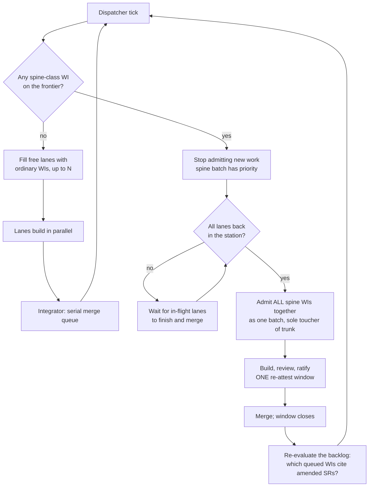

# Constraints over checks — concurrency, spine authority, and work-item state

> **STATUS: DESIGN DRAFT — nothing here is ruled.** Working surface opened
> 2026-07-31 after a session ran two work items in parallel by hand and
> surfaced problems that were not really about concurrency. The draft rows in
> [`docs/work/deferred/`](work/deferred/) point here; **none should be
> claimed** until this settles. Precedent for the shape:
> [`concurrency-restructure.md`](concurrency-restructure.md).

## 0. The governing principle (owner framing, 2026-07-31)

> *"A lot of the previous moth-balling was due to constraining the overall
> system and building checks instead of building constraints that would have
> prevented the bad behavior in the first place."*

Prefer **structure that makes a bad state unrepresentable** over **a check
that detects it after the fact**. Every section below is an application; each
proposal is judged first by whether it *removes* machinery.

**Worked example, found while drafting this.** The `archive/` folder holds
both terminal states, so a `disposition = "retired"` frontmatter key
disambiguates it — and `parse_spec_status()` exists to verify the attribute
and the folder agree, raising on "unknown disposition" and on "a retired spec
outside archive/". One folder too few produced: an attribute, a validator, two
error paths, and its tests. **Splitting the folder deletes all of it.** That is
the shape to look for everywhere else.

**Why this keeps happening — a structural answer, not a character one.** The
2026-07-28 audit already found enforcement-layer growth to be the repo's
dominant failure mode, and Phase 5 then deleted 4,042 lines, so this is not
aversion to architectural change. The likelier cause is an **incentive
gradient**: a check fits inside the scope of the WI that discovered the
problem, while a constraint usually needs a schema or flow change that crosses
WI boundaries and may owe an attestation. Every local decision to add a check
is individually correct; the aggregate is enforcement-layer growth. If that
diagnosis is right, the fix is procedural — ask *"what constraint would make
this unrepresentable?"* at **filing** time, where the cost is still comparable,
rather than at review time when only the check is in scope.

---

# Workstream A — concurrency and spine authority

## A1. Vocabulary

| Term | Owns | Exists today |
|---|---|---|
| **Driver** | Sequencing **within one lane**: next WI → claim → build → merge → repeat | Yes — [`drive.py`](../project-trajectory/scripts/drive.py) |
| **Dispatcher** | Allocation **across lanes**: how many run at once, what each gets, when the spine batch is admitted | **No** — deleted at Phase 5 |

**Open question A:** separate modules, or dispatcher as a driver mode? At
`lanes = 1` the dispatcher is a no-op.

## A2. How the dispatcher operates

Spine work is **not refused** — it waits for the station to clear, then runs
alone.



Properties this gives, none of which hold today: spine work is **exclusive**,
**batched** (N spine changes = one window, one owner sitting), and
**prioritised** (drains rather than starving).

**Constraint, not check:** `schedule.py` already classifies
`spine|gate|attestation → serial-whole-project`, but `_disposition()` still
returns `ready` for those rows and the only enforcement is `integrate.py`'s
blunt refusal. Making the frontier itself withhold a spine WI until lanes are
empty is a constraint; the current refusal is a check.

**Open question B:** what admits the batch — the dispatcher (can wait) or a
claim rung (can only refuse)?

## A3. What counts as a spine touch — OWNER RULING 2026-07-31

> Only what is **ratified** matters. Ratification is on change of **scope**,
> defined by the **prose and the relevant field attributes**. Traceability —
> the `Module` pointer and its kin — is *traced*, not ratified, and must **not**
> count as a spine touch.

The detector violates this. `check_trajectory.staged_spine_findings` compares
every column except `Status`:

```python
changed = sorted(k for k in set(head) | set(row)
                 if k != "Status" and (head.get(k) or "") != (row.get(k) or ""))
```

So `Module`, `CodeSymbol`, `TestRefs`, `Component` and `Phase` arm the
re-attest warn as if requirement prose had changed. **That is what happened on
WI-280**: 19 LLR `Module` cells followed code that moved → 11 owning SRs to
`Modified` → gate G3→G2 → a ratify brief and four review rounds, for a change
that altered no requirement. Under this ruling **that window should never have
opened.**

**Open question C — the cell split.** First cut; the `?` rows need the owner's
line:

| Registry | Ratified (arms the warn) | Traced (must not) |
|---|---|---|
| SR | `Title`, `Requirement`, `Rationale`, `AcceptanceCriteria`, `Permutations`, `Priority`, `Verification` | `SN-Refs`?, `Phase`, `Area`, `Lifecycle` |
| LLR | `Title`, `Detail`, `Rationale` | `Module`, `CodeSymbol`, `TestRefs`, `Component`, `Phase` |
| TC | `Method`, `Expected`, `Parameters`, `Level`, `Tier` | `Verifies`?, `Evidence`, `Automated`, `Phase` |

`SN-Refs` changes what a requirement answers to; `Verifies` changes what a test
claims to cover. Both smell like scope.

## A4. Grouping and the bar

The bar is ~11 minutes (measured 2026-07-31: 634 s is `tests+coverage`; the
other nineteen steps total ~25 s). Three WIs singly = three bars.

**What actually fails**, from this session's seven WIs:

| Class | What | Seen | Attributable without bisecting? |
|---|---|---|---|
| A. Product code wrong | the WI's own code is broken | **0 at merge** | yes |
| B. Registration incomplete | code fine, a spine/census/ratchet row missing | WI-374, WI-280 | **yes** — the bar names check and row |
| C. Composition | two greens, red together | **0 observed** | **no** — needs bisecting |
| D. Pre-existing rot | exposed, not caused | WI-280 | yes — reproduces at trunk |
| E. Merge conflict | textual | WI-280 ×2, WI-277 ×1 | yes — before the bar |
| F. Gate refusal | verdict freshness | WI-280 ×2 | yes — not a work failure |

The composed bar **never caught broken product code** — each builder's own
close bar caught it first. So the merge bar's realistic job is composition and
registration, and most reds name their own cause.

| Knob | Groups | Failure coupling |
|---|---|---|
| **Session grouping** (retired traincar) | N WIs into one session | High — one bad WI reds the car; recorded history 19 reservations → 8 integrations → **0** gate-verified |
| **Drain grouping** | N *finished branches*, barred once | Medium — red needs bisecting; fall back to per-branch on red |

**Drain grouping wins twice:** it gets 3-bars-into-1 without session
grouping's coupling, *and* it is the only configuration that can catch Class C
at all — a per-branch bar is structurally blind to interaction failures.

**Open question D:** is session grouping wanted once drain grouping exists? If
not, remove the vestigial plumbing — `schedule.py` still classifies for
"optimistic multi-WI packing", `agent_loop --wi` still accepts
`'WI-201;WI-204'`, the §7 continuation guard still runs, but **nothing packs**.

## A5. Backlog re-evaluation after re-attest

A verdict goes stale when the tree moves; a **WI's premise** goes stale when a
cited SR is amended. The first is mechanized (`_verdict_gate`); the second is
**not checked at all** — `SR-Refs` is only ever tested for *existence*.

If re-attest means scope changed, every open WI citing an amended SR may be
mis-scoped or obsolete, and today it will be claimed and built as if nothing
happened. Cheap to detect with machinery that already exists (`ratify_check`
and `_verdict_gate` both do git-derived staleness). **Warn, not gate** — a
scope change means *re-read*, and gating would strand the backlog on every
ratification. Fires at the §A2 flow's final step.

**Depends on A3:** without the cell split this warns constantly on WIs whose
premise never changed — noise that gets it switched off.

---

# Workstream B — work-item state

## B1. The duplication

Status **is** the folder — except `archive/`, which holds two terminal states
and therefore needs a `disposition` attribute plus a validator to keep them
honest. That is the only reason the attribute exists.

## B2. The proposed model (owner, 2026-07-31)

| Before | After |
|---|---|
| `queued`, `active`, `deferred`, `archive` (+ `disposition`) | `draft`, `queued`, `active`, `deferred`, `cancelled`, `complete` |

- **`draft/`** — written down, **not claimable**. Today there is nowhere honest
  to put thinking-in-progress; `deferred` reads as *a decision*. (These very
  rows sit in `deferred/` for want of it.)
- **`cancelled/`** replaces `retired`, which is ambiguous — it can read as
  *finished and put out to pasture*. "Cancelled" cannot.
- **`complete/`** replaces the done half of `archive/`.

**What this removes:** the `disposition` key, `parse_spec_status()`'s
attribute/folder cross-check, its two raise paths, and their tests. State
becomes *unrepresentably* inconsistent rather than checked-for-consistency.
This is §0's principle applied.

**Specs mirror it.** A closed WI's spec-of-record moves to the folder matching
its terminal state rather than a single `docs/archive/specs/`, so a spec's
location answers "did this ship or was it cancelled?" without opening it.

**Cost, stated honestly:** `SPEC_STATUS_DIRS` is triplicated across the three
F5 readers (`agent_common.py`, `check_trajectory.py`, `schedule.py` — 3/4/3
references), plus `wi_convert.py`, the scheduler's terminal-state logic, and
tests. The driver must treat `draft` as never-ready. Existing `archive/` rows
migrate by disposition. Downstream repos owe a migration step.

**Open question F:** is `draft/` worth its share of that cost? This session
says yes, but one session is one data point.

---

## Open questions, collected

- **A.** Driver and dispatcher — one module or two?
- **B.** What admits the spine batch — dispatcher (waits) or claim rung (refuses)?
- **C.** The ratified-vs-traced cell split, incl. `SN-Refs` and `Verifies`.
- **D.** Session grouping once drain grouping exists — keep, or remove the plumbing?
- **E.** Default lane count. (The bar is CPU-capped at 50%, so two concurrent bars contend — lanes and bar cost are coupled.)
- **F.** Does `draft/` earn the schema change?

## Provisional breakdown — NOT solidified

All in [`docs/work/deferred/`](work/deferred/), all pointing here.

| Draft | Scope | Removes machinery? | Blocked on |
|---|---|---|---|
| **WI-380** | Ratified-vs-traced cell split (A3) | narrows a check | C |
| **WI-381** | Spine barrier: batch, priority, wait (A2) | replaces a refusal with a constraint | A, B |
| **WI-382** | Drain grouping: one composed bar (A4) | — (adds capability) | D |
| **WI-383** | Driver/dispatcher vocabulary + grouping disposition (A1, A4) | **yes** — deletes vestigial packing plumbing | A, D |
| **WI-384** | Six-state model, `disposition` deleted (B) | **yes** — attribute + validator + tests | F |
| **WI-385** | Backlog re-evaluation after re-attest (A5) | — (adds a warn) | A3 |

**Sequencing:** **WI-380 first**, regardless of how the rest resolves — small,
already ruled, and it removes most of the pain WI-381/385 are designed around.
**WI-384 is the cleanest test of §0's principle** and is independent of the
concurrency work, so it can proceed in parallel with the design discussion.
