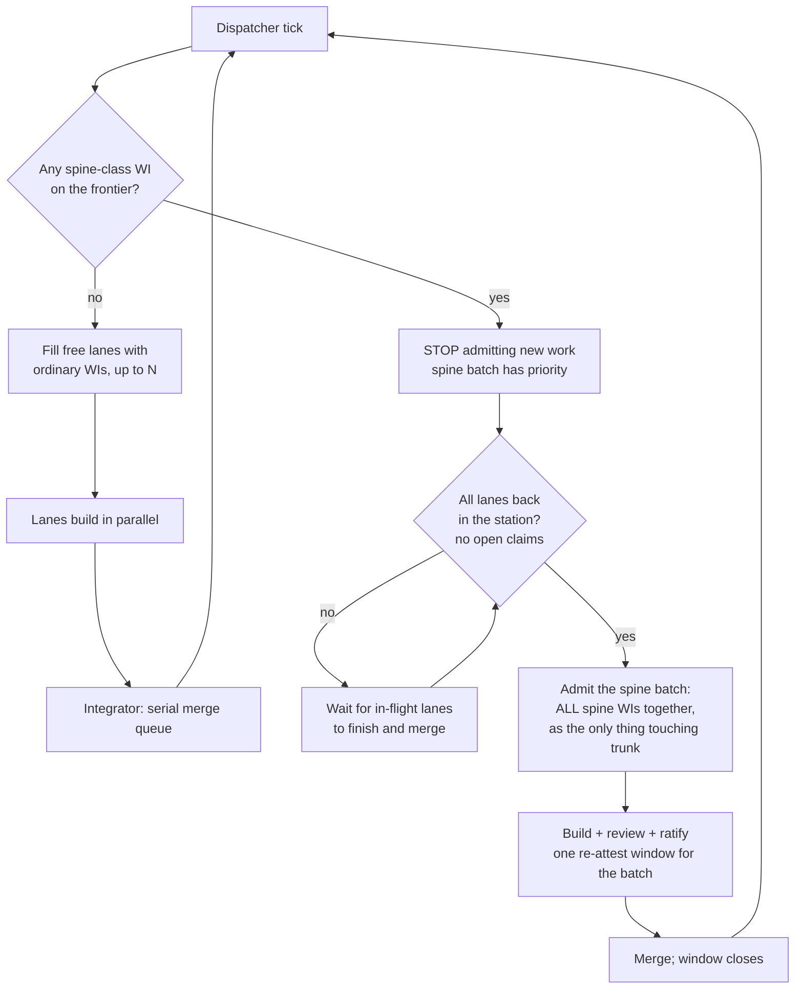

# Concurrency v2 — the dispatcher, the spine barrier, and what is ratified

> **STATUS: DESIGN DRAFT — nothing here is ruled.** This is the working
> surface for the concurrency discussion opened 2026-07-31, after a session
> ran two work items in parallel by hand and surfaced three separate
> problems. The draft WI rows in [`docs/work/deferred/`](work/deferred/)
> point here; **none should be claimed** until this doc is settled and the
> breakdown is solidified. Precedent for this shape:
> [`concurrency-restructure.md`](concurrency-restructure.md), which ran the
> same way before becoming a phased program.

## Why this exists

The 2026-07-31 session claimed WI-280 and WI-277 at once (03:07 and 04:50)
and merged them serially (09:49, 11:25). Nothing broke, but three things
surfaced that the current design does not handle:

1. **A spine-touching WI ran concurrently with other work** — under a
   declared `safety_class = "ordinary"` that was honest at filing and wrong
   by the time the work revealed itself.
2. **The re-attest window it opened cost four review rounds**, two of them
   bought by the freshness gate re-arming (recorded as WI-378).
3. **That window should probably never have opened at all** — see §3.

## 1. The vocabulary (proposed, needs agreement)

The session's confusion came from collapsing two roles. Keeping them
separate is the first thing to agree:

| Term | Owns | Exists today |
|---|---|---|
| **Driver** | Sequencing **within one lane**: next WI → claim → build → merge → repeat. No concurrency decisions. | Yes — [`drive.py`](../project-trajectory/scripts/drive.py) |
| **Dispatcher** | Allocation **across lanes**: how many run at once, what each gets, and when the spine batch is admitted. | **No** — deleted with the v4 dispatcher at Phase 5 |

**Open question A:** do these stay separate modules, or is the dispatcher a
mode of the driver? The owner has questioned whether the split is worth it.
Argument for one module: at `lanes = 1` the dispatcher is a no-op, and two
modules means two things to reason about. Argument for two: the driver is
proven and small; concurrency logic is where the last dispatcher died.

## 2. How the dispatcher should operate

The owner's model, stated as a flow. **Spine work is not refused — it
waits for the station to clear, then runs alone.**



Three properties this gives, none of which hold today:

- **Spine work is exclusive**, so no other WI's scope can shift underneath it.
- **Spine work batches**, so N spine changes cost **one** re-attest window
  and one owner sitting, not N.
- **Spine work has priority**, so it drains rather than starving behind a
  queue of ordinary work.

**What already exists:** `schedule.py` classifies
`spine|gate|attestation → serial-whole-project` and
`protected → protected-serial`. **What is missing:** anything that acts on
it. `_disposition()` still returns `ready` for those rows, and the only
enforcement is `integrate.py`'s blunt *"claims ordinary work only"* refusal —
which is a hard stop, not a wait. So this is largely making an existing
declaration true, not new machinery.

**Open question B:** what admits the spine batch — the dispatcher (which
knows lane state) or a claim rung (which is where every other refusal
lives)? A claim rung cannot *wait*, only refuse; waiting needs the
dispatcher.

## 3. What counts as a spine touch (OWNER RULING 2026-07-31)

> Only what is **ratified** matters. The owner ratifies the spine on change
> of **scope**, which is defined by the **prose and the relevant field
> attributes**. Traceability — the `Module` pointer and its kin — is *traced*,
> not ratified, and must **not** count as a spine touch.

**The current detector violates this.** `check_trajectory.staged_spine_findings`
compares every column except `Status`:

```python
changed = sorted(k for k in set(head) | set(row)
                 if k != "Status" and (head.get(k) or "") != (row.get(k) or ""))
```

So `Module`, `CodeSymbol`, `TestRefs`, `Component` and `Phase` arm the
post-attestation amendment warn exactly as if the requirement text had
changed. That is what happened on WI-280: 19 LLR `Module` cells followed
code that moved, which forced 11 owning SRs to `Modified`, which dropped the
gate G3→G2, which cost a ratify brief and four review rounds.

**Under this ruling, that window should never have opened.** Fixing the
detector therefore does three jobs at once: it stops spurious re-attests, it
removes most of WI-378's pain, and it makes the §2 barrier cheap — because a
decomposition stops counting as spine work.

**Open question C:** the exact cell split per registry. First cut:

| Registry | Ratified (arms the warn) | Traced (must not) |
|---|---|---|
| SR | `Title`, `Requirement`, `Rationale`, `AcceptanceCriteria`, `Permutations`, `Priority`, `Verification` | `SN-Refs`?, `Phase`, `Area`, `Lifecycle` |
| LLR | `Title`, `Detail`, `Rationale` | `Module`, `CodeSymbol`, `TestRefs`, `Component`, `Phase` |
| TC | `Method`, `Expected`, `Parameters`, `Level`, `Tier` | `Verifies`, `Evidence`, `Automated`, `Phase` |

The `?` cells are genuinely arguable: `SN-Refs` changes *what the requirement
answers to*, which smells like scope. `Verifies` changes what a test claims
to cover. These need the owner's line, not mine.

## 4. Grouping, and the bar-amortisation problem

The owner's objection to one-WI-at-a-time is quantitative and correct: the
gate bar is ~11 minutes (measured 2026-07-31: 634 s of it is
`tests+coverage`; all nineteen other steps total ~25 s). Three WIs handled
singly cost **three** bars; grouped, they cost **one**.

**The synthesis worth considering: you do not need multi-WI *sessions* to get
that.** The bar is paid at *integration*, not at build. Two independent
knobs:

| Knob | What it groups | Cost | Failure coupling |
|---|---|---|---|
| **Session grouping** (the retired traincar) | N WIs into one worker session | Complex — this is what the deleted dispatcher did, with a recorded 19 reservations → 8 integrations → **0** gate-verified | High: one bad WI reds the whole car, and the session must unwind it |
| **Drain grouping** (integrator composes) | N *finished branches* onto one candidate, barred **once** | Small — a loop change in `integrate.py`, already listed as a Q2 speed lever | Medium: a red bar needs bisecting; mitigate by falling back to per-branch barring on red |

**Drain grouping gets the 3-bars-to-1 win without session grouping's
failure coupling**, because each WI is still built and reviewed
independently — only the *bar* is shared. That looks like the better trade,
and it is strictly smaller.

**Open question D:** is session grouping wanted at all once drain grouping
exists? If not, the vestigial plumbing should be removed or formally marked
dormant — today `schedule.py` still classifies for "optimistic multi-WI
packing", `agent_loop --wi` still accepts `'WI-201;WI-204'`, and the §7
continuation guard still exists, but **nothing packs**. Capability that looks
present and isn't is the worst of the three states.

## 5. A `draft` status for work items (gap)

There is no way to file a work item that is *not yet ready to be claimed*.
The status directories are `queued`, `active`, `deferred`, `archive`;
`deferred` means "parked with a reason", which is the closest fit but reads
as a decision rather than as work-in-progress thinking. The rows for this
design are in `deferred/` for that reason, and say so.

Adding `draft/` is a real schema change: `SPEC_STATUS_DIRS` is duplicated
across three F5 readers (`schedule.py`, `check_trajectory.py`,
`agent_common.py`), plus `wi_convert.py` and their tests. Worth doing if the
"write it down before it is claimable" need is recurring — which this session
suggests it is.

## Open questions, collected

- **A.** Driver and dispatcher: one module or two?
- **B.** What admits the spine batch — dispatcher (can wait) or claim rung (can only refuse)?
- **C.** The exact ratified-vs-traced cell split, including `SN-Refs` and `Verifies`.
- **D.** Is session grouping wanted once drain grouping exists? If not, remove or dormant-mark the plumbing.
- **E.** How many lanes by default? (The bar is CPU-capped at 50%, so two concurrent bars contend — lane count and bar cost are coupled.)
- **F.** Does `draft/` earn its schema change?

## Provisional WI breakdown — NOT solidified

Draft rows in [`docs/work/deferred/`](work/deferred/), all pointing here:

| Draft | Scope | Depends on |
|---|---|---|
| WI-380 | Ratified-vs-traced cell split in the amendment detector (§3) | Question C |
| WI-381 | Spine barrier: batch, priority, wait-for-station (§2) | Questions A, B |
| WI-382 | Drain grouping: one composed bar per drain (§4) | Question D |
| WI-383 | Driver/dispatcher vocabulary + grouping disposition (§1, §4) | Questions A, D |
| WI-384 | `draft/` work-item status (§5) | Question F |

**Sequencing note:** WI-380 (§3) is the one that should land first regardless
of how the rest resolves — it is small, it is already ruled, and it removes
most of the pain the others are designed around.
