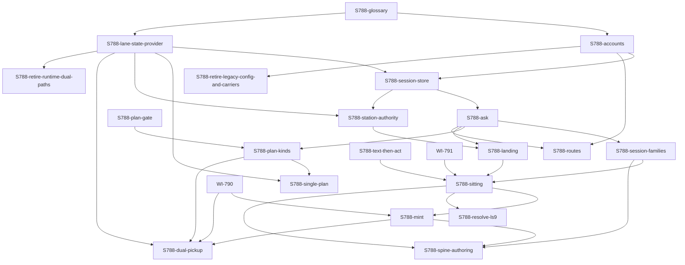

# WI-788 design note (half 1): the owner's checkpoint

The design note for [WI-788](../../work/active/wi-788/WI-788-provider-homes-and-new-routes.md),
drafted 2026-10-04 on lane `wi-788` at base `c3be7be0`. **Nothing here is built.**
The owner rules on it before any successor row is filed. Four chapters (B12):

1. [State, evidence and recovery](1-state-evidence-recovery.md) (ch.1): the lane-state provider `lane_state`.
2. [Sessions, routing and accounts](2-sessions-routing-accounts.md) (ch.2): `ask(kind, ...)`, session families, accounts, routes, U1.
3. [Planning and tiering](3-planning-tiering.md) (ch.3): the two plan products, selection, the tier dial.
4. [Adjudication, mint and landing authority](4-adjudication-mint-landing.md) (ch.4): the station authority, the sitting, the one landing.

**How to read it.** Read this page, then answer the
[questions](#questions-for-the-owner-at-the-checkpoint); open a chapter only at
the section a question names. Each chapter keeps its own matrix, rows and
research record. Where a chapter and this page differ, this page wins.

## What this note decides

- **A lane's state is derived, never stored** (B1). `lane_state` computes it from
  committed evidence and live ownership; committed records carry only decisions.
  `MERGE` is read from trunk's tree, `ARCHIVE` from `archive/lanes`, refs and the
  worktree list. Today's flow moves onto the provider first, unchanged.
- **One labelled entry point, `ask(kind, ...)`**, launches every model call, from
  the loop and from the coordinator (`ask.py`). It owns tier, exclusion by
  recorded authors, retention before the ratio, availability, the lease, durable
  invocation records, the log and the decisions note. A caller names only a kind.
- **Five session families with declared reset terms.** Adjudication and its review
  ship retained (`context_reset_pct = 55`); builders ship "every call"; reviewers
  and judges are never retained. One untracked store, `out/sessions/store.toml`.
- **Accounts, not duplicated rows**: `[account.<ID>]`, `ROUTE@ACCOUNT`, homes
  outside every checkout. Grok and FreeLLMAPI run through OpenCode; Gemini is
  documented and untested. Every route records `verified`; none untested is
  enabled by default.
- **One station authority** (a fenced lease) is the tool's only way to trunk;
  every ref advance is a compare-and-swap inside it. Claims move lane-side,
  every mint moves into `ADJUDICATION.MINT`, keep-warm and telemetry go through a
  spool, coordinator writes go through a station lane, and `out/integrate.lock`
  retires. Only the owner's own commits are outside the tool.
- **The sitting runs in the lane**: `LOCK`, `REFRESH`, `RESOLVE` (the adjudicator's
  call is final), `JUDGE` (acts on a recorded scope), `MINT` (every item consumed),
  `MERGE_ACTION`; then the final review, regeneration and bar on the final tree;
  then one landing per lane, on both paths (one squash commit for a single-item
  lane; an act-taking lane lands as one squash too, by the owner's Q-8 answer; the batched case is Q-11). A fourth sitting that
  owes a return ends `merge-partial` with a successor; nothing red lands.
- **Spine text before act**, enforced in the lane (a landing squash is not held to it, owner Q-8; a direct trunk commit is). The adjudicator drafts, the
  adjudication reviewer edits, the adjudicator's unchanged final pass is the act.
- **Planning has two products.** A decomposition is selected by its drafters (no
  arbiter call recommended; a PAGE closes the parent `partial` and mints a
  successor that waits on the owner); an implementation plan is declared, or triggered at
  the second consecutive CHANGES-REQUESTED with the swap. A plan gate checks
  Done-when, SR and TC coverage. The OI-103 Q5 dial ships off.
- **Risk 7:** eighteen dual paths, each retired or justified (ch.1 §7).
- **The build:** twenty successor rows in [one graph](#the-dependency-graph-of-successor-rows),
  each with its own RESYNC entry.

### How the locks and the lease compose

One order everywhere: the process's own `out/agent-loop.lock`, then the session
leases, then the station authority, then the millisecond store locks (ch.4 §2).
**Nothing waits while holding the authority** (OI-103 Q2). A sitting first takes
its [adjudicate] and [adjudication review] leases, waiting up to 1200 s while
holding nothing else (ch.2 §3 step 5); then it tries the authority once, without
waiting, and on failure releases the leases and tries again on a later tick.
Under the authority every acquisition is one non-blocking try, and a lease found
busy (a keep-warm ping) gives that call a fresh, non-replacing session at once.
Nothing holding the authority waits, so no cycle can form. Every wait runs in the
worker's own process, never in the dispatcher's tick or the landing. Every tool
ref advance re-checks the authority's generation and swaps the ref inside one
critical section, so an expired or cancelled holder cannot land.

## Rulings carried

| Binding input | Settled in |
|---|---|
| Done-when 1, per provider: CLI, version, auth, home, free plan, stream | ch.2 §5; probes ch.2 §1 |
| Done-when 1: one route, one account; second account without duplicate rows | ch.2 §4 |
| Done-when 1: OpenCode config for FreeLLMAPI, per route, out of the tree | ch.2 §5 |
| Done-when 1: tested vs untested, never enabled by default; spine impact | ch.2 §5 (`verified`); [matrix](#the-amend--preserve--retire-matrix) |
| OI-101 Q1, Q2 (final pass is the act, 3 rounds; risk 6, its trunk scope amended for landings by the owner's Q-8 answer) | ch.4 §7; Q-8 |
| OI-101 Q3, Q4 (OpenCode routes, free-model row; probe OpenCode, Google from docs) | ch.2 §1, §5 (no `opencode/*-free` row); gap below |
| OI-101 Q5, Q6 (kit glossary; S11 §6 as ruled) | [glossary](#glossary-draft); ch.4, changes 4-6 |
| OI-103 Q1, Q2 (no tool write to trunk but a merge; never wait) | ch.4 §2, §3, §4.3, §5 |
| OI-103 Q3, Q4 (final call; one squash, tip archived) | ch.4 §4.1, §6; ch.1 §1; Q4 against OI-101 Q2 is Q-8, and batched lanes are Q-11 |
| OI-103 Q5, Q6 (tier dial; agent-judged recovery and U1 harvest) | ch.3 §4.8; ch.1 §5-§6, ch.2 §6 |
| Risks 1-5 (store; family from records; retention first; no occupancy; lease) | ch.2 §4; §3 steps 2, 3, 5; §2; [composition](#how-the-locks-and-the-lease-compose) |
| Risks 6-9 (text then act; no fallback modes; the coordinator on `ask`; RESYNC is the migration) | ch.4 §7; ch.1 §7, ch.2 §7; ch.2 §3, ch.4 §6; graph's RESYNC rule |
| LS1, LS2 | ch.1 §1-§2 (B1 supersedes LS1's stored record), ch.1 §4 |
| LS3 | superseded by OI-103 Q5 (ch.3 §4.8) |
| LS4-LS9 (lock; resolve; mint; merge action; rulings; stance) | ch.4 §2, §4.1, §4.3, §4.4, §8 (and ch.3 §4.8), §9 |
| LS10 (resume: state, session, per-CLI probes) | ch.1 §6; ch.2 §1, §3 step 6 |
| U1 | ch.2 §6; ch.1 §5 "The U1 hook" |
| B1, B2 / B3, B4 / B5, B6 | ch.1 §1 (B2 changed, change 19) / ch.4 §2-§3 / ch.4 §5 |
| B7, B8 / B9 / B10 | ch.3 §4.1, §4.6 (B8 superseded by Q5) / ch.2 §3 step 6, ch.1 §6 / ch.2 §3 step 2, ch.4 §5, §7 |
| B11, B12 | applied throughout (`ask` / `lane_state` split: ch.2 §3); this page |
| Second-pass retention defaults; gap 2 (every brief kind); gaps 3-4 (one entry) | ch.2 §2, §3 |
| 2026-10-03 scope: families, glossary, spine authoring as an option | ch.2 §2; glossary; ch.4 §7 (OI-101 Q1 wins, B11) |
| 2026-10-04 plan kinds: arbiter options, kinds, pickup, per-item planning | ch.3 §4.3-§4.7 |
| Delegated decisions: note on every path, check at every landing, the gap | ch.2 §3 step 8; ch.4 §6 |
| Half 2's bullets (routes, Google adapter, homes, spine rows, fixtures, RESYNC, no forced install) | S788-accounts, S788-routes, every row's RESYNC |

**Gaps, named.**
- **OI-101 Q4 against LS10.** Chapter 2 also live-probed claude and codex (resume
  by id from another directory; a few cents), because LS10, the later
  instruction, asks for that probe of each CLI. Gemini was not probed.
- **Unprobed, each assigned:** F1 (a killed refresh) and F2 (an incomplete
  unload) are S788-landing's Done-when; F3 (`refs/stash` across worktrees) is
  probed by S788-lane-state-provider's fixture; the Windows lock probe stays
  UNVERIFIED (the dispatcher passes its handles instead). The provider contracts
  and the live checks still owed are tabled in ch.2 §5. **Hand-path liveness**
  is unknown until `ask.py` lands.

## Changes to existing rulings

1. **S10 "reviewers never"**: narrowed; the adjudication reviewer is retained (ch.2 §2).
2. **OI-69 "the dial is the owner's act"**: the template ships retention on (owner's second pass); this repo's dial stays the owner's (ch.2 §2).
3. **OI-69 (e1)**: per-family homes become per-account homes, retained or not (ch.2 §4).
4. **S11 §4.6**: the "fresh cross-family review of the act" becomes the retained adjudication reviewer (ch.2 §2); "the adjudicator edits no cell" yields, for spine text only, to "the adjudicator drafts" (ch.4 §7).
5. **S11 §4.1's freshness rung**: replaced by the authority once every writer is covered (ch.4 §2, §8).
6. **S11 §4.2, §4.7, step 9, the post-merge mint**: a drift reading; ADJUDICATE ranges widen to MINT writes, resolutions and `author` ranges; a squash; the mint before the merge (ch.4 §8).
7. **R1 and the slot's mint and act refusals**: "only a lane in `ADJUDICATION`, under the authority, mints or acts" (ch.4 §8; LS8 confirmed).
8. **The 2026-09-01 division of labour** (acts trunk-side): acts move into the lane, still serial through the authority (ch.4 §7-§8).
9. **"An adjudication runs alone"** (LLR-149, LLR-152): replaced by the authority (ch.4 §8).
10. **SR-170's "serial merge step"**: "under the station authority, on the tree that lands" (ch.4 §3).
11. **RULING-6's audit**: a landing commit whose tree equals its `Lane-Tip`'s attested tree (ch.4 §6).
12. **RULING-7's verdict gate**: a CHANGES-REQUESTED is cleared by a recorded resolution (ch.4 §4.1).
13. **"Amend-plus-flip is approval"**: retired everywhere, with PROCESS.md:488 and "re-attest it in this commit" (ch.4 §7).
14. **The amendment brief's "a judge never amends the row it judges"**: draft, commit alone, approve only on a later unchanged pass (ch.4 §7).
15. **The independence rule's exceptions**: B10's non-mutating final pass (ch.4 §7) and, under Q-5 (a), the losing drafter's concession (ch.3 §4.4).
16. **The BuildTier pin and "never downgrade a declared route"**: one sanctioned exception, the Q5 dial (ch.3 §4.8).
17. **LLR-081's ladder**: the swap carries a replan (ch.3 §4.7).
18. **PROCESS_OPTIONS' dual-plan layer and SR-155**: drafter selection, a park instead of a same-family pair, no manual fallback, rounds only in a lane (ch.3 §4.10).
19. **B2's "MERGE from ancestry"**: from trunk's tree; `Lane-Tip:` is the audit's link only, never a state input (ch.1 §1, ch.4 §6).
20. **LS10**: "same commit" superseded by B1; "today's refresh resets" corrected (it refuses a dirty lane); claude's fixed-directory expectation refuted (ch.1 §6, ch.2 §1).
21. **IF-045 "a second account is a second row"**: retired; OpenCode rows' `family` becomes the trainer (ch.2 §4-§5).
22. **`retain_for`**: retired; `rejudge` moves to [judge] (ch.2 §2).
23. **LS4 "LOCK takes the lease and holds the merge slot"**: the leases, then the authority by one non-blocking try, nothing waited for under it; `out/integrate.lock` retires (ch.4 §2).
24. **LS9's wording** in the rework brief, the reviewer brief (`[ADVICE]`) and `AGENTS.template.md`'s retry rule (ch.4 §9).
25. **The coordinator's hand path to trunk**: a coordinator is an agent, so its trunk writes (filing, rulings records, status, log fragments) go through a station lane; only the owner's commits stay outside the tool. The pause file is Q-12 (ch.4 §2-§3).
26. **Pending the owner, not settled here:** OI-103 Q4's "per item" for batched lanes (Q-11).
27. **OI-101 Q2's trunk scope** (owner, 2026-10-04, Q-8): the text-then-act rule is enforced in the lane (the hook, and the landing's re-check of each lane commit); a lane's landing is one squash commit, not held to it (ch.4 §7).

## Glossary draft

Proposed text for `project-trajectory/GLOSSARY.md` (OI-101 Q5), linked from
PROCESS.md and shipped by S788-glossary. One term per concept; it retires the
"adjudicator vs retained adjudicator" split.

> **ask.** The one labelled entry point for a model call, `ask(kind, ...)` or `ask.py`. It picks tier, family, route, account and session; a caller names only the kind.
>
> **kind.** An `ask` label: build, plan, review, plan-critique, judge, adjudicate, author or author-review. Each belongs to one session family.
>
> **session family.** Kinds that share one retention slot and one independence rule: [plan and build], [adjudicate], [adjudication review], [review], [judge].
>
> **independence.** A judgement never runs in a session that authored what it judges (B10's non-mutating final pass excepted). Other families are ranked preferences, dropped only when the enabled pool cannot meet them, each unmet one recorded.
>
> **reset terms.** The declared conditions under which a family's next call starts a fresh session. "Every call" is a value of the terms, not a second path.
>
> **adjudicator.** The role that rules on spine rows, disputes and dispositions and takes the approval act, performed by an [adjudicate] session retained until its reset terms are met.
>
> **adjudication reviewer.** The [adjudication review] session that edits the adjudicator's spine drafts and reviews a sitting's writes; never the adjudicator's session, preferably another family than the adjudicator's, then than the builders'.
>
> **reviewer.** A [review] session judging a build round or a plan; never retained, never a recorded author of what it reviews.
>
> **judge.** A [judge] session that re-judges a recorded observation; never retained. Not `JUDGE`, the sitting substate in which the adjudicator acts.
>
> **arbiter.** Whoever selects among rival plans in `ARBITRATION`: under the recommended protocol, the drafters, by concession; never one drafter's vote for its own plan alone.
>
> **independent adjudicator.** The adjudicator role called through `ask.py` by a person's coordinating session; same family and rules, not a separate role.
>
> **lane state.** `PLANNING`, `BUILD`, `REVIEW_REWORK`, `ADJUDICATION`, `MERGE` or `ARCHIVE`, derived from evidence, never stored. **Substates:** `SINGLE`, `DUAL` (`DRAFT`, `CROSS_CRITIQUE`, `ARBITRATION`); `LOCK`, `REFRESH`, `RESOLVE`, `JUDGE`, `MINT`, `MERGE_ACTION`. **Condition:** a fact reported beside the state, such as `PARKED`.
>
> **decision record.** A committed decision (outcome, verdict, resolution, merge action), never a claim that a process or lock is live.
>
> **station authority.** The one fenced lease every tool write to trunk takes.
>
> **sitting.** A lane's `ADJUDICATION` under the authority. Its **sitting record** holds `[resolution]`, `[consumption]` and `[merge_action]`; its **scope record** lists the rows it may act on.
>
> **consumption list.** Every item a sitting must dispose of: open item, decision, successor or no-action.
>
> **merge action.** `merge`, `merge-partial`, `cancel` or `return`.
>
> **landing.** The one squash commit per work item; the lane tip is kept on `archive/lanes`.
>
> **account.** A declared login of one CLI with its own **home** outside every checkout; `ROUTE@ACCOUNT` runs under it.
>
> **implementation plan / decomposition.** `PLANNING`'s two products: a plan leading to `BUILD`, and a rival-plan round yielding successor rows.

## The amend / preserve / retire matrix

Merged from the four chapters' matrices; **resolved** marks a disagreement settled here.

| Item | Fate | Successor |
|---|---|---|
| SR-156 | preserve. **Resolved** (ch.1 preserve, ch.4 amend): its text names no merge form or lock (R2), and recovery still reads version control alone | — |
| SR-140/144/148/174/179/207/208/209, LLR-073/283/290, SN-024/026, IF-064/101/137/220/266, TC-293 | preserve | — |
| SR-173, LLR-220 (from Sol's inventory) | preserve: regeneration stays ordered and all-or-nothing, now at the final evidence; assumptions and surrogates stay inside the act | — |
| LLR-137 | amend: `trunk_step` runs lane-side under the authority and appends the ledger | S788-station-authority, S788-session-store |
| LLR-246 | amend: its writers move (claim, `commit_telemetry`, `_mint`); the held-status refusal applies at each new writer and per lane commit | S788-station-authority, S788-session-store, S788-mint |
| TC-218 | amend: a lane flip is admitted only in an eligible ADJUDICATE range | S788-sitting |
| IF-123, IF-228 | amend: drift and `checkpoint_drafts` read at `MINT`, in the lane | S788-mint |
| IF-129 | amend: "re-attest it in this commit" goes | S788-text-then-act |
| IF-242 | amend: `plan_coverage` joins `done_when`'s requestors | S788-plan-gate |
| LLR-140 | amend: `code_symbol`, the rollup window (D10), `--no-ff` | S788-lane-state-provider, S788-retire-runtime-dual-paths, S788-landing |
| LLR-150, LLR-182, IF-136, TC-205 (TC-132/143/144 if a test moves); IF-173; new LLR, IF, TCs for `lane_state` | amend / add | S788-lane-state-provider (IF-173 also S788-landing) |
| SR-027, LLR-029/030, IF-023 (D10-D12) | amend | S788-retire-runtime-dual-paths |
| SR-137 (requirement, AC), SR-139 (AC), LLR-155 (detail, code_symbol), LLR-277 (detail), IF-079 (data): the cells stating D1-D6's dual reads, named in ch.1 §9.1 | amend | S788-retire-legacy-config-and-carriers |
| SR-006, SR-147, LLR-291 | preserve: no cell states a dual read (corrects ch.1's first list) | — |
| TC-253, LLR-058, IF-073 (D9) | amend | WI-790 |
| SR-154 | amend thrice, in `needs` order: exclusion from all authors; planning and the dial; final resolution | S788-ask, S788-single-plan, S788-resolve-ls9 |
| SR-222, LLR-269; SR-225 | amend (ledger, `commits`, `_dp_session`; the note via `ask`, one landing check) | S788-session-store, S788-ask, S788-plan-kinds; S788-landing |
| SR-227, LLR-270, TC-266/267/268/303, IF-247/248, IF-081/155 | amend | S788-session-store, S788-session-families |
| LLR-044, LLR-081, TC-046, TC-084, IF-246; new LLR and IF for `ask` | amend / add | S788-ask (LLR-081, TC-084 also S788-single-plan) |
| LLR-266/267/268, TC-262..265, IF-045, IF-162, IF-245; new LLR for accounts | amend / add | S788-accounts, S788-routes |
| LLR-069, TC-069, IF-057, IF-060 | amend | S788-plan-gate |
| LLR-070/071/076, IF-058, IF-066 | amend | S788-plan-kinds |
| LLR-072 | retire. **Resolved** (ch.2 amend, ch.3 retire) | S788-plan-kinds |
| SR-155, LLR-074/095/096/132, TC-074/097/098, IF-061 | amend | S788-dual-pickup |
| new LLR and TC under SR-154 (the dial) | add | S788-single-plan |
| SR-170, LLR-151; new authority row | amend / add | S788-station-authority |
| LLR-144/149/152/158/161/262/278, SR-178, TC-143/146/153/257/278, IF-091 | amend. **Resolved** (ch.1 preserve, ch.4 amend): the provider slice leaves them; the sitting amends them | S788-sitting |
| SR-215, SR-220, LLR-153/154/255/264, TC-147/148/248/260, IF-090/229/243; new consumption row | amend / add | S788-mint |
| LLR-265, TC-261, IF-244 (`sweep`) | retire | S788-mint |
| LLR-284, TC-294, IF-080, IF-154, IF-186 | amend | S788-landing |
| LLR-173/178/245, TC-167/173; new separation row | amend / add | S788-text-then-act |
| new dispute-resolution row | add | S788-resolve-ls9 |
| `scripts/lane_state.py` (with the authority and its `release` CLI); `scripts/ask.py` | module, add | S788-lane-state-provider, S788-station-authority; S788-ask |
| `kitlib/station.py`, `dispatch`, `lane`, `handback`, `integrate`, `agent_loop`, `kitlib/verdict`, `test_import_layers` | module, amend | S788-lane-state-provider, then ch.4 rows |
| `session_service`, `session_keep`, `session_adapters`, `agent_route`, `trunk_step`; the `plan_*` modules; `intake`, `acceptance_record`, `baseline_snapshot`, `bookkeeping`, `consolidate`, `agent_common`, `agent_brief`, `kitlib/decisions`, `hooks/pre-commit` | module, amend | ch.2, ch.3, ch.4 rows |
| `planner_pair`/`planner_fallback`; `_dual_plan_entry`, `--dual-plan`, the preflight refusal; `last_impl_family`, `last_build_family`; `regenerate_index` | module, retire | S788-plan-kinds, S788-dual-pickup, S788-ask, S788-session-store |
| `out/review-owed` | retire | S788-lane-state-provider |
| `out/integrate.lock` | retire. **Resolved** (ch.1 "may fold"): into the authority | S788-station-authority |
| `out/adjudicator/` → `out/sessions/` (store, spool); keep-warm trunk commits; `docs/iteration_index.md` | retire. **Resolved** (ch.4 also scoped the spool): the spool is S788-session-store's | S788-session-store |
| `docs/usage-ledger.csv` | add | S788-session-store |
| `docs/agents.toml`, `agents.template.toml`, `docs/agents-enabled` | amend | S788-accounts, S788-routes |
| `[adjudicator]` → `[sessions.<family>]`; `[planning]`; `[station]` | amend / add | S788-session-families, S788-single-plan, S788-station-authority |
| `docs/id-watermark` `DP` key (frozen); `archive/lanes` (gains its first kit writer) | preserve | S788-dual-pickup; S788-landing |
| `GLOSSARY.md`; `opencode-freellmapi.template.json`; `prompts/plan-single.template.md` | add | S788-glossary, S788-routes, S788-single-plan |
| adjudicate prompts (`-first-approval`, `-amendment`, `-disposition`, `-consolidate` folds into MINT), `reviewer`, `worker:68-71`, the rework brief, `dual-plan-planner` | prompt, amend | S788-sitting, S788-mint, S788-spine-authoring, S788-resolve-ls9, S788-single-plan, S788-plan-kinds |
| `dual-plan-arbiter.template.md` | prompt, retire | S788-plan-kinds |
| PROCESS.md, PROCESS_OPTIONS.md, AGENTS.template.md:172-176, runtime-flows, `wi-lifecycle.html`, registry-machinery-reference, enforcement-audit, cli-reference, concurrency-v2 §A2.0/§A5.2, knowledge packs, the `session-protocol` skill | doc, amend | the row that changes each behaviour; the state names in S788-glossary |
| concurrency-v2 §A4.2 "no state file"; S11 plan §4.1/§4.2/§4.6/§7 | preserve; superseded in part | — |

## The dependency graph of successor rows

This replaces both numbered slice lists in the spec. Every row's test bar is its
affected modules plus the smoke tier at `-n 2`, plus any extra named below, and
every row carries its own RESYNC entry (risk 9). **Review bar:** `A` is one
cross-family REVIEW-A of the code; `A+B` adds an independent REVIEW-B, of
another family where the pool allows, for the backbone rows and the forced
migration. Every row that amends a spine row also passes adjudication of that
row. Each row is landable on its own: its Done-when tests only what it and its
`needs` provide (the writer census waits for the last writer move, S788-dual-pickup).

| Group | Row | Title | needs | Tier | Review | Extra test bar |
|---|---|---|---|---|---|---|
| contracts | S788-glossary | `GLOSSARY.md` and PROCESS.md wording | — | medium | A | `check_docs`, byte budget |
| foundation | S788-accounts | Account tables, per-account homes | glossary | strong | A | scaffold bootstrap; claude login isolation check |
| foundation | S788-lane-state-provider | The provider, representation only | glossary | strong | A+B | a fixture per crash shape (F3 probe) |
| foundation | S788-session-store | Store, invocations, ledger, spool | accounts, lane-state-provider | strong | A+B | per-CLI kill fixtures; usage baselines |
| foundation | S788-ask | One entry point, today's kinds | session-store | strong | A+B | judged-scope tests; one live `ask.py` call (Q-3) |
| foundation | S788-session-families | Families and reset terms | ask | strong | A | — |
| planning | S788-plan-gate | A checkable plan gate | — | medium | A | — |
| planning | S788-plan-kinds | Plan kinds through `ask`; drafter selection | ask, plan-gate | strong | A | — |
| planning | S788-single-plan | Per-item planning, replan, tier dial | plan-kinds, lane-state-provider | strong | A | — |
| adjudication | S788-text-then-act | Risk 6 in the lane (and on direct trunk commits) | — | medium | A+B | — |
| adjudication | S788-station-authority | The authority, claims, cancellation | lane-state-provider, session-store | strong | A+B | — |
| adjudication | S788-landing | One landing per lane; F1, F2; record check | station-authority, ask | strong | A+B | — |
| adjudication | S788-sitting | `LOCK` to `MERGE_ACTION`, final evidence, exhaustion | landing, text-then-act, session-families, WI-791 | strong | A+B | — |
| adjudication | S788-mint | `MINT`, consolidation, station lane | sitting, WI-790 | strong | A+B | — |
| adjudication | S788-resolve-ls9 | `RESOLVE` and LS9 wording | sitting | medium | A | byte budget |
| adjudication | S788-spine-authoring | The OI-101 Q1 flow | sitting, session-families, mint | strong | A+B | — |
| planning, late | S788-dual-pickup | The dual pickup in a lane; the writer census | plan-kinds, lane-state-provider, mint, WI-790 | strong | A | the no-writer-outside-the-landing census |
| routes | S788-routes | FreeLLMAPI, Grok, Gemini untested | accounts, ask | medium | A | one live call (Q-3; the FreeLLMAPI row waits on OI-105) |
| consolidation | S788-retire-runtime-dual-paths | Dual paths needing no migration | lane-state-provider | medium | A | — |
| consolidation | S788-retire-legacy-config-and-carriers | SN-028 window, non-TOML carriers | accounts | strong | A+B | scaffold bootstrap (forced migration) |

(`needs` omits the `S788-` prefix.) **Order notes.** S788-dual-pickup follows
S788-mint, against B12's "planning, then adjudication", because its children
must come from the one allocator (B7); until then the regression stays latent (no
live row is dual). The provider slice adds no locking, minting or archive
ordering (B12). Homes come first among code rows, because retained homes override
route environments today.

## Questions for the owner at the checkpoint

Ids are kept stable across the fix round; withdrawn ones say why.

- **Q-1. Withdrawn, now a notice.** Retiring D1-D6 is already directed (risks 7 and 9). **Forced migration:** adopters still on one-word config or CSV/markdown carriers must run the migrators at their next resync (S788-retire-legacy-config-and-carriers). Flagged per CLAUDE.md; object at the checkpoint if one release of grace is wanted.
- **Q-2. Withdrawn, decided.** Account homes live in the user config directory, outside every checkout (ch.2 §4): an implementation location, reversible.
- **Q-3. Answered by the owner, 2026-10-04: agreed (yes to both).** Spend: authorize (i) one live `ask.py` call in S788-ask and (ii) one live FreeLLMAPI call in S788-routes once the endpoint exists? **Recommend yes to both.** (The Gemini recording is not asked: OI-101 Q4 rules Gemini documentation-only.)
- **Q-4. Moved to OI-105 by the owner, 2026-10-04.** Provisioning, FreeLLMAPI: name the endpoint (local `:3001` or hosted) and the models to pin, and confirm FreeLLMAPI can hold a one-model chain per pinned id; without that, no FreeLLMAPI row ships (ch.2 §5). **Owner, 2026-10-04: "You can do whatever is desired to build up but the router isn't active yet so it will still be an open item to followup on when I have it".** So S788-routes builds everything that needs no endpoint (the account template, the OpenCode config, the Grok row, the one-model-chain refusal), and the FreeLLMAPI row and its one live call stay held by OI-105 (filed on trunk with its queued placeholder WI-795, at the owner's direction: "If Q-4 needs to stay open, please move it to a separate OI"), which the owner rules once the router runs. OI-104 no longer carries Q-4.
- **Q-5. Answered by the owner, 2026-10-04: (a), as recommended.** Dual-plan selection, (a), (b) or (c)? **Recommend (a):** drafters select, a mutual self-select becomes your open item, and the losing drafter's concession is recorded as a second independence exception. The evidence is suggestive, not conclusive: in 8 rounds the two arbiter runs always agreed and ported nothing, and the arbiter picked its own family's plan in at least 7 (DP-003 unverified). Whether arbitration ever changed a selection cannot be told, because no drafter was asked to choose. ch.3 §3.2, §4.4.
- **Q-6. Answered by the owner, 2026-10-04: the second consecutive CHANGES-REQUESTED, as a trial ("I'm okay trying it"), re-measured after 20 lanes.** Per-item planning: on declaration plus the second consecutive CHANGES-REQUESTED (with the swap), or also the first? **Recommend the second:** 13 of 34 first-CR lanes passed unaided. Re-measure after 20 lanes. ch.3 §4.7.
- **Q-7. Answered by the owner, 2026-10-04: (a), as recommended ("Recommendation is fine").** Idle and CLI mints, and the coordinator's writes, have no lane.** (a) A station lane mints its own carrier row and lands like any lane; (b) a station lane with no row; (c) drop idle mints. **Recommend (a):** every landing is then a work item's. ch.4 §12.
- **Q-8. Answered by the owner, 2026-10-04.** OI-101 Q2 (no commit carries spine text with a snapshot update) and OI-103 Q4 (one squash commit per item) collided for a lane that took an act. The owner: "Within the lane, yes the landing text and the approval should be guarded against, but once that happens in lane (which is guarded mechanically) that lane can merge straight into the trunk as a single commit. Yes that does override a previous decision, but it's because the mechanism to mitigate risk is now placed in lane and as such doesn't require that protection burden at merge". So the text-then-act rule is enforced IN THE LANE, at the pre-commit hook on every lane commit and again by the landing on each lane commit against its parent (so a `--no-verify` commit is still refused), and the lane then lands as ONE squash commit, which is not held to the rule. This amends OI-101 Q2's trunk scope for landing commits; OI-103 Q4 stands. Coordinator's reading, for the owner to confirm: any other commit made directly on trunk (the owner's own signing) still keeps text and act in separate commits, as Q2 ruled. ch.4 §7.
- **Q-9. Answered by the owner, 2026-10-04: agreed.** Retitle WI-788 ([Title](#title)); the rename is its own commit.
- **Q-10. Answered by the owner, 2026-10-04: (a), as recommended.** Attribute an unlogged commit by its `Co-Authored-By:` trailer?** It is evidence in the judged commit itself, can only add an exclusion, and no one is asked to write it, but it sits near your "no marker convention" rule. (a) Keep it; (b) count every unlogged commit as a person's. **Recommend (a)** until hand sittings run on `ask.py`. ch.2 §3 step 2.
- **Q-11. Answered by the owner, 2026-10-04: (a), as recommended ("Recommendation is fine").** Batched lanes under Q4. The dispatcher batches spine rows into one lane sharing one re-attest window (`dispatch.py:25-38`); their items share one act and one tree and cannot be split per item. (a) A batch lands as one landing naming every item (Q4's "per item" read as "per lane" for batches, as the hand path already does: `eecd656d` closed nine WIs in one squash); (b) retire batching, so every lane holds one item and shared re-attestation is lost. **Recommend (a).** ch.4 §6.
- **Q-12. The pause file.** Every coordinator write to trunk goes through a station lane, but a pause must stop claims at once and cannot wait for a sitting to land. (a) The pause is your act: the coordinator writes it only on your explicit instruction, as your commit (the hook's check applies); (b) it lands through a station lane, taking effect up to one sitting late; (c) it moves to an untracked file under the primary checkout's `out/`, read by the dispatcher, so it is no trunk write. **Recommend (a):** it is already your gate, and it stays visible in the tree. ch.4 §2. **Owner, 2026-10-04: "Ultimately, but it can be removed as needed temporarily to keep the chain moving".** So (a): the pause is the owner's gate and only the owner's instruction sets it; a coordinator may lift it temporarily by a scoped unpause (a reviewed deletion commit, its batch of claims, then a byte-identical restore), per the owner's 2026-10-04 batch direction.

**Decided here, reversible at the checkpoint:** a dual round with one family
available parks (risk 7; ch.3's question 2); the decisions-record gap (75 commits
since 2026-09-28, listed in ch.4 §6) is accepted as history; the shipped
retention dial is 55; homes live in the user config directory.

## Research-to-uncover status

| Item | Status | Where |
|---|---|---|
| Baseline: rounds, CR by tier, partials, tokens | partly: 48 loop lanes; hand path unlogged; 1 of 484 logs has `gen_ai.usage.*` | ch.3 §3.1 |
| Drafter convergence | partly: 8 rounds; arbiter runs agreed 16 of 16 and ported nothing; the arbiter picked its own family's plan in at least 7 (DP-003 unverified); drafters' choice never recorded, so the arbiter's effect on outcomes is unknown | ch.3 §3.2 |
| Dual round's cost | partly: 8-11 sessions, 27-39 min; OpenAI tokens only | ch.3 §3.2 |
| What the arbiter checks against | done (design): the plan gate | ch.3 §4.5 |
| Replanning against drift | done | ch.3 §4.9 |
| Knowledge packs | done | ch.3 §9 |
| arXiv 2604.12147 in full; AdaCoder figures | done: the first holds more narrowly than claimed; the second holds on a narrow base | ch.3 §3.3 |
| WI-199, WI-209, `DP-*` records | done: WI-199 records no cost figures and names the routing-off degraded mode §4.3 retires | ch.3 §9 |
| The owner's earlier arbiter notes | not found | ch.3 §3.2 |
| LS10 probes: claude, codex, opencode | done: claude and codex resume by id anywhere; opencode needs `--dir` | ch.2 §1 |
| The decisions-record gap | done: 77 closing commits, 2 records, 75 owed, listed | ch.4 §6 |

## Title

"Session families with reset terms, a glossary, per-route provider homes, and new
routes" no longer describes the scope. Proposed: **"Design the lane lifecycle:
lane-state provider, labelled sessions, in-lane adjudication, planning and
provider routes"**; shorter: "Lane lifecycle and session redesign (design
note)". The checkpoint decides.
