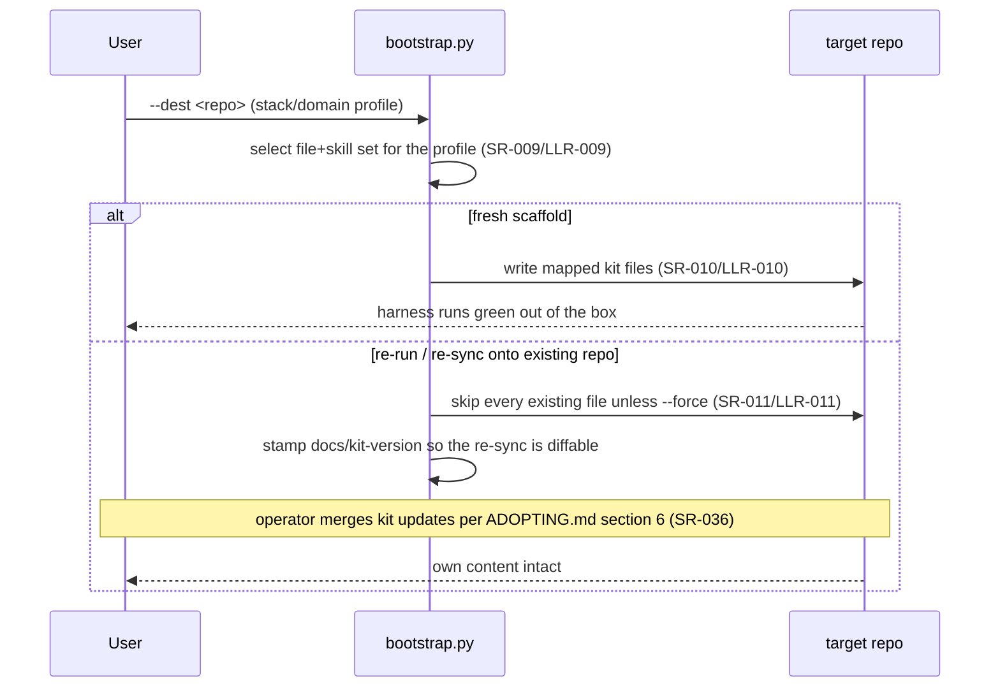
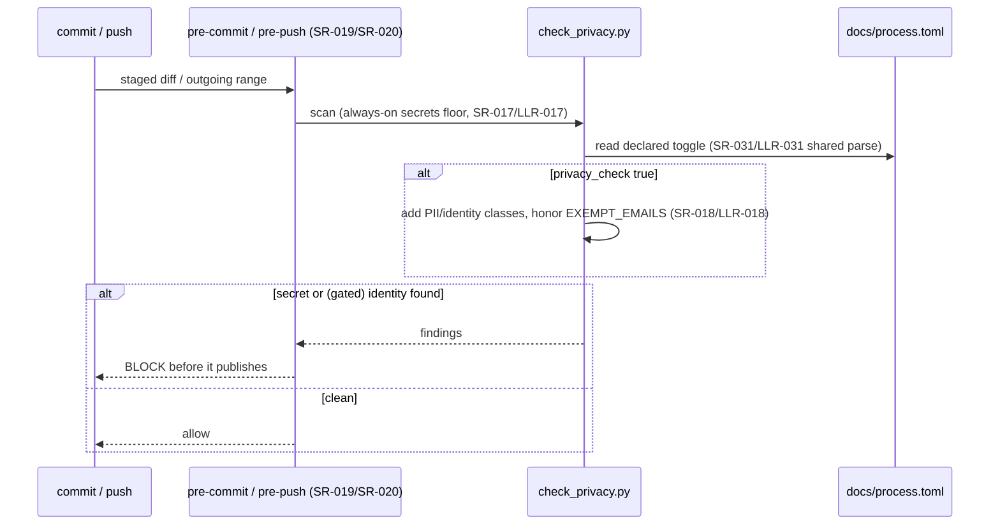

# Runtime flows — the kit meta-repo (self-adoption)

The kit's **authored architecture narrative**: the behaviors most easily
misread from registry rows — concurrency, what blocks on what, failure
handling — as hand-authored Mermaid sequence diagrams, each citing the SR/LLR
ids it renders (PROCESS.md §3, required at DevStg-Tests; `check_flows.py`
keeps the citations honest). This doc is the narrative half of the
architecture record: the **structural** half (module map, import graph,
declared `IF-###` seams, components) is *derived* from the registries and the
source tree and rendered in [`PROJECT_STATE.html`](../PROJECT_STATE.html)'s
"How (SW architecture)" tab, which also embeds these flows (owner ruling
2026-08-13u, sitting-2 decision 8 — the retired hand-authored architecture
doc is this doc's ancestor). The requirement spine it cites
lives in [`requirements/`](requirements/) + [`test/`](test/).

## Shape of the product

- **Checkers / generators** (`project-trajectory/scripts/*.py`) — stdlib-only,
  Python 3.11+, cross-platform (SR-034/SR-035). Each is invoked as a subprocess
  by the check harness (`check.py`) and by the test suite, so the "product" is a
  set of independently runnable commands, not a linked application.
- **Enforcement floor** (`project-trajectory/hooks/*`) — the pre-commit /
  pre-push / commit-msg hooks that run the integrity + secrets floor
  agent-neutrally (SR-019/SR-020).
- **Declared config** (`docs/stack.ini`, the generated `docs/stage`, and
  `docs/process.toml` — the one home for every process dial) — read once by the
  harness and the coordinator so a behavior is declared in text, not baked into
  a script (SR-007/SR-031).
- **The unattended station** (`agent_loop.py` + `dispatch.py` + `lane.py` +
  `integrate.py` + `handback.py` + `intake.py`, over `schedule.py`'s frontier)
  — the only subsystem here that is a *running* thing rather than a command:
  one dispatch loop per checkout drives N lanes from the WI frontier to trunk
  (SR-026/LLR-058/LLR-140). Flow 4 renders it; it is the piece most often
  misread from the rows alone.

## Runtime flows

> **The inherited drift this section used to record is RESOLVED (Flow 4).** Flow
> 4 renders the code as it stands after the concurrency-v2 program
> (WI-380/381/383/386/387/388). Three requirement rows it cited still described
> the model that program replaced — the composed-tree bar on a candidate
> worktree, and the five-class scheduling ladder — and LLR-143 still named the
> deleted `drive.py` as its Module. **The WI-451 re-tier closed all four**:
> those three rows were DEMOTED to the design tier, so the stale requirement
> text no longer exists to disagree with the diagram, and LLR-143 now names
> `dispatch.py`. What was owed to
> [WI-390](work/active/wi390-concurrency-v2-program-close/WI-390-concurrency-v2-program-close.md) as spine scope
> was discharged by the re-tier instead.
>
> **Every citation below was re-pointed onto the carrier that now holds the
> obligation**, which for the demoted rows is a design row. The old→new map is
> recorded in the campaign's log fragment rather than here, because naming a
> deleted id in this section is exactly what `check_flows` refuses — and it is
> right to: a flow must cite rows that exist.

### Flow 1 — Unattended coordinator session (SR-026, SR-027, SR-028, LLR-029)

```mermaid
sequenceDiagram
    participant Launcher as agent-resume launcher
    participant Loop as agent_loop.py (coordinator)
    participant Lock as dispatch lock — out/agent-loop.lock (LLR-029)
    participant Disp as dispatch.run — the station (Flow 4)
    participant Worker as agent_loop --wi (lane subprocess)
    participant Agent as agent CLI
    Launcher->>Loop: run --root .
    Loop->>Loop: preflight — git repo? agent CLI? privacy author? (SR-027/LLR-027)
    alt broken footing
        Loop-->>Launcher: typed nonzero exit (EXIT_PREFLIGHT), never hangs
    else ok
        Loop->>Lock: _coordinator_lock (SR-027/LLR-030 refuse a 2nd writer)
        Lock-->>Loop: held for the process lifetime (kernel-released on death — LLR-029)
        Loop->>Disp: _drive_entry — nothing is read from docs/status.md
        Note over Loop,Disp: resume authority is the claimed assignment plus the committed<br/>trailers on its branch (SR-026/LLR-026); the serial<br/>resume-from-status.md loop is retired
        Disp->>Worker: spawn per admitted lane, stdin closed (LLR-061)
        Worker->>Agent: run headless session(s)
        alt agent errors (retired model / auth)
            Agent-->>Worker: nonzero
            Worker->>Worker: log ERROR; all-ERROR region = unavailable agent (SR-028/LLR-028)
        else worked
            Agent-->>Worker: session output
        end
        Worker-->>Disp: typed worker exit — decided outcome or crash (Flow 4)
        Disp-->>Loop: first fatal code, or DONE once the station drains
        Loop-->>Launcher: typed outcome code (DONE/PAUSED/STALL/PREFLIGHT/…)
    end
```

### Flow 2 — Scaffold generation and re-sync (SR-009, SR-010, SR-011, SR-036)



### Flow 3 — Secrets + privacy floor at commit/push (SR-017, SR-018, SR-019, SR-020)



### Flow 4 — Station cycle: admission, lane, refresh, merge slot, intake (LLR-058, LLR-059, LLR-123, LLR-138, LLR-140)

One tick of `dispatch.run`. The three properties hardest to read off the rows:
the **spine barrier** is a property of admission (nothing slips past an
exclusive kind into a free lane), the **bar is attested to a tree** on the
branch *before* the merge slot rather than run on a composed tree inside it,
and **every lane ends in a merge** — a worker that cannot finish hands back and
the run keeps going.

```mermaid
sequenceDiagram
    participant Sched as schedule.py frontier (LLR-058/LLR-123, LLR-152)
    participant Disp as dispatch.py tick loop (LLR-149)
    participant Lane as lane.py worktree + subprocesses (LLR-150)
    participant Hand as handback.py (LLR-144)
    participant Slot as integrate.py merge slot (LLR-140/LLR-151)
    participant Intake as intake.py (LLR-153/LLR-154)
    loop each tick, until a fatal code or a drained queue
        Disp->>Disp: tracked pause? dirty trunk? (LLR-138) — freeze admission, let lanes come home
        Disp->>Sched: re-derive the ready frontier as (WI, kind) pairs
        Sched-->>Disp: exclusive kinds ranked ahead of parallel ones (LLR-059/LLR-123)
        alt an exclusive kind is on the frontier
            Note over Disp: THE SPINE BARRIER — admission stops outright;<br/>the batch admits alone, sole toucher of trunk
        else free lane and parallel work
            Disp->>Slot: claim, dispatch lock held (LLR-151)
            Slot-->>Disp: spec to active/&lt;branch&gt;/ on a trunk commit, branch cut from it
            Disp->>Lane: spawn the worker subprocess on the lane worktree
        end
        Lane-->>Disp: worker exit
        alt decided non-DONE exit (NEEDS-HUMAN, blocked, budget, stall)
            Disp->>Hand: hand_back — commit as-is, spec to queued/ with a Handback section and a blockref
            Note over Disp,Hand: the lane still closes into trunk and the run<br/>continues; only a FAILED handback stops it (LLR-144)
        else crash (traceback, signal)
            Note over Disp: claim stays in active/&lt;branch&gt;/; the next tick<br/>resumes it, bounded by the stall guard
        end
        Disp->>Lane: spawn the refresh — mechanical, no agent
        Lane->>Lane: merge trunk in, then trunk_step, then the check.py bar
        Lane->>Lane: commit a Bar-Green trailer naming the tree it barred and its work parent
        alt refresh red
            Note over Disp,Hand: a branch asserting DONE stops the run; one that merges<br/>nothing is quarantined once (code reverted, diff kept<br/>as a bar-inert patch) and refreshed again
        else refresh green
            Disp->>Slot: merge this lane's branch only — the slot is sub-second
            Slot->>Slot: is trunk already an ancestor, and does the tip attest its OWN tree?
            Slot->>Slot: merge --no-ff, ff trunk, unload, audit
            Slot->>Intake: post-merge arm, still inside the held slot (LLR-154)
            Intake-->>Slot: rows the merge forces, as ONE bookkeeping commit on trunk (LLR-153)
        end
    end
    Disp->>Intake: empty frontier — gap census mints gap-closure rows, else drain and exit 0
```
