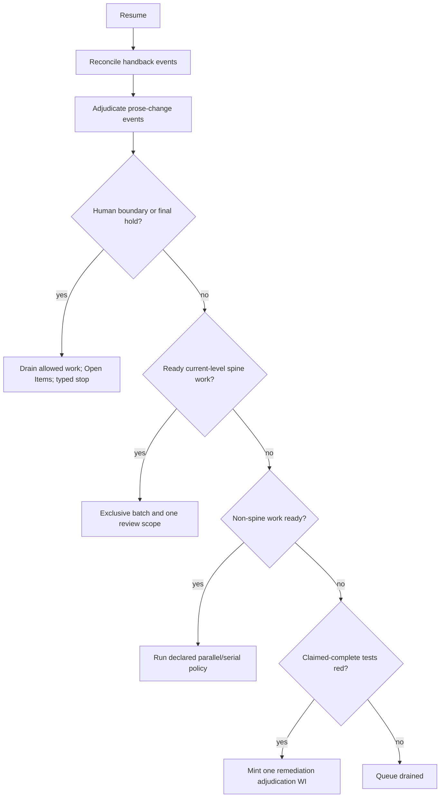

# Stakeholder-needs build plan — configuration, attestation, and adjudication

**Status:** proposed for owner review; this document does not ratify a design
or authorize a migration.  **Scope:** the kit under `project-trajectory/` and
its self-adopted process surfaces.  **Intent:** make the build loop
mechanically auditable while preserving a worker's autonomy to report what it
did and reserving scope/completion judgement for an adjudicator and, where
configured, a human.

## 1. Decision summary

The proposed architecture has four durable authorities:

1. The requirement spine defines *what the product must do*.
2. An immutable work-item (WI) definition defines the scope a branch accepted.
3. A branch may report factual execution evidence, including an incomplete
   return, but may not rewrite its WI or declare its scope complete.
4. An adjudicator decides the completion disposition and whether a prose change
   changed meaning.  A configured human remains the final authority at the
   declared attestation boundary and may override an adjudicator decision.

This distinction is intentional: a later judgement that a WI was only partial
does not alter the branch's original scope.  Continued work is a newly minted
successor WI with explicit lineage, never a revival of the original WI.

## 2. Current-state findings

The current core is already Python: `trace.py`, `derive_gate.py`, `check.py`,
`agent_loop.py`, `dispatch.py`, `intake.py`, `integrate.py`, `handback.py`, and
their tests supply the substantive behavior.  The root `agent-resume.cmd`,
`.sh`, and `.command` launchers should stay thin cross-platform adapters that
locate Python and execute the core.

Configuration is currently split between `docs/stack.ini`, `docs/gate-policy`,
`docs/agents.csv`, `docs/agents-enabled`, and environment/launcher overrides.
The existing `gate-policy` chooses who may ratify; it does not express the
requested numeric in-process threshold or a separate final-review hold.

The current handback flow mutates and requeues the original WI spec.  Its
`blockref`/self-referential handback design is the subject of
`docs/handback-contract.md`; that document correctly identifies the missing
identity of a return event as the root defect.  Existing code does batch ready
spine WIs and does derive the current gate, but it lacks a semantic prose
adjudication event, durable row-level attestation anchors, a central queued
admission transaction, and dedicated red-bar remediation minting.

There is also a documentation inconsistency to resolve in the first slice:
`docs/status.md` contains historical prose that says the dispatcher was
deleted, while the checked-in dispatcher and `docs/concurrency-v2.md` describe
and implement a live dispatch path.  The plan treats code plus tests as the
present-behavior authority; generated/reference documentation must be corrected
before it is relied on operationally.

## 3. Spine impact and proposed needs

Add the following as **Draft** stakeholder needs.  Under the current
derived-gate model, any Draft SN legitimately makes the project G0 until the
new need is ratified and answered by an SR.  This is not a regression: it is
the model correctly reporting that the product's contract is being extended.

| Proposed need | Purpose | Existing areas it amends |
|---|---|---|
| SN-A: single processing configuration | All downstream processing behavior is declared in one validated configuration file. | SN-003, SN-004, SN-025, SN-026 |
| SN-B: human-attestation boundary | A numeric policy states when autonomous progression stops for human ratification, plus an optional final full-spine review. | SN-004, SN-006, SN-025 |
| SN-C1: autonomous adjudication loop | Resume autonomously triages returns, prose changes, spine work, ordinary work, and red bars in a deterministic order. | SN-006, SN-025, SN-027 |
| SN-C2: immutable WI outcome | A branch's WI scope is immutable; Complete, Cancelled, and Partial are adjudicated terminal outcomes. | SN-025, SN-027 |
| SN-C3: conflict-safe queue admission | Every queued transition is checked against the spine and queued/active work. | SN-002, SN-025, SN-027 |
| SN-D: declared provider/role pools | Providers, models, arguments, job roles, weighted pools, and compatible fallback are configured and visible. | SN-026 |

SN-E and SN-F remain placeholders.  They must not receive trace rows or
implementation work until they have an observable need and acceptance intent.

The SR/LLR/TC decomposition must be authored after these SNs are ratified;
this plan deliberately does not embed normative requirement prose in a planning
document.  The likely implementation seams are the existing configuration,
agent routing, derived-gate, trace, intake, schedule, dispatch, handback,
integrate, trajectory, bootstrap, and test modules.

## 4. Target configuration model

Adopt one `docs/config.toml` as the configuration authority.  Python 3.11's
standard-library `tomllib` makes TOML available without adding a shipped
dependency.  `configparser` would also work, but TOML is preferable here for
typed/nested role pools and readable arrays/tables.

The file owns behavior configuration, not runtime secrets.  Provider tokens and
machine-local credentials remain environment or provider-CLI state.

```toml
[attestation]
# 0=SN in process; 1=SR; 2=LLR; 3=TC.  The prior level is ratified.
human_attestation_level = 1
require_final_full_spine_review = false

[routing]
fallback = "same-strength-or-higher"

[routing.roles.implementer]
minimum_tier = "medium"
pool = [{ model = "ANTHROPIC-OPUS", weight = 3 },
        { model = "OPENAI-TERRA", weight = 1 }]
```

It will also contain harness, scheduler, provider/model, command-template, and
role-pool declarations currently spread across the named config files.  The
migration needs an explicit temporary read order, a validator that rejects
ambiguous duplicate declarations, and a compatibility sunset release.  Do not
attempt to replace shell launchers with Python: that has no bearing on the
single-source-of-truth goal.

## 5. Attestation semantics

`human_attestation_level` is an **in-process** boundary, not a claim about what
is already ratified:

| Value | Work currently being developed | Ratified prerequisite |
|---:|---|---|
| 0 | Stakeholder needs | none |
| 1 | System requirements | stakeholder needs |
| 2 | Low-level requirements | SN + SR |
| 3 | Test cases | SN + SR + LLR |

The dispatcher stops only when the derived in-process level equals the declared
boundary and all remaining eligible work is above that boundary.  It drains
permitted work, renders every owed item in Open Items, emits a typed
`ATTESTATION_REQUIRED` outcome/banner, and exits.  The independent
`require_final_full_spine_review` hold requires an owner review after all TCs
are validated; it is never overloaded onto level 3.

Every attestation decision must persist a row-level immutable anchor:

- artifact kind/id and canonical normative-cell digest;
- the trunk commit SHA at which it was attested;
- decision (`ratified`, `clarity`, `meaning`, or human override);
- decision artifact/reference and timestamp.

On a changed ratified cell, mechanical diffing creates a prose-adjudication
event.  The adjudicator receives before/after text and the exact anchored
baseline.  A `clarity` verdict retains the anchor; a `meaning` verdict marks
the affected attestation unit re-attest-needed and automatically pulls the
derived in-process level back to that unit.  This extends existing `Modified`
handling to stakeholder-need prose, which cannot be safely handled by the
current section-state mechanism alone.

## 6. Immutable WI and handback model

Use one immutable handback document per return event, outside `docs/work/`, for
example `docs/handbacks/HB-<id>.md`.  A returned original WI moves to a terminal
`returned/` directory and is never requeued.  The worker records factual
evidence: commits, tests attempted, files changed, blockers, and unfinished
acceptance evidence.  It does not choose Complete/Cancelled/Partial.

The adjudicator then issues one disposition:

| Adjudicator disposition | Result |
|---|---|
| Complete | Original WI closes Complete; evidence demonstrates its fixed scope. |
| Cancelled | Original WI closes Cancelled with a reason. |
| Partial | Original WI closes Partial; a new successor WI describes the remaining scope. |
| Needs human | Original remains terminal Returned until a human selects one of the above. |

The successor contains `Predecessor`/`HandbackRef` lineage and must pass the
same conflict admission check as any other WI.  This supplies a durable identity
for every return, prevents re-claim loops, and lets the adjudicator override a
worker's self-assessment without mutating history.

## 7. Resume state machine

Implement the decision sequence as a pure, fully tested state-machine function
before wiring it to process/subprocess operations:



Component-level LLR/TC batches are permitted only when explicit component
ownership is declared and no trace edge crosses the proposed partition.  Until
then, ready spine work remains one project-wide exclusive batch.

## 8. Delivery slices and dependencies

| Slice | Deliverable | Depends on |
|---|---|---|
| 0. Design amendment | Ratified terminology/state model; draft SNs; corrected current-state docs; migration decision for current handback rows. | Owner review |
| 1. Config foundation | TOML schema, validator, compatibility reader, bootstrap fixtures, one precedence contract. | 0 |
| 2. WI/event migration | `returned/`, immutable HB documents, parser/dashboard/integrator support, legacy handback migration. | 0 |
| 3. Queue admission | Single queued-transition API with lineage, predecessor, scope, and conflict checks. | 0, 2 |
| 4. Prose adjudication | Anchor ledger, candidate generation, adjudicator artifact, human override, gate derivation updates. | 0, 1 |
| 5. Boundary policy | Numeric threshold/final hold and Open Items/banner behavior; retire `gate-policy` authority. | 1, 4 |
| 6. Resume orchestration | Pure planner plus dispatch wiring for the specified loop and red-bar remediation mint. | 2, 3, 4, 5 |
| 7. Role routing/templates | Role pools/fallback, reviewed prompt-template assets, renderer, packet generator, static checks. | 1 |
| 8. Cleanup and closure | Remove compatibility/dead paths after migration proof; regenerate generated artifacts; full matrix evidence. | 2–7 |

Slices 2/3 and 4/7 can proceed in parallel after Slice 1's schema/authority
decisions are settled.  Slice 6 is intentionally last because it composes every
new authority.

## 9. Prompt-template review and verification

Move command-fed LLM prose from embedded Python/comments into versioned template
assets.  Every asset declares its role, allowed inputs, source references,
expected structured result, and revision hash.  The renderer writes prompt text
to stdin; no prompt is shell-interpolated.

Before an invocation, a generated review packet presents the source template,
fully rendered prompt, bound variable names/values, source artifact hashes, and
required response schema.  The test suite must cover unbound/extra placeholders,
escaping, forbidden environment interpolation, golden renders, role schema
conformance, and adjudicator instructions that distinguish factual branch
evidence from judgement.

## 10. Required evidence and cleanup bar

The implementation is not complete without the following evidence:

- folder/state-transition tests for every WI outcome, including crash recovery,
  duplicate handback events, and proof that an original WI cannot revive;
- semantic-adjudication tests for clarity, meaning, stale anchor, and human
  override; threshold boundary tests for 0–3 and final-review hold;
- queue-conflict/property tests, spine-batch barrier tests, and a red-bar case
  that mints exactly one remediation WI;
- routing tests for unavailable-model fallback, weighted role pools, and clear
  provider-preflight errors;
- bootstrap end-to-end fixtures on Windows and POSIX, including old-config
  compatibility and new-config-only operation;
- generated architecture/status/dashboard/Open Items freshness checks; and
- a final reachable-code inventory.  Delete unused helpers, obsolete config
  readers, self-mutating handback code, and their tests only after the new path
  proves green.  Preserve terminal WIs as historical evidence unless an item is
  explicitly superseded or shown to have no remaining context.

## 11. Migration safeguards

This program changes the mechanisms that ordinarily enforce the repository
workflow.  Per owner direction, it may use a dedicated controlled implementation
branch rather than attempting to drive its own evolving dispatcher.  It still
must be small-sliced, reviewed, tested against real bootstrapped repositories,
and integrated only after the old and new formats agree at each migration
boundary.

