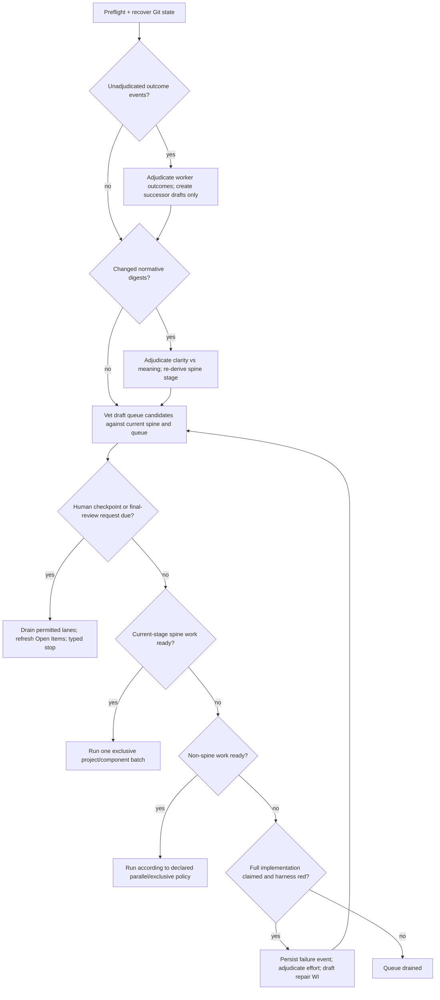
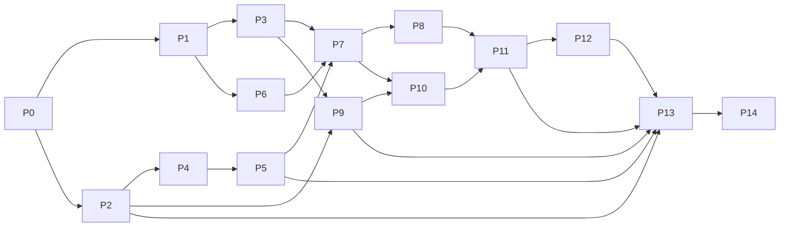

# Stakeholder-needs build plan — configuration, attestation, and adjudication

**Status:** proposed for owner review; this plan records recommended rulings and
an executable dependency order, but does not itself ratify spine changes.
**Scope:** the reusable kit under `project-trajectory/` and this meta-repo's
self-adopted instance. **Execution exception:** because this program replaces
the machinery that would normally drive it, build it on one controlled branch
with explicit reviews and manual integration checkpoints; do not run the live
`agent-resume` loop across its own changing implementation.

## 1. Recommended decisions

1. Keep the Python 3.11+ core and the three thin `.cmd` / `.sh` / `.command`
   starters. The core is already Python; a launcher rewrite would add migration
   cost without addressing the configuration problem.
2. Replace the scattered behavioral configuration with one validated
   `docs/config.toml`. Python 3.11's `tomllib` is the relevant new capability:
   nested typed tables and arrays are available in the standard library.
3. Separate two derived facts that the current `docs/gate` conflates:
   **spine stage** (which artifact tier is in process) and **verification gate**
   (which harness bar applies).
4. Name the numeric policy `human_ratification_through`, not “human attest
   level.” `Attest` already names a requirement verification method, while
   “through” makes the cumulative 0–3 meaning explicit.
5. Make the branch's judgment real: its worker moves the byte-identical WI spec
   to `complete/`, `cancelled/`, or `partial/` and writes a separate immutable
   outcome event. Partial and Cancelled claims always receive adjudication;
   Complete uses the existing independent review + composed-tree bar, with a
   dedicated adjudicator on risk triggers or sampling. Every path retains an
   override channel. The WI's scope text never changes on the branch.
6. Never revive an attempted WI. Any remaining work is a newly minted successor
   with explicit lineage and a fresh queue-conflict verdict.
7. Store attestation history in an append-only ledger keyed by artifact id and
   normative-text digest. Do not add Git hashes to every requirements row.
8. Externalize every operational LLM prompt into reviewed Markdown templates,
   validate their slot and output contracts, and record the exact template and
   rendered-prompt hashes used by each session.

## 2. What already exists, and what changes

| Need | Existing foundation | Gap that this program owns |
|---|---|---|
| A — one configuration | `stack.ini` is already parsed structurally; most substantive tools are Python. | Behavior is split across `stack.ini`, five one-value policy files, `agents.csv`, `agents-enabled`, launchers, environment variables, and CLI maps. The one-value convention is load-bearing in two places: `agent_common.read_declared()` reads the first non-comment line, and security-sensitive shell hooks use a first-value `grep`/`head` parse so they can fail closed before Python tooling runs. That accreted convention—not a limitation of grep—is why the policy files did not become structured config. |
| B — numeric human boundary | `derive_gate.py` derives `G0..G3`; Draft/Modified rows surface in Open Items; `trace.py` reconstructs an SR's latest Verified commit. | Current G2 combines LLR and TC decomposition, SNs have section-state rather than row status, and Git archaeology is not a durable row-level attestation anchor. The old `gate-policy` enum does not express the requested cumulative human boundary. |
| C.1 — autonomous resume | `dispatch.py` has a spine barrier, exclusive adjudication, parallel ordinary work, attended-stop banner, and empty-frontier gap census. | Handback reconciliation is not an explicit first pass; sanctioned Modified changes evade the current adjudication trigger; a claimed-complete red bar stops instead of minting remediation. |
| C.2 — worker outcome + override | Complete and cancelled are terminal; handback mints an adjudication WI. | Handback mutates the original WI and requeues it. There is no `partial/`, no immutable outcome event, and no general adjudicator confirmation/override of all three worker judgments. |
| C.3 — conflict-safe queue | The WI DAG, ids, dependencies, safety classes, and exclusive admission are mechanically checked. | No central transition owns every move into `queued/`, and semantic overlap with the spine or other queued/active WIs is not adjudicated. |
| D — role/model pools | `agent_route.py` already provides model routes, tiers, weighted per-phase draws, cooldown, cross-family preference, and same-or-stronger fallback. Dual-plan has planner/critic/arbiter roles. | Routing config is fragmented; there is no routed adjudicator role; the dual-plan arbiter uses the ambient model; prompt assets and job pools are not declared together. |

The present handback failures are one design fault, not several dedup bugs:
the return event has no immutable identity. `docs/handback-contract.md` already
reaches that diagnosis. This plan adopts a per-attempt outcome event but follows
the newer stakeholder instruction—worker chooses one of three outcomes, then an
adjudicator reviews it—instead of that document's proposed `returned/` state.

## 3. Effect on the spine definition

The requested 0–3 values cannot safely replace the current `G0–G3` arithmetic
one-for-one. The current gate means:

- G0: a Draft or unanswered stakeholder need exists;
- G1: requirements are ratified but not fully decomposed;
- G2: required LLRs **and TCs** exist, but an SR is not Verified;
- G3: every in-scope SR is Verified.

That model has no state between “LLRs exist” and “TCs exist.” It also uses G2
both for new implementation work and for a Modified SR awaiting re-attestation.
The target therefore derives two named axes from one spine:

| `spine_stage` | Meaning | Entry condition |
|---:|---|---|
| 0 | Stakeholder needs in process | at least one current SN has no accepted normative-text anchor |
| 1 | System requirements in process | all current SNs are ratified; at least one current SR is not |
| 2 | Low-level requirements in process | all current SRs are ratified; at least one required LLR is not |
| 3 | Test cases in process | all required LLRs are ratified; at least one required TC is not validated |
| 4 | Full breakdown implemented and validated | all required TCs are validated and the full declared harness is green |

`spine_stage` is the workflow/admission input. `verification_gate` remains the
harness input and initially preserves the existing `check.py` G1–G3 contract.
A small mapping function declares which check gate applies at each spine stage;
callers never infer it from a shared integer.

A meaning-changing amendment invalidates the current anchor at that artifact's
level. Therefore an SN meaning change derives stage 0, an SR meaning change
stage 1, an LLR meaning change stage 2, and a TC meaning change stage 3. A
clarity-only verdict advances the accepted anchor to the new digest without
lowering the stage. This is stronger than today's SR-only `Modified` convention
and gives SN prose an honest baseline.

## 4. Proposed stakeholder-needs amendment

After the terminology is approved, mint five real Draft needs as SN-028..032
and amend the already-existing SN-026 for item D. SN-026 already owns the
provider/model/family routing intent and is currently in the same Modified
window, so a second need would duplicate it. The other five are separate needs:
folding them into SN-003/SN-004/SN-025/SN-027 would turn those rows into
multi-obligation statements.

Draft SN-028..032 and resolve the 21 already-Modified SRs in **one combined
drafting-plus-re-attestation sitting**. The temporary G0/G1 result is the
derived model honestly exposing in-process scope, not a regression.

| Spine action | Acceptance intent | Existing rows to reconcile, not duplicate |
|---|---|---|
| New SN-028 — single processing configuration | One validated file controls harness, automation policy, routing, and prompt selection; a detector proves no retired config source still affects behavior. | SN-003, SN-004, SN-025, SN-026 |
| New SN-029 — configurable human ratification boundary | A cumulative numeric boundary controls which spine-tier ratifications require a human; meaning changes regress the derived stage; an independent final-review request is durable and visible. | SN-004, SN-006, SN-025 |
| New SN-030 — autonomous adjudication loop | One deterministic resume planner orders outcome adjudication, prose adjudication, human stops, spine batches, ordinary work, and red-bar remediation. | SN-006, SN-025, SN-027 |
| New SN-031 — immutable scoped attempt | A worker records Complete, Cancelled, or Partial without changing scope; adjudication may override; the attempted WI never returns to the frontier. | SN-025, SN-027 |
| New SN-032 — adjudicated queue admission | Every transition to queued has a recorded, current conflict verdict against spine and queued/active work. | SN-002, SN-025, SN-027 |
| Amend SN-026 — declared job routing and prompt contracts | Planner, reviewer, implementer, adjudicator, critic, and arbiter resolve through declared weighted pools with capability and same-or-stronger fallback; every launched prompt is reviewable and attributable. | SN-024 and the existing SN-026 SR chain |

SN-E and SN-F remain placeholders. They receive neither ids nor trace rows until
they state observable stakeholder value.

## 5. Single configuration authority

Use `docs/config.toml` as the only editable source for behavior. It owns:

- product commands, tiers, paths, coverage, custom steps, and generated owners;
- lane count, timeouts, blackout, review/critique policy, push/privacy/
  guardrail policy, and ratification policy;
- provider/model access routes, enabled routes, capability/strength metadata,
  role pools, weights, and fallback rules; and
- prompt ids, template paths, allowed input classes, and output schemas.

It does **not** own credentials, generated state (`docs/gate`, dashboards), live
events (`docs/work/pause`, outcome/attestation requests), requirement/WI
records, or measured baselines. Those are state or evidence, not configuration.

The shell hooks are an explicit migration constraint. The recommended target is
a tiny Python 3.11 config-query entry point used by pre-commit, commit-msg, and
pre-push; a missing or below-floor interpreter refuses clearly and therefore
preserves the current fail-closed security behavior. During migration, tests
drive the old shell read and the TOML read over the same matrix and require
agreement. No second policy file or generated mirror survives cutover: a mirror
would immediately violate the single-authority need it was meant to support.

Illustrative shape:

```toml
schema = 1

[attestation]
# Inclusive human checkpoints:
# 0=SN; 1=SN+SR; 2=SN+SR+LLR; 3=SN+SR+LLR+TC.
human_ratification_through = 1
final_full_spine_review = "never" # never | always

[automation]
lanes = 2
session_timeout_seconds = 7200

[[routes]]
id = "OPENAI-TERRA"
family = "OPENAI"
model = "gpt-5.6-terra"
strength = 2
argv = ["codex", "exec", "--model", "{model}"]
capabilities = ["text", "implementation", "review"]

[jobs.adjudicator]
minimum_strength = 3
fallback = "same-or-higher"
pool = [
  { route = "ANTHROPIC-OPUS-STRONG", weight = 1 },
  { route = "OPENAI-SOL", weight = 1 },
]

[prompts.adjudicator]
template = "docs/prompts/adjudicator.md"
required_slots = ["SCOPE", "EVIDENCE", "WORKER_OUTCOME", "CONFLICTS"]
output_schema = "adjudication-v1"
```

Use argv arrays for new route declarations, not shell command strings. Continue
to send prompts on stdin. Secrets remain in provider CLI state or environment;
the config may name a credential profile but never contain its token.

Migration is staged: strict loader and validator; read-only converter/report;
old-shell/new-Python agreement tests for security keys; behavior-parity run;
canonical cutover; then legacy-reader deletion. If both a new and an old source
are live, preflight fails with the conflicting keys—there is no silent
precedence. One-shot CLI overrides remain possible only as break-glass inputs
recorded in the session evidence.

The old `gate-policy` values do not map losslessly: `attended` maps naturally to
3, while `single-ratify` also encoded cadence and `autonomous` allowed no early
human checkpoint. The migration command must surface those cases for an
explicit choice; it must not guess.

## 6. Ratification, semantic change, and final review

Add an append-only attestation ledger outside the normative registries. Each
event carries:

- event id, artifact kind/id, normative-cell schema version and digest;
- accepted trunk commit, parent attestation event, actor/role, timestamp;
- decision: `ratified`, `clarity`, `meaning`, or `override`;
- adjudication/review evidence reference; and
- for a `meaning` decision, the exact level made pending.

The current accepted event is the newest valid event in the chain. A
clarity-only decision writes a new accepted event for the new digest; it does
not leave the old digest current. A meaning verdict writes a pending event and
pulls `spine_stage` back. A human override appends another event; history is
never edited.

Detection compares the current canonical normative cells with the ledger's
accepted digest and commit. It therefore catches both of today's cases:

1. a row changed while remaining Verified; and
2. the sanctioned amend-and-flip to Modified, which the current
   `staged_spine_amendments()` deliberately skips.

The adjudicator packet contains the exact anchored before/after prose, connected
parent/child rows, affected queued/active WIs, and current evidence. At or below
`human_ratification_through`, the adjudicator recommends and the human decides.
Above it, the adjudicator may enact the decision; a later human override is
still append-only and re-derives state.

Level 4 is not encoded as another human boundary because it is not “TCs in
process.” Persistent policy is `final_full_spine_review = "always"`. A more
frequent one-shot request is created with an attestation command as a tracked
review-request event; it survives relaunches, appears in Open Items, and closes
only through a recorded human decision. This keeps transient state out of the
single config without creating a second configuration source.

## 7. Immutable WI attempts and adjudicator override

The WI spec's identity and scope-bearing content are frozen at claim: id, title,
SpecRef, referenced requirements, acceptance/deliverable definition,
predecessors, safety class, build tier, and plan mode. The branch may only move
the unchanged file to a terminal folder.

Every attempted branch writes one immutable outcome event outside `docs/work/`:

- WI id, claim-base and branch-tip commits, scope digest;
- worker outcome (`complete`, `cancelled`, `partial`);
- facts: files/commits, checks run and exact results, blockers, unmet criteria;
- for Partial, an explicit keep/discard/quarantine classification of every
  branch commit or coherent change group;
- reviewer verdict references; and
- no free-form instruction field that can be interpreted as dispatcher policy.

The worker then moves the byte-identical WI spec:

| Worker judgment | Folder | Adjudicator options |
|---|---|---|
| Complete | `complete/` | confirm, or override to Partial/Cancelled |
| Cancelled | `cancelled/` | confirm, or override to Partial/Complete |
| Partial | `partial/` | confirm, or override to Complete/Cancelled |

All three are terminal and never scheduler-ready. Partial and Cancelled always
enter the disposition path. Complete normally receives its authoritative
judgment from the already-independent reviewer plus composed-tree bar; a
dedicated adjudicator runs when the review disagrees with the worker claim, the
scope/bar evidence is incomplete, the safety class requires it, or configured
sampling selects it. This avoids rebuilding the existing verdict gate under a
new name while preserving review and override authority.

The adjudicator records the final outcome in a new disposition event and, if
needed, moves the same byte-identical spec to the corrected terminal folder;
the worker's original claim remains visible in the outcome event. Leaving a
misjudged WI in its original folder would contradict the directory-as-status
contract. A Partial outcome drafts a successor for the remaining scope and the
integrator refuses it until the keep/discard/quarantine split is complete. It
never edits or requeues the original. Existing `returned/`, self-`blockref`,
and mutable `## Handback` proposals are retired by this contract.

## 8. Queue admission as one transaction

Every producer creates a candidate in `draft/`; only a trunk-side admission API
may move it to `queued/`. The transaction validates mechanically:

- unique id, valid immutable scope digest and source event;
- predecessor existence/acyclicity and no attempted-WI revival;
- current SpecRef and spine references;
- declared components, modules, interfaces, likely files, and safety class;
- no active/queued item with an unreviewed overlap; and
- current attestation anchors for every referenced normative row.

Mechanical overlap is a candidate finding, not a claim of semantic conflict.
An adjudicator receives the overlap graph and records `no-conflict`,
`compatible-overlap` with an ordering/partition, or `conflict` with cancellation
or a replacement draft. `check_trajectory.py --strict` rejects any queued spec
whose admission verdict is absent, stale, or based on an older scope/spine
digest.

For LLR/TC work, partition by the connected components of the declared
SN/SR/LLR/TC + Component + IF graph. A component is independent only when no
trace or interface edge crosses the proposed partition. Missing ownership or a
cross-edge collapses the work to one project-wide spine batch.

## 9. Resume state machine

Safety preflight and crash recovery always run before judgments. The pure
planner then executes this precedence on every cycle:



Outcome adjudication comes first as requested, but a successor remains Draft
until prose adjudication has established the current spine and the queue
transaction has ruled on conflicts. The human stop fires only when no
unresolved outcome/prose adjudication or permitted current-level work remains.
Its typed result and banner are derived from the same pending model rendered in
Open Items.

A red claimed-complete branch is an outcome, not an automatic retry. A red full
trunk after stage 4 produces a failure event keyed by tree SHA, failing step,
and failure fingerprint so the intake can mint exactly one remediation draft.
The adjudicator estimates effort, BuildTier, plan mode, and scope; ordinary
queue admission still decides whether it may enter the queue. The existing
empty-frontier `gap_census` remains the discovery seam for registry symptoms,
but the remediation event is grounded in the actual harness failure—not merely
in a TC `Evidence` cell or an unverified status.

## 10. Prompt source, review, and provenance

Current prompt influence is only partly reviewable:

| Prompt/input | Current home | Current strength / risk |
|---|---|---|
| Worker assignment | embedded `WORKER_PROMPT` in `agent_loop.py` | Scope is explicit, but prose review requires reading Python. |
| Reviewer | embedded `REVIEWER_PROMPT` | Strong redaction/adversarial clauses; optional file override has no declared slot schema. |
| Critique | embedded `CRITIQUE_PROMPT` | Rubric-driven and redacted; same embedded-prose problem. |
| Dual-plan planner/critic/arbiter | three Markdown templates under `project-trajectory/prompts/` | Best current pattern: strict slot allowlist and unfilled-slot refusal. |
| Guardrails core | external Markdown selected by policy | Reviewable source, but not catalogued with the operational prompts. |
| Derived WI context, rework, handback reason | assembled in Python | Facts and judgments are not consistently typed; WI-417/WI-418 show how free prose can select tier or anchor the next judge. |

The target uses the dual-plan pattern for every role:

1. Put worker, reviewer, critic, planner, and arbiter prose in versioned
   Markdown assets. Add four deliberately separate adjudicator templates from
   day one: `adjudicate-amendment` (clarity/meaning),
   `adjudicate-disposition` (Partial/Cancelled + successor/tier),
   `adjudicate-conflict` (queue admission), and `adjudicate-red-test`
   (remediation effort/scope). `docs/config.toml` maps each job to its template.
2. Keep template metadata in config: required/allowed slots, allowed and
   prohibited source classes, output grammar, and semantic-review rubric.
3. Use one strict renderer. Unknown, extra, missing, or still-unrendered slots
   fail before launch. Prompts always travel on stdin.
4. Delimit injected values as typed, untrusted evidence. A worker's outcome is
   an enum plus a separately delimited rationale; it can never become an
   instruction, tier selector, or `NEEDS-HUMAN` magic string.
5. State the template authoring and source-separation rules once in
   `prompts/README.md`, then generate a prompt catalog showing job, source template, input dataflow,
   prohibited inputs, output parser, template hash, and deterministic fixture
   render. A review command can render any real packet to a gitignored audit
   directory without committing secrets or large prompts.
6. Record template id/hash, rendered-prompt hash, route id, model, arguments,
   and source-artifact hashes in every session/outcome/verdict event.
7. Mechanize structural correctness: slot contracts, source deny-lists,
   output-parser compatibility, stdin transport, golden renders, required
   policy clauses, and fake-CLI assertions over the **as-launched** prompt.
   Judge prose meaning honestly with an independent prompt review against a
   written rubric; no string-presence test can prove prose is semantically good.

## 11. Dependency-ordered implementation work

The plan ids below are design-local; mint real WI ids on trunk only after the
spine amendment is ratified. “Dual” means two independent plans plus arbiter;
“standard” means one scoped plan/review; “mechanical” means no LLM design step.

| Plan id | Deliverable | Depends on | Suggested route |
|---|---|---|---|
| P0 | Ratify glossary and the decisions in §§1, 3, 5–8; freeze old unattended execution; disposition current conflicting WIs; declare one combined sitting with the 21 already-Modified SRs. | owner review | strong · dual |
| P1 | Draft/ratify SN-028..032, amend SN-026, and decompose SR/LLR/TC acceptance, including the two-axis `spine_stage`/`verification_gate` contract. | P0 | strong · dual |
| P2 | Implement pure `config.toml` schema, typed loader, validator, legacy conversion/diff report, and fail-closed shell-hook migration/agreement tests; no runtime callers switch yet. | P0 | strong · dual |
| P3 | Implement canonical normative-cell snapshots/digests plus append-only attestation and final-review request ledgers. | P1 | strong · dual |
| P4 | Externalize existing prompts; add the four purpose-specific adjudicator templates, `prompts/README.md`, strict rendering, output schemas, as-launched tests, prompt catalog, and prompt provenance. | P2 | medium · standard |
| P5 | Normalize provider routes and job pools onto config; add routed adjudicator and arbiter; preserve equal-or-stronger and diversity behavior. | P2, P4 | medium · standard |
| P6 | Add `partial/`, immutable scope-at-claim enforcement, one outcome event for every terminal result, and mandatory keep/discard/quarantine classification for Partial. | P1 | strong · dual |
| P7 | Implement mandatory Partial/Cancelled adjudication, risk-triggered/sampled Complete adjudication, authoritative folder override, successor drafting, and worker/adjudicator audit history. | P3, P4, P5, P6 | strong · standard |
| P8 | Centralize Draft→Queued admission and add mechanical overlap graph + adjudicator conflict verdict/freshness gate. | P3, P7 | strong · dual |
| P9 | Replace gate-policy admission behavior with `human_ratification_through`, persistent final-review policy, one-shot request events, and shared Open Items/banner projection. | P2, P3 | strong · standard |
| P10 | Replace commit-local prose detection with ledger-vs-current semantic candidates; cover SN and sanctioned Modified changes; enact clarity/meaning/override. | P3, P7, P9 | strong · dual |
| P11 | Implement the pure resume planner and wire it to dispatch/intake in the precedence of §9, including component-safe spine batching. | P8, P9, P10 | strong · dual |
| P12 | Persist branch/full-trunk bar-failure events and exactly-once remediation drafting with adjudicated effort/tier/plan mode. | P7, P8, P11 | medium · standard |
| P13 | Cut runtime readers to canonical config; simplify launchers; migrate self-adoption and bootstrapped fixtures; update architecture/process/dashboard/Open Items. | P2, P5, P9, P11, P12 | medium · standard |
| P14 | Mint and execute one measured unused-function sweep; delete legacy readers/files, mutable handback, and magic-string routing; disposition (rather than assume) any newly stale live WIs; run the complete migration and scaffold matrix. | P13 | medium · mechanical + review |



Safe parallel lanes after P0: P1 and P2. After those foundations, P4/P5 can
run alongside P3/P6. P7 is the first composition point; P11 is the final
orchestration point and should not start early.

### Phase-close checkpoints

The granular DAG above remains the scheduling authority. These checkpoints
group it into reviewable compositions and keep the replacement loop runnable:

| Checkpoint | Plan work | Exit evidence |
|---|---|---|
| A — owner sitting and spine contract | P0–P1 | combined Draft/re-attest brief; approved terminology and exact transition tables |
| B — configuration, ledger, and prompt foundations | P2–P5 | old/new behavior parity, hook fail-closed matrix, prompt catalog, routed adjudicator/arbiter |
| C — immutable outcomes and admission | P6–P8 | all worker/final outcome combinations, Partial keep/discard refusal, conflict-verdict freshness |
| D — human boundary and prose semantics | P9–P10 | 0–3 boundary matrix, final-review request, SN/SR/LLR/TC clarity/meaning cases |
| E — complete resume loop | P11–P12 | ordered end-to-end loop, component batch proof, exactly-once real-harness remediation |
| F — cutover and cleanup | P13–P14 | canonical-config-only scaffold, no legacy behavior readers, measured unused-symbol disposition |

Every checkpoint ends with the full unfiltered suite and the applicable full
`check.py` gate bar, not only the per-slice smoke bar.

## 12. Primary code, document, and test touchpoints

- Configuration/routing: `agent_common.py`, `check.py`, `agent_route.py`,
  `agent_loop.py`, `agent_session.py`, `plan_runner.py`, `run_menu.py`,
  `bootstrap.py`, stack/policy/agent templates, and all three resume starters.
- Spine/attestation: `derive_gate.py`, `trace.py`, `trace_text.py`,
  `check_trajectory.py`, `intake.py`, `gen_open_items.py`, `traj_status.py`,
  the four spine registries/templates, and the registry machinery reference.
- WI lifecycle: `handback.py`, `spec_move.py`, `wi_convert.py`, `schedule.py`,
  `dispatch.py`, `integrate.py`, WI templates, architecture Flow 4, and the
  concurrency/process contracts.
- Prompts: `agent_loop.py` embedded constants, `plan_briefs.py`, the existing
  dual-plan templates, new worker/reviewer/critique/adjudicator assets, and the
  config-selected prompt catalog.

Each slice adds focused unit/negative tests before caller migration. Program
closure additionally requires:

- all 0–3 boundary transitions, meaning regressions at each artifact tier,
  clarity retention, stale anchors, autonomous decisions, and human overrides;
- every worker/adjudicator outcome pair, byte-identical scope proof, crash
  recovery, duplicate events, Complete risk/sampling triggers, Partial
  keep/discard/quarantine refusal, and proof an attempted WI is never ready
  again;
- conflict candidates across shared SN/SR, component, interface, file and
  predecessor scope, with stale/missing admission verdicts rejected;
- weighted pools, unavailable-route fallback at equal/higher strength, routed
  arbiter/adjudicator, degraded diversity, and provider-preflight failures;
- shell-hook and Python config reads agreeing on security policy during
  migration, plus a clear fail-closed result when Python 3.11 is unavailable;
- every prompt's strict slots, prohibited-source redaction, output grammar,
  golden render, stdin transport, and logged hashes;
- stage-wide/component spine batches, ordinary parallel work, human stops, and
  exactly-once red-bar remediation in an end-to-end resume fixture; and
- Windows/POSIX fresh bootstrap, legacy conversion, mixed-config refusal,
  canonical-config-only operation, full suite, full gate bar, and generated
  artifact freshness.

## 13. Current WI disposition at program start

| Current WI | Proposed treatment |
|---|---|
| WI-390 | Absorb its still-needed spine/prose/connectivity close into P1/P13 so there is one coherent amendment sitting; do not let it rewrite the old concurrency contract immediately before this program replaces it. |
| WI-413 | Cancel as superseded: per-event identity removes the dedup-token problem rather than patching it again. |
| WI-416 | Re-decide at P0 against the approved outcome contract; expected result is cancellation/supersession once its old disposition mechanism is no longer live. |
| WI-417 | Absorb the factual-reason / judgment / tier separation into P6/P7/P12; preserve its evidence as design input. |
| WI-418 | Absorb into P4/P7: typed evidence and prompt contracts are the general fix for derived prose anchoring. |
| WI-415 | Keep independent; it is ordinary dashboard polish and may run outside this program if it does not touch the new Process view. |

The current queue contains no context-free dead WI, and there is no existing
unused-function sweep WI—WI-390 explicitly is not that sweep. Do not delete
completed/cancelled/partial WIs merely because they are old; they are audit
history. P14 mints one measured cleanup row and applies “dead WI” cleanup only
to live Draft/Queued items whose SpecRef, premise, or context has become stale
during this program: cancel or supersede them with a recorded reason. Delete
code only after its legacy caller is removed and an AST/import inventory plus
`rg` confirms it is unreachable; do not use test coverage alone as a
reachability oracle.

## 14. Cutover and rollback

Build P2–P12 behind explicit entry points on the controlled branch. Exercise
them against temporary bootstrapped repositories; do not ask the live
dispatcher to integrate branches through code changing beneath it. At P13,
take a backup ref, run the old/new behavior-parity report, switch all readers in
one reviewed cutover, regenerate every declared artifact, and run the full
cross-platform/scaffold matrix. Keep the legacy converter for one documented
migration release, but do not keep dual behavior readers. P14 removes the old
paths only after a new-config-only scaffold completes the whole resume loop.
