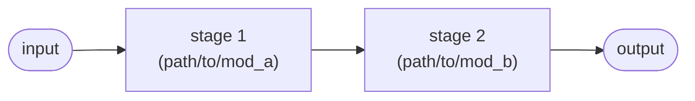

# Architecture (one page)

Owned by the **Software Engineer** hat. The **overview** below is hand-written
and must stay within one screen; the **module/function map** and the
**dependency diagram** are **generated** by the check harness so they cannot
drift (see [process.md §3/§7](process.md)).

## High-level flow

Hand-written and small. Diagrams are Mermaid fenced blocks — rendered natively
by GitHub/GitLab and the VS Code Markdown preview, no toolchain needed (see
process.md "Diagrams are text"). Replace this example with your data flow:

_Describe the data flow in a few nodes. Keep it readable at a glance._

## Runtime flows

Moved: the authored runtime-flow diagrams live in **`docs/runtime-flows.md`**
(scaffolded from `RUNTIME_FLOWS.template.md`), checked by
`python scripts/check_flows.py` and required from DevStg-Tests on.

### Program flow (generated)

The ordered steps of the entry/orchestrator function, generated from the code by
`python scripts/gen_arch_map.py --flow <entry>` (wire `--flow` into the harness's
map step). Keep the orchestrator thin so this reads as the high-level flow; the
diagram above carries the control flow this list omits.

<!-- BEGIN GENERATED FLOW -->
_(run `gen_arch_map.py --flow <entry>` to populate — e.g. `--flow run`)_
<!-- END GENERATED FLOW -->

## Module responsibilities

| Module | Responsibility | Key public items |
|---|---|---|
| `path/to/mod_a` | <one line> | |
| `path/to/mod_b` | <one line> | |

Design rules (reviewed): shared logic lives in one place (no duplication); pure,
unit-testable cores are separated from I/O / network / GUI shells; functions stay
small; each module has a single clear responsibility. The generated map and
dependency diagram below make violations (duplication, a forbidden import edge)
*visible* at a glance, but enforcing these rules is the reviewer's job, not the
harness's — don't read "reviewed" as "machine-checked".

## Module dependencies (generated)

The internal-import graph, harvested from the AST — each arrow is an import, so
a layering violation (e.g. an arrow from `common` into `engine`) is visible at
a glance.

<!-- BEGIN GENERATED DEPENDENCY DIAGRAM -->
_(run `python scripts/gen_arch_map.py` to populate)_
<!-- END GENERATED DEPENDENCY DIAGRAM -->

<!-- BEGIN GENERATED MODULE MAP -->
_(the harness regenerates the code map here from the source AST: per-module
summary, internal dependencies, and public symbols with `Implements:` back-links.
Run `python scripts/gen_arch_map.py`. To also surface it where agents read, add
the same marker pair to `AGENTS.md`/`CLAUDE.md` and pass `--doc` for each — see
process.md "Generated code map".)_
<!-- END GENERATED MODULE MAP -->
