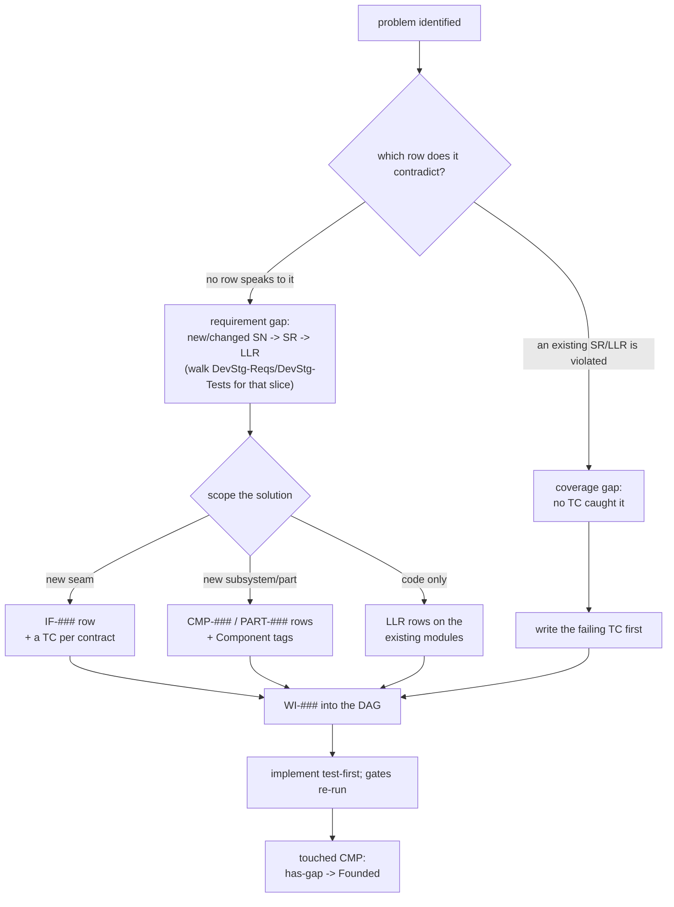

# Development Process (template)

<!-- kit-only -->
Copied into a new repo as `docs/process.md` by `scripts/bootstrap.py`, which
omits any sections `docs/kit-profile` turns off — § labels never renumber; an
omitted section keeps its heading plus a one-line stub.
<!-- /kit-only -->
Canonical method for a gated, requirement-traced project. It is
**stack-agnostic** — wire the harness commands to your project's
language/tooling — but it **requires a git repository**: diffable registries,
the append-only log, reviewed Status-change commits, and gate approval
all presume git. That substrate was always assumed; it is named here so no
one designs around its absence. Other docs reference this file by section rather than
restating it. Links are authored for the scaffolded home (`docs/process.md`
beside `docs/process-options.md`); at the kit's own location some relative
links don't resolve.

**Read this file top to bottom for the load-bearing core** (§1–§7): roles, ids,
the §3 discipline, the gates, the verdict protocol, the harness contract. The
opt-in layers — phased delivery, lifecycle tags, cross-project interfaces (§8),
NFR/perf budgets (§9), the multi-repo scale ladder (§10), and the §7 boundary
notes — are summarized here with an **applies-when** and expanded in
[`process-options.md`](process-options.md); skip any that your scope doesn't hit.

**Minimum profile — a standalone one-module project needs exactly:** the five
spine hats (§1), the id scheme (§2), the §3 traceability/anti-duplication
discipline, the bars **DevStg-Reqs→DevStg-Tests→DevStg-Impl** + the owner's final read (§4), the verdict protocol (§5),
review triage (§6), and the harness (§7). Everything else is opt-in: skip §8,
§9, §10, the `Phase`/`Lifecycle` tags, and every "optional" tripwire until the
scope forces it. (Skipping the `Lifecycle` *tag* doesn't skip DevStg-Reqs's per-phase
edge-case sweep — an explicit n/a per phase is all the bookkeeping this rung
owes.) That default is rung 1 of the §10 ladder.

**Proportionality — the process right-sizes itself.** Text-representable,
change-trackable artifacts are the **ideal** this process reaches for, not an
entry requirement: track *about* an asset in text even where the asset itself
can't be diffed. Where verification can't be mechanized, a **recorded human
attestation** (§4 `Attest`) is the honest floor — trust-based by nature (the box
can be checked without the work having happened), so the process's job is to make
it **explicit, named, and auditable**, never to pass it off as a mechanized
check. Over-aggressive traceability is itself a failure mode: right-sizing is the
process working, not a compromise of it (see §3 "Right-sizing"). The same
calibration sets the **decision-surfacing dial** at project setup — how often the
driver pauses for a human decision (§6). Full doctrine — including the
creative/subjective stance and the dial — in
[`process-options.md`](process-options.md#proportionality-doctrine).

---

## 1. Roles (hats), not necessarily separate agents

One driver wears these hats in sequence, keeping context. Spawn a *separate*
agent for an independent pre-gate review, to step a mechanical subtask down a
tier, or to give bulk content a dedicated context (all §6) — never to split the
hats' shared context.

| Hat | Owns (single source of truth) |
|---|---|
| Stakeholder | `requirements/stakeholder-needs.toml` (SN-###), failure-mode expectations included |
| UX / Docs | documentation quality, quick-reference, usability findings |
| System Engineer | `requirements/system-requirements.toml` (SR-###); **gatekeeper** |
| Software Engineer | `requirements/low-level-requirements.toml` (LLR-###) + code + `runtime-flows.md` |
| Test Engineer | `test/test-cases.toml` (TC-###) + the check harness + coverage/trace reports |

A hat only edits artifacts it owns; to change another, file a finding addressed
to its owner (§5).

**Domain hats (scope-dependent).** The five above are the spine; the
discipline perspectives beyond them — Security, DBA, SRE/Ops,
Hardware/Mechanical, an **Integration/Coordination** hat that allocates
cross-module budgets (`performance-budgets.csv`, §9) — are declared in the
shipped **hats roster** (`requirements/hats.toml`): one `[hat.NAME]` per
perspective carrying `applies_when` (a closed, evaluable condition), `asks`
(the question put to the decomposition) and `listens_for` (the failure class
it catches — a hat naming no failure is ceremony). The roster is **owner
text**, tailored with the frame at `DevStg-Boundary`; `scripts/hats.py` reads
it and the planning briefs put each applicable hat's question to the
decomposition, so edge-case and discipline coverage is regenerated per
decomposition, never hand-recorded. An obligation only a hat's charter demands enters the spine as
a **derived** SR naming the deriving hat in `Hat-Refs` — the SR/LLR cell listing,
by roster name, the perspectives a row is attributable to (an undeclared name is
a finding; a blank means *not recorded*, never *none applied*). An LLR lists only
what its own decomposition raised; the EFFECTIVE set derives as own + parents',
so re-ruling one SR corrects no child cell. A domain
hat owns the `SR`/`LLR` rows in its area (identify them by the LLR `Module`
or its component id) and brings its own release-checklist items.
The SR `Aspect` tag is **not** that grouping: it is an optional, closed-vocabulary
label for a **cross-cutting** concern no component partition can express, and a
row that is not cross-cutting carries none. Don't wear a hat the scope doesn't
need — cut the rows that don't earn their place. Like the others, it is
usually the same driver switching context — spawn a separate specialist agent
only for an independent high-risk review (§6).

## 2. Identifier scheme

| Prefix | Level | Parent link |
|---|---|---|
| `SN-###` | Stakeholder Need | — |
| `SR-###` | System Requirement | `SN-Refs` |
| `LLR-###` | Low-Level Requirement | `SR-Refs` (+ Module/CodeSymbol, Detail/Rationale) |
| `TC-###` | Test Case | `Verifies` (SR/LLR) |

Stable, zero-padded, never reused.

## 3. Traceability & anti-duplication

- **One fact, one home.** Reference by ID and link; never restate.
- **Decompose, don't paraphrase.** A child adds detail; if it would merely
  repeat its parent, link instead.
- **Registries are the machine source of truth; prose is thin** and links by ID.
- **A requirement states the system, not its own history.** No provenance in a
  living registry cell — on **any spine tier** (`SN`, `SR`, `LLR`, `TC`), in the
  normative cells **and the reason cell** alike: no work-item id, no citation of
  *this* document, no ruling, sitting, review-round or open-item reference, no
  decision id, no edit-history verb, no date stamp. Provenance belongs to the
  work-item registry and the log, and a row **obeys** the process rather than
  citing it, so it reads stand-alone to someone with none of your history. Naming
  the thing under specification — a script, an artifact path, the rubric a
  `Critique` row is judged against — is the *subject*, not provenance. `trace.py`
  gates under `--strict` on a work-item id or a process-doc citation and warns on
  the rest; pointer columns (`Module`, `CodeSymbol`, `TestRefs`, `Evidence`) are
  out of scope by design.
- **One requirement, one `shall`** — exactly one obligation, one testable
  behavior, never a compound "and/or". The full quality bar and the statement
  pattern that carries it are stated once, just below the bullets.
- **One decision per row; one home per method.** A single interface or method is
  fully defined by exactly one requirement, and a requirement calls out at most
  one method/action. Two rows sharing one interface identity — or one row
  deciding both *which artifact* carries a capability and *what its methods
  do* — is a tiering defect, not a style choice. Exceptions are extraordinarily
  rare and ride the one-`shall` valve: a recorded per-row waiver, written as
  `recorded waiver: <reason>` in `Rationale`. `trace.py` warns (never gates) when an SR's direct-LLR fan-out
  exceeds the declared bound (default 7): a *detector* for merged rows,
  deliberately not a cap — a hard cap invites merging LLRs to slip under it —
  so a row past the bound either splits by observable class or keeps a per-row
  re-stamp with its reason.
- **A need or requirement cell names no concrete artifact unless its reason
  cell records why constraining that artifact is necessary.** Absent that reason
  the SN and SR tiers speak in delivered-capability or artifact-class voice
  ("the delivered harness", "the launchers at the repository root") — an SN
  `acceptance` states the observable *condition*, never the instrument that
  observes it — and a concrete filename lives in `AcceptanceCriteria` as
  rewritable current-carrier evidence ("read off the current carrier, as the
  current set: …") or at the LLR tier. Why a file exists is answered at its
  binding homes — the shipped-file inventory, the LLR `Module` cell, the
  interface registry — never by minting artifact-establishing requirements. An
  *altitude* rule: `trace.py` warns (never gates) on an artifact token in either
  cell without that recorded per-row waiver — `recorded waiver: <reason>`, in
  `Rationale` at SR and `why` at SN (
  the tier's reason cell, since the need schema carries no `Rationale`); the
  provenance rule above still reads a named script as subject, not provenance.
- **A rationale carries its own reason, and only that.** `Rationale` (`why` at
  `SN`) is complete when a reader with none of your history knows **what breaks
  without the requirement** and **which alternative lost** — stated as standing
  prose, carrying no citation frame of any kind. A reason cell is not a changelog:
  the detailed history — which review raised it, which sitting ruled it, when —
  lives in the log and the archive, which can hold it in full and cannot rot into
  the specification. **Drop the frame, keep the reason**: where deleting the
  citation would leave a bare assertion, restate the reasoning as prose that
  stands on its own. Deleting the citation *and* the reasoning with it is the
  failure this exists to prevent.
- **The traceability matrix is generated** by a small join over the registries'
  ID/parent columns; it reports **orphans** (req with no child/test; test/LLR
  with no parent). Hand-maintaining the matrix is forbidden.
- **Code carries back-links to the depth you declare** (`Implements: SR-007,
  LLR-014`); test names embed the verified ID. The registry rows are
  authoritative. The obligation is a DIAL, not a blanket rule:
  `docs/process.toml` `[checks] backlink_coverage_min` is the minimum share of
  live LLR rows a literal `Implements:` declaration must name, and the harness
  reports the measured share every run. It ships at `0` — report the number,
  gate nothing — and rises by writing the declarations, never by lowering the
  bar. A regulated setting raises it rather than being handed a softened guide.
- **Architecture is derived, never committed**: the module/function map, import
  graph and seams are read live from the source tree and the registries into the
  dashboard, so there is no markdown copy to drift. The one authored narrative
  that survives is `docs/runtime-flows.md` (the Runtime flows the DevStg-Tests
  bar requires).
- **Modularity/dedup**: shared logic in exactly one place; pure cores separated
  from I/O/GUI shells; small functions; one-page-readable architecture.
- **Consolidate, don't duplicate — the 0→A→B rule.** Edit-conservatively (agent
  guide, "Working agreement") is scoped to the task in front of you: smallest
  diff, within that one change. Across the codebase the goal is the opposite —
  prefer the change that minimizes **total** behavior. When a fix wants the
  same code in two places, don't patch each site: extract the shared stage
  both sites call through, so two independent paths to a result (0→B, 0→D)
  become one shared stage feeding both (0→A→B, 0→A→D). Where two or more
  existing outputs already overlap, restructure so each behavior has exactly
  one home — never an original plus a near-copy. The same principle governs
  validation and error handling: implement once, at the boundary that owns the
  behavior, never re-derived at each caller — this is the antidote skill's
  "validate once at the boundary" applied at repo scale (vendored at
  `skills/antidote/`, a per-fix companion to this repo-scale doctrine).
- **Thin orchestrators**: an entry point / top-level routine should *compose, not
  compute* — a short, ordered sequence of well-named calls so that reading it is
  the high-level flow. Push logic down into the named steps. The flow is
  generated from the orchestrator (`gen_arch_map.py --flow`, see below), so a
  routine that inlines logic instead of delegating shows up as a short,
  uninformative flow — a built-in tripwire.

**Requirement quality — the eight characteristics.** Write in **simple technical
English**: short declarative sentences, one clause per idea, defined terms only,
and one name per thing (never a synonym for a term already chosen). Every
requirement — hand-authored or generated — aims at all eight, at every tier:

| Characteristic | What it means here |
|---|---|
| **Necessary** | Removing it would leave a gap; no filler, no placeholder rows. |
| **Singular** | Exactly one `shall`; one testable behavior. No compound "and/or" obligation. |
| **Unambiguous** | One interpretation; defined terms only; no "etc.", no undefined pronoun. |
| **Complete** | States trigger, response, and — where they apply — timing/threshold **with units**. |
| **Verifiable** | A test or analysis method can confirm it (§4's four verification classes). |
| **Feasible** | Achievable within the declared stack, architecture and resource budget (§9). |
| **Conforming** | Uses the statement pattern below and the §2 id scheme. |
| **Traceable** | Carries a stable unique id and its parent/child links (§2; the matrix above). |

**The statement pattern is EARS** (Easy Approach to Requirements Syntax): the
condition goes **in front of** the subject, so a reader learns *when the
requirement applies* before *what it obliges*. One pattern per row:

| Pattern | Grammar | Use when |
|---|---|---|
| Ubiquitous | `The <system> shall <response>.` | It always holds. |
| Event-driven | `When <trigger>, the <system> shall <response>.` | A discrete event starts it. |
| State-driven | `While <state>, the <system> shall <response>.` | It holds for the duration of a state. |
| Unwanted behavior | `If <trigger>, then the <system> shall <response>.` | The trigger is a fault, an error, or misuse. |
| Optional feature | `Where <feature is included>, the <system> shall <response>.` | It applies only where that feature/option is present. |

A complex row nests them (`While <state>, when <trigger>, the <system> shall
…`). A condition written any other way — "Before …", "During …", "For … work",
or buried after the `shall` — is the same condition **outside** the pattern:
invisible to a reader scanning openings and to every tool that reads them.

**What a checker settles, and what it cannot.** `trace.py --strict` gates the
decidable half of Singular/Unambiguous/Conforming: no second `shall`, no
`should`/`may`/`will` in normative text, no unfalsifiable adjective ("robust",
"minimal"), no open-ended "such as", no actorless passive, and no `shall` in an
`LLR` (the SR states the obligation; the child decomposes it). A multi-clause
`AcceptanceCriteria` is fine — it enumerates how *one* obligation is checked. A
non-EARS opening **warns** rather than gates: the wording is a judgement about
which pattern the row is, not a defect a script can settle. **Necessary,
Complete and Feasible stay the consistency review's** (§4/§6), and no proxy
metric is offered for them.

**Right-sizing has guardrails — and a name for the calibrated shortcut.**
"Simplest thing that works" (the agent guide's "Right-size the solution") is
calibrated, not flimsy: it never trims **validation at trust boundaries**, error
handling that would **lose or corrupt data**, **security**, **accessibility**, or
understanding the problem (root cause, not symptom) before fixing it. Where a
deliberate simplification is still right, mark it inline with a **`SHORTCUT:`**
comment naming the **ceiling** it accepts (a global lock, an O(n²) scan, a naive
heuristic) and the **upgrade path** past it — so it is greppable, reviewable, and
never mistaken for the final design. One tag, defined once; not a taxonomy.

Right-sizing cuts the *other* way too: **over-aggressive traceability is a
failure mode in its own right.** Traceability founds sustainability, but pushed
past what the scope earns it becomes an overly complex, overly constrained
process that bogs development down — so trimming it to fit is the process
working, not a lapse from it. This bites hardest in **creative / subjective
domains** (game story, music, artwork, voice acting — mostly binary, mostly
human-judged): there the spine's value is at **high altitude** — `SN→SR` to
ensure nothing key is missed or silently broken as work moves forward — and you
**descend to LLR/TC granularity only where a mechanized check earns its keep**,
not to decompose inherently subjective work into fine-grained rows a script still
can't verify. Where the honest floor is a human's judgment, name it `Attest`
(§4) rather than inflate a subjective call into a false `Test`.

**Reviewability — review the source, not the render.** The registries (the
`SN`/`SR`/`LLR`/`TC` TOML files) are the tracked, line-by-line-reviewable source
of truth; every other view is *generated* from them. Generated output splits by size:

- **Small, diff-meaningful blocks** live in tracked files behind `GENERATED`
  markers, kept honest by a freshness gate — the code map, dependency diagram,
  and program flow (`gen_arch_map.py --check` fails a trunk-lane commit that
  left them stale; on a claimed work branch freshness skips — generated
  artifacts are trunk-only, regenerated after each merge). These you *do* read
  in diffs.
- **Large composite artifacts** — the full trace report (`test/report.md`: counts,
  matrix, the `SN→SR→LLR→TC` text outline, and the Mermaid graph), the HTML map
  (`trace.py --html`), and the perf report (`test/perf-report.md`, §9) — are
  regenerated every run, **gitignored**, and published by CI as artifacts. Don't
  diff these; review the registry change that produced them.
- **Committed goldens** — a small generated file you *do* commit and review as the
  record of an accepted change: the perf baseline (`test/perf-baseline.json`,
  §9). Moving a number means committing the new golden in the same PR — explicit,
  never silent.

This is the "composite artifacts are ignored from change tracking" rule, named:
the cost of reviewing a big regenerated file is never paid, because the small
registry diff already carries the intent.

**Commit cadence — reviewable change exists only once committed.** Everything
above buys its value at **commit granularity**: line-diffable registries, the
drift-gated map, committed goldens — none of it protects work sitting
uncommitted in a working tree, which can't be diffed, reviewed, reverted, or
bisected, and can simply be lost. So **commit early and often**: a small,
single-purpose commit at each green step (one finding closed, one requirement
decomposed, one registry edit plus its regenerated blocks), never a
session-sized batch. The pre-commit floor (§7) is deliberately fast and
**always-valid** *so that* frequent commits stay cheap — that is its design
intent, not a coincidence. A commit is not a release and not a gate: the bar is
"floor-green plus a coherent, describable change", never perfection — polish
arrives as further commits. End every session with a **clean tree**: work
either committed or explicitly parked as a finding/assumption in `status.md`,
never silently stranded. Agent-driven work can keep this cadence *and* a
readable history: under the opt-in iteration-branch layer
([`process-options.md`](process-options.md) "Agent iteration branch & sync")
the agent commits often on its own `llm/{branch}` and the development branch
receives each leg **collated into categorical commits** at sync.

**The doc set must stay navigable (the doc map stays honest like the code map).**
The freshness gate above keeps *generated* blocks honest; the hand-written docs
get the same guarantee. `scripts/check_docs.py` (stdlib, a process check — §7)
parses the Markdown under `docs/` plus root `*.md`, builds the link graph, and
**fails on broken intra-repo links** (a missing target file or `#anchor`) — the
machine version of the "verify no broken intra-doc links" step the gates ask a
human to do. It also **warns on orphan docs** (no path from an entry root —
root `*.md`, an optional `docs/index.md` Map-of-Content, or a configured entry)
and, with `--stale` (git-gated), on a doc left frozen beside a non-doc file it
links that has changed. Broken links are a hard finding; orphans/staleness are
warnings (a young project legitimately has standalone docs). Run by `check.py`
from DevStg-Reqs on.

**Interface contracts live at the code, referenced — not restated.** Every public
module/function documents its contract once, where it is implemented, as a
structured block a reader can grep inline: *Inputs* (each parameter's type and,
where it matters, its **range/enum/units**), *Outputs* (return type/shape),
*Config* (keys it reads + constraints + where they live), *Raises/Errors*
(failure modes and what they signal). Keep it **non-duplicative by referencing
IDs**: a constraint already captured as a requirement (an input range, an
accepted set) lives once in the SR (its `AcceptanceCriteria` and `Permutations`)
and the block cites the id (`SR-012`) instead of restating it. The block carries
`Implements: SR/LLR`, so intent stays in the registry, the implemented signature
stays in code, and the link is explicit; the code map harvests the summary and
back-links so a reader finds the contract in one hop. (Exact tag syntax is the
agent guide's job — `AGENTS.template.md` "Define the interface (contract) at the
code".)

**Generated code map — route the AST into the agent's working file.** An agent
edits faster and more safely with a *current* index of the code in the file it
already reads, instead of re-deriving the layout each session. So the harness
parses the source (AST) and generates, between marker comments, a per-module map:
each module's **one-line summary** (from its docstring/header); its **internal
dependencies** (which in-tree modules it imports) — making layering invariants
auditable (e.g. "Common must not import Engine") and showing a change's blast
radius; and each public symbol's **signature**, summary, and `Implements:
SR/LLR` back-links. Because it is harvested from docstrings and `Implements:`
comments, commenting for humans (agent guide's "Comment for humans — and the
map") directly improves the map. Reference generator: `scripts/gen_arch_map.py`
(Python AST, stdlib); each stack ships its own equivalent (a PowerShell or
ts-morph version) writing into the **same marker block** — that block is the only
contract.

**Routing (where the map lands).** The map's ONE rendered home is the
dashboard's "How (SW architecture)" tab, derived live from the source AST —
no committed markdown copy to rot. `gen_arch_map.py --doc` (repeatable) can
ALSO splice it *directly into `AGENTS.md`/`CLAUDE.md`* (zero
hops, but the guide's diff churns with the code; good when the map fits on a
screen); there `--check` fails the gate if stale, so it never rots. Don't
hand-maintain a code map.

**The derived map is a contract, not a search index.** The AST inventory is
**derived, deterministic and drift-proof** — the dashboard and the checks read
the source itself, learning the code's *actual* shape. Query-time
**semantic-retrieval tools** (LSP-backed code-graph servers, Serena-style MCP
indexes) are a *different* thing: not committed, language-server-dependent,
rebuilt on demand. They are a legitimate **optional downstream accelerator** for
chasing references across a large repo, but they **don't replace** the committed
map and the kit must **not** hard-wire one (it would break stdlib-only and add a
server/LSP dependency). Use one if it helps; keep it off the required path.

**Generated high-level flow.** `gen_arch_map.py --flow <entry>` emits an
entry/orchestrator function's ordered internal calls (each with the callee's
summary) into a `GENERATED FLOW` marker block — a drift-proof rendering of the
"Thin orchestrators" rule. Put the markers in the agent
file if you route a map there. It complements, not replaces,
the hand-written flow overview.

**Design-time runtime flows (authored at DevStg-Tests, checked).** Everything above is
harvested from code, so none of it exists at DevStg-Tests — yet DevStg-Tests is when a human reviews
the LLRs, and runtime *behavior* (ordering, concurrency, background work, what
blocks on what) is the thing most easily misread from registry rows. So the Software
Engineer hat authors **`docs/runtime-flows.md`** ("Runtime flows") **with
the LLRs, before the DevStg-Tests review**: one Mermaid `sequenceDiagram` per key
user-visible scenario, and always one for any concurrent / asynchronous /
non-blocking behavior. Participants are the planned modules (the LLR `Module`
column); each diagram cites the SR/LLR ids it renders. `scripts/check_flows.py`
(DevStg-Tests/DevStg-Impl) fails when the doc is missing, has no diagrams, a diagram cites no
SR/LLR id, or a cited id doesn't exist. The human's DevStg-Tests review starts from these
diagrams — verify the flow there, then spot-check the rows. Update a flow in the
same change that alters its LLRs; from DevStg-Impl on the generated map/flow corroborates
these authored diagrams rather than replacing them.

**Diagrams are text (Mermaid); the dependency graph is generated.** Diagrams live
as ```` ```mermaid ```` fenced blocks inside the Markdown — rendered natively by
GitHub/GitLab/Gitea and the VS Code preview (offline-capable), so no diagram
toolchain is required and the source diffs like prose. Hand-written diagrams (the
one-page flow, sequence diagrams) follow the same anti-duplication rule: reference
IDs, don't restate requirements. The module **dependency diagram is generated** —
the dashboard renders the internal-import graph live, and `gen_arch_map.py`
splices a Mermaid twin into the `GENERATED DEPENDENCY DIAGRAM` markers
wherever a routed doc carries them, covered by its `--check`, so the layering
picture can't drift. Don't commit exported diagram images; the text block is the
source. A project that genuinely outgrows Mermaid (PlantUML/C4/BPMN, AsciiDoc
sources) wires a Kroki/PlantUML toolchain as *project* tooling — deliberately
outside the kit's required path.

## 4. Objectives, gates, and exit criteria

Advance only when criteria pass. **Who accepts an advance is the repo's
declared gate authority** — the `[attestation] human_approval_through` dial
in `docs/process.toml`, an ordinal `0`–`4` counting how many spine tiers stay
**human-held** from the top (`4`, the shipped default: every tier's gate pauses
for a human; `3` releases the TC tier, … `0` holds nothing). A held tier's gate
waits for a per-gate human approval; a released tier's closes on an independent
fresh-context LLM reviewer's recorded verdict. The words `attended` /
`single-approve` / `autonomous` are `--gate-policy` **presets** that *translate*
into the `[attestation]` dials and are never stored. Full
mechanics + the deviation-register pattern:
[process-options.md "Gate authority levels"](process-options.md#gate-authority-levels).
**Fixed points at every level:** the owner's final read is the human's; no un-run greens; the
harness is still the bar (LLM judgment never waives a red check); approved
owner decisions are never re-decided by an agent. A coordinator can loop fresh
driver sessions under any level, stopping where the level requires a human —
the stop banner + typed exit codes:
[process-options.md "Unattended operation"](process-options.md#unattended-operation-walk-away-runs).
The rung in `docs/stage` is **derived from the artifact states**, not
hand-set: `scripts/derive_stage.py` generates it as the **min over every in-scope
artifact's own rung**, so it names the rung the repo is IN and thereby
selects the strictness the harness runs at ("Stages and gates" below). Crossing a
gate = **approving a batch of artifacts in a reviewed commit** (`Status`
`Drafted`→`Approved`, at every tier including SN), never a manual bump (§7
"The derived gate"; the model + parallel/series workflow:
[process-options.md "Derived gate model"](process-options.md#derived-gate-model)).
A `Drafted` artifact lives in the live spine (exempt from the decomposition rules),
retiring the old `-000`/off-spine drafting workaround.
`Status` is a **closed** vocabulary — `Drafted`, `Approved`, `Founded` — matched
**case-insensitively** (write them Title-Case); a value outside it is an
always-on integrity finding, not a free label — it was open until 2026-08-15,
and a word no predicate read announced nothing.
`Approved` says the row's TEXT is blessed and says nothing about tests passing —
whether they pass is the harness's answer, never a cell's. `Founded` is
`Approved` plus a demonstration: the artifacts the row calls for EXIST (SRs
under an SN, LLR+TC under an SR, resolving code under an LLR, a written test
under a TC). It is COMPUTED, never a claim you type to advance a gate.
**A post-approval amendment has no value of its own** — an approved row whose
text is later changed stays `Approved` and the change is caught by DIFFING it
against the last approval. (A transitional `Modified` marked that state until
2026-08-20; it is retired, and an adopter carrying it migrates —
`RESYNC_PACK.md`.) A re-attest is a reviewed commit that re-reads the changed
cells and re-copies the record. The baseline those before/after diffs run against is a
**byte-for-byte copy** of the registries at the last approval —
`docs/archive/last_approved/`, written only by the approval act itself
(`intake.py snapshot`, in the same commit as the `Status` write; a snapshot
file must always equal its live counterpart) and replaced wholesale at each
approval. Amend and re-copy in the **same commit** (a `--staged`
warn enforces it); a row's `Status` answers for its **own cells** — a child
(LLR/TC) amendment never touches its parent SR (owner ruling 2026-08-17). A
child change surfaces through the snapshot-drift arm; chain-completeness is the
derived `Founded` state's claim (D-9), never the signature's. **Sequence requirement-text work *into* an open window, not after it:**
a prose standard, a registry schema change or a cleanup lands while the sitting
is still owed, so its rows join the batch a human is already reading. Landing it
after a re-attest drifts freshly-blessed rows straight away from the record and
buys a second sitting for the same reading.
Define machine-checkable criteria wherever possible; classify the rest honestly.

- **DevStg-Reqs — Requirements, UX & constraints.** The `PROJECT-VISION:` tag exists in
  `README.md#vision` (the purpose fact's canonical home; other docs point at
  it, never restate it) and the consistency review reads each need against it —
  human-judged, like the rest of that review. SN complete (priority + measurable
  acceptance intent + edge cases, the edge cases covering **each lifecycle
  phase** in the project's vocabulary — Provision/Startup/Runtime at minimum —
  or recording an explicit n/a per phase; see "Lifecycle phase" below); every
  SR links ≥1 SN with measurable acceptance criteria; usability/doc needs +
  constraints + non-goals captured. Sign-offs: Stakeholder, UX, System Engineer.
- **DevStg-Tests — Decomposition & test coverage.** Every SR → ≥1 LLR (or
  Analysis/Inspection/Attest); every SR and LLR → ≥1 TC; traceability **0 orphans** and
  ids unique/well-formed; **no `-000` placeholder rows or flow citations remain**
  (`trace.py`/`check_flows.py --no-placeholders`); **every SR with variable
  inputs has its dimensions enumerated (`Permutations`) and a stated combination
  strategy, with boundary values covered** (see "Dimensional coverage" below);
  **key runtime flows are diagrammed and pass `check_flows.py`** (see §3
  "Design-time runtime flows"); harness runs locally + CI. Sign-offs: System
  Engineer, Test Engineer.
- **DevStg-Impl — Implementation (test-first).** Code is written **test-first**: each DevStg-Tests
  TC becomes a *failing* test before the code that satisfies it, then the minimal
  code to pass, then refactor (red → green → refactor). TDD is *how* DevStg-Impl code gets
  written; the SN→SR→LLR→TC spine is *what* it must satisfy — it operates within
  the traceability discipline, not instead of it. The exit criteria below
  (coverage, every in-scope SR Approved) are what that loop drives toward.
  Format/lint clean; every source module parses
  (`gen_arch_map.py --strict-parse`); the **full** test tier passes; coverage ≥
  `COVERAGE_THRESHOLD`; registry **schema** holds (required fields non-empty,
  `Verification`/`Tier` in vocabulary — `trace.py --strict-schema`); every
  **in-scope** test-verifiable SR **Approved** (phase-scoped — see "Phased
  delivery" below); every other SR explicitly **Demonstration / Manual /
  Inspection / Analysis / Attest / Critique**; each in-scope SR's implementing symbol is **substantive, not a
  stub** (Inspection — see "No-stub / substance review" below). Sign-offs: System
  Engineer, Test Engineer.
- **`DevStg-Release` — Release readiness** *(per release; skip for a one-off
  deliverable)*. The **release** test tier passes (incl. slow/hardware tests);
  the generated **release checklist** (`scripts/gen_release_checklist.py`) is
  completed and signed; version bumped; changed `approved` interface versions
  communicated to counterparts; docs/changelog updated. Sign-offs: Test Engineer,
  any active domain hats, Human.
- **Acceptance — the owner's final read.** Human/stakeholder exercises the real product (incl.
  Demonstration/Manual items) and approves. For shipped software this is the
  human half of DevStg-Release; for a bespoke deliverable it stands alone.

**The stage ladder — one vocabulary, one axis.** **A stage is a STATE: the repo
is *in* exactly one rung, and that rung is DERIVED from the artifact states, never
declared.** Approval is an **event** that moves it — a named human signing off
a reviewed Status-change commit — and an event is recorded where events are (the
phase anchors, §5), not as a second value beside the state. There is no separate
"bar" axis and no second spelling: a certified rung boundary is **a rung that a
named human signs off**, and the **three signed boundaries are a strict subset of
the eight rungs**. (Owner rulings 2026-08-18 and OI-51. Three vocabularies have
now failed here, each the same way — by carrying two questions on one token. The
`G*` tags had one axis saying both "already met" and "to pass next"; the  <!-- check_vocab: allow -->
`DevBar-` prefix split the spelling instead of the question; and the derived  <!-- check_vocab: allow -->
three-value bar that followed was a MIN over every row, so one drafted
requirement collapsed it to what a fresh scaffold reads. The ladder answers
"where is this repo" once, and everything else asks it.) **Eight rungs; the three
whose boundary a human signs are marked:**

```
DevStg-Needs      vision and stakeholder needs in work
DevStg-Boundary   the system's frame: what is outside, what crosses,
                  each crossing typed.  HAPPENS ONCE.
DevStg-Reqs       the obligations at the current level's boundaries,
                  system and component alike.  RECURSES.
   ══ DevStg-Reqs CLEARED ══   Stakeholder, UX, System Engineer
                               → the project enters DevStg-Arch
DevStg-Arch       partition each scope into sub-boundaries.  RECURSES;
                  exits when no child needs partitioning.
DevStg-LLReqs     the inside of a leaf, bound to a realization artifact
                  (a code symbol, or a part source).  TERMINAL.
DevStg-Tests      the test set for those obligations in work
   ══ DevStg-Tests CLEARED ══  System Engineer, Test Engineer
                               → the project enters DevStg-Impl
DevStg-Impl       implementation in work
   ══ DevStg-Impl CLEARED ══   System Engineer, Test Engineer
                               → the project enters DevStg-Release
DevStg-Release    nothing in work; release checklist available
```

**One value, and everything reads it.** `docs/stage` records the rung the repo is
**in**, derived over its SETTLED spine so a draft cannot lower it, with the
honest unfloored reading beside it. `check.py --stage <rung>` runs every step
declared at or **below** that rung (OI-51); `[attestation]
human_approval_through` names the highest rung a human still approves, and
holds every rung at or **below** it — the same ladder read from each end. A
sign-off record names the rung whose boundary was **just** signed and therefore
the rung the project has **entered**. **`DevStg-Release` has no signed boundary
and no cell can reach it** — leaving `DevStg-Impl` means the declared tests PASS,
so its one input is the harness-written `docs/test/evidence` record
(`record_test_evidence.py`), bound by value to the tree it measured.

**Requirements come before architecture**, because architecture is a *response*
to requirements: a scope is partitioned in whatever way best satisfies its
obligations, so partitioning first means partitioning against nothing but the
frame. An interface and a requirement say different things — an interface says
*what crosses* (provider, consumers, contract, type), a requirement says
*what must be achieved* — so neither derives from the other.

**The frame is a registry, not prose.** `DevStg-Boundary`'s deliverable is
`requirements/external.toml`: who is outside (`[entity.EXT-###]`), what
crosses the boundary (`[boundary.B-##]`), and the external-to-external flows
the system is *not* a party to (`[relationship.REL-###]`). An SR states an
observable **at** a crossing and cites it (`boundary_refs`); an IF row that
realizes a crossing ties back to it directionally (§8).

**The boundary happens once; the recursion lives in the two rungs after it.**
Only the system's own frame comes from the needs and the context; every boundary
below it is *produced by* a partition, and a partition **is** the next level's
boundary declaration. So the repeating unit is two steps — state the obligations
at the current boundaries, then partition them into sub-boundaries — and
`DevStg-LLReqs` is where it stops: a requirement that still needs allocating to
sub-parts is a `DevStg-Reqs` requirement for that sub-scope; one that **binds**
to a realization artifact is an LLR, and that is the floor. **The tier does not
recurse, the activity does.** Depth is a property of the component tree
(`PartOf`), never of the requirement tier — which is why the ladder carries no
depth and adds no sub-rungs.

**The ladder is therefore not monotonic**, and that is the truth about iterative
decomposition rather than a defect in the report: `DevStg-Reqs` and
`DevStg-Arch` oscillate as the recursion descends. Identifying a sub-component
mints a drafted `CMP` row, which drops the reported stage back to `DevStg-Arch`
with nobody deciding to. That is what makes the recursion **self-reporting** — it
needs no ladder machinery at all. If a monotonic reading is wanted it is a
second, derived high-water number shown *beside* the honest one, never instead.

**The label is the identifier; the position is derived.** A stage is
`DevStg-<Label>` over a **closed vocabulary** — not a minted id, so it takes no
`docs/id-watermark` space and no retire-never-remint rule. The ordinal is *not*
in the key, because position changes when the ladder changes and this kit's
standing rule is that derived facts are generated and rendered, never authored
into a key: `docs/stage` records `stage = DevStg-LLReqs`,
`stage-ord = 4`, `stage-of = 8` and renderers show "stage 4 of 8, …", so a new rung
self-corrects every ordinal with no citation moved. **Every comparison routes
through a `STAGE_ORDER` lookup that raises on an unknown label**; ordering
operators on the raw value are banned, and are now obviously wrong rather than
accidentally right (`DevStg-Arch` sorts *before* `DevStg-Boundary`).
**There is no `DevStg-Below` you sit at** — it is the internal sentinel below the
lowest runnable bar; say "stage Needs", never "at DevStg-Below".

**The approval dial is a rung, on this same ladder.** `[attestation]
human_approval_through` takes a `DevStg-*` value (or `DevStg-Below` for
"nothing is human-held"), and every rung **at or below** it is the human's to
approve. It was a 0–4 tier ordinal mapped onto the ladder by a declared table
until OI-21 shape (ii) landed; a repo still carrying the number is read,
translated and warned, and `bootstrap.py --migrate-config` rewrites it. The two
inserted rungs need no special case any more: `DevStg-Boundary` sits immediately
above `DevStg-Needs` and `DevStg-Arch` immediately above `DevStg-Reqs`, so each
is held whenever the rung below it is — the direction that errs toward *more*
human involvement — and now by the ORDER rather than by a hand-written pairing.

**What a signature certifies is NOT derivable from the rung.** Leaving
`DevStg-Reqs` also requires non-goals captured and a UX sign-off; leaving
`DevStg-Tests` requires the key runtime flows diagrammed. No derivation can see
any of that, which is exactly why approval is an **event a human records**
and not a function of the state. A repo that inferred its sign-offs from its
derived rung would have dropped the whole human half.

**The retired vocabulary** — the tags this ladder replaced survive only as
read-side aliases, which is `check.py`'s and `check_vocab.py`'s behaviour, not a
rule prose has to carry; the retirement record, the translation table and the
never-reword rule for attestations are archived in the kit repo at
`docs/archive/retired-vocabulary.md`.

**And the derived value floors — it does not achieve.** Being a min, one
`Drafted` row pulls it down (deliberately: that is the new-phase
signal), so a mature spine holding one draft displays exactly what a fresh
scaffold displays. The value answers *what must still be passed*, never *what
has been achieved*; `stage=` and `ex-draft=` on the basis line are what tell the
two apart.

**Consistency review (DevStg-Reqs; re-checked at DevStg-Tests).** Separate from the *structural*
checks `trace.py` runs — orphans, duplicate ids, schema — the **System Engineer**
hat reads the needs and requirements **against each other** for the conflicts a
script can't see: contradictory acceptance criteria or limits, mutually exclusive
behaviors, duplicate or overlapping requirements, ambiguous / underspecified
needs, and overlapping module/hat ownership. One recurring ambiguity gets its own
rule: **every comparative or absolute term in an acceptance criterion must name
its predicate** — "identical" / "indistinguishable" / "equivalent" / "same as" /
"matches" is untestable until it says identical *in what*, judged *how* ("cannot
distinguish source by schema" → "identical field names and dtypes, per the
IF-### row"). `trace.py` flags unpinned comparatives as **warn-only advisories**
(a heuristic lint, never a gate failure); the reviewer pins the predicate or
accepts the wording knowingly. This is the **consistency**
complement to DevStg-Reqs's *completeness* criteria, not a restatement of them, and it is
**human/LLM judgment, not a machine check** — classify it as a Manual/Analysis
activity and never imply `trace.py` performs it. (An independent LLM reviewer
(§6) is well-suited to a first-pass contradiction sweep, but the **human makes the
call**.) Route each contradiction or ambiguity through the §5 findings protocol to
its owner; where it needs a human decision, **pause and ask — don't guess**. This
is the reachable-human flip side of *Assumptions* logging: record an assumption
only when **unattended**; when a human is available, **solicit clarification**.
Track unresolved ambiguities in `status.md` *Open items*, and re-run the review at
DevStg-Tests when SRs decompose into LLRs.

**No-stub / substance review (DevStg-Impl).** Traceability, coverage, and a green suite
confirm an implementation *exists* and *passes*; none confirms it has
**substance**. A body that is `pass` / `...` / `raise NotImplementedError` / a
bare `return None` / a placeholder return satisfies its trace links and can even
hold a coverage line, yet does nothing. So the DevStg-Impl criterion adds: **every in-scope
SR's implementing symbol does real work, not a stub.** TDD mitigates this (a
red-first test should fail against a stub), but coverage can be met by exercising
a stub's trivial path, and Demonstration/Manual/Analysis SRs have **no** automated
test to fail — so name it. It is **Inspection** (human/LLM judgment, **never a
machine verdict**): fold the prompt into §6's independent-reviewer checklist — a
fresh-context reviewer reads the §3 code map (which harvests each symbol's summary
and `Implements:` back-links) and confirms the body matches the requirement. The
kit ships an **optional, Python-reference tripwire**, `scripts/check_stubs.py`
(§7), listing trivial-bodied public symbols; like the perf *meters* it is
**product-layer and warn-first** (a stub's shape is language-specific; a tiny
pure function is not an unfinished one), so it informs the Inspection, not
replaces it. Same stance as `ruff`/`pytest`: name the criterion; the project wires
the tool.

**Phased delivery (version subsets) — opt-in.** *Applies when* a roadmap ships
phase 1 before 2/3. Every approved SR/LLR/TC carries the **`Phase`** it was
approved in — a bare integer, digits only (an approved prefixed/blank cell is a
schema finding once any row is phased); an SN's phase is
derived from its SRs. The project's **current phase is derived** = the highest
approved phase, mirroring the derived rung (`derive_stage.py --next-phase` prints
the next number); a phase increments only when re-opened scope is **confirmed**
— an adjudication verdict that scope moved, or an approved draft-SN batch —
never on the raw derived-stage drop.
Traceability stays phase-blind while the DevStg-Impl approval criterion and DevStg-Release
scope by phase (`check.py --gate DevStg-Impl --phase 1`; the foundation phase is always in
scope), reporting out-of-phase SRs as **phase-deferred**.
Full semantics in
[`process-options.md`](process-options.md#phased-delivery); standalone single-shot
deliverables skip it.

**Lifecycle phase (when in the product's life a requirement holds) — opt-in.**
*Applies when* install/startup requirements are easy to miss (most non-trivial
products). Distinct from the delivery `Phase` above, an optional **`Lifecycle`**
tag (blank = **Runtime**) records *at what point in the running
product's lifetime must this hold, and how often?* — default vocabulary
**Provision** (ready) · **Startup** (set) · **Runtime** (go), an open,
project-named set. Naming it stops the perennial miss of writing only
steady-state requirements. Full vocabulary, the "discriminate by when/how-often"
rule, and the config-straddles-Provision↔Startup guidance are in
[`process-options.md`](process-options.md#lifecycle-phase).

**Constants:** `MAX_ROUNDS = 4` per gate (then escalate to the human);
`COVERAGE_THRESHOLD = 80%` line coverage (adjust by agreement; record it in
`docs/stack.ini` `[coverage]` — §7's declared home).

**Verification methods:** the classic four — `Test` · `Demonstration` ·
`Inspection` · `Analysis` (`TDIA`, per MIL-STD-961E / ISO/IEC/IEEE 29148 / INCOSE
SE Handbook) — plus three the kit names: `Manual` (a human procedure that isn't
`Attest`), `Attest`, and `Critique`. Definitions follow the standard rather than being restated
here; pick the cheapest method that actually establishes the criterion, and don't
claim `Test` for something only a human can confirm. **`Attest`** is the kit's
honest extension (nearest standard analog: a witnessed test / QA sign-off record,
but the attested-vs-mechanized *reporting* is deliberately beyond the standards):
the floor for what can't be mechanized at all (a playtest, a creative review, a
physical action) — a **named human's recorded judgment**, **trust-based, the box
can be checked without the work having happened** (Proportionality doctrine); the
process's job is to make it explicit, named, and auditable, not pass it off as a
check. Its TC records **who** attested and **when** (`Parameters`/`Expected` cell,
`Automated=No`); `trace.py` accepts an `Attest` SR as Approved **and** reports it
under "attested vs mechanized" so an audit sees the trust footprint. **`Critique`**
is the mechanized sibling for *subjective* acceptance: an independent critical eye
(an LLM one, deliberately separated from human `Attest`) judges a **code-produced**
artifact against a **written rubric** (`docs/rubrics/`) — never the authoring
session (process-options.md "Critique verification & the critique loop"). Method drives
what `trace.py` requires: only `Analysis`/`Inspection`/`Attest` SRs are LLR-exempt
(no code to decompose — `Attest` typically covers a subjective/binary asset with no
code symbol). `Demonstration` (observe functional behavior, no instrumented
pass/fail), `Manual`, and `Critique` still exercise code the system runs, so **they
keep the LLR** — the standard reading puts `Demonstration` closer to `Test`, and a
`Critique` artifact is produced by a real pipeline (only its acceptance is perceptual). **Every SR needs ≥1 TC row
regardless of method** — for human methods the TC records the procedure
(`Automated=No`, usually `Tier=Release`), which is how the release checklist finds it.

**Test tiers (run cost vs. confidence).** Running the whole suite every iteration
gets untenable as a project grows (and CI has time/quota limits), so each
`TC-###` carries a **`Tier`**: `Smoke` (fast, run every iteration / on every
push), `Full` (the pre-merge suite, run on PRs), `Release` (slow, hardware,
manual-adjacent, or long-running — run at `DevStg-Release`). Tiers are cumulative:
`full` includes smoke, `release` includes both. The harness selects a tier
(`check.py --tier`) via pytest markers, with a safe default: an **unmarked test
runs in `full` and `release`**, so a forgotten marker can never silently drop a
test from the pre-merge suite — `smoke` is opt-in, and marking `release` opts a
test out of pre-merge. The `Tier` column is the source of truth. Keep at least
the critical paths in `Smoke` so the cheap gate still catches regressions; the
coverage threshold is enforced at `full`/`release` only (the smoke subset alone
isn't expected to meet it).

**Dimensional coverage (exercise the input space, not just the happy path).** A
requirement with variable inputs is rarely satisfied by one example test. Treat
each variable input as a **dimension** and test deliberately: defects cluster at
the **boundaries** of each dimension and in the **interactions** between them.

1. **Per dimension — pick the values that matter.**
   - *Boundary-value analysis:* for any range, test **min and max** and the
     **degenerate** boundaries — empty, zero, one, single-element, largest allowed
     (catches off-by-one, overflow, empty-input bugs). For validated inputs, also
     test **just outside** each bound (the first invalid value) as its own,
     usually error-path, case — these assert *rejection*, not the SR's acceptance
     criteria, so hand-design them as their own TCs; `gen_cases.py` combines over
     the valid space only.
   - *Equivalence partitioning:* for discrete modes/types, test **one
     representative per class the code treats differently**, not every literal.
2. **Across dimensions — choose a combination strategy by risk and cost.** The
   full Cartesian product grows as `k**d` and becomes untenable; don't default to
   it. Per requirement:
   - **Full product** — combination count small (≤ ~12) **or** the interaction is
     high-risk (data loss, corruption, security, money) *and* each case is cheap.
   - **Pairwise (all-pairs)** — the default for ≥3 dimensions: cover every value
     pair across every dimension pair at least once. Catches the large majority of
     interaction defects for a fraction of the cases.
   - **Boundary-corners** — when even pairwise is too costly or each run is
     expensive (hardware / integration): all-low, all-high, and each dimension
     flipped to its other extreme (single-factor sweeps that localize the failure).
3. **Balance via the tiers.** Cheap pure-core combinations afford full/pairwise in
   `Smoke`/`Full`; expensive integration/hardware combinations use
   boundary-corners in `Release`. Don't run a 4-mode × N-size sweep on every push.

Record each requirement's dimensions in the SR **`Permutations`** column using
this grammar, so one SR stands in for many near-duplicate rows and the intent is
machine-readable:

```
field=set{plain,comma,quote,newline}; size=range[0..2GiB]; enc=set{utf8,utf16}; @pairwise
```

`scripts/gen_cases.py` reads exactly that grammar and emits the derived value sets
and the chosen combinations (and shows the reduction vs. the full product) — copy
its output into `Parameters` cells / parametrized tests. The generated cases are
the source; do not hand-curate combinations the generator should produce.

## 5. Verdict & status protocol

Two files split *now* from *history*: `status.md` is the **working surface** —
the whole file holds only what must be performed next (open items, pending
decisions, the next action) — and `log.md` is the **append-only history** it
points at (sign-offs, verdicts, approved decisions, session notes; evidence,
never normative). Act from status.md; append evidence to log.md — directly on
the serial trunk lane, or as a `docs/log.d/<WI-id>-<slug>.md` fragment on a
work branch, compiled into `log.md` in merge order by `trunk_step.py` (the
sign-off table and Decisions log are trunk-serial edits, never fragments).
There is a **third** tier behind those two — `docs/archive/`, where a document
that records a historical decision and is no longer read by a script goes to
stop competing with the live surfaces; its README states the boundary rule and
the counter-rule (a generated or script-read surface is machinery, not history).

**Open items — the owner decision surface, always shipped.** A decision deferred
to the owner is a **row** in `docs/requirements/open-items.toml`, rendered by
`gen_open_items.py` into `docs/open-items.html`; status.md's `Needs <human>`
bullets stay one-liners pointing at it, and every scaffold gets both whatever its
profile — *you deferred and no `OI` row resolves it* is a finding only a repo
that HAS the registry can act on. Three mechanisms keep the announcement and the
queue from being two artifacts: a `docs/provenance-allow` entry **names** the
`OI-###` it defers (a required field, integrity-class); a `docs/log.d/` fragment
**declares** the ids its session deferred (`Deferred open items: OI-45` / `…
none — <why>`), warn-only at the commit bar; and zero pending rows while entries
still stand is reported as a contradiction naming them. The surface is the
substrate, never the mechanism — a fresh registry renders *the owner queue is
empty* perfectly truthfully.

Reviews use this block — in `log.md`, or as a `docs/reviews/WI-<n>-<PHASE>.md`
verdict file under the review layer (work-item-scoped names; serial counters
race under concurrency):

```
### <HAT or REVIEWER> — <Gate> — Round <r> — <YYYY-MM-DD>
Verdict: APPROVE | CHANGES-REQUESTED
Findings:
- [BLOCKER|MAJOR|MINOR] <ID or area> → <issue> → <suggested change> → @<owner>
```

Sitting sign-offs live in the **Sittings** table in `log.md`; the driver
records the gate decision there, cites it from status.md's *Stage* line,
and requests acceptance per the declared gate authority (§4).

**Voice policy — warmth has a layer boundary.** Personality is a human value, not
a machine one: **human-facing** output (CLI narration, a kickoff greeting, a
release-checklist intro) may carry warmth and **dry wit at most**;
**machine/agent-facing** output — this protocol's findings and verdicts,
subagent prompts, registry cells, commit messages — stays **literal, terse,
structured: no whimsy**. Levity there costs tokens, reads ambiguously to the
next agent (irony/understatement is exactly what a parser misreads), and
erodes the honesty/severity signal this protocol depends on. Default voice is
**restrained**
("direct and concrete; dry wit at most; never at the expense of clarity or
honesty"); a project may expose an optional, named **tone knob** to dial levity
up or down — never a baked-in persona, since no single tone fits both a
medical-device repo and a game studio.

### Change intake — routing a problem to the spine

An inbound problem (bug, review finding, field report) routes by **which
registry row it contradicts** — that classification, not the fix, is step 1:



- **Coverage gap** — the requirement was right and untested: the fix *starts*
  as a failing TC against the existing SR/LLR, never code-first.
- **Requirement gap** — no row speaks to it: walk the DevStg-Reqs/DevStg-Tests bar for that slice
  only; the new rows then scope the solution (each new interface, component, or
  purchased part lands as its own registry row, so the next reader finds the
  decision where the ids live).
- Off-spine effects ride along: a touched `CMP-###` walks
  `Founded → Drafted+has-gap → Founded` (its `Knowledge` cell keeps what was
  learned), and the work schedules as `WI-###` rows — never as prose
  accumulating on the working surface.

## 6. Review-depth triage (efficiency)

- **High-risk** (security, data loss, crash-safety, money, irreversible, gate
  closure): spawn an **independent** reviewer with a fresh-context, defect-
  hunting prompt. Verify its file edits; never trust an unverified "green."
- **Medium**: self-review against the gate checklist + run the harness.
  (Self-review catches wrong *work*, not wrong *claims* — an author believes
  their own claims; that class needs the independent reviewer.)
- **Low/mechanical** (rename, doc tweak, config): just run the harness.

Keep `status.md` short so a reviewer can orient cheaply — the *whole file* is
the working surface (§5); the full history lives in `log.md` and need not be
re-read each pass.

**Model/agent tiering — recommend + record, not enforce.** The risk triage above
is also a **tiering** axis: planning, decomposition, decisions, and high-risk
review need a **strong model**; mechanical execution, well-specced builds, and
low-risk/prose work tolerate a **cheaper tier**. Tiering down is **safe
specifically because of the gates** above — the harness + tests mean a cheaper
executor can't silently drift past a check, a guarantee an ungated workflow can't
make. The kit **cannot force** a model choice (a fast-moving, host-specific
concern); it offers a **recorded-tier-hint** convention instead: any planned
unit of work (a thread, a phase, a `status.md` task) may carry a **model-tier
hint** — metadata an agent reads and may act on, guidance like any other
`AGENTS.md` directive, not a guarantee. Host-specific levers (e.g. a
strong-model-plans/cheaper-model-executes mode, per-subagent model overrides,
a model-selection command) are optional, documented per-host examples — name
the pattern, never a vendor-specific model-selection engine. Tiering also applies
**in flight**, not just as plan-time metadata: mid-session the driver **steps
down** — hands a mechanical, well-specced subtask to a cheaper-tier subagent —
**when the hand-off pays for itself** (spawning has its own cost, and an agent
that already delegates readily needs no push), and **steps sideways** to
a peer-tier subagent with a fresh, dedicated context when the work would
otherwise crowd the driver's context (bulk asset/prose generation, a wide file
sweep; the independent reviewer above is already this pattern). Hosts
increasingly make these hand-offs automatically; the judgment stands wherever
the lever is manual.

**Decision-surfacing rate — same axis, set at setup.** The risk triage above
also calibrates **how often the driver pauses for a human decision**. It is a
project-setup dial, not a constant: a specialized or high-consequence domain
(safety even as an *ancillary* risk, money, irreversible actions) surfaces
decisions often — the human decides even medium calls; a low-risk domain
(creative content) where a reverted decision costs little tech debt lets a
**confident** agent decide autonomously, **provided the decision is recorded**
(pending → `status.md` Assumptions/Open items; approved → the `log.md`
Decisions log, §5) so it stays auditable and revertible. The dial never moves the fixed points — gates still close only per the declared gate authority (§4),
contradictions still route as findings. Full doctrine: point (e) of the
[proportionality doctrine](process-options.md#proportionality-doctrine).

**Three cheap disciplines the dial never relaxes.** (1) **Verify at peak
confidence.** Confidence is data about the agent, not about the world: the
moment an action feels obviously safe is exactly when the 30-second check —
re-read the target before overwriting, re-run the failing command, confirm
the working directory before anything destructive — is cheapest, because
wrong-and-confident is the most expensive state an agent can act from.
(2) **Sunk work is not an argument.** An approach discovered wrong after
hours is as wrong as one discovered wrong in minutes; the effort is spent
either way. Route the discovery as a finding, record the decision (§5), and
change course — prior work is tuition paid, never a reason to ship.
(3) **Never retry past an unexplained failure.** A retry is justified by a
*cause* (transient network, known flake), not by hope: get the actual error
text, find the actual cause, and record the rule that would have prevented it
as a durable fact (§7 — repo text is the durable memory layer). A failure
retried past without understanding is a landmine re-armed.

## 7. Harness contract (wire to your stack)

`scripts/check` (and the CI workflow) must run, and fail nonzero on any failure:
format check · linter (warnings as errors) · unit + integration tests · coverage
(≥ threshold) · the traceability check (0 orphans at the derived gate). Emit the
coverage + traceability reports as artifacts. The architecture views are
derived from source + registries, so no map step is owed.

**The derived gate is cached, and CI reads it.** The rung the repo is IN
lives in `docs/stage` — **generated** by
`scripts/derive_stage.py` from the artifact states, not hand-set (§4 "Stages and
gates"; the model:
[process-options.md](process-options.md#derived-gate-model)). `check.py` defaults
`--stage` to it and runs every step declared at or above it, so **CI enforces the
bar the project has actually earned** — a fresh scaffold deriving DevStg-Reqs is
green, and more steps select when a batch of artifacts is **approved in a reviewed
commit** and `docs/stage` is regenerated. The `derived-stage` step
(`derive_stage.py --check`) guards the cache against rot on every trunk-lane
commit and gate (a claimed work branch reads the cache as-of-base); a release tag
runs the full bar regardless.
Without a derived stage, CI would apply the end-state DevStg-Impl bar from day one and
stay red for months — training everyone to ignore it.

**Push authority.** Who may *publish* (`git push`) is likewise declared, not
assumed: the `[policies] push` dial (default **`human`** — an agent never
pushes, even if asked mid-session; it prepares the branch and requests). A
process rule honored by agent drivers, not a hook guarantee (hooks are
per-clone). Levels + the iteration-branch sync ritual:
[`process-options.md`](process-options.md) "Agent iteration branch & sync".

**Two check layers — process vs. product.** The harness runs two kinds of check,
and naming the split is what keeps the kit portable across stacks:

- **Process checks are kit-owned and stdlib-only** (`requires=()` in `check.py`):
  traceability (`trace.py`), the derived-stage freshness guard (`derive_stage.py`),
  design-flow validation (`check_flows.py`), doc navigability (`check_docs.py`),
  perf-budget comparison (`check_perf.py`), and generated-artifact freshness
  (`gen_trajectory.py` and its siblings). They are identical in every
  project and every language — **don't rewrite them.** (The perf *comparator* is
  process; the *measurement* that feeds it is product — see §9.) The
  agent-neutral `pre-commit` hook (`.githooks/pre-commit`, enabled by
  `scripts/setup.{sh,ps1}`) enforces their **always-valid subset** on every
  commit: generated-artifact freshness, registry integrity (`trace.py --strict-integrity` —
  ids + registry row structure; `check.py` runs the same floor as its DevStg-Reqs
  `registry-integrity` step), and
  format. Orphan strictness stays gate-scoped in `check.py` — a mid-DevStg-Reqs registry
  legitimately has SRs not yet decomposed, and the floor must never block a
  legitimate early-stage commit.
- **Product checks are project-owned and language-specific** (`requires` names a
  tool — `ruff`/`pytest` in the Python reference): format, lint, and
  tests+coverage. **You wire these to your stack in one file, `docs/stack.ini`**
  — the declared home for the format/lint/test commands, `src`/`tests` paths,
  tier expressions, and coverage threshold (`check.py`'s "EDIT FOR YOUR STACK"
  block is the identical built-in fallback); a non-Python project swaps the
  commands or drops a step it lacks, and adds a domain-specific gate (dup-code,
  license-lint) as a `[step:<name>]` section there, keeping `check.py`
  take-wholesale on a re-sync.

The empty-vs-named `requires` tuple already implies which layer a step is in;
`check.py --list` makes it explicit, tagging each step `[process]`/`[product]` so
a newcomer sees at a glance which steps are fixed and which they must localize.

**A third toolchain layer — the developer workstation.** The two layers above
cover what the *project* needs to pass its gates; a third, often-conflated
concern is what a **human** needs to view, render, edit, and run any of it: a
language/runtime, `git`, an **offline** Markdown+Mermaid renderer (VS Code's
preview or `@mermaid-js/mermaid-cli`), optionally an IDE or a domain viewer
(CAD/image/publication). "No required tools" was always a claim about the
**process** layer (stdlib only); it never meant a human needs nothing.

**The onboarding ladder — Provision-for-development.** A fresh contributor's path
to a running checkout mirrors the §4 lifecycle phases one level up: `Stage 0`
(get git + repo, pre-clone) → `dev-setup` (workstation, post-clone) → `setup`
(product deps, per clone/CI) → `check` (run gates). `Stage 0`/`dev-setup`
provision the developer workstation (rare, per contributor); `setup` provisions
the product toolchain; `check` is the process floor. Each rung is an optional,
readable, **consent-first** helper — never a silent or compiled installer — so
even a non-code contributor can reach an editable checkout without prior git
literacy. The ladder serves the *contributor*; the **evaluator's rungs** are the
repo `README.md` (the human front door — scaffolded by bootstrap, built out from
the project brief at kickoff, never overwritten on adoption) and the root
**`run.{cmd,sh,command}` product launchers**: every launchable project ships a
double-clickable launcher per supported platform that presents the capabilities
declared once in `docs/stack.ini`'s `[run]` section, because ease of access is a
requirement of its own — running the product must never depend on recalling a
command, however obvious or well-documented. Details and the full rationale for
these §7 boundary notes
(developer-workstation · onboarding ladder · evaluator's rungs · offline-render)
are in [`process-options.md`](process-options.md#7-boundary-notes).

**Offline-render principle.** Legibility artifacts (Mermaid diagrams, the trace
HTML map, the code map) must render with **local, offline** tooling — never a
cloud service (the reason the kit chose Mermaid-in-Markdown, §3). Reach for a
Kroki/PlantUML *container* only if a project outgrows Mermaid.

**Three more boundary notes (opt-in reading — [`process-options.md`](process-options.md#7-boundary-notes)):**
**the kit generates legibility, it does not score it** (measuring AI-readiness
over time is an *external readiness assessor*, optional downstream tooling — the
`ruff`/`pytest` stance: name the gate, the project picks the tool); **the kit
is a spec, not a turnkey agent-runtime harness** (an `npx`-installed engine
shipping skills/agents/hooks/MCP for one tool is a different, optional product
that *composes* with a scaffolded repo but neither depends on the other — though
the kit *does* ship neutral, opt-in **skills** an agent can materialize at setup,
`process-options.md` "Skills layer"); and
**repo text is the durable agent memory layer** — committed `status.md`,
registries, `AGENTS.md`, and the code map are agent-neutral and reviewable;
agent-native memory tools are scratch, never homes for load-bearing facts.
Promote decisions, constraints, and gotchas into `status.md` or the registries;
durable research findings use optional knowledge packs (`process-options.md`,
"Research track & knowledge packs"). The kit requires no memory tooling.

Ready reference scripts ship with the template (Python 3.11+, stdlib only — no
pip needed to run them):

- `scripts/check.py` — the harness itself. Stage-scoped (`--stage <rung>|all`,
  defaulting to the derived effective stage in `docs/stage`; a step runs when
  that rung is at or above the one it declares), runs
  format · lint · tests · coverage · traceability · generated-artifact freshness, and exits
  nonzero on any failure. Wire it to your stack by editing `docs/stack.ini` (the
  commands/paths/tiers/coverage; its built-in `steps()` fallback is unchanged);
  the contract is the gates + exit code, not the specific tools. CI runs the
  same command (`ci/check.yml`).
- `scripts/trace.py` — joins the registries, writes `docs/test/report.md` (counts,
  the SR→LLR→TC matrix, a line-reviewable `SN→SR→LLR→TC` **text outline**, and a
  small **Mermaid `graph LR`** colored by orphan/draft state), and exits nonzero
  on orphans with `--strict`. `--html` also writes a dependency-free collapsible
  `docs/test/report.html` map that scales to any size (a gitignored composite —
  §3). It always checks **integrity** (duplicate/malformed ids and row
  structure — the TOML carrier makes a duplicate id a parse error, and a legacy
  CSV's data rows must parse to the header's column count); `--strict-integrity`
  fails on *only* that class (the always-valid pre-commit floor).
  `--require-verified` adds the DevStg-Impl status criterion (every `Verification=Test` SR
  must be `Approved`); `--phase v1` scopes it for phased delivery (§4).
  `--no-placeholders` rejects leftover `-000` rows; `--strict-schema` requires the
  non-empty fields and the two closed vocabularies (`Verification`, `Tier`) —
  `Priority`/`Status` stay open. Called by `check.py` at every gate — at DevStg-Reqs as
  the `registry-integrity` floor (`--strict-integrity`), then at DevStg-Tests/DevStg-Impl (DevStg-Tests+ adds
  `--no-placeholders`; DevStg-Impl adds `--require-verified` and `--strict-schema`, plus
  `--phase` when given).
- `scripts/check_flows.py` — verifies the authored **"Runtime flows"** section
  (§3 "Design-time runtime flows"): present, ≥1 Mermaid diagram, every cited
  SR/LLR id real. Run by `check.py` at DevStg-Tests/DevStg-Impl.
- `scripts/check_docs.py` — **doc navigability** (§3 "The doc set must stay
  navigable"): parses the docs' link graph and fails on broken intra-repo links
  (missing file or `#anchor`), warns on orphan docs (and, with `--stale`,
  git-gated freshness). Stdlib-only; run by `check.py` from DevStg-Reqs on.
- `scripts/check_perf.py` — the **perf-budget comparator** (§9): compares the
  product-emitted `perf-metrics.json` against `performance-budgets.csv` and the
  committed `perf-baseline.json` — absolute breach (vs `Budget`) and regression
  (vs baseline ± `Tolerance`), warn-vs-fail per the row's `Gate`, tier-scoped —
  and writes the gitignored `perf-report.md`. `--update-baseline` accepts a move.
  Stdlib-only, metric-agnostic; run by `check.py` at DevStg-Impl (absent metrics skip).
- `scripts/check_stubs.py` — the **no-stub / substance** tripwire (§4 DevStg-Impl): lists
  public symbols whose body is a stub (`pass` / `...` / `raise NotImplementedError`
  / bare `return None` / docstring-only), writing the gitignored `stub-report.md`.
  Stdlib, but **product-layer, not process** — a stub's shape is language-specific,
  so it ships like the perf *meters*: **opt-in and warn-first** (exit 0 unless
  `--strict`), **not** wired into `check.py`'s required floor. A Python project runs
  it to inform the DevStg-Impl Inspection; a non-Python stack swaps or drops it.
- `scripts/gen_arch_map.py` — the module/function AST walk the derived
  architecture reads (`scan_inventory`: summaries, `Implements:` back-links,
  imports, seams); its CLI splices the rendered map + Mermaid **dependency
  diagram** into opt-in `--doc` marker blocks, where `--check` fails on drift
  and `--strict-parse` fails on any module that won't parse.
- `scripts/gen_release_checklist.py` — generates the human **release checklist**
  for `DevStg-Release` from the registries: every Demonstration/Manual/Inspection SR,
  every Release-tier/manual TC, the SN acceptance intents, and provided
  interfaces — each a tick-box back-linked to its id. Keep the completed copy as
  the sign-off record.
- `scripts/gen_cases.py` — expands an SR's `Permutations` (input dimensions) into
  boundary-aware test combinations by strategy (full / pairwise / boundaries),
  and reports the reduction vs. the full product (see "Dimensional coverage" in
  §4). Use it at DevStg-Tests to design test cases that exercise the input space.

**Cross-platform launchers** (so a fresh clone is trivial to run on any OS):
`scripts/setup.{sh,ps1}` create a venv and install the toolchain;
`scripts/check.{sh,ps1}` are thin wrappers that forward to `check.py`. Provide
the pair for every platform the project supports.

`scripts/bootstrap.py` scaffolds all of the above (plus `docs/` and CI) into a new
repo in one command. See `EXAMPLE.md` for a complete worked SN→SR→LLR→TC chain.

## 8. Interface seams — cross-project and intra-repo

When this project provides or consumes a contract — shared with another repo, or
between its **own modules** — record each seam once in
`requirements/interfaces.toml` as an `IF-###` (see `INTERFACES.template.md`):
`Provider` and `Consumers` (modules, a file medium, or an external actor),
contract, its signal type, the `Req-Refs` that realize/rely on it, its `Owner`, a
rationale, a version, and its `Status`. `Owner` is the **one** row
answerable for the seam — an `SR-###` or a design-tier id, exactly one, and the
cell that answers "who serves this" without reading three others. **Flow is the
shape of the row**, `Provider` → `Consumers`, never a column beside it: a
provision implies orientation but not that the seam is actually directional (a
mated connector has an owner and no flow), and naming a consumer declares that
its cross-component edge is intended and that this row discharges it. Omit
`Provider` where the `Owner` derives it (a design row naming one module IS the
provider). The `Owner`'s side holds the authoritative spec and
closes the final read; a consuming side links the same
`IF-###` and pins the version. A seam may also name the bundle that carries it
(`CarriedBy`), so one contract can be declared at both grains. Every interface is backed by an SR and a
contract/fixture test. This keeps interlinked projects — and a repo's own modules
— from silently drifting apart without imposing a build system. Single-module
standalone projects skip this section; a multi-repo or multi-module repo declares
its seams the same way, and the architecture-connectivity coverage over them is
**opt-out/default-on** (process-options.md "Intra-repo interfaces & the
architecture graph").

**An IF row is an INTERFACE ONLY** (ruled, OI-14 part B). `Contract` states just
*what crosses, typed*: the surface, plus a `Signal` of `discrete` (a finite
enumerable alphabet — exit code, gate name, status enum, dial) or `variable`
(unbounded content — prose, file bytes, a count, a duration). The **why** goes in
`Rationale`, never in `Contract`; history goes in the log. Four warn-first rules
police the difference by FORM, since no check reads intent: no work-item id and
no decision citation in `Contract` (both age — a cancelled id still reads as
authority), no rationale connective (*because* / *rather than* / *so that* /
*since* — that sentence belongs in `Rationale`), and a 500-character ceiling.
`Status` (`Drafted` · `Approved`) is the row's **one** maturity field, shared
with the boundary tier — the spine's own vocabulary (§7) minus `Founded`, which
never applies here: an approval says the seam is agreed, not demonstrated. A row ties back to a declared boundary crossing — a
`B-##` row in `requirements/external.toml` (§4, "The frame is a registry"),
via `interface_from_external` / `interface_to_external` — only when it
REALIZES one; a row with neither is an internal seam.

**An IF row is machine-consumed, not just read.** `plan_briefs.IF_SURFACE_COLUMNS`
feeds the row's surface — `Contract` included — **verbatim** into the dual-plan
LLM planning briefs, so every cell is handed to a planner as authority. Write
them as contract, never as narrative or changelog.

A **purchased/external part** the product buys rather than builds (a motor, board,
camera) is owned the same way — a repo/coordinator-held `IF-###` is its
owner-of-record (MULTI_REPO.md §3.3) — with acquisition facts (vendor, cost,
status, quantity) in the optional `requirements/procurement.csv` (`PART-###`).
Minimal by design; full BOM tracking is deferred. See
[`process-options.md`](process-options.md#8-purchased-parts).

**Binary assets — track *about* the asset in text.** *(opt-in)* When a
deliverable is unavoidably binary (art, music, voice acting, video), you can't
diff the asset — but you can, and must, change-track the **facts about it**: its
**provenance** (human-made / AI-generated / mixed — distribution platforms like
Steam require AI-content disclosure), **license**, required **attribution**, a
**contract/release link** (voice-actor release, commission agreement), and a
**pointer + hash** to the asset in a git-LFS or out-of-repo store. That is the
optional `requirements/assets.csv` (`ASSET-###`, integrity-checked like
`PART-###`) — the ideal-not-requirement stance (header) made concrete. See
[`process-options.md`](process-options.md#binary-assets).

## 9. Non-functional requirements & performance budgets *(opt-in)*

<!-- profile: nfr -->
*Applies when* the product has resource, performance, or other quality costs
worth pinning (RAM/VRAM, latency, artifact size, security, reliability, …).
Standalone projects with no such concerns skip this section, exactly like §8.

The `SN→SR→LLR→TC` spine verifies **behavior**, never on its own the **cost** of
that behavior. NFRs are expressible as ordinary SRs, but nothing makes you
*consider* them, and quantitative budgets often aren't the author's to invent (a
module is *handed* a slice of a system-level budget by an integrator; most metrics
should be **minimized within reason**, not guessed at). At DevStg-Reqs, run the
**consideration checklist** — a prompt, not a mandate, anchored on **ISO/IEC
25010** plus cost/economics — and **route each NFR to one of three homes:**

1. *Allocation / coordination* NFRs (perf budgets, capacity, availability) → the
   **`performance-budgets.csv`** registry below.
2. *Behavioral* NFRs (security, observability, safety, data integrity) → ordinary
   **SRs** with measurable `AcceptanceCriteria` + honest `Verification`, owned by
   a domain hat.
3. *Hard external limits* (compliance, supported platforms) → `status.md`
   constraints.

The full 25010-anchored checklist and the "don't double-prompt what the kit
already covers" list are in
[`process-options.md`](process-options.md#9-nfr-checklist).

**The performance-budgets registry (`requirements/performance-budgets.csv`,
`PB-###`).** Quantitative budgets live **separate from the spine** (like `IF-###`,
§8) so `SN→SR→LLR` stays functional-focused and an **Integration/Coordination**
hat (§1) can (re)allocate them without churning the breakdown. **Separation is not
disconnection:** every row **back-links** the SR/LLR/Module it bounds (its
`Refs`), and `trace.py` flags a row whose `Refs` name an unknown id or whose `PB-`
id is malformed. Columns: `PB-ID, Metric, Refs, Budget, Unit, Tolerance,
Direction (lower-better | higher-better), Tier, Gate (fail | warn), Owner, Notes`.

**The comparator (`scripts/check_perf.py`).** A budget is inert until something
compares the *measured* number against it — **absolute** (measured vs `Budget`,
per `Direction`) and **regression** (measured vs a committed baseline outside the
`Tolerance` band). Split along the §7 process/product line: *measuring* is
**product** work the project wires (`/usr/bin/time`, `tracemalloc`, `nvidia-smi`,
a size command), emitting `docs/test/perf-metrics.json` (`PB-ID → number`);
*comparing* is **process** work the kit owns (`check_perf.py`, stdlib, metric-
agnostic). Three artifacts map to the §3 reviewability classes:
`performance-budgets.csv` (tracked truth), `perf-baseline.json` (committed golden
— accepting a regression = committing a new baseline in the same PR,
`--update-baseline`), `perf-report.md` (gitignored composite). Warn-first: gate
low-noise deterministic metrics (size, dep count) at `full`; default noisy runtime
metrics (latency, RAM, VRAM) to `Gate=warn` at `release`; absent metrics never
fail. Full guidance in
[`process-options.md`](process-options.md#9-perf-comparator).
<!-- /profile -->

## 10. Project scale — one module, several modules, several repos *(opt-in past rung 1)*

<!-- profile: multi-module -->
*Applies when* the scope outgrows one module. Everything above (§1–§9) assumes the
common case, **one module in one repo** — the default and rung 1. Scale is an
**escalation ladder**: climb a rung only when the scope forces it, decide the rung
**at project creation**, and bias to the lowest, because each higher rung buys
coordination cost a single module never pays.

1. **One module, one repo** — the default; the whole `SN→SR→LLR→TC` spine, one
   gate run, one release.
2. **Several modules, one repo** — distinct sub-systems that still **build and
   release as one**. No new machinery: partition the same spine by the columns that
   already exist (the LLR **`Module`** column and its component id,
   §1), give each module its own **domain hat**, add **integration TCs** for the
   seams, and record shared internal contracts as `IF-###` (§8). The **repo-level
   gate stays the source of truth** — `trace.py --strict` requires 0 orphans
   across the whole repo, seams included; the kit ships **no** `--module`/`--area`
   filter (per-module ownership is a reading convention, not a gate).
3. **Several repos + a coordinator** — only when modules genuinely need
   *independent* versioning, ownership, access, or release cadence at a scale one
   repo can't sustain. A heavier, deliberately **rare** step with its own
   coordinator role, documented separately in `MULTI_REPO.md` (a *design*, heavy
   cross-repo tooling deferred); a reviewer should push back on a premature jump.
   **Revisitable** — promote a module to its own repo *later*, once it proves it
   needs the independence, which is far cheaper than a speculative split.

Rung 2 details (module-scoped review, seam TCs, in-repo `IF-###`) are expanded in
[`process-options.md`](process-options.md#10-several-modules-one-repo).
<!-- /profile -->
