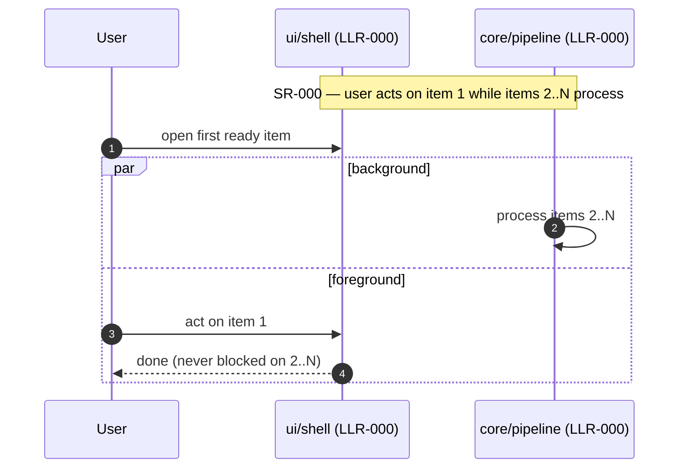

# Runtime flows — <project> (authored at DevStg-Tests)

Owned by the **Software Engineer** hat. This doc is the **authored-narrative
half** of the architecture record: hand-written Mermaid sequence diagrams of
the key runtime scenarios, each citing the `SR-`/`LLR-` ids it renders. The
**structural half** — module map, import graph, declared `IF-###` seams,
components — is *derived* from your registries and source tree and rendered in
`PROJECT_STATE.html`'s "How (SW architecture)" tab, which also embeds these
flows (see [process.md §3/§7](process.md)). Diagrams are Mermaid fenced blocks
— rendered natively by GitHub/GitLab and the VS Code Markdown preview, no
toolchain needed (process.md "Diagrams are text").

Write these **with the LLRs, before the DevStg-Tests review** — the diagrams
are how a human verifies *behavior* (ordering, concurrency, what blocks on
what) without reverse-engineering it from registry rows. Required from
DevStg-Tests on and checked by `python scripts/check_flows.py` (wired into the
harness): this doc must exist, hold at least one Mermaid diagram, and every
cited `SR-`/`LLR-` id must exist in the registries (so the flows stay
traceable as requirements evolve).

## Runtime flows

The heading above is the **section** `check_flows.py` reads — keep it, and put
every flow under it (as `###` subheadings). The document title on line 1 does
*not* count as the section: a doc merely *named* "Runtime flows" whose section
was deleted must fail this gate, so the check ignores the title heading.

Author one sequence diagram per key user-visible scenario, and **always one
for anything concurrent / asynchronous / non-blocking** — that's where
reviewers misread registry rows. Participants are planned modules (the LLR
`Module` column); cite the ids a diagram renders in its title or `Note`s.
Replace this example:

_Update a flow in the same change that alters its LLRs — a stale flow diagram
is a design lie. Sequence diagrams for simpler, synchronous interactions are
welcome here too._
